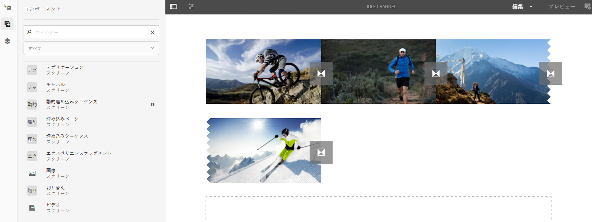
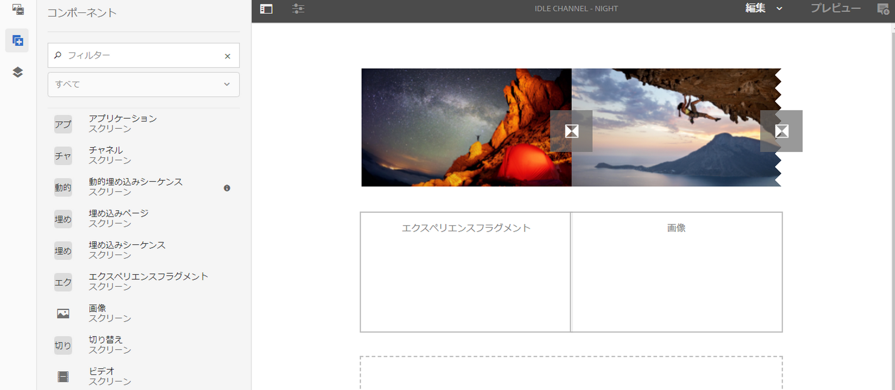

# チャネルへのコンポーネントの追加 {#adding-components-to-a-channel}

コンポーネントは、AEM（Adobe Experience Manager）エクスペリエンスの基本的要素です。多数のコンポーネントを使用でき、AEM Screens プロジェクトのチャネルに追加できます。

## AEM Screens のコンポーネント  {#components-in-aem-screens}

AEM Screens には、スクリーンプロジェクトで使用できる様々な AEM コンポーネントが用意されています。

### AEM Screens コンポーネントの表示  {#viewing-aem-screens-components}

AEM Screens プロジェクトを作成する場合はいつでも、プロジェクトに追加できるデフォルトコンポーネントのリストが表示されます。

Screens プロジェクトのデフォルトコンポーネントを表示するには、次の手順に従います。

1. チャネルを選択します。（例：**We.Retail In-Store**／**Channels**／**Idle Channel**）。

1. アクションバーから「**編集**」をクリックして、AEM エディターを開きます。
1. サイドバーから **+** アイコンをクリックして、コンポーネントを開きます。
1. 次に示す図のように、AEM Screens プロジェクトにデフォルトで含まれるすべてのコンポーネントが表示されます。

### 新しいコンポーネントの追加 {#adding-a-new-component}

AEM には、他のコンポーネントが多数用意されています。AEM Screens と互換性のある（デフォルトで含まれていない）他のコンポーネントをプロジェクトにいつでも追加できます。

次に、AEM Screens プロジェクトへの Livefyre コンポーネントの追加例を示します。

1. 新しいコンポーネントを追加するチャネルを選択します（例：**We.Retail In-Store**／**Channels**／**Idle Channel**）。

1. アクションバーの「**編集**」をクリックして、エディターを開きます。
1. **デザイン**&#x200B;モードを選択します。
1. 右側のデザインエディター全体を選択して、設定シンボルをクリックし、**ParSys Design** ダイアログボックスを開きます。
1. AEM Screens プロジェクトに読み込むコンポーネントを選択できます。次に、AEM Screens プロジェクトへの **Livefyre** コンポーネントの追加例を示します。

>[!NOTE]
>
>同様に、AEM Screens と互換性のある他の新しいコンポーネントをプロジェクトに好きなだけ追加できます。

## AEM Screen コンポーネントについて  {#understanding-aem-screen-components}

ここでは、プロジェクトで使用できる AEM Screens コンポーネントについて説明します。

>[!NOTE]
>
>任意のコンポーネントのプロパティを表示するには、コンポーネントを選択し、ハンマーアイコンをクリックします。

### アプリケーション {#application}

**アプリケーション**&#x200B;コンポーネントを使用すると、チャネルにアプリケーションを追加できます。

アプリケーションコンポーネントには、次のプロパティがあります。

| **プロパティ** | **説明** |
|---|---|
| ***アプリケーションパス*** | アプリケーションが存在する絶対パスを選択します。 |
| ***デュレーション (ms)*** | アプリケーションのデュレーションを選択します。デフォルトでは、デュレーションは -1 に設定されています。これは、要素が無期限に実行される（つまり、シングルページアプリケーションである）ことを意味します。デュレーションの値を 0 より大きい値に設定すると、指定されたデュレーションの間要素が表示されてから次のアプリケーションに移動します。 |

次に、アプリケーションコンポーネントを埋め込んでプロパティをプレビューする方法の例を示します。

>[!NOTE]
>
>前述の例を参照して、次の各コンポーネントのプロパティを表示します。

### チャネル {#channel}

**チャネル**&#x200B;コンポーネントを使用すると、プロジェクトにチャネル全体を追加できます。

チャネルコンポーネントには、次のプロパティがあります。

<table>
 <tbody>
  <tr>
   <td><strong>プロパティ</strong></td>
   <td><strong>説明</strong></td>
  </tr>
  <tr>
   <td><strong><em>チャネルパス</em></strong></td>
   <td>アプリケーションが存在するこの絶対パスを選択します。  </td>
  </tr>
  <tr>
   <td><strong><em>デュレーション (ms)</em></strong></td>
   <td>チャネルのデュレーション全体を選択します。デュレーションを -1 に設定すると、埋め込まれたチャネルが特定のチャネルでノーカットで実行されます。</td>
  </tr>
 </tbody>
</table>

### 埋め込みページ {#embedded-page}

**埋め込みページ**&#x200B;を使用すると、プロジェクトに埋め込みページを追加できます。例えば、Web アプリケーションや製品カタログにできます。

埋め込みページには、次のプロパティがあります。

<table>
 <tbody>
  <tr>
   <td><strong>プロパティ</strong></td>
   <td><strong>説明</strong></td>
  </tr>
  <tr>
   <td><strong><em>ページパス  </em></strong></td>
   <td>チャネルが存在するこの絶対パスを選択します。  </td>
  </tr>
  <tr>
   <td><strong><em>デュレーション (ms)</em></strong></td>
   <td>チャネルのデュレーション全体を選択します。デュレーションを -1 に設定すると、埋め込まれたチャネルが特定のチャネルでノーカットで実行されます。</td>
  </tr>
 </tbody>
</table>

### 埋め込みシーケンス {#embedded-sequence}

>[!NOTE]
>
>埋め込みシーケンスについて詳しくは、Screens のオーサリングの節の[埋め込みシーケンス](embedded-sequences.md)を参照してください。

埋め込みシーケンスを使用すると、既存のチャネル（他のアセットを含む）内に埋め込みシーケンスチャネルを追加できます。

埋め込みシーケンスには、次のページプロパティがあります。

<table>
 <tbody>
  <tr>
   <td><strong>プロパティ</strong></td>
   <td><strong>説明</strong></td>
  </tr>
  <tr>
   <td>チャネルパス</td>
   <td>チャネルに追加するシーケンスの絶対パスを選択します。  </td>
  </tr>
  <tr>
   <td><strong><em>デュレーション (ms)</em></strong></td>
   <td>チャネルのデュレーション全体を選択します。デュレーションを -1 に設定すると、埋め込まれたチャネルが特定のチャネルでノーカットで実行されます。</td>
  </tr>
  <tr>
   <td><strong><em>方法</em></strong></td>
   <td><strong>origina</strong> または <strong>single</strong> に設定します。値を <strong>original</strong> に設定すると、親シーケンスの各サイクルで後続が完全に実行されます。他の指定可能な値は <strong>single</strong> です。この場合は、各実行で後続の 1 つのアイテムのみ表示されます（例えば、最初のループで最初のアイテム、2 回目のループで 2 番目のアイテムというように）。</td>
  </tr>
 </tbody>
</table>

### 動的埋め込みシーケンス {#dynamic-embedded-sequence}

動的埋め込みシーケンスを使用すると、チャネルロールによることを除いて、前述の方法と同じようにシーケンスを追加できます。

埋め込みシーケンスについて詳しくは、Screens のオーサリングの節の[埋め込みシーケンス](embedded-sequences.md)を参照してください。

動的埋め込みシーケンスには、次のプロパティがあります。

<table>
 <tbody>
  <tr>
   <td><strong>プロパティ</strong></td>
   <td><strong>説明</strong></td>
  </tr>
  <tr>
   <td><strong><em>チャネル割り当ての役割</em></strong>  </td>
   <td>チャネルロールを入力します。  </td>
  </tr>
  <tr>
   <td><strong><em>デュレーション (ms)</em></strong></td>
   <td>チャネルのデュレーション全体を選択します。デュレーションを -1 に設定すると、埋め込まれたチャネルが特定のチャネルでノーカットで実行されます。</td>
  </tr>
  <tr>
   <td><strong><em>方法</em></strong></td>
   <td><strong>origina</strong> または <strong>single</strong> に設定します。値を <strong>original</strong> に設定すると、親シーケンスの各サイクルで後続が完全に実行されます。他の指定可能な値は <strong>single</strong> です。この場合は、各実行で後続の 1 つのアイテムのみ表示されます（例えば、最初のループで最初のアイテム、2 回目のループで 2 番目のアイテムというように）。</td>
  </tr>
 </tbody>
</table>

### エクスペリエンスフラグメント {#experience-fragment}

エクスペリエンスフラグメントを使用すると、エクスペリエンスフラグメント（ページ内で参照できるコンテンツやレイアウトを含んだ 1 つ以上のコンポーネントのグループ）を AEM Screens チャネルに追加できます。エクスペリエンスフラグメントコンポーネントを AEM エディターにドラッグ＆ドロップし、エクスペリエンスフラグメントを選択します。

エクスペリエンスフラグメントを作成して AEM Screens プロジェクトに活用する方法について詳しくは、[エクスペリエンスフラグメントの使用](experience-fragments-in-screens.md)を参照してください。

| **プロパティ** | **説明** |
|---|---|
| **エクスペリエンスフラグメント** |
| ***エクスペリエンスフラグメント*** | エクスペリエンスフラグメントを選択します。 |
| ***デュレーション*** | チャネルで再生されるエクスペリエンスフラグメントのデュレーション全体を選択します。 |
| **オフライン設定** |
| ***クライアント側ライブラリ*** | JavaScript ファイルと CSS ファイル。 |
| ***静的ファイル*** | オフライン設定としてエクスペリエンスフラグメントに追加できる静的ファイル。 |

>[!NOTE]
>
>このコンポーネントから追加する&#x200B;**クライアント側ライブラリ**&#x200B;と&#x200B;**静的ファイル**&#x200B;は、設定済みの&#x200B;**クライアント側ライブラリ**&#x200B;と、エクスペリエンスフラグメントの&#x200B;**プロパティ**&#x200B;から追加されている静的ファイルにそれぞれ追加されます。

### 画像 {#image}

画像を使用すると、チャネルに画像を追加できます。

イメージアセットには、「**画像**」、「**アクセシビリティ**」および「**シーケンス**」の 3 つのタブがあります。

| **プロパティ** | **説明** |
|---|---|
| **画像** |
| ***イメージアセット*** | イメージアセットを選択します。 |
| ***タイトル*** | 画像のタイトル。 |
| ***リンク先*** | 画像にリンクを追加します。 |
| ***説明*** | 画像の概要。 |
| ***サイズ*** | 画像のサイズ。 |
| **アクセシビリティ** |
| ***代替テキスト*** | 画像の代替テキスト。 |
| **シーケンス** |
| ***デュレーション*** | デフォルトでは、デュレーションは *8000 ms* に設定されています。画像の再生時間を変更する場合は、「**デュレーション (ms)**」フィールドを更新します。 |

### トランジション {#transition}

トランジションコンポーネントを使用すると、Screens プロジェクトにトランジションを追加できます。

次の画像は、（ドラッグ＆ドロップで）エディターに追加されたトランジションコンポーネントを示しています。

トランジションアイコンを選択し、「**設定**」（レンチアイコン）をクリックして、**トランジション**&#x200B;ダイアログボックスを開きます。このダイアログボックスには次の 3 つのタブが含まれています。

* **トランジション**
* **シーケンス**
* **アクティベーション**

>[!NOTE]
>
>デフォルトでは、シーケンスは 600 ms に設定されています。「**シーケンス**」タブを使用して、トランジションシーケンスを別の値に更新できます。

トランジションコンポーネントには、次のプロパティがあります。

<table>
 <tbody>
  <tr>
   <td><strong>プロパティ</strong></td>
   <td><strong>説明</strong></td>
  </tr>
  <tr>
   <td><strong>トランジション</strong></td>
   <td></td>
  </tr>
  <tr>
   <td><strong><em>タイプ</em></strong></td>
   <td>
前の要素と後の要素の間のトランジションのタイプ。トランジションの<strong>タイプ</strong>には、次の選択肢があります。

    <ul>
     <li><strong>標準</strong></li>
     <li><strong>フェード</strong></li>
     <li><strong>右からスライドイン</strong></li>
     <li><strong>左からスライドイン</strong></li>
     <li><strong>上からスライドイン</strong></li>
     <li><strong>下からスライドイン</strong></li>
    </ul> </td>
  </tr>
  <tr>
   <td><strong>シーケンス</strong></td>
   <td></td>
  </tr>
  <tr>
   <td><strong><em>デュレーション</em></strong></td>
   <td>トランジションのデュレーション全体を選択します。デフォルトでは 600 ms に設定されています。</td>
  </tr>
  <tr>
   <td><strong>アクティベーション</strong></td>
   <td></td>
  </tr>
  <tr>
   <td><strong><em>次の日から有効</em></strong></td>
   <td>トランジションがアクティブになる時点を示すタイムスタンプ。  </td>
  </tr>
  <tr>
   <td><strong><em>次の日まで有効</em></strong></td>
   <td>トランジションのアクティブ状態が終了する時点を示すタイムスタンプ。</td>
  </tr>
  <tr>
   <td><strong><em>スケジュール</em></strong></td>
   <td>定義済みのスケジュールを追加します。</td>
  </tr>
 </tbody>
</table>

### ビデオ {#video}

ビデオコンポーネントを使用すると、Screens プロジェクトにビデオを追加できます。

ビデオコンポーネントには、次のプロパティがあります。

<table>
 <tbody>
  <tr>
   <td><strong>プロパティ</strong></td>
   <td><strong>説明</strong></td>
  </tr>
  <tr>
   <td><em><strong>ビデオアセット</strong></em></td>
   <td>ビデオへのリンクを選択します。</td>
  </tr>
  <tr>
   <td><em><strong>デュレーション</strong></em></td>
   <td>ビデオのデュレーションを選択します。デフォルトでは、デュレーションは -1 に設定されています。これは、要素が無期限に実行されることを意味します。デュレーションの値を 0 より大きい値に設定すると、指定されたデュレーションの間要素が表示されてから次のアプリケーションに移動します。  </td>
  </tr>
  <tr>
   <td><em><strong>レンダリング</strong></em></td>
   <td>
ビデオの縦横比がスクリーンに合わない場合、<strong>含む</strong>または<strong>カバー</strong>のどちらかでレンダリングを調整できます。
 
<em>含む</em>は、ビデオ全体が表示され、足りない領域は黒い境界線で埋められることを意味します。
 
<em>カバー</em>は、ビデオが表示域全体を占めますが、サイドのオーバーフローする部分は非表示になります。
 </td>
  </tr>
  <tr>
   <td><em><strong>サイズ</strong></em></td>
   <td>ビデオのサイズ。</td>
  </tr>
 </tbody>
</table>

