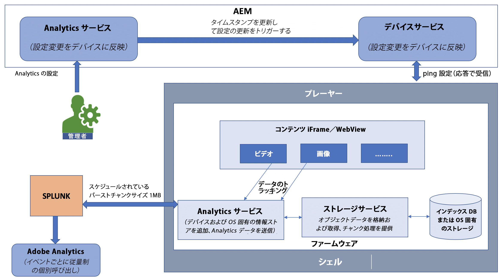

# Adobe Analytics と AEM Screens の統合 {#adobe-analytics-integration-with-aem-screens}

>[!CAUTION]
>
>この AEM Screens 機能は、AEM 6.4.2 機能パック 2 と AEM 6.3.3 機能パック 4 がインストールされている場合にのみ使用できます。

>[!NOTE]
>
>このいずれかの機能パックにアクセスするには、アドビサポートに連絡してアクセス権をリクエストする必要があります。アクセス権が付与されると、パッケージ共有から機能パックをダウンロードできるようになります。

ここでは、以下のトピックについて説明します。

* **概要**
* **アーキテクチャの詳細**
* **プロパティの設定**

## 概要 {#overview}

***AEM Screens*** で Adobe Analytics を活用することにより、特定の場所に表示されるコンテンツと他のデータソースとの関連性を探るのに役立つユニークなクロスチャネル分析を実現できます。

AEM Screens は、標準で Adobe Analytics と統合されており、再生検証機能を提供します。

ここでは、AEM Screens プロジェクトと Adobe Analytics の連携に関係する以下の機能について説明します。

* デバイス別の再生検証レポートが可能
* アセット別の再生検証レポートが可能
* すべてのプレーヤーイベントをキャプチャしタイムスタンプを設定できる
* 再生がネットワークに接続されていない場合、すべてのプレーヤーイベントをローカルに保存できる
* フィードバックループを作成して再生イベントを経時的に追跡できる
* コンテンツ作成者が定義した成功条件に基づいてシステムがコンテンツやレイアウトを変更できる

Adobe Analytics と AEM Screens の統合により、*次の*&#x200B;目標を達成できます。

* デジタルサイネージの実装による ROI の実現
* 使用状況情報の収集と分析を将来可能にする基盤として Analytics を統合

## アーキテクチャの詳細 {#architectural-details}

AEM Screens ユーザーは、どのコンテンツが、いつ、どのくらいの時間（集計）表示されたかを把握したいと考えています。これは、サイネージソリューションの一般的な機能です。独自に分析を作成するのではなく、AEM Screens で Adobe Analytics を活用することにより、特定の場所に表示されるコンテンツと他のデータソースとの関連性を探るのに役立つユニークなクロスチャネル分析を実現できます。

次のアーキテクチャ図では、Adobe Analytics と AEM Screens の統合について説明しています。

## AEM Screens での Adobe Analytics の有効化 {#enabling-adobe-analytics-in-aem-screens}

Adobe Analytics の設定は、OSGi コンソールから指定できます。

**Adobe Experience Manager Web コンソール設定**&#x200B;に移動して、次の図のように Adobe Analytics を AEM Screens 用に設定します。

## Screens 用 Analytics：有効化フロー {#screens-analytics-enablement-flow}

>[!CAUTION]
>
>Before you configure the properties, please contact your Adobe Relationship Manager to create a ticket to obtain an **Analytics API Key** and **Analytics Project** for use with AEM Screens.

### プロパティの設定 {#configuring-the-properties}

>[!CAUTION]
>
>Before you configure the properties, please contact your Adobe Relationship Manager to create a ticket to obtain an **Analytics API Key** and **Analytics Project** for use with AEM Screens.

Adobe Analytics を AEM Screens 用に設定するためのプロパティとその説明を次の表に示します。

<table>
 <tbody>
  <tr>
   <td><strong>プロパティ</strong></td>
   <td><strong>説明</strong></td>
  </tr>
  <tr>
   <td><strong>Analytics URL</strong></td>
   <td>プレーヤーから得られる分析データを投稿するための URL。 
   開発／ステージング環境の場合</em> - https://cc-api-data-stage.adobe.io/ingest/ <em>プロダクション環境の場合</em> - https://cc-api-data.adobe.io/ingest/</em>   </td>
  </tr>
  <tr>
   <td><strong>Analytics API キー</strong></td>
   <td>Adobe Analytics サーバーに対して認証をおこなうための API キー（アカウントマネージャーから提供される）。</td>
  </tr>
  <tr>
   <td><strong>Analytics プロジェクト</strong></td>
   <td>データを受け取るように Analytics 上で設定された AEM Screens プロジェクト（アカウントマネージャーから提供される）。</td>
  </tr>
  <tr>
   <td><strong>環境</strong></td>
   <td>
ステージング環境または実稼動環境（「ステージング」か「実稼動」のいずれかを選択）。
</td>
  </tr>
  <tr>
   <td><strong>分析送信頻度</strong></td>
   <td>プレーヤーから分析データを送信する間隔（分）。デフォルトでは 15 分に設定されています。</td>
  </tr>
 </tbody>
</table>

>[!NOTE]
>
>デフォルトでは、**分析送信頻度**&#x200B;は 15 分です。

#### AEM Screens での Adobe Analytics サービスの使用 {#using-adobe-analytics-service-in-aem-screens}

このシナリオは、ファームウェアの分析サービスからREST呼び出しを介してAnalytics APIを呼び出し、画面のコアコンポーネントを実装して、特定の使用例に固有のイベントを明示的に作成および送信し、カスタム開発チャネルからAnalyticsに任意のカスタムメッセージを送信できます。

Analytics イベントは、IndexedDB にオフラインで保存され、後でまとめてクラウドに送信されます。

>[!NOTE]
>
>***シーケンス***&#x200B;と&#x200B;***イベントの標準データモデル***&#x200B;について詳しくは、**[AEM Screens 用の Adobe Analytics の設定](configuring-adobe-analytics-aem-screens.md)**&#x200B;を参照してください。

