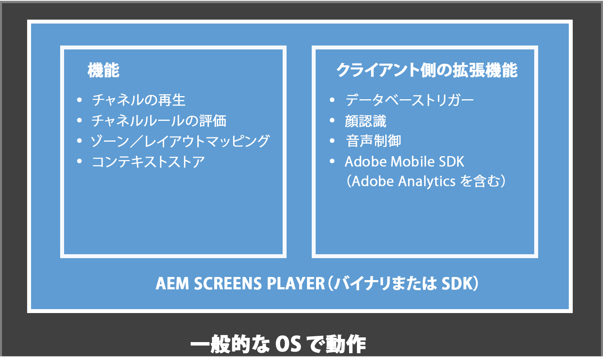
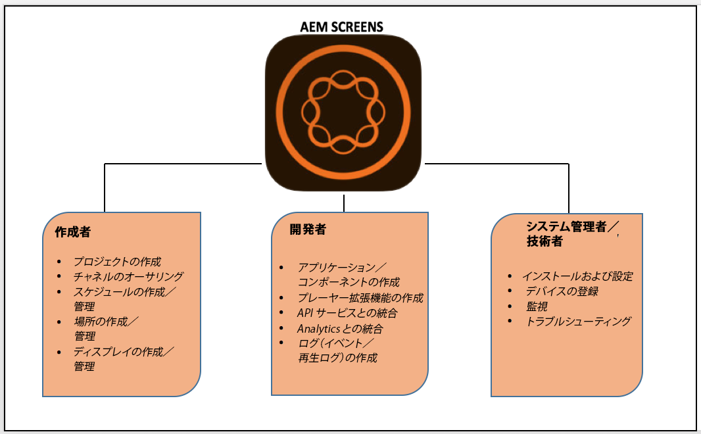

# AEM Screens とは{#what-is-aem-screens}

**AEM(Adobe Experience Manager)Screens** — 包括的なデジタルマーケティングプラットフォームとの連携により、様々な種類の画面に関する動的でインタラクティブなデジタルエクスペリエンスおよびインタラクションを公開できるDigital Signage Solutionです。

Get up and running with a simple digital signage experience, using [Kickstart for AEM Screens](kickstart-for-aem-screens.md).

## 概要 {#overview}

**AEM Screensは******** AEM Sitesの強固な基盤を基盤として構築されており、マーケターやIT担当者は、ブランドの構築と需要の促進に関する店頭/出店先内の目標に影響を与える複数のデジタル画面でエクスペリエンスを作成および管理できます。 AEM Screens と Sites を統合すると、既存のコンテンツを再利用し、明瞭で一貫性のある顧客ソリューションを効果的に提供することが可能です。これにより、費用対効果と有用性の非常に高い、特化したデジタルエクスペリエンスを作成するための合理的なワークフローが実現します。さらに、ブランド認知や、購入や関与に対する高揚をもたらす意思決定に影響を与えるのに役立ちます。

AEM Screensは、専用のデジタルメニューボード、商品レコメンデーター、背景ライフスタイル画像を作成して、顧客との交流を広げ、店舗、ホテル、銀行、医療、教育機関など、様々なAEMプラットフォームから、便利なブランド体験を提供できる強力なWebベースのソリューションです。 画面には、インタラクティブなディスプレイ、ウェイフィンド、ブランディング、顧客や従業員の環境への環境効果の追加など、様々なユニークなアプリケーションが用意されています。

AEM Screensを使用したアプリの作成と管理は、シンプルで直感的です。 アプリケーションは、顧客や実装パートナーが AEM Screens 向けに作成した Web ページをホストします。**&#x200B;ロケーションは、事前に定義された階層を管理し、ディスプレイを含んでいます。****&#x200B;各ディスプレイには、関連付けられている様々なデバイスや画面を表示するダッシュボードがあります。AEM Screens のコンテンツは&#x200B;*チャネル*&#x200B;で管理されます。チャネル内に存在するコンテンツが AEM Screens Player によってディスプレイにレンダリングされます。

To understand the key terminologies associated with AEM Screens, see [Glossary](screens-glossary.md).

### Screens Player のアーキテクチャ {#architecture-of-screens-player}

次の図に、AEM Screensプレーヤーの一般的なアーキテクチャを示します。

### デジタルサイネージエクスペリエンスを 5 分で作成する {#create-a-digital-signage-experience-in-minutes}

To create a demo Screens project and publish your content in Screens player, see [Kickstart for AEM Screens](kickstart-for-aem-screens.md).

## 新しい AEM Screens プロジェクトの開始 {#starting-a-new-aem-screens-project}

新しいデジタルサイネージエクスペリエンスを開始するには、使用に向けて準備する前に各役割が協力する必要があります。次の役割は、新しい画面プロジェクトを作成する際の起点となります。

* **作成者**
* **開発者**
* **システム管理者／技術者**

次の図は、AEM Screens のユーザーとその役割の定義を示しています。

>[!NOTE]
>
>*また、役割ごとに異なる責任を表示するには、上記の個人をクリックします。*

## 必要条件 {#pre-requisite-knowledge}

AEM Screens を使用してデジタルサイネージプロジェクトの作業を開始するには、Adobe Experience Manager（AEM）の知識が必要で、AEM Screens プロジェクトに取り組む前に知識を習得しておく必要があります。

Adobe Experience Manager 6.5 については、以下のチュートリアルとリソースを参照してください。

* **** Adobe Experience Managerはじめに：Adobe Experience Managerの初心者向け記事とビデオチュートリアルをDiscoverで紹介します。
* **AEM 6.5 のチュートリアルとビデオ**：AEM 6.5 のリリースに伴う AEM Sites、AEM Assets、AEM Forms、AEM Screens、AEM Foundation の新機能と更新された機能について重点的に解説する一連のチュートリアルとビデオです。
* **AEM の中心概念**：AEM の構造に関する中心概念と、それを基にした開発方法の概要（JCR、Sling、OSGi、ディスパッチャー、ワークフロー、MSM の解説を含む）です。

### ガイド付き実装の基本 {#guided-implementation-essentials}

基本的な機能とAEM Screensでサポートされる高度な機能について説明する ****、AEM Screens Implementation Essentialsのガイド付き学習パスに従ってください。

新しいプロジェクトを作成する際、組織およびビジネスの要件によっては、異なる機能が重複することがあります。
