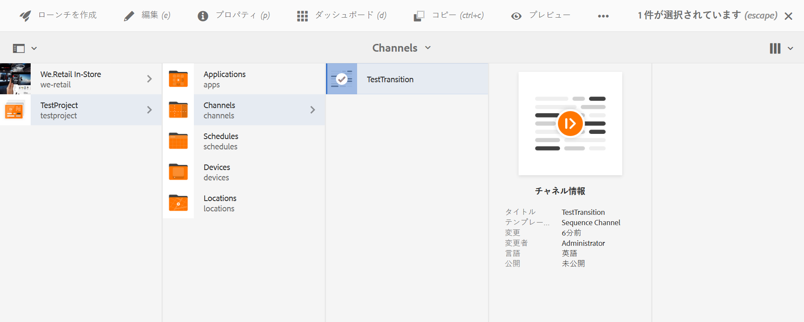
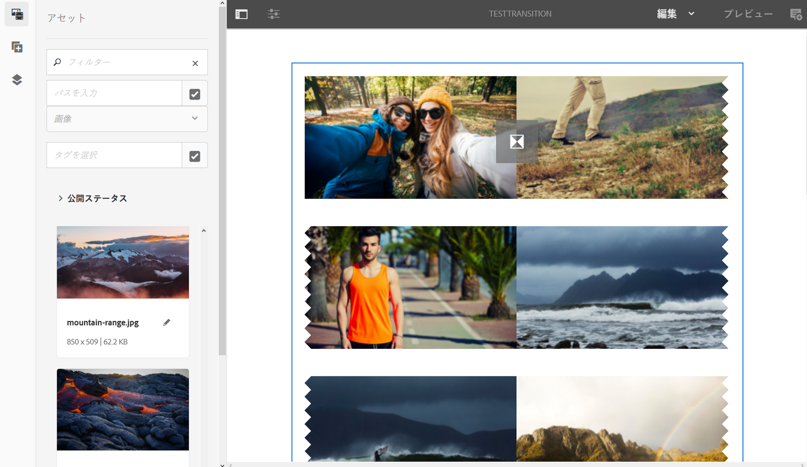

# トランジションの適用 {#applying-transitions}

ここでは、チャネル内の様々なアセット（画像やビデオ）および埋め込みシーケンスの間に&#x200B;**トランジション**&#x200B;コンポーネントを適用する方法について説明します。

>[!CAUTION]
>
>**トランジション**&#x200B;コンポーネントのプロパティについて詳しくは、[トランジション](adding-components-to-a-channel.md#transition)を参照してください。

## チャネル内のアセットへのトランジションコンポーネントの追加 {#adding-transition}

AEM Screens プロジェクトにトランジションコンポーネントを追加するには、以下の手順に従います。

>[!NOTE]
>
>**前提条件**
> ：**TestTransition** チャネルを持つ AEM Screens プロジェクト **TestProject** を作成します。さらに、出力を表示するロケーションとディスプレイをセットアップします。

1. **TestTransition** チャネルに移動し、アクションバーの「**編集**」をクリックします。

   

   >[!NOTE]
   >
   >**TestTransition** チャネルには、既にいくつかのアセット（画像やビデオ）が含まれています。例えば、以下の例では、3 つの画像と 2 つのビデオが **TestTransition** チャネルに含まれています。

   

1. **トランジション**&#x200B;コンポーネントをエディターにドラッグ＆ドロップします。
   >[!CAUTION]
   >
   >チャネル内のアセットにトランジションを追加する前に、シーケンスチャネルの最初のアセットの前にトランジションを追加しないことを確認します。チャネルの最初のアイテムは、トランジションではなくアセットにする必要があります。

   

   > [!NOTE]
   >
   >By default, the properties of the transition component such as **Type** is set to **Fade** and the **Duration** is set to *1600 ms*.  また、適用先のアセットより長いトランジションデュレーションを設定することはお勧めしません。

1. さらに、（シーケンスチャネルを含む）**埋め込みシーケンス**&#x200B;コンポーネントをこのチャネルエディターに追加する場合は、最後にトランジションコンポーネントを追加して、コンテンツが順に再生されるようにすることができます（下図を参照）。

   

