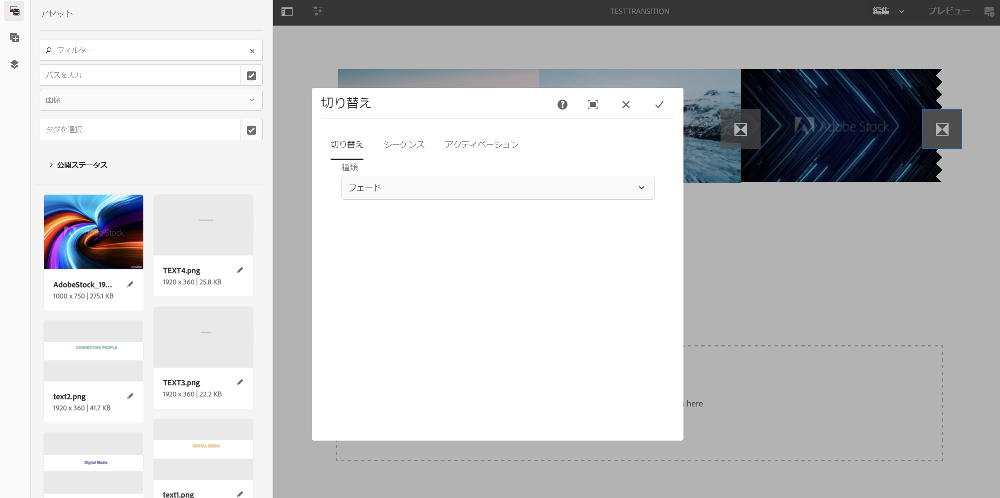

# トランジションの適用 {#applying-transitions}

ここでは、様々なアセット（画像やビデオ）とチャンネルに埋め込ま **れたシーケンスの間に** 、トランジションコンポーネントを適用する方法について説明します。

>[!CAUTION]
>
>トランジションコンポーネントのプロパティの詳細につ **いては** 、「トランジション」を参照し [てください](adding-components-to-a-channel.md#transition)。

## チャネル内のアセットへのトランジションコンポーネントの追加 {#adding-transition}

次の手順に従って、AEM Screensプロジェクトにトランジションコンポーネントを追加します。

>[!NOTE]
>
>**前提条件**
> チャネルTestTransitionを使用してAEM Screensプロジ **ェクト** TestProjectを作 **成します**。 さらに、出力を表示する場所と表示を設定します。

1. Channel testTransitionに移動し、アクシ **ョンバーで** 「 **Edit** 」をクリックします。

   

   >[!NOTE]
   >
   >TestTransitionチャ **ンネルには** 、既にほとんどアセット（画像やビデオ）が含まれていません。 例えば、TestTransitionチャネルに **は** 、次に示す3つの画像と2つのビデオが含まれます。

   

1. トランジションコンポーネント **をエディタ** にドラッグ&amp;ドロップします。
   >[!CAUTION]
   >
   >チャネル内のアセットにトランジションを追加する前に、順次チャネル内の最初のアセットの前にトランジションを追加しないようにしてください。 チャネルの最初の項目は、トランジションではなくアセットである必要があります。

   

   > [!NOTE]
   >
   >デフォルトでは、 **Type** （タイプ）などのトランジションコンポーネントのプロパティは **Normal** （標準）に、Duration（デュレーション）は **** 600 ms( *600 ms)に設定されま*&#x200B;す。  また、適用するアセットより長いトランジション期間を設定することはお勧めしません。

1. さらに、このチャネルエディターに **Embedded Sequence** （シーケンスチャネルを含む）コンポーネントを追加する場合は、次の図に示すように、最後にトランジションコンポーネントを追加して、コンテンツが順番に再生されるようにすることができます。

   

## チャネル内のビデオへのトランジションコンポーネントの追加 {#adding-transition-videos}

ビデオ間でトランジションコンポーネントを適用する場合は、 **Type** to **Fade** 、 **Sequence Durationを****** 1600 msに設定することをお勧めします。

