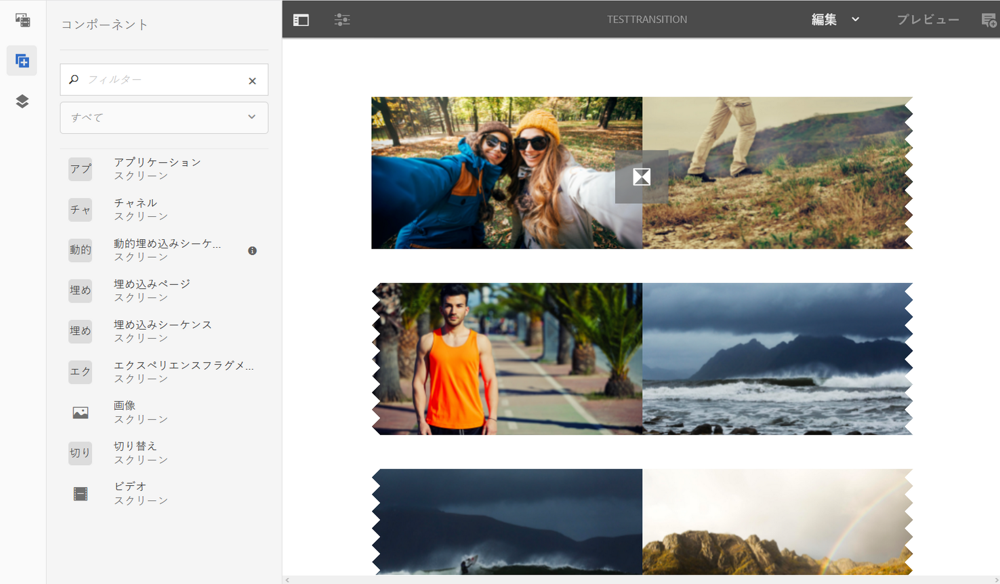

# トランジションの適用 {#applying-transitions}

ここでは、チャネル内の様々なアセット（画像やビデオ）および埋め込みシーケンスの間に&#x200B;**トランジション**&#x200B;コンポーネントを適用する方法について説明します。

>[!CAUTION]
>
>**トランジション**&#x200B;コンポーネントのプロパティについて詳しくは、[トランジション](adding-components-to-a-channel.md#transition)を参照してください。

## チャネル内のアセットへの切り替えコンポーネントの追加 {#adding-transition}

AEM Screens プロジェクトに切り替えコンポーネントを追加するには、以下の手順に従います。

>[!NOTE]
>
>**前提条件**
>
>**TestTransition** チャネルを持つ AEM Screens プロジェクト **TestProject** を作成します。また、出力を表示する場所とディスプレイをセットアップします。

1. **TestTransition** チャネルに移動し、アクションバーの「**編集**」をクリックします。

   

   >[!NOTE]
   >
   >**TestTransition** チャネルには、既にいくつかのアセット（画像やビデオ）が含まれています。例えば、以下の例では、3 つの画像と 2 つのビデオが **TestTransition** チャネルに含まれています。

   

1. **切り替え**&#x200B;コンポーネントをエディターにドラッグ＆ドロップします。

   >[!CAUTION]
   >
   >チャネル内のアセットにトランジションを追加する前に、シーケンスチャネルの最初のアセットの前にトランジションを追加しないようにしてください。チャネルの最初のアイテムは、切り替えではなくアセットにする必要があります。

   

   >[!NOTE]
   >
   >デフォルトでは、トランジションコンポーネントのプロパティは、例えば、「**タイプ**」は「**フェード**」に、「**デュレーション**」は「*1600 ミリ秒*」に設定されています。また、適用先のアセットより長いトランジションデュレーションを設定することはお勧めしません。

1. また、**埋め込みシーケンス**&#x200B;コンポーネント（シーケンスチャネルを含む）をこのチャンネルエディターに追加すると、末尾にトランジションコンポーネントを追加できます。これにより、次の画像に示すように、コンテンツが正しい順序で再生されます。

   
