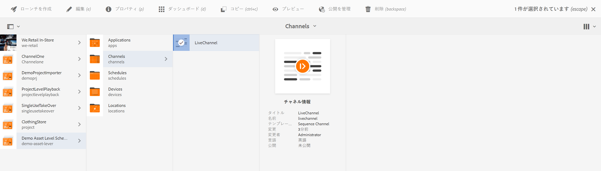
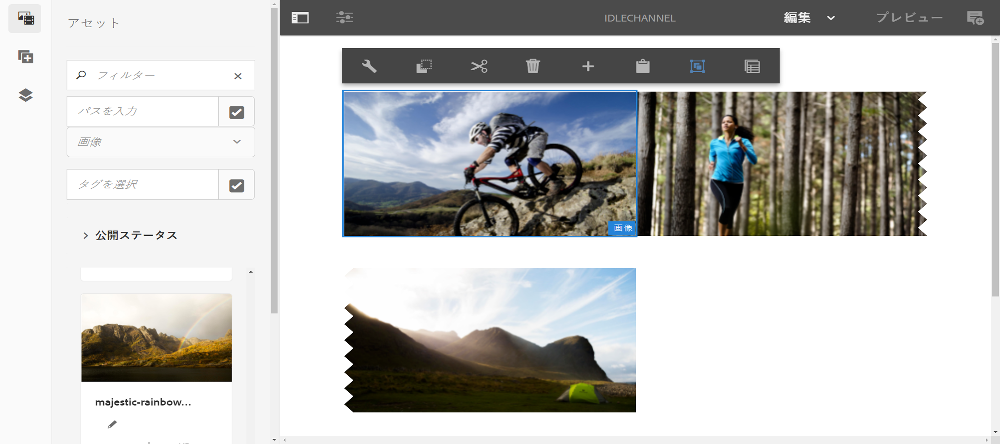
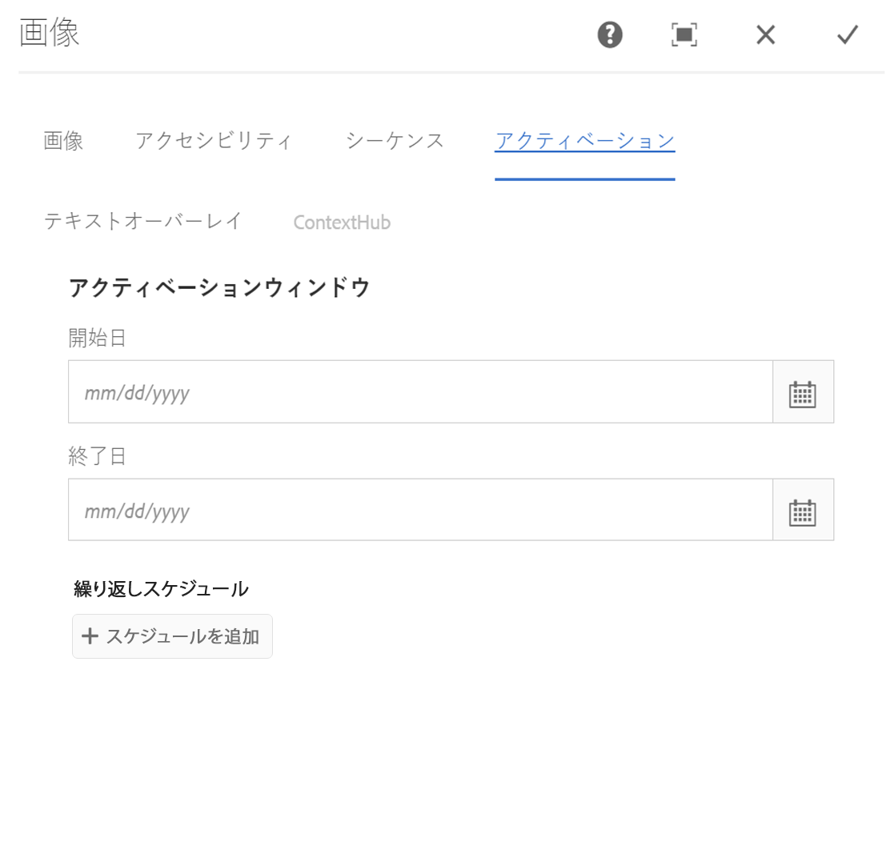
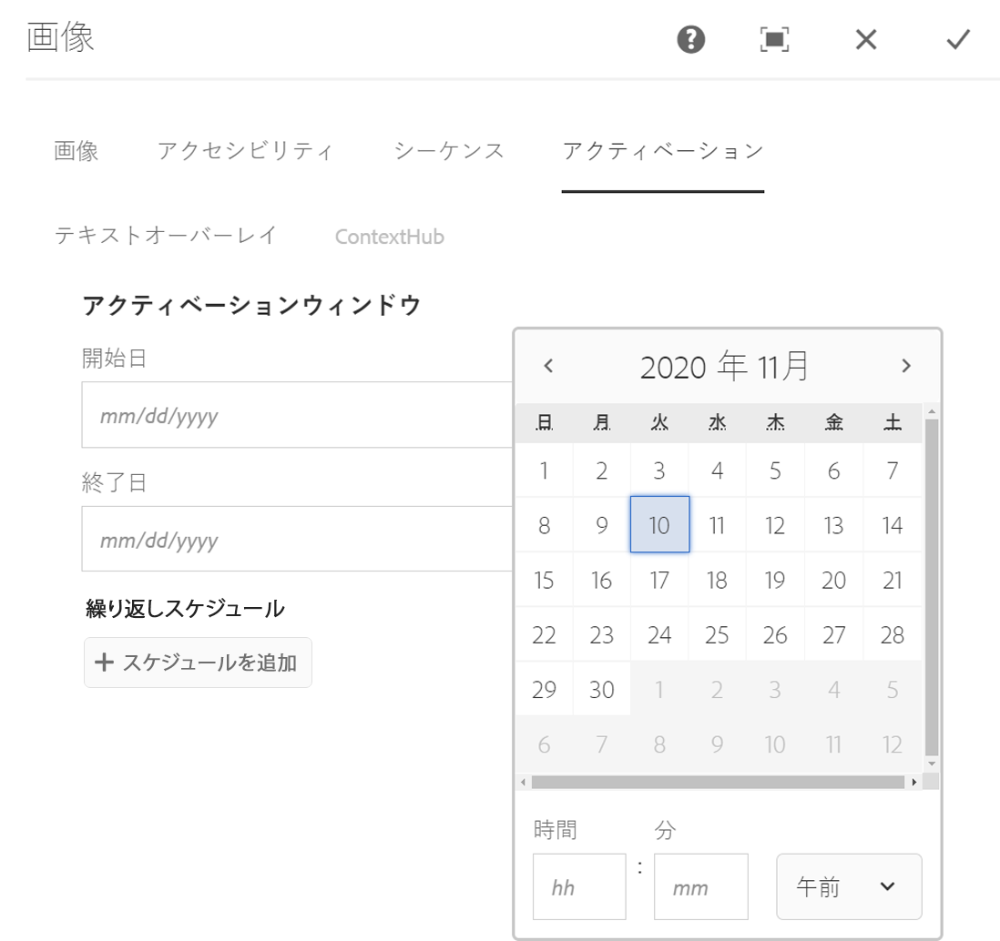

# 資産レベルのスケジュール {#asset-level-scheduling}

ここでは、チャネルで使用されるアセットのアセットレベルのスケジュール設定について説明します。

この節では、以下のトピックについて説明します。

* OvervieW
* 資産レベルのスケジュール設定の使用
* アセット内の繰り返しの処理
* マルチアセットスケジュール

>[!CAUTION]
>
>このAEM Screens機能は、AEM 6.3 Feature Pack 3またはAEM 6.4 Screens Feature Pack 1をインストールしている場合にのみ使用できます。
>
>この機能パックにアクセスするには、アドビサポートに連絡してアクセス権をリクエストする必要があります。アクセス権が付与されると、パッケージ共有から機能パックをダウンロードできるようになります。

## 概要 {#overview}

***Asset Level Scheduling***：プレイヤーのローカルタイムゾーンでスケジュールされた時間枠に対して、チャネル内の特定のアセットをアクティブ化できます。 これは、画像、ビデオ、トランジション、ページおよび埋め込みチャネル（動的または静的）で使用できます。

*例えば*、月曜日と水曜日のうまい時間帯（午後2時～午後5時）にのみ特別なプロモーションを表示するとします。

この機能を使用すると、開始日と終了日時だけでなく、繰り返しパターンも指定できます。

## 資産レベルのスケジュール設定の使用 {#using-asset-level-scheduling}

アセットレベルのスケジュール設定は、アセットのプロパ **ティにアクセスしながら** 「アクティブ化」タブを設定することで行います。

次の手順に従って、資産レベルのスケジュールを実行します。

1. 任意のチャネルを選択し、アクシ **ョンバーの** 「編集」をクリックして、チャネルにコンテンツを追加または編集します。

   

   >[!NOTE]
   >
   >方法を詳しく学ぶには
   >
   >* プロジェクトを作成する方法については、「新し [いプロジェクトの作成](creating-a-screens-project.md)」を参照してください。
   >* チャネルのコンテンツを作成して追加する方法については、チャネルの管理を参 [照してくださ](managing-channels.md)い。

1. 「編集 **** 」をクリックしてチャネルエディタを開き、スケジュールを適用するアセットを選択します。

   

1. アセットを選択し、左上の設定アイコンを **クリックし** 、画像のプロパティを開きます。

   Click the **Activation** tab.

   

1. 「アクティブ：開始日」と「アクティブ：終了日」フィールドから日付を **選択して** 、日付 **を指定できます** 。

   「 **Active from** 」と「 **Active until** 」を選択した場合は、アセットが表示され、その開始日時と終了日時の間でのみループされます。

   

## アセット内の繰り返しの処理 {#handling-recurrence-in-assets}

必要に応じて、毎日、毎週、または毎月、特定の間隔でアセットが繰り返されるようにスケジュールすることもできます。

例えば、金曜日の午後1時から午後10時までの間、画像を表示するとします。 「アクティブ化」タブを使用して、アセットの定期的な間隔を設定できます。

### 資産に対する定期イベントの追加 {#adding-a-recurring-event-for-your-asset}

1. アセットを選択し、設定アイコンをク **リックして** 、プロパティダイアログボックスを開きます。
1. 開始日時と終了日時を入力した後、Cron形式または自然テキスト形式を使用して、繰り返しスケジュールを指定できます。

   無料のCron形式ジェネレーターをWebで検索し、 **Cron形式をコピーして** Scheduleに貼り付けると、特定の時間間隔でアセットが表示されます。

   *また*、cron形式を使用する代わりに、6:00の後、金曜日の18:00より前などの自然テキストバージョンを使用して、タスクを実行するこ ** ともできます。 スケジュールにアセットを表 **示する** テキストを入力します。

## マルチアセットスケジュール {#multi-asset-scheduling}

>[!CAUTION]
>
>マル **チアセットスケジュール機能は** 、AEM 6.3機能パック5またはAEM 6.4機能パック3をインストールしている場合にのみ使用できます。

***マルチアセットスケジュール*** (Multi-asset Scheduling)を使用すると、ユーザは複数のアセットを選択し、選択したすべてのアセットに再生スケジュールを適用できます。

### 前提条件 {#prerequisites}

アセットに対して複数アセットレベルのスケジュール設定を使用するには、シーケンスチャネルを含むAEM Screensプロジェクトを作成します。 例えば、次の使用例は機能の実装を示しています。

* 「MultiAssetDemo」というタイトルのAEM Screensプロジェクトを作 **成する**
* 次の図に示すように、MultiAssetChannelとい **う名前のチャネルを作成し** 、チャネルにコンテンツを追加します。

次の手順に従って、複数のアセットを選択し、AEM Screensプロジェクトでの表示をスケジュールします。

1. Select **MultiAssetChannel** and click **Edit** from the action bar to open the editor.

   

1. エディターから複数のアセットを選択し、「アクテ **ィブ化を編集** 」（左上のアイコン）をクリックします。

   

1. [コンポーネントアクティブ化]ダイアログ **ボックスで** 、[アクテ **ィブ開始]と[アクティブ終了****** ]で日時を選択します。 スケジュールの選択が完了したら、チェックマークアイコンをクリックします。

   

1. 「更新」をクリックして、複数アセットのスケジュールが適用されるアセットを確認します。

   >[!NOTE]
   >
   >スケジュールアイコンは、マルチアセットスケジュールが設定されているアセットの右上隅に表示されます。

   

