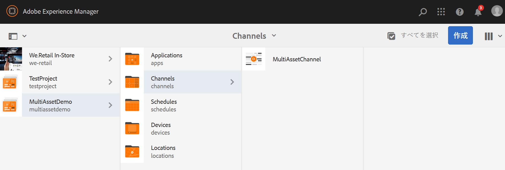
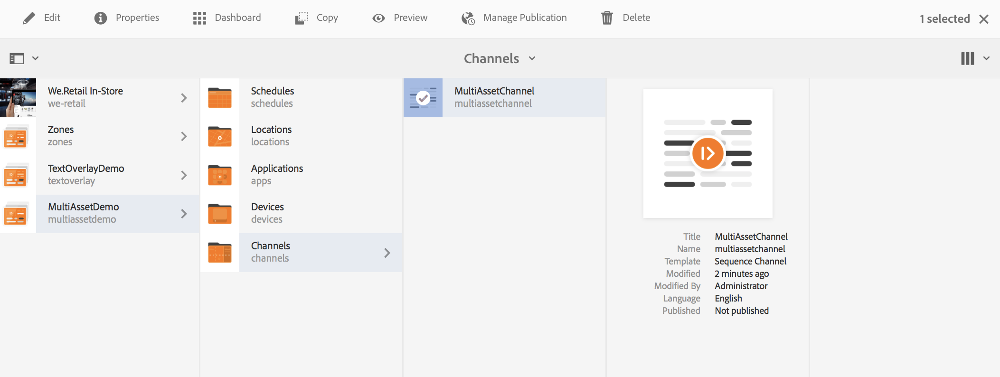
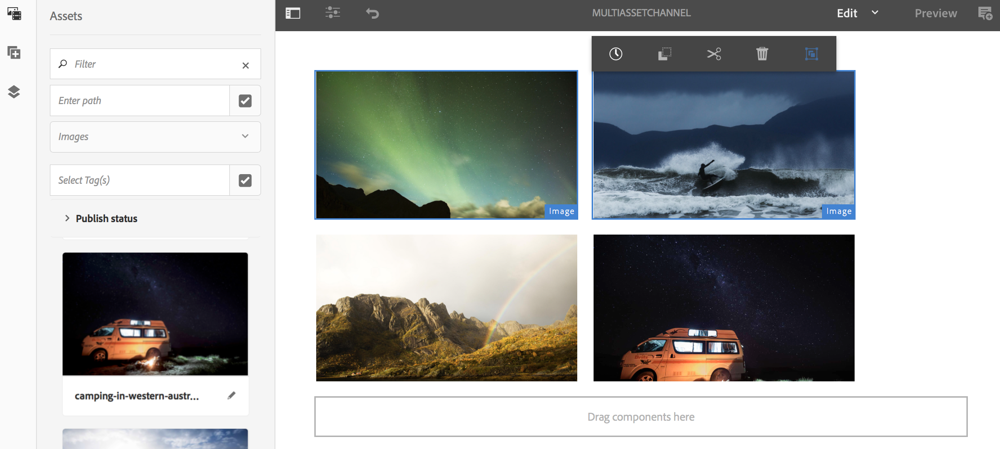
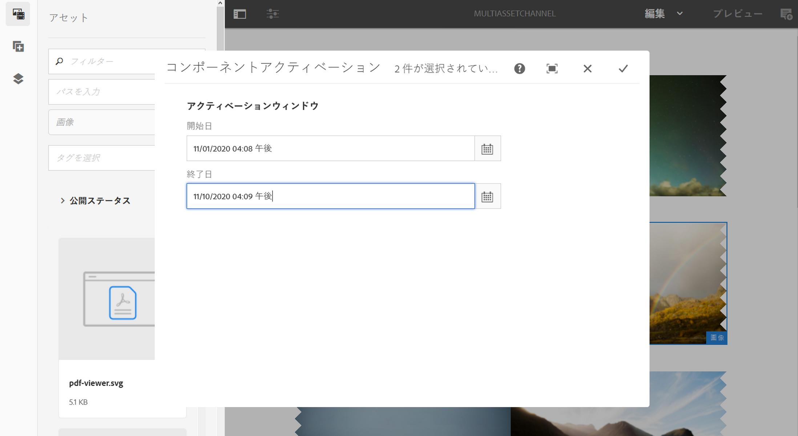
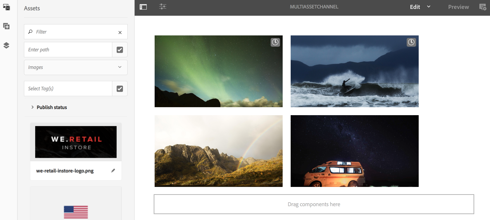

# アセットレベルのアクティベーション {#asset-level-scheduling}

このページでは、チャネルで使用されるアセットのアセットレベルのアクティベーションについて説明します。

この節では、以下のトピックについて説明します。

* 概要
* アクティベーションウィンドウ
* 単一イベントの再生
* アセット内の繰り返しの処理
   * 時間帯区分
   * 週分割
   * 月分割
   * 分割の組み合わせ
* 複数アセットのアクティベーション
* ユニバーサル開始時刻のグローバルオーバーライド

<!--
REFERS TO ARCHIVED VERSIONS THAT ADOBE NO LONGER SUPPORTS>
>[!CAUTION]
>
>This AEM Screens functionality is only available if you have installed AEM 6.3 Feature Pack 3 or AEM 6.4 Screens Feature Pack 1.
>
>To get access to this Feature Pack, contact Adobe Support and request access. When you have permission, you can download it from Package Share. 
-->

## 概要 {#overview}

***アセットレベルのアクティベーション***&#x200B;を使用すると、チャネルで予定時間枠（すべてプレーヤーのローカルタイムゾーン内）に特定のアセットをアクティベートすることができます。 この機能は、画像、ビデオ、トランジション、ページおよび埋め込みチャネル（動的または静的）に対して使用できます。

*例えば*、月曜日と水曜日のサービスタイム（午後 2 時～午後 5 時）にのみ特別なプロモーションを表示するとします。

この機能を使用すると、開始日時と終了日時だけでなく、繰り返しパターンも指定できます。

## アクティベーションウィンドウ {#single-event-playback}

アセットレベルのアクティベーションは、アセットのプロパティへのアクセス時に「**アクティベーション**」タブを設定して行います。

アセットレベルのスケジュール設定を行うには、以下の手順に従います。

1. 任意のチャネルをクリックしたあと、アクションバーの「**編集**」をクリックします。

   

   >[!NOTE]
   >
   >以下を行う方法について詳しくは、
   >
   >* プロジェクトの作成： [新しいプロジェクトの作成](creating-a-screens-project.md)を参照してください。
   >* コンテンツの作成とチャネルへの追加： [チャネルの管理](managing-channels.md)を参照してください。

1. 「**編集**」をクリックすると、チャネルエディターを開き、スケジュールを設定するアセットをクリックできます。

   

1. アセットをクリックしたあと、左上の&#x200B;**設定**（レンチアイコン）をクリックします。

   「**アクティベーション**」タブをクリックします。

   

1. 日付は、日付選択ツールで「**次の日から有効**」と「**次の日まで有効**」フィールドを使用して指定できます。

   「**次の日から有効**」と「**次の日まで有効**」で日時をクリックした場合は、その開始日時と終了日時の間でのみアセットが表示されループします。

   

## アセット内の繰り返しの処理 {#handling-recurrence-in-assets}

必要に応じて、毎日、毎週または毎月、特定の間隔でアセットが繰り返されるようにスケジュールを設定することができます。

金曜日の午後1:00時から午後10:00時までのみ画像を表示するとします。「**アクティベーション**」タブを使用して、アセットの目的の繰り返し間隔を設定できます。

### 日分割 {#day-parting}

1. アセットをクリックし、**設定**（レンチアイコン）をクリックして、プロパティダイアログボックスを開きます。

1. 開始日時と終了日時を入力した後、式または自然言語テキスト形式を使用して、繰り返しスケジュールを指定できます。

   >[!NOTE]
   >必要に応じて、「**次の日から開始**」フィールドと「**次の日まで有効**」フィールドをスキップするか、それらを含めて「スケジュール」フィールドに式を追加できます。

1. 「**スケジュール**」に式を入力すると、特定の日時間隔でアセットが表示されます。

#### 日分割の式の例 {#example-one}

ディスプレイにチャネルを割り当てる際にスケジュールに追加できる式の例を次の表にまとめます。

| **式** | **解釈** |
|---|---|
| 午前8:00前。 | チャンネル内のアセットは、毎日午前8:00前に再生されます |
| 午後2:00時以降。 | チャネル内のアセットは、毎日の午後2:00時以降に再生されます |
| 12:15以降12:45以前 | チャネル内のアセットは、毎日12:15時間後に30分間再生されます |
| before 12:15 also after 12:45 | チャネル内のアセットは、毎日午後12:15までに再生され、午後12:45以降も再生されます。 |

>[!NOTE]
>
>*A.M./P.M.* （2:00 P.M.）の代わりに&#x200B;_軍時間_&#x200B;の表記法（14:00）を使用することもできます。

### 週分割 {#week-parting}

1. アセットをクリックしたあと、**設定**（レンチアイコン）をクリックします。

1. 開始日時と終了日時を入力した後、式または自然言語テキスト形式を使用して、繰り返しスケジュールを指定できます。

   >[!NOTE]
   >必要に応じて、**次の日から開始**&#x200B;フィールドと&#x200B;**次の日まで有効**&#x200B;フィールドをスキップするか、それらを含めてスケジュールフィールドに式を追加できます。

1. 「**スケジュール**」に式を入力すると、特定の日時間隔でアセットが表示されます。

#### 週分割の式の例 {#example-two}

ディスプレイにチャネルを割り当てる際にスケジュールに追加できる式の例を次の表にまとめます。

| **式** | **解釈** |
|---|---|
| `Mon,Wed,Fri` | アセットは、月曜、水曜、金曜日にチャネルで再生される |
| `Mon-Thu` | アセットは、月曜日から木曜日までのチャネルで再生される |

>[!NOTE]
>
>_省略形_（`Mon,Wed,Fri`）の代わりに、_通常_&#x200B;の表記（`Monday,Wednesday,Friday`）を使用することもできます。

### 月分割 {#month-parting}

1. アセットをクリックし、**設定**（レンチアイコン）をクリックします。

1. 開始日時と終了日時を入力した後、式または自然言語テキスト形式を使用して、繰り返しスケジュールを指定できます。

   >[!NOTE]
   >必要に応じて、**次の日から開始**&#x200B;フィールドと&#x200B;**次の日まで有効**&#x200B;フィールドをスキップするか、それらを含めてスケジュールフィールドに式を追加できます。

1. 「**スケジュール**」に式を入力すると、特定の日時間隔でアセットが表示されます。

#### 月分割の式の例 {#example-three}

ディスプレイにチャネルを割り当てる際にスケジュールに追加できる式の例を次の表にまとめます。

| **式** | **解釈** |
|---|---|
| `on February,May,August,November` | アセットは 2 月、5 月、8 月、および 11 月にチャネルで再生される |
| `on February-July` | アセットは、2 月から 7 月末までチャネルで再生される |

>[!NOTE]
>曜日や月を定義する場合は、省略形または通常の表記を使用できます（月／月曜日、1／1月など）。

### 分割の組み合わせ {#combined-parting}

1. アセットをクリックし、**設定**（レンチアイコン）をクリックします。

1. 開始日時と終了日時を入力した後、式または自然言語テキスト形式を使用して、繰り返しスケジュールを指定できます。

   >[!NOTE]
   >必要に応じて、**次の日から開始**&#x200B;フィールドと&#x200B;**次の日まで有効**&#x200B;フィールドをスキップするか、それらを含めてスケジュールフィールドに式を追加できます。

1. 「**スケジュール**」に式を入力すると、特定の日時間隔でアセットが表示されます。

#### 分割の組み合わせの式の例 {#example-four}

ディスプレイにチャネルを割り当てる際にスケジュールに追加できる式の例を次の表にまとめます。

| **式** | **解釈** |
|---|---|
| `after 6:00 and before 18:00 on Mon,Wed of Jan-Mar` | アセットは、1月から 3月末の月曜日と水曜日、午前 6 時から午後 6 時の間、チャネルで再生されます |
| `on the 1st day of January after 2:00 P.M. also on the 2nd day of January also on the 3rd day of January before 3:00 A.M.` | チャンネル内のアセットは、1月1日の午後2時から再生を開始し、1月3日の午前3時1分まで1日中再生を続けます:00:00 |
| `on the 1-2 days of January after 2:00 P.M. also on the 2-3 days of January before 3:00 A.M.` | チャネル内のアセットは、1月1日の午後2:00時にプレーヤーを開始し、1月2日の午前3:00まで再生を続け、1月2日の午後2:00に再び開始し、1月3日の午前3:00まで再生を続けます |

>[!NOTE]
>曜日や月を定義する場合は、省略形または通常の表記を使用できます（月／月曜日、1／1月など）。 また、*A.M./P.M.* （2:00 P.M.）の代わりに&#x200B;_軍時間_&#x200B;の表記法（14:00）を使用することもできます。

## 複数アセットのアクティベーション {#multi-asset-scheduling}

<!--
>[!CAUTION]
>
>The **Multi-asset Activation** feature is only available if you have installed AEM 6.3 Feature Pack 5 or AEM 6.4 Feature Pack 3. 
-->

***複数アセットのアクティベーション***&#x200B;を使用すると、複数のアセットをクリックし、選択したすべてのアセットに再生スケジュールを適用することができます。

### 前提条件 {#prerequisites}

複数アセットレベルのアクティベーションをアセットに使用するには、シーケンスチャネルを含んだ AEM Screens プロジェクトを作成します。 この機能の実装を次の使用例で示します。

* 「**MultiAssetDemo**」というタイトルの AEM Screens プロジェクトを作成します。
* **MultiAssetChannel** というタイトルのチャネルを作成し、そのチャネルにコンテンツを追加します（下図を参照）。

複数のアセットをクリックし、それらの表示スケジュールを AEM Screens プロジェクトに設定するには、以下の手順に従います。

1. **MultiAssetChannel** をクリックしたあと、アクションバーの「**編集**」をクリックします。

   

1. エディターで複数のアセットをクリックしたあと、「**アクティベーションを編集**」（左上のアイコン）をクリックします。

   

1. **コンポーネントアクティベーション**&#x200B;ダイアログボックスの「**次の日から有効**」と「**次の日まで有効**」で、日時をクリックします。 スケジュールの選択が完了したら、チェックマークアイコンをクリックします。

   

1. 「更新」をクリックして、複数アセットスケジュールが適用されるアセットを確認します。

   >[!NOTE]
   >
   >複数アセットのアクティベーションが設定されているアセットの右上隅に、スケジュールアイコンが表示されます。

   

## ユニバーサル開始時刻のグローバルオーバーライド {#global-override-scheduling}

***ユニバーサル開始時刻のグローバルオーバーライド***&#x200B;は、コンテンツ作成者が特定の時間に基づいて画像アセットまたはビデオアセットの再生を定義できる設定です。 個々のプレーヤーの時間／タイムゾーン設定は使用されません。

通常は、指定のプレーヤーのローカル時間によって再生が決まります。 ただし、グローバルオーバーライドでは、特定のユニバーサル開始時刻を使用してアセットの再生を開始できます。

そのため、コンテンツ作成者は特定のアセットの再生を指定できます。 コンテンツを割り当てたプレーヤーのローカル時計に関係なく、特定の日時に再生が行われるように指定できます。

***ユニバーサル開始時刻のグローバルオーバーライド***&#x200B;は、アセットのプロパティへのアクセス時に「**アクティベーション**」タブを設定して行います。 アセットスケジュール設定のグローバルオーバーライドを実行するには、次の手順に従います。

1. 任意のチャネルをクリックしたあと、アクションバーの「**編集**」をクリックして、チャネルのコンテンツを追加または編集します。

   

1. 「**編集**」をクリックします。
1. チャネルエディターで、スケジュールを適用するアセットをクリックします。

   

1. グローバルオーバーライドの場合は、アセットの「**タイムゾーンオーバーライド**」セクションでアクティベーション時刻を入力します。 この領域に何も入力しない場合、適用されるタイムゾーンはプレーヤーのタイムゾーンになります。

