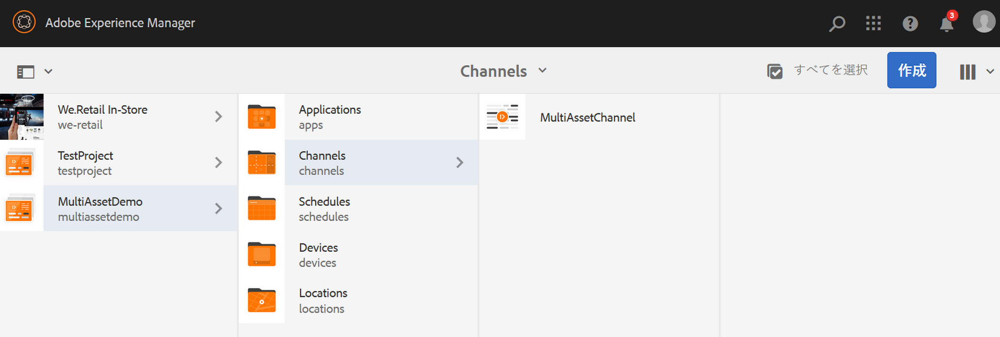

# アセットレベルのアクティベーション {#asset-level-scheduling}

このページでは、チャネルで使用されるアセットのアセットレベルのアクティベーションについて説明します。

この節では、以下のトピックについて説明します。

* 概要
* アクティベーションウィンドウ
* 単一イベントの再生
* アセット内の繰り返しの処理
   * 日分割
   * 週分割
   * 月分割
   * 分割の組み合わせ
* 複数アセットのアクティベーション

>[!CAUTION]
>
>この AEM Screens 機能は、AEM 6.3 機能パック 3 または AEM 6.4 Screens 機能パック 1 がインストールされている場合にのみ使用できます。
>
>この機能パックにアクセスするには、アドビサポートに連絡してアクセス権をリクエストする必要があります。アクセス権が付与されると、パッケージ共有から機能パックをダウンロードできるようになります。

## 概要 {#overview}

***アセットレベルのアクティベーション***&#x200B;を使用すると、プレーヤーのローカルタイムゾーンで予定時間枠にチャネル内の特定のアセットをアクティブにすることができます。この機能は、画像、ビデオ、トランジション、ページ、埋め込みチャネル（動的または静的）に対して使用できます。

*例えば*、月曜日と水曜日のサービスタイム（午後 2 時～午後 5 時）にのみ特別なプロモーションを表示するとします。

この機能を使用すると、開始日時と終了日時だけでなく、繰り返しパターンも指定できます。

## アクティベーションウィンドウ {#single-event-playback}

アセットレベルのアクティベーションは、アセットのプロパティへのアクセス時に「**アクティベーション**」タブを設定しておこないます。

アセットレベルのスケジュール設定をおこなうには、以下の手順に従います。

1. 任意のチャネルを選択し、アクションバーの「**編集**」をクリックして、チャネル内のコンテンツを追加または編集します。

   

   >[!NOTE]
   >
   >以下をおこなう方法について詳しくは、
   >
   >* プロジェクトを作成する方法：[新しいプロジェクトの作成](creating-a-screens-project.md)を参照してください。
   >* チャネルにコンテンツを作成して追加する方法：[チャネルの管理](managing-channels.md)を参照してください。

1. 「**編集**」をクリックしてチャネルエディターを開き、スケジュールを設定するアセットを選択します。

   

1. アセットを選択し、左上の&#x200B;**設定**（レンチアイコン）をクリックして、画像のプロパティを開きます。

   「**アクティベーション**」タブをクリックします。

   

1. 日付は、日付選択ツールで「**次の日から有効**」と「**次の日まで有効**」フィールドを使用して指定できます。

   「**次の日から有効**」と「**次の日まで有効**」で日時を選択した場合は、その開始日時と終了日時の間でのみアセットが表示されループされます。

   

## アセット内の繰り返しの処理 {#handling-recurrence-in-assets}

必要に応じて、毎日、毎週または毎月、特定の間隔でアセットが繰り返されるようにスケジュールを設定することもできます。

例えば、金曜日の午後 1 時から午後 10 時までの間のみ、画像を表示するとします。「**アクティベーション**」タブを使用して、アセットの繰り返し間隔を希望どおり設定できます。

### 日分割 {#day-parting}

1. アセットを選択し、**設定**（レンチアイコン）をクリックして、プロパティダイアログボックスを開きます。

1. 開始日時と終了日時を入力した後、式または自然言語テキスト形式を使用して、繰り返しスケジュールを指定できます。

   >[!NOTE]
   >必要に応じて、「**次の日から開始**」フィールドと「**次の日まで有効**」フィールドをスキップするか、それらを含めて「スケジュール」フィールドに式を追加できます。

1. 「**スケジュール**」に式を入力すると、特定の日時間隔でアセットが表示されます。

#### 日分割の式の例 {#example-one}

ディスプレイにチャネルを割り当てる際にスケジュールに追加できる式の例を次の表にまとめます。

| **式** | **解釈** |
|---|---|
| 午前 8:00 より前 | チャネル内のアセットは毎日午前 8:00 まで再生されます |
| 午後 2:00 より後 | チャネル内のアセットは毎日午後 2:00 から再生されます |
| 12:15 より後、12:45 より前 | チャネル内のアセットは、毎日午後 12:15 から 30 分間再生されます |
| 12:15 より前、12:45 より後 | チャネル内のアセットは、毎日午後 12:15 までと午後 12:45 から再生されます |

>[!NOTE]
>
>*午前／午後*&#x200B;表記（例：午後 2:00）ではなく、_24 時間_&#x200B;表記（例：14:00）を使用することもできます。

### 週分割 {#week-parting}

1. アセットを選択し、**設定**（レンチアイコン）をクリックして、プロパティダイアログボックスを開きます。

1. 開始日時と終了日時を入力した後、式または自然言語テキスト形式を使用して、繰り返しスケジュールを指定できます。

   >[!NOTE]
   >必要に応じて、「**次の日から開始**」フィールドと「**次の日まで有効**」フィールドをスキップするか、それらを含めて「スケジュール」フィールドに式を追加できます。

1. 「**スケジュール**」に式を入力すると、特定の日時間隔でアセットが表示されます。

#### 週分割の式の例 {#example-two}

ディスプレイにチャネルを割り当てる際にスケジュールに追加できる式の例を次の表にまとめます。

| **式** | **解釈** |
|---|---|
| 月、水、金 | アセットは、月曜、水曜、金曜にチャネル内で再生される |
| 月 ～ 木 | アセットは、月曜日から木曜日までのチャネルで再生される |

>[!NOTE]
>
>また、_省略形_（月、水、金など）の代わりに、_通常の_&#x200B;表記（月曜日、水曜日、金曜日など）を使用することもできます。

### 月分割 {#month-parting}

1. アセットを選択し、**設定**（レンチアイコン）をクリックして、プロパティダイアログボックスを開きます。

1. 開始日時と終了日時を入力した後、式または自然言語テキスト形式を使用して、繰り返しスケジュールを指定できます。

   >[!NOTE]
   >必要に応じて、「**次の日から開始**」フィールドと「**次の日まで有効**」フィールドをスキップするか、それらを含めて「スケジュール」フィールドに式を追加できます。

1. 「**スケジュール**」に式を入力すると、特定の日時間隔でアセットが表示されます。

#### 月分割の式の例 {#example-three}

ディスプレイにチャネルを割り当てる際にスケジュールに追加できる式の例を次の表にまとめます。

| **式** | **解釈** |
|---|---|
| 2 月、5 月、8 月、11 月 | アセットは 2 月、5 月、8 月、および 11 月にチャネルで再生される |
| 2 月～ 7 月 | アセットは、2 月から 7 月末までずっとチャンネル内で再生される |

>[!NOTE]
>曜日や月を定義する場合は、省略形または通常の表記を使用できます（月／月曜日、1／1 月など）。

### 分割の組み合わせ {#combined-parting}

1. アセットを選択し、**設定**（レンチアイコン）をクリックして、プロパティダイアログボックスを開きます。

1. 開始日時と終了日時を入力した後、式または自然言語テキスト形式を使用して、繰り返しスケジュールを指定できます。

   >[!NOTE]
   >必要に応じて、「**次の日から開始**」フィールドと「**次の日まで有効**」フィールドをスキップするか、それらを含めて「スケジュール」フィールドに式を追加できます。

1. 「**スケジュール**」に式を入力すると、特定の日時間隔でアセットが表示されます。

#### 分割の組み合わせの式の例 {#example-four}

ディスプレイにチャネルを割り当てる際にスケジュールに追加できる式の例を次の表にまとめます。

| **式** | **解釈** |
|---|---|
| 6:00 ～ 18:00（1 月～ 3 月の月曜および水曜） | アセットは、1 月から 3 月末の月曜日と水曜日、午前 6 時から午後 6 時の間、チャンネルで再生される |
| 1 月 1 日の午後 2:00 より後、1 月 2 日を経て、1 月 3 日の午前 3:00 より前 | チャネル内アセットの再生は、1 月 1 日の午後 2:00 に開始し、1 月 2 日の終日を経て 1 月 3 日の午前 3:00 まで続きます |
| 1 月 1～2 日の午後 2:00 より後、1 月 2～3 日の午前 3:00 より前 | チャネル内アセットの再生は、1 月 1 日の午後 2:00 に開始し、1 月 2 日の午前 3:00 まで続いた後、1 月 2 日の午後 2:00 に再開し、1 月 3 日の午前 3:00 まで続きます。 |

>[!NOTE]
>曜日や月を定義する場合は、省略形または通常の表記を使用できます（月／月曜日、1／1 月など）。さらに、_午前／午後_&#x200B;表記（例：午後 2:00）ではなく、*24 時間*&#x200B;表記（例：14:00）を使用することもできます。

## 複数アセットのアクティベーション {#multi-asset-scheduling}

>[!CAUTION]
>
>**複数アセットのアクティベーション**&#x200B;機能は、AEM 6.3 機能パック 5 または AEM 6.4 機能パック 3 がインストールされている場合にのみ使用できます。

***複数アセットのアクティベーション***&#x200B;を使用すると、複数のアセットを選択し、選択したすべてのアセットに再生スケジュールを適用することができます。

### 前提条件 {#prerequisites}

複数アセットレベルのアクティベーションをアセットに使用するには、シーケンスチャネルを含んだ AEM Screens プロジェクトを作成します。この機能の実装を次の使用例で示します。

* 「**MultiAssetDemo**」というタイトルの AEM Screens プロジェクトを作成する
* **MultiAssetChannel** というタイトルのチャネルを作成し、そのチャネルにコンテンツを追加します（下図を参照）。

複数のアセットを選択し、それらの表示スケジュールを AEM Screens プロジェクトに設定するには、以下の手順に従います。

1. **MultiAssetChannel** を選択し、アクションバーの「**編集**」をクリックして、エディターを開きます。

   

1. エディターで複数のアセットを選択し、「**アクティベーションを編集**」（左上のアイコン）をクリックします。

   

1. **コンポーネントアクティベーション**&#x200B;ダイアログボックスの「**次の日から有効**」と「**次の日まで有効**」で、日時を選択します。スケジュールの選択が完了したら、チェックマークアイコンをクリックします。

   

1. 「更新」をクリックして、複数アセットスケジュールが適用されるアセットを確認します。

   >[!NOTE]
   >
   >複数アセットのアクティベーションが設定されているアセットの右上隅にスケジュールアイコンが表示されます。

   
