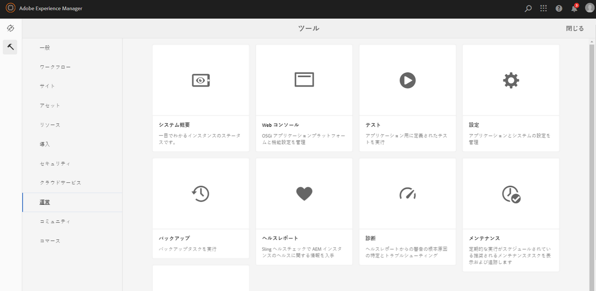
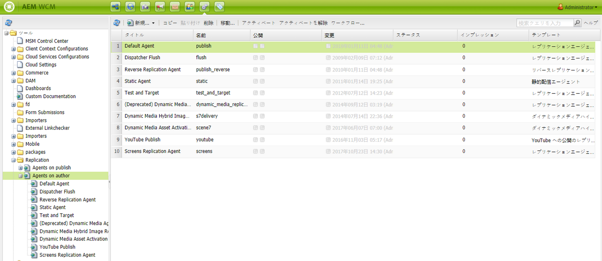
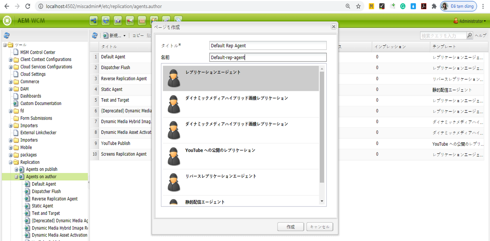
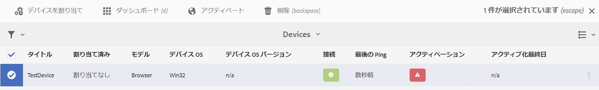
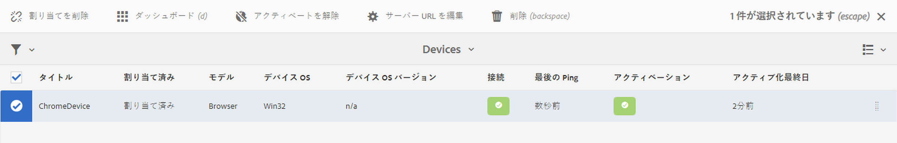

# AEM Screens でのオーサーとパブリッシュの設定 {#configuring-author-and-publish-in-aem-screens}

ここでは、以下のトピックについて重点的に説明します。

* **オーサーインスタンスとパブリッシュインスタンスの設定**
* **パブリッシュトポロジのセットアップ**
* **公開の管理：オーサーからパブリッシュ経由でデバイスにコンテンツの更新を配信**

## 前提条件 {#prerequisites}

オーサーサーバーとパブリッシュサーバーの使用を開始する前に、以下に関する事前の知識が必要です。

* **AEM トポロジ**
* **AEM Screens プロジェクトの作成と管理**
* **デバイス登録プロセス**

>[!NOTE]
>
>この AEM Screens 機能は、AEM 6.4 Screens 機能パック 2 がインストールされている場合にのみ使用できます。この機能パックにアクセスするには、アドビサポートに連絡してアクセス権をリクエストする必要があります。アクセス権が付与されると、パッケージ共有から機能パックをダウンロードできるようになります。

>[!IMPORTANT]
>
>複数のパブリッシュインスタンスをディスパッチャーと共に使用する場合は、ディスパッチャー内の dispatcher.any ファイルを更新する必要があります。詳しくは、[スティッキーセッションの有効化](dispatcher-configurations-aem-screens.md#enable-sticky-session)を参照してください。

## オーサーインスタンスとパブリッシュインスタンスの設定{#configuring-author-and-publish-instances}

>[!NOTE]
>
>オーサーとパブリッシュのアーキテクチャの概要と、コンテンツを AEM オーサーインスタンスで作成して複数のパブリッシュインスタンスにフォワードレプリケートする方法について詳しくは、[オーサーとパブリッシュのアーキテクチャの概要](author-publish-architecture-overview.md)を参照してください。

次の節では、オーサーおよびパブリッシュトポロジにレプリケーションエージェントをセットアップする方法について説明します。

次のような 1 つのオーサーインスタンスと 2 つのパブリッシュインスタンスをホストする簡単な例を示します。

* オーサー --> localhost:4502
* パブリッシュ 1（pub1） --> localhost:4503
* パブリッシュ 2（pub2） --> localhost:4504

## オーサー環境へのレプリケーションエージェントのセットアップ {#setting-replication-agents}

レプリケーションエージェントを作成するには、標準のレプリケーションエージェントの作成方法を習得する必要があります。

AEM Screens には次の 3 つのレプリケーションエージェントが必要です。

1. **デフォルトレプリケーションエージェント&#x200B;***（***標準レプリケーションエージェント**&#x200B;として指定）
1. **Screens レプリケーションエージェント**
1. **リバースレプリケーションエージェント**

### 手順 1：デフォルトレプリケーションエージェントの作成 {#step-creating-a-default-replication-agent}

以下の手順に従って、デフォルトレプリケーションエージェントを作成します。

1. AEM インスタンス／ハンマーアイコン／**操作**／**設定**&#x200B;に移動します。

   

1. 左側のナビゲーションツリーから「**レプリケーション**」を選択します。

   

1. **レプリケーション**&#x200B;フォルダーから「**作成者のエージェント**」を選択し、「**新規作成**」をクリックして新しい標準レプリケーションエージェントを作成します。

   

1. 作成するレプリケーションエージェントの「**タイトル**」と「**名前**」を入力し、「**作成**」をクリックします。

   

1. レプリケーションエージェントを右クリックし、「**開く**」をクリックして設定を編集します。

   

1. 「**編集**」をクリックして&#x200B;**エージェントの設定**&#x200B;ダイアログボックスを開き、詳細を入力します。

   >[!NOTE]
   >
   >レプリケーションエージェントを有効にするには、「**有効**」をオンにする必要があります。このオプションは、デフォルトレプリケーションエージェント、Screens レプリケーションエージェント、リバースレプリケーションエージェントでオンにする必要があります。

   

1. 「**トランスポート**」タブに移動し、「**URI**」、「**ユーザー**」、「**パスワード**」を入力します。

   

   >[!NOTE]
   >
   >また、既存のデフォルトレプリケーションエージェントをコピーして名前を変更することもできます。

#### 標準レプリケーションエージェントの作成 {#creating-standard-replication-agents}

1. pub1 の標準レプリケーションエージェントを作成します（すぐに使用できるデフォルトエージェントは既に設定されている必要があります）（例：*https://&lt;hostname>:4503/bin/receive?sling:authRequestLogin=1*）。
1. pub2 の標準レプリケーションエージェントを作成します。pub1 のレプリケーションエージェントをコピーし、トランスポート設定のポートを変更することで、トランスポートを pub2 用に更新することができます（例：*https://&lt;hostname>:4504/bin/receive?sling:authRequestLogin=1*）。

#### Screens レプリケーションエージェントの作成 {#creating-screens-replication-agents}

1. pub1 の AEM Screens レプリケーションエージェントを作成します。デフォルトで、ポート 4503 を指す名前付きの Screens レプリケーションエージェントが 1 つ用意されています。これを有効にする必要があります。
1. pub2 の AEM Screens レプリケーションエージェントを作成します。pub1 の Screens レプリケーションエージェントをコピーし、pub2 の 4504 を指すようにポートを変更します。

#### Screens リバースレプリケーションエージェントの作成 {#creating-screens-reverse-replication-agents}

1. pub1 の標準リバースレプリケーションエージェントを作成します。
1. pub2 の標準リバースレプリケーションエージェントを作成します。pub1 のリバースレプリケーションエージェントをコピーし、トランスポート設定のポートを変更することで、トランスポートを pub2 用に更新することができます

## パブリッシュトポロジのセットアップ {#setting-up-publish-topology}

### 手順 1：Apache Sling Oak-Based Discovery の設定 {#step-configure-apache-sling-oak-based-discovery}

トポロジ内のすべてのパブリッシュインスタンスに、Apache Sling Oak-Based Discovery をセットアップします。

パブリッシュインスタンスごとに以下をおこないます。

1. `https://<host>:<port>/system/console/configMgr` に移動します。
1. 「**Apache Sling Oak-Based Discovery Service**」の設定を選択します。
1. トポロジコネクタ URL の更新：参加するすべてのパブリッシュインスタンスの URL を追加します。
   * `https://localhost:4503/libs/sling/topology/connector`
   * `https://localhost:4504/libs/sling/topology/connector`
1. **Topology Connector サービスのホワイトリスト：参加するパブリッシュインスタンスをカバーする IP またはサブネットに合わせます。**
1. 「**ローカルループの自動停止**」をオンにします。

各パブリッシュインスタンスの設定は同じにする必要があり、ローカルループの自動停止は無限ループを防ぎます。

#### 手順 2：パブリッシュトポロジの確認 {#step-verify-publish-topology}

任意のパブリッシュインスタンスについて、`https://:/system/console/topology` に移動します。各パブリッシュインスタンスは、**送信トポロジコネクタ**&#x200B;の下に表示されているはずです。

#### 手順 3：ActiveMQ Artemis クラスターのセットアップ {#step-setup-activemq-artemis-cluster}

この手順では、ActiveMQ Artemis クラスターの暗号化パスワードを作成できます。
トポロジ内のすべてのパブリッシュインスタンスについて、クラスターユーザーおよびパスワードは共通でなければなりません。ActiveMQ Artemis 設定のパスワードは暗号化する必要があります。インスタンスごとに専用の暗号化キーがあるので、Crypto Support を使用して、暗号化されたパスワード文字列を作成する必要があります。こうして暗号化されたパスワードは、ActiveMQ の OSGi 設定で使用されることになります。

各パブリッシュインスタンスで以下をおこないます。

1. OSGi コンソールで、**Main**／**Crypto Support**（`https://&lt;host&gt;:&lt;port&gt;/system/console/crypto`）に移動します。
1. 目的のプレーンテキストパスワード（すべてのインスタンスに共通）を「**Plain Text**」に入力します。
1. 「**Protect**」をクリックします。
1. 「**Protected Text**」の値をメモ帳またはテキストエディターにコピーします。この値は、ActiveMQ の OSGi 設定で使用されることになります。

デフォルトでは、パブリッシュインスタンスごとに一意の暗号キーが存在するので、この手順を各パブリッシュインスタンスで実行し、次回の設定用にこの一意のキーを保存する必要があります。

>[!NOTE]
>
>パスワードは波括弧（{}）で囲んでください。次に例を示します。
>`{1ec346330f1c26b5c48255084c3b7272a5e85260322edd59119828d1fa0a610e}`

#### 手順 4：ActiveMQ Artemis クラスターのアクティブ化 {#step-activate-activemq-artemis-cluster}

各パブリッシュインスタンスで以下をおこないます。

1. OSGi 設定マネージャー（`https://&lt;host&gt;:&lt;port&gt;/system/console/configMgr`）に移動します。
1. 「**Apache ActiveMQ Artemis JMS Provider**」の設定を選択します。
1. 以下を更新します。

   * ***Cluster Password***：（インスタンスごとに前の手順の暗号化された値を使用）
   * ***Topics***：{name: &#39;commands&#39;, address: &#39;com.adobe.cq.screens.commands&#39;, maxConsumers: 50}

#### ActiveMQ Artemis クラスターの確認 {#verify-activemq-artemis-cluster}

各パブリッシュインスタンスで次の手順に従います。

1. OSGi コンソールで、Main／ActiveMQ Artemis（`https://localhost:4505/system/console/mq`）に移動します。
1. Cluster Information／Topology でノード数 2、メンバー数 2 を選択し、他のインスタンスのポートを確認します。
1. テストメッセージを送信します（画面上部の「Broker Information」の下）。
1. 各フィールドを次のように変更します。

   1. **Destination**：/com.adobe.cq.screens/devTestTopic
   1. **Text**：Hello World
   1. 各インスタンスの error.log を表示して、メッセージがクラスター全体で送受信されたことを確認します。

>[!NOTE]
>
>OSGi コンソールに移動すると、前の手順で設定を保存した後、数秒かかる場合があります。詳しくは、error.log を確認することもできます。

例えば、次の画像は、ActiveMQ Artemis サーバーの設定が正常におこなわれた場合に表示されます。

次の設定が */system/console/mq* に表示されない場合は、*/system/console/mq* に移動し、「**Restart**」をクリックしてブローカーを再起動します。

#### リファラーヘッダー要件の削除 {#remove-referrer-header-requirement}

各パブリッシュインスタンスで次の手順に従います。

1. **OSGi コンソール**&#x200B;を開いて **Configuration Manager** に移動します。
1. 「**Apache Sling Referrer Filter**」を選択します。
1. 設定を更新し、「**Allow Empty**」をオンにします。

### オーサーインスタンスとパブリッシュインスタンスの設定 {#configuring-author-and-publish-instance}

パブリッシュ環境のトポロジをセットアップしたら、実装の実際の結果を表示するようにオーサーインスタンスとパブリッシュインスタンスを設定する必要があります。

>[!NOTE]
>
>**前提条件**
>
>この例に取りかかるには、新しい AEM Screens プロジェクトを作成した後、プロジェクト内にロケーション、ディスプレイ、チャネルを作成します。チャネルにコンテンツを追加し、このチャネルをディスプレイに割り当てます。

#### 手順 1：AEM Screens Player（デバイス）の起動 {#step-starting-an-aem-screens-player-device}

1. 別のブラウザーウィンドウを起動します。
1. ** Web ブラウザーを使用して Screens Player（`https://localhost:4502/content/mobileapps/cq-screens-player/firmware.html`）に移動するか、AEM Screens アプリを起動します。デバイスを開くと、デバイスの状態が未登録であることがわかります。

>[!NOTE]
>
>AEM Screens Player を開くには、ダウンロードした AEM Screens アプリか Web ブラウザーを使用します。

#### 手順 2：オーサー環境へのデバイスの登録 {#step-registering-a-device-on-author}

1. `https://localhost:4502/screens.html/content/screens/we-retail` に移動するか、プロジェクトを選択してデバイス／デバイスマネージャーに移動します。
1. 「**デバイスを登録**」をクリックします。
1. 「**デバイスの登録**」をクリックして、デバイスを表示します。
1. 登録するデバイスを選択して、「**デバイスを登録**」をクリックします。
1. 登録コードを確認し、「**検証**」をクリックします。
1. デバイスのタイトルを入力し、「**登録**」をクリックします。

#### 手順 3：ディスプレイへのデバイスの割り当て {#step-assigning-the-device-to-display}

1. 前の手順のダイアログボックスで、「**ディスプレイを割り当て**」をクリックします。
1. **ロケーション**&#x200B;フォルダーから、チャネルのディスプレイのパスを選択します。
1. 「**割り当て**」をクリックします。
1. 「**完了**」をクリックしてプロセスを完了すると、デバイスが割り当てられます。

プレーヤーを確認すると、チャネルに追加したコンテンツが表示されます。

#### 手順 4：パブリッシュインスタンスへのデバイス設定の公開 {#step-publishing-device-configuration-to-publish-instances}

**デバイスの確認**

以下の手順を実行する前に、デバイス ID を確認してください。確認するには、CRXDE Lite で、パスを */home/users/screens/we-retail/devices* としてデバイス ID を検索します。

次の手順に従って、デバイスユーザーをレプリケートします。

1. ユーザー管理ページ（例：`https://localhost:4502/useradmin`）に移動します。
1. **screens-devices-master** グループを検索します。
1. このグループを右クリックし、「**アクティブ化**」をクリックします。

>[!CAUTION]
>
>author-publish-screens-service はオーサージョブで使用されるシステムユーザーなので、アクティブ化しないでください。

また、デバイス管理コンソールからデバイスをアクティブ化することもできます。その場合は、次の手順に従います。

1. Screens プロジェクト／**デバイス**&#x200B;に移動します。
1. アクションバーの「**デバイスマネージャー**」をクリックします。
1. 次の図に示すように、デバイスを選択し、アクションバーの「**アクティブ化**」をクリックします。

>[!NOTE]
>
>または、デバイスをアクティブ化したら、アクションバーの「**サーバー URL を編集**」をクリックして、サーバーの URL を編集または更新することもできます（下図を参照）。その場合は、変更が AEM Screens Player に反映されます。

### チェックリストの公開 {#publishing-check-list}

チェックリストの公開の要点は次のとおりです。

* *Screens デバイスユーザー* - AEM ユーザーとして保存され、**ツール**／**セキュリティ**／**ユーザー**&#x200B;でアクティブ化できます。ユーザー名の先頭には、「screens」とシリアル化された長い文字列が付けられます。

* *プロジェクト* - AEM Screens プロジェクト。
* *ロケーション* - デバイスの接続先となるロケーション。
* *チャネル* - ロケーションに表示されている 1 つ以上のチャネル。
* *スケジュール* - スケジュールを使用する場合は、スケジュールを必ず公開します。
* *ロケーション、スケジュール、チャネルの各フォルダー* - 対応するリソースがフォルダー内にある場合。

次の手順に従って、オーサーとパブリッシュの動作を確認します。

1. オーサーインスタンスのチャネルコンテンツの一部を更新します。
1. 「**公開を管理**」を実行して、すべてのパブリッシュインスタンスに新しい変更を公開します。
1. 「**アクティブ化**」をクリックして、**デバイスマネージャー**&#x200B;からデバイスをアクティブ化します。
1. オーサーインスタンス URL からパブリッシュインスタンス URL の 1 つに **URL を編集**&#x200B;します。
1. AEM Screens Player に更新されたチャネルコンテンツが表示されることを確認します。
1. 別のパブリッシュインスタンスを使用して、これらの手順を繰り返します。

#### 手順 5 ：パブリッシュインスタンスを指すように管理パネルでデバイスを設定 {#step-pointing-the-device-to-publish-instance-in-the-admin-panel}

1. Screens Player から Admin UI を表示します。それには、タッチ操作対応の AEM Screens Player またはマウスを使用して左上隅を長押しして、Admin メニューを開きます。
1. サイドパネルの「**設定**」オプションをクリックします。
1. 「**サーバー**」のオーサーインスタンスをパブリッシュインスタンスに変更します。

AEM Screens Player で変更結果を表示します。

または、次の手順に従って、デバイス管理コンソールでサーバー URL を更新または編集することもできます。

1. AEM Screens プロジェクトに移動し、**デバイス**&#x200B;フォルダーを選択します。
1. アクションバーの「**デバイスマネージャー**」をクリックします。
1. デバイスを選択し、アクションバーの「**サーバー URL を編集**」をクリックします（下図を参照）。変更内容が AEM Screens Player に反映されます。

「**公開を管理**」機能を使用すると、コンテンツの更新をオーサーからパブリッシュ経由でデバイスに配信できます。AEM Screens プロジェクト全体のコンテンツを公開／非公開にすることも、チャネル、ロケーション、デバイス、アプリケーション、スケジュールのいずれか 1 つのコンテンツを公開／非公開にすることもできます。この機能の詳細については、[オンデマンドコンテンツの更新](on-demand-content.md)を参照してください。

