# AEM Screensでのオーサーインスタンスとパブリッシュインスタンスの設定 {#configuring-author-and-publish-in-aem-screens}

このページでは、以下のトピックについて重点的に説明します。

>[!IMPORTANT]
>このコンテンツは、AEM オンプレミス/AMS （AEM 6.5LTSおよびAEM 6.5）に対して有効です。 AEM as a Cloud Service Screensの内容については、[AEM as a Cloud Service ガイド &#x200B;](https://experienceleague.adobe.com/en/docs/experience-manager-cloud-service/content/screens-as-cloud-service/overview/introduction)を参照してください。

* **オーサーインスタンスとパブリッシュインスタンスの設定**
* **パブリッシュトポロジのセットアップ**
* **公開の管理：オーサーからパブリッシュ経由でデバイスにコンテンツの更新を配信**

## 前提条件 {#prerequisites}

オーサーサーバーとパブリッシュサーバーの使用を開始する前に、以下に関する事前の知識が必要です。

* **AEM トポロジ**
* **AEM Screens プロジェクトの作成と管理**
* **デバイス登録プロセス**

>[!NOTE]
>
>この AEM Screens 機能は、AEM 6.4 Screens 機能パック 2 がインストールされている場合にのみ使用できます。 この機能パックにアクセスするには、アドビサポートに連絡してアクセス権をリクエストします。 アクセス権が付与されると、Package Share から機能パックをダウンロードできます。

>[!IMPORTANT]
>
>複数のパブリッシュインスタンスを Dispatcher と併用する場合は、Dispatcher をアップデートします。 [スティッキーセッションの有効化](dispatcher-configurations-aem-screens.md#enable-sticky-session)を参照してください。

## オーサーインスタンスとパブリッシュインスタンスの設定 {#configuring-author-and-publish-instances}

>[!NOTE]
>
>オーサーとパブリッシュのアーキテクチャの概要と、コンテンツを AEM オーサーインスタンスで作成して、複数のパブリッシュインスタンスにフォワードレプリケートする方法について詳しくは、[オーサーとパブリッシュのアーキテクチャの概要](author-publish-architecture-overview.md)を参照してください。

次の節では、オーサーおよびパブリッシュトポロジにレプリケーションエージェントを設定する方法について説明します。

1つのオーサーインスタンスと2つのパブリッシュインスタンスをホストする簡単な例を設定できます。

* 作成者 / localhost:4502
* Publish 1 （pub1） > localhost:4503
* Publish 2 （pub2） > localhost:4504

## 作成者にレプリケーションエージェントを設定する {#setting-replication-agents}

レプリケーションエージェントを作成するには、標準のレプリケーションエージェントの作成方法を習得します。

AEM Screens には次の 3 つのレプリケーションエージェントが必要です。

1. **デフォルトレプリケーションエージェント&#x200B;***（***標準レプリケーションエージェント**&#x200B;として指定）
1. **Screens レプリケーションエージェント**
1. **リバースレプリケーションエージェント**

### 手順1：デフォルトのレプリケーションエージェントの作成 {#step-creating-a-default-replication-agent}

以下の手順に従って、デフォルトレプリケーションエージェントを作成します。

1. AEM インスタンス／ハンマーアイコン／**操作**／**設定**&#x200B;に移動します。

   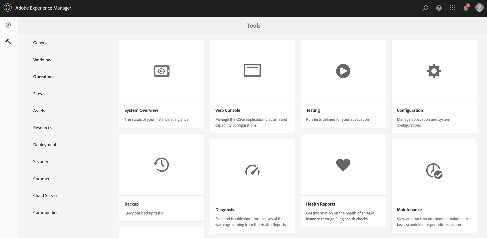

1. 左側のナビゲーションツリーから「**レプリケーション**」をクリックします。

   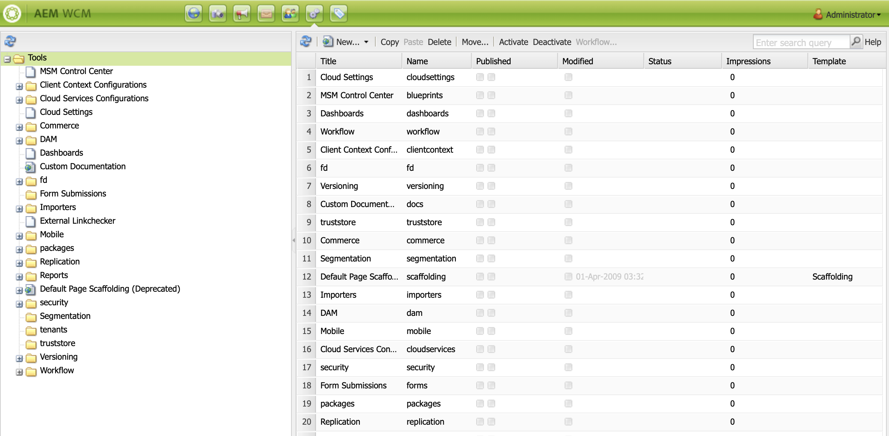

1. **レプリケーション**&#x200B;フォルダーから「**作成者のエージェント**」をクリックし、「**新規作成**」をクリックして新しい標準レプリケーションエージェントを作成します。

   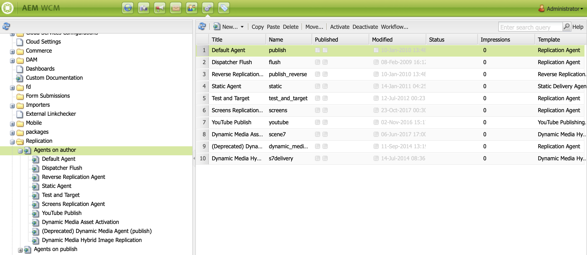

1. レプリケーションエージェントを作成できるように、「**タイトル**」と「**名前**」を入力し、「**作成**」をクリックします。

   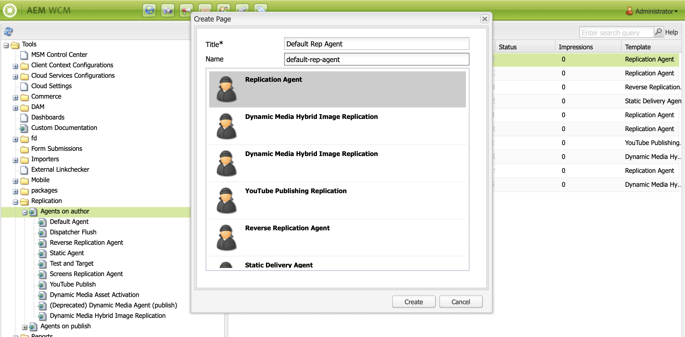

1. レプリケーションエージェントを右クリックし、「**開く**」をクリックして設定を編集します。

   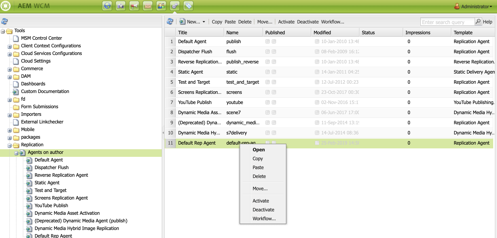

1. 「**編集**」をクリックします。

1. **エージェント設定**&#x200B;ダイアログボックスで、詳細を入力します。

   >[!NOTE]
   >
   >レプリケーションエージェントを有効にするには、「**有効**」をオンにする必要があります。 デフォルト、Screens、リバースレプリケーションエージェントでこのオプションをオンにします。

   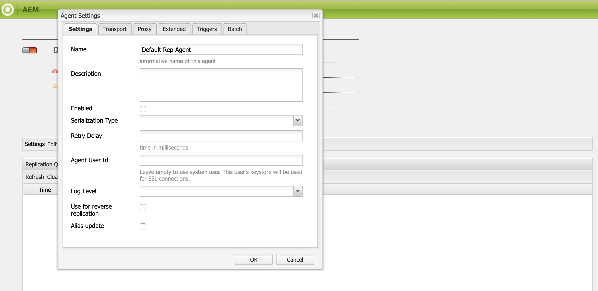

1. 「**トランスポート**」タブに移動し、「**URI**」、「**ユーザー**」、「**パスワード**」を入力します。

   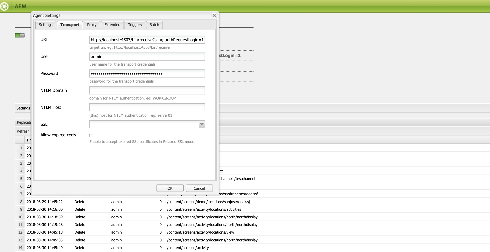

   >[!NOTE]
   >
   >また、既存のデフォルトレプリケーションエージェントをコピーして名前を変更することもできます。

#### 標準レプリケーションエージェントの作成 {#creating-standard-replication-agents}

1. pub1 の標準レプリケーションエージェントを作成します（標準のデフォルトエージェントが既に設定されている必要があります）。 例えば、*`https://<hostname>:4503/bin/receive?sling:authRequestLogin=1`* のように指定します。
1. pub2 の標準レプリケーションエージェントを作成します。 pub1 のレプリケーションエージェントをコピーし、トランスポート設定でポートを変更することで、トランスポートを pub2 に使用するように更新できます。 例えば、*`https://<hostname>:4504/bin/receive?sling:authRequestLogin=1`* のように指定します。

#### Screens レプリケーションエージェントの作成 {#creating-screens-replication-agents}

1. pub1 の AEM Screens レプリケーションエージェントを作成します。 標準では、ポート 4503 を指す名前付きの Screens レプリケーションエージェントが 1 つ用意されています。 それを有効にします。
1. pub2 の AEM Screens レプリケーションエージェントを作成します。 pub1 の Screens レプリケーションエージェントをコピーし、pub2 の 4504 を指すようにポートを変更します。

   >[!NOTE]
   >Screens レプリケーションエージェントの設定方法については、[Screens レプリケーションエージェントの設定](https://experienceleague.adobe.com/ja/docs/experience-manager-screens/user-guide/administering/configure-screens-replication)を参照してください。

#### Screens リバースレプリケーションエージェントの作成 {#creating-screens-reverse-replication-agents}

1. pub1 のリバースレプリケーションエージェントを作成します。
1. pub2 のリバースレプリケーションエージェントを作成します。 pub1 のリバースレプリケーションエージェントをコピーし、トランスポート設定のポートを変更することで、トランスポートを pub2 に使用するように更新できます。

## 公開トポロジの設定 {#setting-up-publish-topology}

### 手順 1：Apache Sling Oak-Based Discovery の設定 {#step-configure-apache-sling-oak-based-discovery}

トポロジ内のすべてのパブリッシュインスタンスに、Apache Sling Oak-Based Discovery をセットアップします。

パブリッシュインスタンスごとに以下を行います。

1. `https://<host>:<port>/system/console/configMgr` に移動します。
1. 「**Apache Sling Oak-Based Discovery Service**」の設定をクリックします。
1. トポロジコネクタ URL の更新：参加するすべてのパブリッシュインスタンスの URL を追加します。
   * `https://publish:4503/libs/sling/topology/connector`
   * `https://publish:4504/libs/sling/topology/connector`
1. **トポロジコネクタ `Whitelist` リスト**：すべてのパブリッシュインスタンスをカバーする IP またはサブネットに適応します。 ポート番号なしで、すべてのパブリッシュインスタンスの IP／ホスト名を `whitelist` します。

1. 「**Auto-Stop Local-Loops**」をオンにします。

各パブリッシュインスタンスの設定を同じにする必要があり、ローカルループの自動停止により無限ループが防止されます。

#### 手順 2：パブリッシュトポロジの確認 {#step-verify-publish-topology}

いずれかのパブリッシュインスタンスの場合は、`https://:/system/console/topology`に移動します。 各パブリッシュインスタンスが、**送信トポロジコネクタ**&#x200B;の下に表示されていることがわかります。

#### 手順3:ActiveMQ Artemis クラスターの設定 {#step-setup-activemq-artemis-cluster}

この手順では、ActiveMQ Artemis クラスターの暗号化パスワードを作成できます。トポロジ内のすべてのパブリッシュインスタンスのクラスターユーザーとパスワードは、同一である必要があります。 ActiveMQ Artemis 設定のパスワードは暗号化する必要があります。 インスタンスごとに専用の暗号化キーがあるので、Crypto Support を使用して、暗号化されたパスワード文字列を作成する必要があります。 こうして暗号化されたパスワードを、ActiveMQ の OSGi 設定で使用できるようになります。

各パブリッシュインスタンスで以下を行います。

1. OSGi コンソールで、**MAIN**／**Crypto Support**（`https://<host>:<port>/system/console/crypto`）に移動します。
1. 目的のプレーンテキストパスワード（すべてのインスタンスに共通）を「**Plain Text**」に入力します。
1. 「**Protect**」をクリックします。
1. 値「**保護されたテキスト**」をメモ帳またはテキストエディターにコピーします。 この値を、ActiveMQ の OSGi 設定で使用できます。

各パブリッシュインスタンスにはデフォルトで一意の暗号化キーが割り当てられているので、各パブインスタンスでこの手順を実行し、次の設定のために一意のキーを保存します。

>[!NOTE]
>
>パスワードは波括弧（{}）で囲んでください。 次に例を示します。

#### 手順 4：ActiveMQ Artemis クラスターのアクティブ化 {#step-activate-activemq-artemis-cluster}

各パブリッシュインスタンスで以下を行います。

1. OSGi 設定マネージャー（`https://<host>:<port>/system/console/configMgr`）に移動します。
1. 「**Apache ActiveMQ Artemis JMS プロバイダー**」の設定をクリックします。
1. 以下を更新します。

   * ***クラスターパスワード***：インスタンスごとに前の手順で暗号化された値を使用
   * ***トピック***：`{name: 'commands', address: 'com.adobe.cq.screens.commands', maxConsumers: 50}`

#### ActiveMQ Artemis クラスターの確認 {#verify-activemq-artemis-cluster}

各パブリッシュインスタンスで次の手順に従います。

1. OSGi コンソールで、Main／ActiveMQ Artemis（`https://localhost:4505/system/console/mq`）に移動します。
1. Cluster Information／Topology でノード数 2、メンバー数 2 を選択し、他のインスタンスのポートを確認します。
1. テストメッセージを送信します（画面上部の「Broker Information」の下）。
1. 各フィールドを次のように変更します。

   1. **Destination**：/com.adobe.cq.screens/devTestTopic
   1. **Text**：Hello World
   1. 各インスタンスの `error.log` を表示すると、メッセージがクラスター全体で送受信されたことがわかります。

>[!NOTE]
>
>前の手順で設定を保存した後、OSGi コンソールに移動するのに数秒かかる場合があります。 詳しくは、error.log を確認することもできます。

例えば、次の画像は、ActiveMQ Artemis サーバーの設定が正常におこなわれた場合に表示されます。

次の設定が */system/console/mq* に表示されない場合は、*/system/console/mq* に移動し、「**Restart**」をクリックしてブローカーを再起動します。

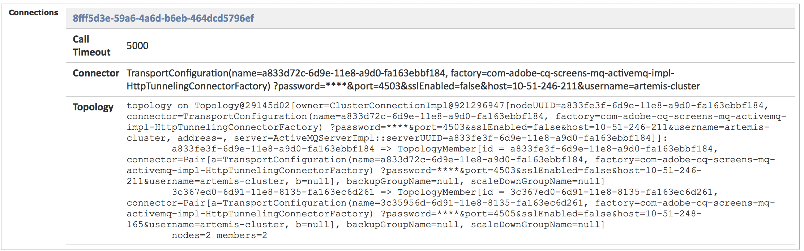

#### リファラーヘッダー要件の削除 {#remove-referrer-header-requirement}

各パブリッシュインスタンスの次の手順に従います。

1. **OSGi コンソール**&#x200B;を開いて **Configuration Manager** に移動します。
1. **Apache Sling リファラーフィルター**&#x200B;をクリックします
1. 設定を更新し、「**Allow Empty**」をオンにします。

### オーサーインスタンスとパブリッシュインスタンスの設定 {#configuring-author-and-publish-instance}

公開トポロジを設定したら、実装の実際の結果を表示するようにオーサーインスタンスとパブリッシュインスタンスを設定します。

>[!NOTE]
>
>**前提条件**
>
>この例に取りかかるには、AEM Screens プロジェクトを作成した後、プロジェクト内に場所、ディスプレイ、チャネルを作成します。 チャネルにコンテンツを追加し、このチャネルをディスプレイに割り当てます。

#### 手順 1：AEM Screens Player（デバイス）の起動

1. 別のブラウザーウィンドウを起動します。
1. *Web* ブラウザーを使用して Screens Player（`https://localhost:4502/content/mobileapps/cq-screens-player/firmware.html`）に移動するか、AEM Screens アプリを起動します。 デバイスを開くと、デバイスの状態が未登録であることがわかります。

>[!NOTE]
>
>AEM Screens Player を開くには、ダウンロードした AEM Screens アプリか web ブラウザーを使用します。

#### 手順2：オーサーでデバイスを登録する {#step-registering-a-device-on-author}

1. `https://localhost:4502/screens.html/content/screens/we-retail` に移動するか、プロジェクトをクリックして、デバイス／デバイスマネージャーに移動します。
1. 「**デバイスを登録**」をクリックします。
1. 「**デバイスを登録**」をクリックします。
1. 登録するデバイスをクリックして、「**デバイスを登録**」をクリックします。
1. 登録コードを確認し、「**検証**」をクリックします。
1. デバイスのタイトルを入力し、「**登録**」をクリックします。

#### 手順3：デバイスをディスプレイに割り当てる {#step-assigning-the-device-to-display}

1. 前の手順のダイアログボックスで、「**ディスプレイを割り当て**」をクリックします。
1. **Locations** フォルダーから、チャネルのディスプレイのパスをクリックします。
1. 「**割り当て**」をクリックします。
1. 「**完了**」をクリックしてプロセスを完了すると、デバイスが割り当てられます。

プレーヤーを確認すると、チャネルに追加したコンテンツが表示されます。

#### 手順4：デバイス設定をパブリッシュインスタンスに公開する {#step-publishing-device-configuration-to-publish-instances}

**デバイスの確認**

次の手順に従って、デバイスユーザーをレプリケートします。

1. ユーザー管理ページに移動します。 例えば、`https://localhost:4502/useradmin` のように指定します。
1. **`screens-devices-master`** グループを検索します。
1. グループを右クリックし、「**アクティベート**」をクリックします。

>[!CAUTION]
>
>author-publish-screens-service はオーサージョブで使用されるシステムユーザーなので、アクティベートしないでください。

また、デバイス管理コンソールからデバイスをアクティブ化することもできます。 次の手順に従います。

1. Screens プロジェクト／**デバイス**&#x200B;に移動します。
1. アクションバーの「**デバイスマネージャー**」をクリックします。
1. デバイスをクリックし、次の図に示すように、アクションバーから&#x200B;**アクティベート**&#x200B;をクリックします。

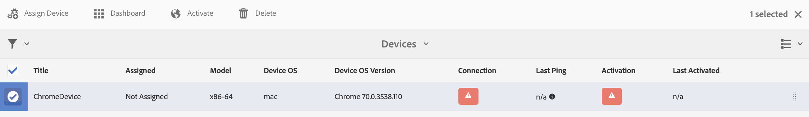

>[!NOTE]
>
>または、デバイスをアクティベートした後で、サーバー URL を編集または更新することもできます。 アクションバーの「**サーバー URL を編集**」をクリックします（下図を参照）。 変更内容が AEM Screens Player に生成されます。

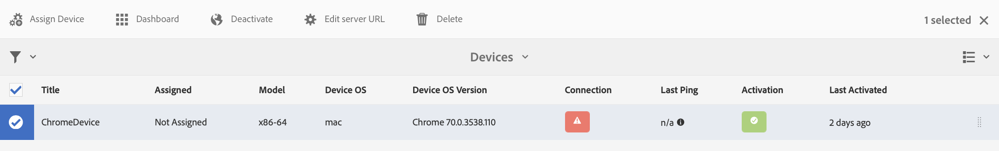

### チェックリストを公開 {#publishing-check-list}

公開チェックリストの要点は次のとおりです。

* *Screens デバイスユーザー* - この情報は、AEM ユーザーとして保存され、**ツール**／**セキュリティ**／**ユーザー**&#x200B;でアクティブ化できます。 ユーザー名には、接頭辞として「screens」とシリアル化された長い文字列が付けられます。

* *プロジェクト* - AEM Screens プロジェクト。
* *ロケーション* - デバイスの接続先となる場所。
* *チャネル* - ロケーションに表示されている 1 つ以上のチャネル。
* *スケジュール* - スケジュールを使用する場合は、このスケジュールを必ず公開します。
* *ロケーション、スケジュール、チャネルの各フォルダー* - 対応するリソースがフォルダー内にある場合。

次の手順に従って、オーサーとパブリッシュの動作を確認します。

1. オーサーインスタンスのチャネルコンテンツの一部を更新します。
1. 「**公開を管理**」を実行して、すべてのパブリッシュインスタンスに新しい変更を公開します。
1. 「**アクティベート**」をクリックして、**デバイスマネージャー**&#x200B;からデバイスを有効にします。
1. 「**URL を編集**」を選択して、オーサーインスタンス URL からパブリッシュインスタンス URL のいずれかに変更します。
1. AEM Screens Player に更新されたチャネルコンテンツが表示されることを確認します。
1. 別のパブリッシュインスタンスを使用して、これらの手順を繰り返します。

#### 手順5：管理パネルでデバイスを公開インスタンスに誘導する {#step-pointing-the-device-to-publish-instance-in-the-admin-panel}

1. Screens Player から管理 UI を表示するには、タッチ操作対応の AEM Screens Player またはマウスを使用して、左上隅を長押しして管理メニューを開きます。
1. サイドパネルの「**設定**」オプションをクリックします。
1. 「**サーバー**」のオーサーインスタンスをパブリッシュインスタンスに変更します。

AEM Screens Player で変更内容を表示します。

または、次の手順に従って、デバイス管理コンソールでサーバー URL を更新または編集することもできます。

1. AEM Screens プロジェクトに移動し、**デバイス**&#x200B;フォルダーをクリックします。
1. アクションバーの「**デバイスマネージャー**」をクリックします。
1. デバイスをクリックし、アクションバーの「**サーバー URL を編集**」をクリックします（下図を参照）。 変更内容が AEM Screens Player に生成されます。

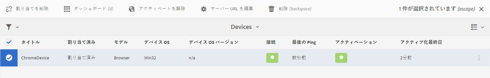

**`Manage Publication`**&#x200B;機能を使用すると、コンテンツの更新をオーサーからパブリッシュにデバイスに配信できます。 AEM Screens プロジェクト全体のコンテンツを公開／非公開にすることも、チャネル、場所、デバイス、アプリケーション、スケジュールのいずれか 1 つのコンテンツを公開／非公開にすることもできます。 この機能について詳しくは、[オンデマンドコンテンツの更新](on-demand-content.md)を参照してください。

## トラブルシューティングのヒント {#troubleshoot-tips}

オーサーとパブリッシュの設定に関するよくある質問に対する回答を得るには、以下の節を参照してください。

### 最初の登録と割り当ての後に https から http へのリダイレクトを追加する方法について教えてください。 {#add-redirect}

**解決策** - `Proxy/Load Balancer Connection in the Jetty configuration`を`true`に設定します。

### `/content/dam/projects/<project>`以外のアセットでオフラインコンテンツとプレーヤーのダウンロードに関する問題を更新するには？ {#update-offline-content}

**解決策** – すべての`/content/dam`または使用する特定のアセットに対して、bulk-offline-update-screens-service ユーザーと`screens-devices-master` グループに対して読み取り権限を付与します（より制限を加える場合）。

### Screens レプリケーションエージェントのエラーを解決する方法について教えてください。 {#replication-agent}

**解決策** - エージェント設定で「リバースレプリケーションに使用」オプションをオンにしていないことを確認してください。 Screens レプリケーションエージェントは、リバースレプリケーションエージェントとして使用できません。この機能のスコープは、デバイスコマンドをオーサーからパブリッシュに転送することです。
