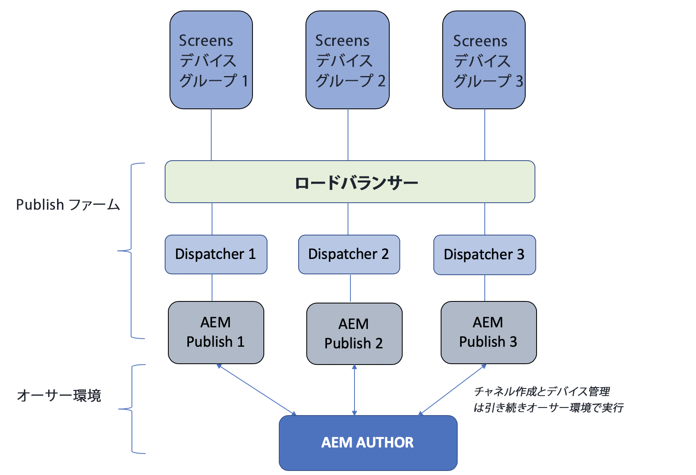
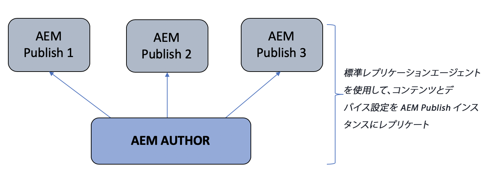
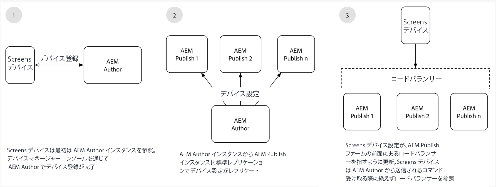

# オーサーとパブリッシュのアーキテクチャの概要 {#author-and-publish-architectural-overview}

ここでは、以下のトピックについて重点的に説明します。

* **パブリッシュサーバーについて**
* **アーキテクチャの概要**
* **登録プロセス**

## 前提条件 {#prerequisites}

オーサーサーバーとパブリッシュサーバーの使用を開始する前に、以下に関する事前の知識が必要です。

* **AEM トポロジ**
* **AEM Screens プロジェクトの作成と管理**
* **デバイス登録プロセス**

>[!NOTE]
>
>この AEM Screens 機能は、AEM 6.4 Screens 機能パック 2 がインストールされている場合にのみ使用できます。この機能パックにアクセスするには、アドビサポートに連絡してアクセス権をリクエストする必要があります。アクセス権が付与されると、パッケージ共有から機能パックをダウンロードできるようになります。

## 概要 {#introduction}

AEM Screens のアーキテクチャは、従来の AEM Sites のアーキテクチャに似ています。コンテンツは AEM オーサーインスタンスで作成された後、複数のパブリッシュインスタンスにフォワードレプリケートされます。AEM Screens デバイスは、ロードバランサーで AEM パブリッシュファームに接続できるようになりました。複数の AEM パブリッシュンスタンスを追加して、パブリッシュファームの拡大／縮小を続行できます。

*例えば*、AEM Screens コンテンツ作成者は、パブリッシュファームとやり取りするように設定されている特定のデバイスのオーサリングシステム上でコマンドを発行するか、パブリッシュファームとやり取りするように設定されているデバイスに関する情報を取得します。

オーサー環境とパブリッシュ環境を次の図に示します。

## アーキテクチャ設計 {#architectural-design}

このソリューションを容易にする次の 5 つのアーキテクチャコンポーネントがあります。

* デバイス別にオーサーからパブリッシュにディスプレイの&#x200B;***コンテンツをレプリケート***

* （デバイスから受信した）パブリッシュのバイナリコンテンツをオーサーに&#x200B;***リバース***&#x200B;レプリケート
* 特定の REST API を介してオーサーからパブリッシュにコマンドを&#x200B;***送信***
* デバイス情報の更新とコマンドを同期させるためのパブリッシュインスタンス間の&#x200B;***メッセージング***
* 特定の REST API を介してデバイス情報を取得するためにパブリッシュインスタンスの作成者によっておこなわれる&#x200B;***ポーリング***

### コンテンツと設定のレプリケーション（フォワード） {#replication-forward-of-content-and-configurations}

標準レプリケーションエージェントは、Screens チャネルコンテンツ、場所設定、デバイス設定のレプリケーションに使用します。これにより、作成者は、チャネルのコンテンツを更新し、必要に応じて何らかの承認ワークフローを経てから、チャネルの更新内容を公開できます。レプリケーションエージェントは、パブリッシュファームのパブリッシュインスタンスごとに作成する必要があります。

レプリケーションプロセスの例を次の図に示します。

>[!NOTE]
>
>レプリケーションエージェントは、パブリッシュファームのパブリッシュインスタンスごとに作成する必要があります。

### Screens レプリケーションエージェントとコマンド {#screens-replication-agents-and-commands}

オーサーインスタンスから AEM Screens デバイスにコマンドを送信するには、Screens 固有のカスタムレプリケーションエージェントを作成します。AEM パブリッシュインスタンスは、これらのコマンドをデバイスに転送する仲介役となります。

これにより、作成者はオーサー環境からデバイスの管理（デバイス更新の送信やスクリーンショットの取得など）を続けることができます。AEM Screens レプリケーションエージェントには、標準レプリケーションエージェントなどのカスタムトランスポート設定があります。

### パブリッシュインスタンス間のメッセージング {#messaging-between-publish-instances}

多くの場合、コマンドは 1 回だけデバイスに送信するために使用されます。ただし、負荷分散型のパブリッシュアーキテクチャでは、デバイスの接続先がどのパブリッシュインスタンスであるかは不明です。

したがって、オーサーインスタンスはすべてのパブリッシュインスタンスにメッセージを送信します。ただし、デバイスに転送されるメッセージは 1 つだけです。適切なメッセージングを確実におこなうために、パブリッシュインスタンス間で何らかの通信が必要になります。それには、*Apache ActiveMQ Artemis* が使用されます。各パブリッシュインスタンスは、Oak ベースの Sling Discovery Service を使用して疎結合トポロジで配置され、各パブリッシュインスタンスが通信し単一のメッセージキューを作成できるように ActiveMQ が設定されます。Screens デバイスは、ロードバランサーを介してパブリッシュファームをポーリングし、キューの先頭からコマンドを取得します。

### リバースレプリケーション {#reverse-replication}

多くの場合、コマンドに従って、Screens デバイスから何らかの応答がオーサーインスタンスに転送されます。これを実現するために、AEM ***リバースレプリケーション***&#x200B;が使用されます。

* 標準レプリケーションエージェントや Screens レプリケーションエージェントと同様に、パブリッシュインスタンスごとにリバースレプリケーションエージェントを作成します。
* ワークフローランチャー設定は、パブリッシュインスタンスで変更されたノードをリッスンし、次にワークフローをトリガーして、デバイスの応答をパブリッシュインスタンスのアウトボックスに格納します。
* このコンテキストでは、リバースレプリケーションは、デバイスから提供されるバイナリデータ（ログファイルやスクリーンショットなど）に対してのみ使用されます。バイナリデータ以外は、ポーリングで取得されます。
* AEM オーサーインスタンスからポーリングされたリバースレプリケーションが応答を取得して、オーサーインスタンスに保存します。

### パブリッシュインスタンスのポーリング {#polling-of-publish-instances}

オーサーインスタンスは、デバイスをポーリングしてハートビートを取得し、接続されたデバイスのヘルスステータスを把握する必要があります。

デバイスはロードバランサーに ping を送信し、パブリッシュインスタンスにルーティングされます。次に、提供されるパブリッシュ API（すべてのアクティブデバイスの場合は **api/screens-dcc/devices/static**、単一デバイスの場合は **api/screens-dcc/devices/&lt;device_id>/status.json**）を通じて、パブリッシュインスタンスがデバイスのステータスを公開します。

オーサーインスタンスは、すべてのパブリッシュインスタンスをポーリングし、デバイスのステータス応答を 1 つのステータスに結合します。オーサー上でポーリングするスケジュール済みは `com.adobe.cq.screens.impl.jobs.DistributedDevicesStatiUpdateJob` で、Cron 形式に基づいて設定できます。

## 登録 {#registration}

登録は AEM オーサーインスタンスで継続的に開始されます。AEM Screens デバイスがこのオーサーインスタンスを指すように設定され、登録が完了します。

デバイスがオーサー環境に登録されると、デバイス設定とチャネル／スケジュールの割り当てが AEM パブリッシュインスタンスにレプリケートされます。次に、AEM Screens デバイス設定が、AEM パブリッシュファームの前面にあるロードバランサーを指すように更新されます。このセットアップは 1 回おこなえばよく、いったんパブリッシュ環境に正常に接続された Screens デバイスは、オーサー環境から送信されるコマンドを受信し続けることができ、それ以降、Screens デバイスをオーサー環境に直接接続する必要がなくなります。

### 次の手順 {#the-next-steps}

AEM Screens におけるオーサーとパブリッシュのセットアップについて詳しくは、[AEM Screens でのオーサーとパブリッシュの設定](author-and-publish.md)を参照してください。
