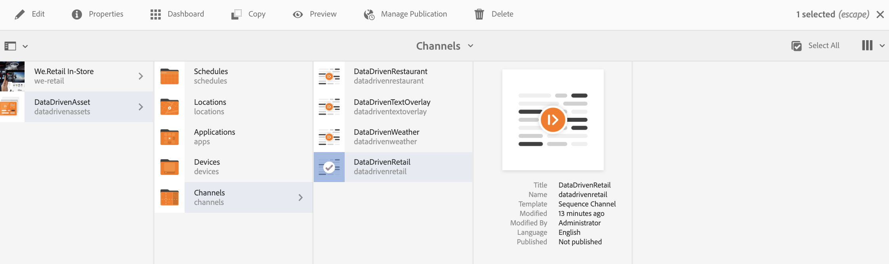
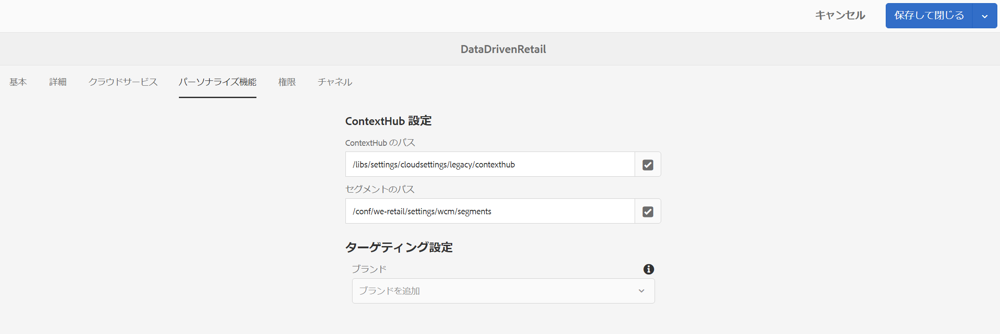
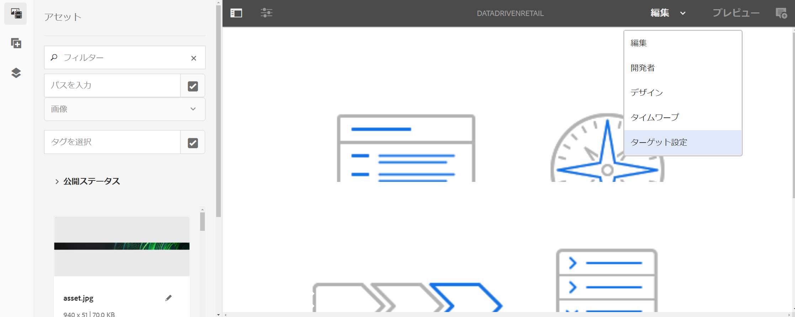

# データトリガーを使用したオーサリング {#authoring-with-data-triggers}

>[!IMPORTANT]
>このコンテンツは、AEM オンプレミス/AMS （AEM 6.5LTSおよびAEM 6.5）に対して有効です。 AEM as a Cloud Service Screensの内容については、[AEM as a Cloud Service ガイド &#x200B;](https://experienceleague.adobe.com/ja/docs/experience-manager-cloud-service/content/screens-as-cloud-service/overview/introduction)を参照してください。

ここでは、チャネルでターゲティングを有効にする方法について説明します。

>[!IMPORTANT]
>
>AEM Screens チャネルでデータトリガーをサポートする最小バージョンは、AEM 6.5.3 機能パック 3 です。

## 前提条件 {#prereqs}

以下の手順に従ってチャネルでターゲティングを有効化する前に、AEM Screens での ContextHub とターゲティングを理解するために必要な [AEM Screens の設定における主要な用語](configuring-context-hub.md)を参照してください。

>[!IMPORTANT]
>
>AEM Screens チャネルでターゲティングを有効にする前に、ContextHub の設定を理解し、設定することをお勧めします。

詳しくは、次のリンクを参照してください。

1. **[データストアの設定](configuring-context-hub.md)**
1. **[オーディエンスのセグメント化の設定](configuring-context-hub.md)**

上記の手順を完了したら、チャネルでターゲティングを有効化する準備が整いました。

## データトリガーを使用したオーサリングの概要 {#author-targeting}

>[!VIDEO](https://video.tv.adobe.com/v/31921)

## AEM Screens チャネルでのターゲティングの有効化 {#enabling-targeting}

以下の手順に従って、チャネルでターゲティングを有効にします。

1. AEM Screens チャネルのいずれかに移動します。 以下の手順は、AEM Screens チャネルで作成した **DataDrivenRetail** *（シーケンスチャネル）*&#x200B;を使用してターゲティングを有効にする方法を示しています。

1. **DataDrivenRetail** チャネルをクリックし、アクションバーの「**プロパティ**」を選択します。

   

1. ContextHub 設定をセットアップできるように「**パーソナライゼーション**」タブをクリックして、「ContextHub とセグメントのパス」を選択します。

   1. 「**ContextHub のパス**」として **libs**／**settings**／**cloudsettings**／**default**／**ContextHub 設定** をクリックし、「**選択**」を選択します。

   1. 「**セグメントのパス**」として **conf**／**`We.Retail`**／**settings**／**wcm**／**segments** をクリックし、「**選択**」を選択します。

   1. 「**保存して閉じる**」をクリックします。

   >[!NOTE]
   >
   >ContextHub 設定とセグメントをそれぞれ最初に保存した、Context Hub とセグメントのパスを使用します。

   

1. **DataDrivenAssets**／**チャネル**&#x200B;に移動して「**DataDrivenRetail**」をクリックし、アクションバーの「**編集**」を選択します。 チャネルエディターでアセットをドラッグ＆ドロップします。

   >[!NOTE]
   >
   >すべてを正しくセットアップしたら、下図に示すように、エディターのドロップダウンに「**ターゲティング**」オプションが表示されます。

   

1. 「**ターゲティング**」をクリック

1. ドロップダウンメニューで「**ブランド**」と「**アクティビティ**」をクリックし、「**ターゲティングを開始**」をクリックします。

### 詳細情報：使用例 {#learn-more-example-use-cases}

AEM Screens プロジェクトに ContextHub を設定したら、以下の様々な使用例を通じて、データでトリガーされるアセットが様々な業界でいかに重要な役割を果たしているかを理解できます。

1. **[小売店向けの在庫に応じたアクティベーション](retail-inventory-activation.md)**
1. **[旅行センター向けの気温に応じたアクティベーション](local-temperature-activation.md)**
1. **[接客業向けの予約状況に応じたアクティベーション](hospitality-reservation-activation.md)**

