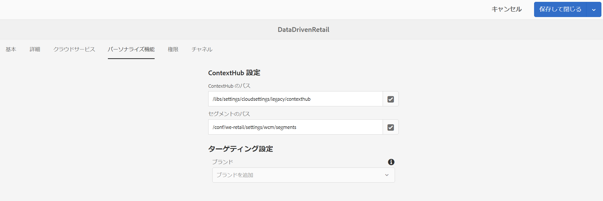

# データトリガーを使用したオーサリング {#authoring-with-data-triggers}

ここでは、チャネルでターゲティングを有効にする方法について説明します。

>[!IMPORTANT]
>
>AEM Screens チャネルでデータトリガーをサポートする最小バージョンは、AEM 6.5.3 機能パック 3 です。

## 前提条件 {#prereqs}

チャネルでターゲティングを有効にするには、次の手順に従う前に [AEM Screensでのの設定の主な用語](configuring-context-hub.md) AEM Screensの ContextHub とターゲティングを理解するために必要です。

>[!IMPORTANT]
>
>AEM Screens チャネルでターゲティングを有効にする前に、ContextHub の設定を理解し、設定することをお勧めします。

詳しくは、次のリンクを参照してください。

1. **[データストアの設定](configuring-context-hub.md)**
1. **[オーディエンスのセグメント化の設定](configuring-context-hub.md)**

上記の手順を完了すると、チャネルでのターゲティングを有効にする準備が整います。

## データトリガーを使用したオーサリングの概要 {#author-targeting}

>[!VIDEO](https://video.tv.adobe.com/v/31921)

## AEM Screens チャネルでのターゲティングの有効化 {#enabling-targeting}

以下の手順に従って、チャネルでターゲティングを有効にします。

1. AEM Screens チャネルのいずれかに移動します。 以下の手順は、AEM Screens チャネルで作成した **DataDrivenRetail** *（シーケンスチャネル）*&#x200B;を使用してターゲティングを有効にする方法を示しています。

1. チャネルを選択 **DataDrivenRetail** を選択して、 **プロパティ** アクションバーから。

   

1. 「」を選択します **Personalization** タブをクリックして、ContextHub 設定をセットアップし、ContextHub とセグメントのパスを選択します。

   1. 「」を選択します **ContextHub パス** as **libs** > **設定** > **cloudsettings** > **default** > **ContextHub 設定** を選択して、 **を選択**.

   1. 「」を選択します **セグメントのパス** as **conf** > **`We.Retail`** > **設定** > **wcm** > **セグメント** を選択して、 **を選択**.

   1. 「**保存して閉じる**」を選択します。

   >[!NOTE]
   >
   >ContextHub 設定とセグメントをそれぞれ最初に保存した、Context Hub とセグメントのパスを使用します。

   

1. に移動してフォルダーを選択します **DataDrivenRetail** から **DataDrivenAssets** > **チャネル** を選択して、 **編集** アクションバーから。 チャンネルエディターでアセットをドラッグ&amp;ドロップします。

   >[!NOTE]
   >
   >すべてが正しく設定されていれば、次のように表示されます **ターゲティング** エディターのドロップダウンの「」オプション（下図を参照）。

   

1. を選択 **ターゲティング**.

1. を選択 **ブランド** および **Activity** ドロップダウンメニューからを選択します。 **ターゲティングを開始**.

### 詳細情報：使用例 {#learn-more-example-use-cases}

AEM Screens プロジェクトに ContextHub を設定したら、以下の様々な使用例を通じて、データでトリガーされるアセットが様々な業界でいかに重要な役割を果たしているかを理解できます。

1. **[小売店向けの在庫に応じたアクティベーション](retail-inventory-activation.md)**
1. **[旅行センター向けの気温に応じたアクティベーション](local-temperature-activation.md)**
1. **[接客業向けの予約状況に応じたアクティベーション](hospitality-reservation-activation.md)**
