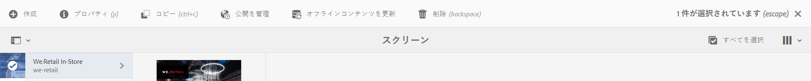

# オフライン一括更新 {#bulk-offline-update}

>[!IMPORTANT]
>このコンテンツは、AEM オンプレミス/AMS （AEM 6.5LTSおよびAEM 6.5）に対して有効です。 AEM as a Cloud Service Screensの内容については、[AEM as a Cloud Service ガイド &#x200B;](https://experienceleague.adobe.com/ja/docs/experience-manager-cloud-service/content/screens-as-cloud-service/overview/introduction)を参照してください。

ここでは、オフライン一括更新に関する以下のトピックについて説明します。

* **概要**
* **オフライン一括更新の使用**

<!--
OBSOLETE VERSIONS
>[!CAUTION]
>
>This AEM Screens functionality is only available, if you have installed AEM 6.3 Feature Pack 3 or AEM 6.4 Screens Feature Pack 1.
>
>To get access to this Feature Pack, contact Adobe Support and request access. When you have permissions you can download it from Package Share.
-->

## 概要 {#overview}

オフライン一括更新を使用すると、すべてのチャネルを一括更新できます。 特定のチャネルに移動してコンテンツを更新する手間が省けます。 代わりに、ある特定のプロジェクトのチャネルに含まれているすべてのコンテンツを一度に更新できます。

また、ネットワークトラフィックが少ない時間帯に、このアクティビティをスケジュールすることもできます。

>[!NOTE]
>
>オフライン一括更新機能は、変更されたチャネルのみを更新するように最適化されています。

## オフライン一括更新の使用 {#using-bulk-offline-update}

ユーザーインターフェイス（UI）からオフライン一括更新を手動で使用することも、OSGi サービスから一括更新をスケジュールすることもできます。

### AEM Screens のユーザーインターフェイスを使用する場合 {#using-aem-screens-user-interface}

次の手順に従って、AEM Screens プロジェクトでオフライン一括更新を使用します。

1. AEM Screens プロジェクトに移動します。
1. プロジェクトをクリックし、アクションバーの「**オフラインコンテンツを更新**」をクリックすると、チャネルコンテンツを手動で更新できます。

   

### Adobe Experience Manager の Web コンソール設定を使用する場合 {#adobe-experience-manager-web-console-configuration}

次の手順に従って、AEM Screens プロジェクトでオフライン一括更新を使用します。

1. Adobe Experience Manager の Web コンソール設定を開きます。
1. オフライン一括更新サービスを検索します。

   

1. 以下のプロパティを追加します。

   **プロジェクトのパス** - AEM Screens プロジェクトのパスを指定します。 パスは通常、`/content/screens/<Name of your project>` です。

   *例えば*、`/content/screens/we-retail` などとなります。 AEM Screens で任意のプロジェクトを選択すれば（アイコンをクリックしないでください）、URL にこのパスが含まれていることがわかります。

   >[!NOTE]
   >
   >チャネルからの相対的なプロジェクトパスを指定します。

   **スケジュール頻度** – このサービスがオフライン コンテンツを更新する必要がある時間（例：午後5:00または17:00）を指定します。

1. 「**保存**」をクリックして、設定を保存します。 コンテンツは指定した時間に更新されます。
