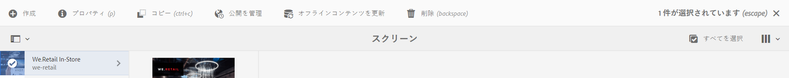

# オフライン一括更新 {#bulk-offline-update}

ここでは、オフライン一括更新に関する以下のトピックについて説明します。

* **概要**
* **オフライン一括更新の使用**

>[!CAUTION]
>
>この AEM Screens 機能は、AEM 6.3 機能パック 3 または AEM 6.4 Screens 機能パック 1 がインストールされている場合にのみ使用できます。
>
>この機能パックにアクセスするには、アドビサポートに連絡してアクセス権をリクエストする必要があります。アクセス権が付与されると、パッケージ共有から機能パックをダウンロードできるようになります。

## 概要 {#overview}

オフライン一括更新を使用すると、すべてのチャネルを一括更新できます。特定のチャネルに移動してコンテンツを更新する手間が省けます。代わりに、ある特定のプロジェクトのチャネルに含まれているすべてのコンテンツを一度に更新できます。

また、ネットワークトラフィックが少ない時間帯に、このアクティビティをスケジュールすることもできます。

>[!NOTE]
>
>オフライン一括更新機能は、変更されたチャネルのみを更新するように最適化されています。

## オフライン一括更新の使用 {#using-bulk-offline-update}

ユーザーインターフェイス（UI）からオフライン一括更新を手動で使用することも、OSGi サービスから一括更新をスケジュールすることもできます。

### AEM Screens ユーザーインターフェイスを使用する場合 {#using-aem-screens-user-interface}

次の手順に従って、AEM Screens プロジェクトでオフライン一括更新を使用します。

1. AEM Screens プロジェクトに移動します。
1. プロジェクトを選択し、アクションバーの「**オフラインコンテンツを更新**」をクリックして、チャネルコンテンツを手動で更新します。

   

### Adobe Experience Manager Web Console Configuration を使用する場合 {#adobe-experience-manager-web-console-configuration}

次の手順に従って、AEM Screens プロジェクトでオフライン一括更新を使用します。

1. Adobe Experience Manager Web Console Configuration を開きます。
1. オフライン一括更新サービスを検索します。

   

1. 以下のプロパティを追加します。

   **プロジェクトパス**：AEM Screens プロジェクトのパスを指定します。パスは通常、`/content/screens/<Name of your project>` です。

   *例えば*、`/content/screens/we-retail` などとなります。AEM Screens で任意のプロジェクトを選択すれば（アイコンをクリックしないでください）、URL にこのパスが含まれていることがわかります。

   >[!NOTE]
   >
   >チャネルからの相対的なプロジェクトパスを指定します。

   **スケジュールの頻度**：このサービスでオフラインコンテンツを更新する時刻（例：午後 5 時または 17 時）を指定します。

1. 「**保存**」をクリックして設定を保存すると、指定した時刻にコンテンツが更新されるようになります。

