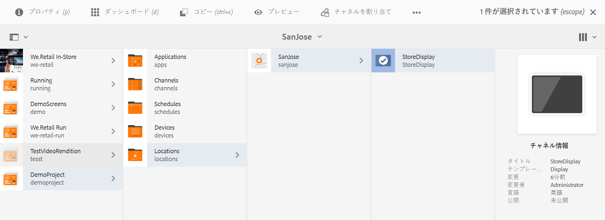

# チャネル割り当て {#channel-assignment}

>[!IMPORTANT]
>このセクションでは、AEM 6.5.5 Screensバージョンより前のFeature Packのチャネルのチャネル割り当てとスケジュールについて説明します。

ディスプレイを設定したら、コンテンツを表示するために、ディスプレイにチャネルを割り当てる必要があります。

このページは、ディスプレイへのチャネルの割り当てを示しています。

>[!NOTE]
>1つのディスプレイに複数のチャネルを割り当てることができます。

## チャネルの割り当て {#assign-a-channel}

下の手順に従ってチャネルをディスプレイに割り当てます。

1. 必要なディスプレイに移動します（例：**DemoProject**／**Locations**／**SanJose**／**StoreDisplay**）。

   

1. アクションバーで「**チャネルの割り当て**」をタップまたはクリックします。

   または、

   「**ダッシュボード**」をタップまたはクリックし、**割り当てられたチャネル**&#x200B;パネルの「**+ チャネルを割り当て**」をクリックして、**チャネル割り当て**&#x200B;ダイアログボックスを開きます。

   

   You can configure the properties from the **Channel Assignment** dialog box from the section below. チャネルプロパティの詳細については、「 [チャネルプロパティ](#channel-properties) 」の節を参照してください。

## チャネル割り当てのチャネルプロパティからのチャネルプロパティ {#channel-properties}

### チャネルを参照{#ref-channel}

「チャネルを参照」では、目的のチャネルへの参照をチャネル名かチャネルパスのどちらかで指定できます。

* **パス別**：チャネルの絶対パスを使用して明示的な参照を提供します。

* **名前別**：コンテキストにより実際のチャネルを解決するチャネルの名前を入力します。この機能により、場所固有のコンテンツを動的に解決するために、チャネルのローカルバージョンを作成できます。例えば、「*本日のお買い得商品*」という名前のチャネルで、実際のコンテンツは 2 つの都市で異なるものの、すべてのディスプレイでチャネルロールを同じにするといったことができます。

### チャネルロール {#role-channel}

チャネルロールはディスプレイのコンテキストを定義します。ロールは多様なアクションによってターゲットになり、ロールを担う実際のチャネルから独立しています。

### 優先度 {#priority-channel}

優先度は、複数の割り当てが再生条件に一致する場合に、割り当ての順序付けをおこなうために使用します。最高値のものが低い値よりも常に優先されます。例えば、2 つのチャネル A と B がある場合、A の優先度が 1 で B の優先度が 2 であるなら、A より優先度が高いために、チャネル B が表示されます。

>[!NOTE]
>チャネルの優先度は、前述のように、**チャネル割り当て**&#x200B;ダイアログボックスで、数字で設定できます（1 が最小）。また、割り当てられたチャネルは、降順の優先度に基づいて並べ替えられます。

### サポートされているイベント {#supported-events-channel}

* **初期ロード**：プレーヤーが開始するときにチャネルに読み込みます。スケジュールと組み合わせて複数のチャネルに割り当てることができます。
* **待機中画面**：スクリーンがアイドルのときに読み込みます。スケジュールと組み合わせて複数のチャネルに割り当てることができます。
* **タイマー**：スケジュールを指定するときに設定する必要があります。
* **ユーザーインタラクション**：アイドルチャネルのスクリーンのユーザーインタラクション（タッチ）がある場合に、プレーヤーが指定されたチャネルに切り替えて、スクリーンがタッチされたときに読み込みます。

### 中断方法 {#interruption-method-channel}

>[!IMPORTANT]
>
> このオプションは、AEM 6.4 機能パック 8 または AEM 6.5 機能パック 4 でのみ使用できます。

コンテンツ作成者は、重要でないコンテンツを切り取るために、チャネルを中断するタイミングを指定できますが、スケジュールによって再生を中断する前に、重要なコンテンツを完全に再生するオプションを選択することもできます。

**チャネル割り当て**&#x200B;ダイアログボックスで、次の中断方法を設定できるオプションを選択します。

* **今すぐ**：スケジュールがアクティブになったり、アップデートを受け取った場合は、再生を停止し、すぐに新しいコンテンツを再生更新またはできます
* **現在のアイテムの最後**：新しいスケジュールがアクティブになったり、アップデートを受け取った場合は、シーケンス内の現在のアイテムの再生が終了するのを待ち、その後新しいコンテンツを更新または再生するオプションがあります
   >[!NOTE]
   >このオプションはデフォルトで選択されています。
* **シーケンスの最後**：新しいスケジュールがアクティブになったり、アップデートを受け取った場合は、シーケンス全体が終了するのを待ち、目的のシーケンスの直前に、最初の要素に戻り、新しいコンテンツを更新または再生するオプションがあります

   >[!NOTE]
   >2 番目または 3 番目のオプションを使用すると、割り当てで定義されたスケジュール時間が少し遅れる場合があります。これは、プレイヤーが更新する前に、アイテムまたはシーケンスの終了を（指定された時間後に）待機するためです。遅延は、アイテムの再生時間に依存します。

### スケジュール {#schedule-channel}

スケジュールでは、チャネルの表示日時をテキストで記述できます。また、チャネルの表示の開始日（**次の日から有効**）と終了日（**次の日まで有効**）を定義できます。

**アトラクションツールチップを表示**：

チャネルの実行中にアトラクションツールチップ（「*どこをタッチしても開始できる*」）を表示するかどうかを定義します。

### 日分割 {#dayparting}

Schedules when combined with **Day-parting**, allows you to set a global schedule with multiple channels running at specific times of the day, and re-use that setup for all your displays at once.

時間帯区分は、1 日を複数の時間帯に分けて、必要な時間にどのコンテツを再生するかを指定することを意味します。AEM Screensでは、必要に応じて1日、1週間、または1か月内の日分割に関するチャネルをスケジュールできます。

次の例では、3つの異なるシナリオでのチャネルでの日分割について説明します。

#### 1 日のコンテンツ再生を複数の時間帯に分割 {#playing-content-on-a-single-day-divided-into-multiple-time-slots}

この例は、Restaurantで日分割を使用して朝食、昼食、ディナーのメニューをどのように表示するかを示しています。

ここでは、1 日を 3 つの時間帯に分け、チャネルコンテンツが 1 日の指定された時間ごとに再生されるようにします。

| **チャネル** | **ロール** | **優先度** | **スケジュール** |
|---|---|---|---|
| Menu_A | モーニング |  | 6:00～11:00 |
| Menu_B | ランチ |  | 11:00～15:00 |
| Menu_C | ディナー |  | 15:00～20:00 |

#### コンテンツを特定の曜日に再生 {#playing-content-on-a-particular-day-of-the-week}

この例では、カジノで時間帯区分を使用し、毎週末の午後 8:00 から午後 10:00 にライブイベントを開催し、午後 10:00 から午前 1:00 までディナーメニューでスペシャルを利用できます。

<table>
 <tbody>
  <tr>
   <td><strong>チャネル</strong></td>
   <td><strong>ロール</strong></td>
   <td><strong>優先度</strong></td>
   <td><strong>スケジュール</strong></td>
  </tr>
  <tr>
   <td>LiveConcert</td>
   <td>週末</td>
   <td> </td>
   <td>2017 年 10 月 21 日 ～ 2017 年 10 月 22 日  20:00 ～ 22:00</td>
  </tr>
  <tr>
   <td>SpecialsDinner</td>
   <td>週末</td>
   <td> </td>
   <td>2017 年 10 月 21 日 ～ 2017 年 10 月 22 日  22:00 ～ 1:00</td>
  </tr>
 </tbody>
</table>

#### 特定の月にコンテンツを再生 {#playing-content-for-a-particular-month-months}

次の例は、6月の月から8月の間に夏のコレクションを表示し、9月から10月の終わりまで収集を中止する店舗の日分割を示しています。

ここでは、月ごとの日分割を作成し、チャネルコンテンツを年内の指定された月ごとに再生するようにします。

| **チャネル** | **ロール** | **優先度** | **スケジュール** |
|---|---|---|---|
| SummerCollection | 夏 |  | 2017 年 6 月 1 日～2017 年 8 月 31 日 |
| FallCollection | 秋 |  | 2017 年 9 月 1 日～2017 年 10 月 30 日 |

>[!NOTE]
>
>さらに、チャネルごとに&#x200B;***優先度***&#x200B;を定義できます。例えば、2 つのチャネルを同じ日時または同じ月に設定する場合は、優先度の高いチャネルが最初に再生されます。優先度の最小値は 0 として設定できます。

#### 同じ優先度のチャネル用コンテンツの再生 {#playing-content-for-channels-with-same-priority}

次の例は、12月の月に同じスケジュールで冬物コレクションを表示する店舗の日分割を示しています。 しかし、その週はチャネル B が優先度 2 に設定されており、チャネル A ではなくチャネル B がそのコンテンツを再生します。

| **チャネル** | **ロール** | **優先度** | **スケジュール** |
|---|---|---|---|
| A | 冬 | 1 | 2017 年 12 月 1 日～2017 年 12 月 31 日 |
| B | クリスマス | 2 | 2017 年 12 月 24 日～2017 年 12 月 31 日 |

>[!NOTE]
>
> 日分割の詳細については、次の節を参照してください。
>
>* [アセット内の繰り返しの処理](https://docs.adobe.com/content/help/en/experience-manager-screens/user-guide/authoring/product-features/asset-level-scheduling.html#handling-recurrence-in-assets)
>* [チャネル内アセットの繰り返し処理](https://docs.adobe.com/content/help/en/experience-manager-screens/user-guide/authoring/product-features/channel-level-activation.html#handling-recurrence-in-assets)

