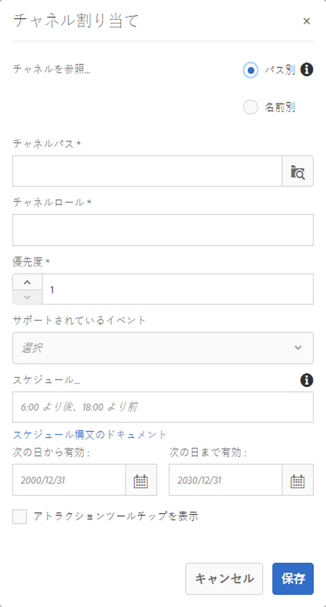

# チャネル割り当て {#channel-assignment}

この節では、以下のトピックについて説明します。

* **チャネルの割り当て**
* **[チャネルの割り当て]ダイアログボックスのプロパティについて**
* **時間帯区分**

ディスプレイを定義したら、チャネルをディスプレイに割り当てる必要があります。

このページでは、ディスプレイへのチャネル割り当てを示します。

**前提条件**:

* [スクリーンの設定および展開](configuring-screens-introduction.md)
* [画面プロジェクトの作成と管理](creating-a-screens-project.md)
* [チャネルの作成と管理](managing-channels.md)
* [場所の作成と管理](managing-locations.md)
* [ディスプレイの作成と管理](managing-displays.md)

## チャネルの割り当て {#assign-a-channel}

下の手順に従ってチャネルをディスプレイに割り当てます。

1. 必要な画面(例： **DemoProject** —&gt;場所 **—&gt;** SanJose **—&gt;** StoreDisplayDisplayDisplayDisplay **)に移**&#x200B;動します。

   

1. アクションバーの「**チャネルを割り当て**」をタップまたはクリックします。

   または、

   Tap/click **Dashboard** and click **+Assign Channel** from the **ASSIGNED CHANNNELS** panel to open the **Channel Assignment** dialog box.

   

   以下のプロパティを&#x200B;**チャネル割り当て**&#x200B;ダイアログボックスから設定できます。

   **チャネルロール**：

   チャネルロールはディスプレイのコンテキストを定義します。役割は様々なアクションによってターゲット設定され、役割を果たす実際のチャネルとは独立しています。

   **参照チャネル**

   参照チャネルを使用して、チャネル名またはチャネルパスにより、参照を必要なチャネルに提供できます。

   * **パス別**：チャネルの絶対パスを使用して明示的な参照を提供します。
   * **名前**:コンテキスト別に実際のチャネルに解決されるチャネルの名前を入力します。 この機能により、場所固有のコンテンツを動的に解決するために、チャネルのローカルバージョンを作成できます。For example, a channel with name *deals of the day*, where the actual content would be different in two cities, but you still have the sane channel role on all the displays.
   **優先度：**

   優先度は、複数が作業基準に合致する場合に、割り当ての順序を決めるために使用します。最高値のあるものが低い値よりも常に優先されます。例えば、2 つのチャネル A と B がある場合、A の優先度が 1 で B の優先度が 2 であるなら、A より優先度が高いために、チャネル B が表示されます。

   上記の「**チャネルの割り当て**」ダイアログボックスで、チャネルの優先順位は数値（最小値は1）に設定されます。 また、割り当てられたチャネルは、降順の優先度に基づいて並べ替えられます。

   **サポートされているイベント**：

   * **初期ロード**：プレーヤーが開始するときにチャネルにロードします。予定と組み合わせて複数のチャネルに割り当てることができます。
   * **待機中画面**：スクリーンがアイドルのときにロードします。予定と組み合わせて複数のチャネルに割り当てることができます。
   * **タイマー**：スケジュールを指定するときに設定する必要があります。
   * **ユーザーインタラクション**：アイドルチャネルのスクリーンのユーザーインタラクション（タッチ）がある場合に、プレーヤーが指定されたチャネルに切り替えて、スクリーンがタッチされたときにロードします。
   **予定**：

   予定により、チャネルが現れるときにテキストで説明を提供できます。It also let's you define a start date (**active from**) and an end date (**active until**) for the channel to be shown. スケジュール式の構文は、later.jsのテキストとcron構文に基づいています。

   * [https://bunkat.github.io/later/parsers.html#text](https://bunkat.github.io/later/parsers.html#text)
   * [https://bunkat.github.io/later/parsers.html#cron](https://bunkat.github.io/later/parsers.html#cron)
   **アトラクションツールチップを表示**：

   アトラクションツールチップを表示：チャネルの実行中にアトラクションツールチップ（「*どこをタッチしても開始できる*」）を表示するかどうかを定義します。

1. 「**保存**」をクリックして、ディスプレイに作成済みチャネルを割り当てます。

### 時間帯区分 {#dayparting}

Schedules when when combined with **Dayparting**, allows you to set a global schedule with multiple channels running at specific times of the day, and re-use that setup for all your displays at once.

時間帯区分は、1 日を複数の時間帯に分けて、必要な時間にどのコンテツを再生するかを指定することを意味します。AEM Screens では、必要に応じて日、週、月内の時間帯区分でチャネルの予定を設定できます。

次の例は、3 つのシナリオでのチャネルの時間帯区分の説明です。

#### 1 日のコンテンツ再生を複数の時間帯に分割 {#playing-content-on-a-single-day-divided-into-multiple-time-slots}

この例では、レストランが時間帯区分を使用して、モーニング、ランチ、ディナーのメニューを表示する方法が示されています。

ここでは、各日を3つの異なるタイムスロットに分け、チャネルコンテンツを指定された時間ごとに再生します。

| **チャネル** | **ロール** | **優先度** | **予定** |
|---|---|---|---|
| メニュー_A | 朝食 |  | 6:00 より後、11:00 より前 |
| メニュー_B | 昼食 |  | 11:00 より後、15:00 より前 |
| Menu_C | 夕食 |  | 15:00 より後、20:00 より前 |

#### コンテンツを週の特定の日に再生 {#playing-content-on-a-particular-day-of-the-week}

この例では、カジノで時間帯区分をおこない、ライブイベントが毎週末の午後 8:00 から午後 10:00 までおこなわれ、スペシャルが午後 10:00 から午前 1:00 までディナーメニューで利用できます。

<table>
 <tbody>
  <tr>
   <td><strong>チャネル</strong></td>
   <td><strong>ロール</strong></td>
   <td><strong>優先度</strong></td>
   <td><strong>予定</strong></td>
  </tr>
  <tr>
   <td>LiveConcert</td>
   <td>週末</td>
   <td> </td>
   <td>2017年10月21日～2017年10月22   日（20:00から22:00）</td>
  </tr>
  <tr>
   <td>SpecialsDinner</td>
   <td>週末</td>
   <td> </td>
   <td>2017年10月21日～2017年10月22   日（22:00から1:00まで）</td>
  </tr>
 </tbody>
</table>

#### 特定の月にコンテンツを再生 {#playing-content-for-a-particular-month-months}

この例では、商店の時間帯区分が示され、6 月から 8 月に夏物コレクションを表示し、9 月から 10 月末まで秋物コレクションを表示します。

ここで、次の時間帯区分を作成し、チャネルのコンテンツが 1 年の指定された月に再生されるようにします。

| **チャネル** | **ロール** | **優先度** | **予定** |
|---|---|---|---|
| SummerCollection | 夏 |  | 2017年6月1日～2017年8月31日 |
| FallCollection | 秋 |  | 2017年9月1日～2017年10月30日 |

>[!NOTE]
>
>またチャネルそれぞれに&#x200B;***優先度**を定義できます。*&#x200B;例えば、2 つのチャネルを同じ日時または同じ月に設定する場合は、優先度の高いチャネルが最初に再生されます。優先度の最小値は 0 として設定できます。

#### 同じ優先度のチャネル用コンテンツの再生 {#playing-content-for-channels-with-same-priority}

この例では、商店の時間帯区分が示され、冬物コレクションを 12 月に同じスケジュールで表示します。しかし、その週はチャネル B は優先度 2 に設定されており、チャネル A ではなくチャネル B がそのコンテンツを再生します。

| **チャネル** | **ロール** | **優先度** | **予定** |
|---|---|---|---|
| A | 冬 | 1 | 2017年12月1日～2017年12月31日 |
| B | クリスマス | 2 | 2017年12月24日～2017年12月31日 |

