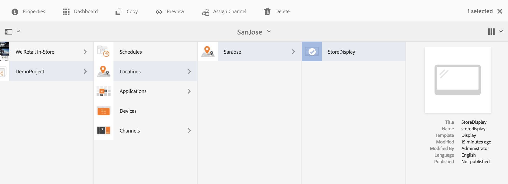

# チャネル割り当て {#channel-assignment}

>[!IMPORTANT]
>このセクションでは、AEM 6.5.5 Screens バージョンより前の機能パックのチャネルの割り当てとスケジュールについて説明します。

ディスプレイの設定が完了したら、チャネルをディスプレイに割り当てて、コンテンツを表示します。

このページでは、ディスプレイへのチャネル割り当てを示します。

このコンテンツは、AEM オンプレミス/AMS （AEM 6.5LTSおよびAEM 6.5）に対して有効です。 AEM as a Cloud Service Screensの内容については、[AEM as a Cloud Service ガイド ](https://experienceleague.adobe.com/en/docs/experience-manager-cloud-service/content/screens-as-cloud-service/overview/introduction)を参照してください。

>[!NOTE]
>1 つのディスプレイに複数のチャネルを割り当てることができます。

## チャネルの割り当て {#assign-a-channel}

ディスプレイにチャネルを割り当てるには、次の手順に従います。

1. 必要なディスプレイに移動します（例：**DemoProject**／**Locations**／**SanJose**／**StoreDisplay**）。

   

1. アクションバーの「**チャネルを割り当て**」をクリックします。

   または、

   「**ダッシュボード**」をクリックし、**割り当てられたチャネル**&#x200B;パネルの「**+ チャネルを割り当て**」を選択すると、**チャネルの割り当て**&#x200B;ダイアログボックスを開くことができます。

   

   以下のセクションで、**チャネルの割り当て**&#x200B;ダイアログボックスのプロパティを設定できます。 チャネルプロパティについて詳しくは、[チャネルプロパティ](#channel-properties)の節を参照してください。

## チャネル割り当てのチャネルプロパティからのチャネルプロパティ {#channel-properties}

### チャネルを参照 {#ref-channel}

「チャネルを参照」では、目的のチャネルへの参照をチャネル名かチャネルパスのどちらかで指定できます。

* **パス別**：チャネルの絶対パスを使用して明示的な参照を提供します。

* **名前別**：コンテキストによって実際のチャネルに解決されるチャネルの名前を入力します。 この機能により、チャネルのローカルバージョンを作成し、場所固有のコンテンツを動的に解決することができます。 例えば、「*本日のお買い得商品*」という名前のチャネルで、実際のコンテンツは 2 つの都市で異なるものの、すべてのディスプレイでチャネルロールを同じにするといったことができます。

### チャネルロール {#role-channel}

チャネルロールはディスプレイのコンテキストを定義します。 役割は様々なアクションを対象とし、役割を実行する実際のチャネルとは無関係です。

### 優先度 {#priority-channel}

優先度は、複数の割り当てが再生条件に一致する場合に、割り当ての順序付けを行うために使用します。 最も高い値のものが低い値よりも常に優先されます。 例えば、チャネル AとBが2つある場合です。 Aは1の優先度を持ち、Bは2の優先度を持ち、チャネル BはAよりも優先度が高いので表示されます。

>[!NOTE]
>チャネルの優先度は、前述のように、**チャネル割り当て**&#x200B;ダイアログボックスで、数字で設定できます（1 が最小）。 また、割り当てられたチャネルは、降順の優先度に基づいて並べ替えられます。

### サポートされているイベント {#supported-events-channel}

* **初期ロード**：プレーヤーが開始するときにチャネルを読み込みます。 スケジュールを使用して複数のチャネルに割り当てることができます。
* **待機中画面**：スクリーンがアイドルのときに読み込みます。 スケジュールを使用して複数のチャネルに割り当てることができます。
* **タイマー**：スケジュールを指定した場合は設定する必要があります。
* **ユーザーインタラクション**：アイドルチャネルのスクリーンのユーザーインタラクション（タッチ）がある場合に、プレーヤーが指定されたチャネルに切り替えて、スクリーンがタッチされたときに読み込みます。

### 中断方法 {#interruption-method-channel}

>[!IMPORTANT]
>
> このオプションは、<!--AEM 6.4 Feature Pack 8 or -->AEM 6.5 機能パック 4 でのみ使用できます。

コンテンツ作成者は、チャネルが中断されるタイミングを指定します。 これにより、重要でないコンテンツを必要に応じて切り捨てることができますが、オプションとして、スケジュール上の理由で再生が中断される前に重要なコンテンツを再生することもできます。

**チャネル割り当て**&#x200B;ダイアログボックスで、中断方法を設定できる次のオプションのいずれかをクリックします。

* **今すぐ**：スケジュールがアクティブになった場合や、アップデートを受け取った場合に、再生を停止し、新しいコンテンツをすぐに更新または再生できます。
* **現在のアイテムの終了時**：新しいスケジュールがアクティブになった場合や、アップデートを受け取った場合に、オプションで、シーケンス内の現在のアイテムの再生が完了するまで待つことができます。 その後にのみ、新しいコンテンツを更新または再生できます。

  >[!NOTE]
  >このオプションはデフォルトで選択されています。
* **シーケンスの最後**：新しいスケジュールがアクティベートされたとき、または更新を受け取ったら、オプションで、シーケンス全体が終了するまで待つことができます。 次に、目的のシーケンスの直前で、最初の要素に戻ってループし、新しいコンテンツを更新または再生できます。

  >[!NOTE]
  >2 番目または 3 番目のオプションを使用すると、割り当てに定義されているスケジューリング時間が若干遅延する場合があります。 これは、プレーヤーが項目またはシーケンスの終わり（指定した時間の後）を待ってから更新するからです。 遅延は、アイテムの再生時間に依存します。

### スケジュール {#schedule-channel}

スケジュールでは、チャネルの表示日時をテキストで記述できます。 また、チャネルの表示の開始日（**次の日から有効**）と終了日（**次の日まで有効**）を定義できます。

**アトラクションツールチップを表示**

チャネルの実行中にアトラクションツールチップ（「*どこをタッチしても開始できる*」）を表示するかどうかを定義します。

### 時間帯区分 {#dayparting}

スケジュールを&#x200B;**日分割**&#x200B;と組み合わせると、1 日の特定の時間に実行される複数のチャネルでグローバルスケジュールを設定でき、また一度にすべてのディスプレイでその設定を再使用できます。

DayPartingは、1日をタイムスロットに分割し、どのコンテンツを目的の時間に再生するかを指定することと呼ばれます。 AEM Screens では、必要に応じて日、週、月内の日分割でチャネルのスケジュールを設定できます。

次の例は、3 つのシナリオにおけるチャネルの日分割に関する説明です。

#### 1 日のコンテンツ再生を複数の時間帯に分割 {#playing-content-on-a-single-day-divided-into-multiple-time-slots}

この例では、レストランが時間帯区分を使用して、モーニング、ランチ、ディナーのメニューを表示しています。

ここでは、1 日を 3 つの時間帯に分け、チャネルコンテンツが 1 日の指定された時間ごとに再生されるようにします。

| **チャネル** | **ロール** | **優先度** | **スケジュール** |
|---|---|---|---|
| Menu_A | 朝食 |  | 6:00以降11:00以前 |
| Menu_B | ランチ |  | 11:00以降15:00以前 |
| Menu_C | ディナー |  | 15:00以降20:00以前 |

#### コンテンツを週の特定の日に再生 {#playing-content-on-a-particular-day-of-the-week}

この例は、ライブイベントが毎週末午後8:00から午後10:00まで発生するカジノで達成されたdayPartingを示しており、午後10:00から午前1:00までディナーメニューにスペシャルメニューが用意されています。

<table>
 <tbody>
  <tr>
   <td><strong>チャネル</strong></td>
   <td><strong>ロール</strong></td>
   <td><strong>優先度</strong></td>
   <td><strong>スケジュール</strong></td>
  </tr>
  <tr>
   <td>LiveConcert</td>
   <td>週末</td>
   <td> </td>
   <td>2017年10月21日～2017年10月22日（PT）  20 時以降 22 時以前</td>
  </tr>
  <tr>
   <td>SpecialsDinner</td>
   <td>週末</td>
   <td> </td>
   <td>2017年10月21日～2017年10月22日（PT）  22 時以降 1 時以前</td>
  </tr>
 </tbody>
</table>

#### 特定の月にコンテンツを再生 {#playing-content-for-a-particular-month-months}

この例では、商店で日分割を使用し、6 月から 8 月に夏物コレクションを表示し、9 月から 10 月末まで秋物コレクションを表示しています。

ここで、次の時間帯区分を作成し、チャネルのコンテンツが 1 年の指定された月に再生されるようにします。

| **チャネル** | **ロール** | **優先度** | **スケジュール** |
|---|---|---|---|
| SummerCollection | 夏 |  | 2017年6月1日～2017年8月31日（PT） |
| FallCollection | 秋 |  | 2017年9月1日～2017年10月30日（PT） |

>[!NOTE]
>
>また、チャネルごとに&#x200B;***優先度***&#x200B;を定義できます。 例えば、2 つのチャネルを同じ日時または同じ月に設定する場合は、優先度の高いチャネルが最初に再生されます。 優先度の最小値は 0 として設定できます。

#### 同じ優先度のチャネル用コンテンツの再生 {#playing-content-for-channels-with-same-priority}

この例では、商店の日分割が示され、冬物コレクションを 12 月に同じスケジュールで表示します。 しかし、その週はチャネル B は優先度 2 に設定されており、チャネル A ではなくチャネル B がそのコンテンツを再生します。

| **チャネル** | **ロール** | **優先度** | **スケジュール** |
|---|---|---|---|
| A | 冬 | 1 | 2017年12月1日～2017年12月31日（PT） |
| B | クリスマス | 2 | 2017年12月24日～2017年12月31日（PT） |

>[!NOTE]
>
> 日分割の詳細については、以下の節を参照してください。
>
>* [アセット内の繰り返しの処理](https://experienceleague.adobe.com/ja/docs/experience-manager-screens/user-guide/authoring/product-features/asset-level-scheduling)
>* [チャネル内アセットの繰り返し処理](https://experienceleague.adobe.com/ja/docs/experience-manager-screens/user-guide/authoring/product-features/channel-level-activation)

