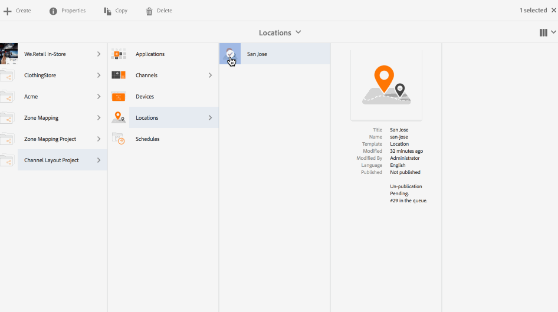

# チャネルレイアウトエディター {#channel-layout-editor}

***チャネルレイアウトエディター***&#x200B;を使用すると、マルチゾーンコンテンツを作成し、ビデオ、画像およびテキストなどの様々なアセットを使用して、コンテキストに沿った方法で単一のスクリーンに組み合わせることができます。画像、ビデオおよびテキストを取り込み、すべてを組み合わせて、直感的でインタラクティブなデジタルエクスペリエンスを作成できます。

プロジェクト要件に応じて、1 つのチャネルに複数のゾーンが必要になり、1 つの包括的なユニットとして編集することがあります。例えば、関連するソーシャルメディアフィードを持つ製品シーケンスが、1つのチャネルの3つの異なるゾーンで実行されているとします。

## 概要 {#overview}

チャネルを作成する際に、チャネルにゾーンを作成するために、様々なテンプレートを使用できます。プロジェクト要件に応じて、画像、ビデオまたは埋め込まれたチャネルを追加し、コンテンツを利用できます。

### 使用例の説明 {#use-case-description}

次の使用例では、チャネルでのマルチゾーンの作成を説明します。

1. ***スクリーンプロジェクトの作成***

   1. Adobe Experience Manager リンク（左上）を選択し、**Screens** を選択します。Alternatively, you can go directly to: `http://localhost:4502/screens.html/content/screens`.
   1. Click **Create** to create a new Screens project.
   1. **Screens プロジェクトの作成**&#x200B;ウィザードで「**スクリーン**」を選択し、「**次へ**」をクリックします。
   1. Enter the title as **Channel Layout Project** and click **Create**.
   

1. ***チャネルの作成***

   1. Navigate to **Channel Layout Project**.
   1. アクションバーから「**作成**」をクリックします。ウィザードが開きます。
   1. Choose the **1x2 Split Screen Channel** and click **Next**.
   1. Enter the **Title** as **Split horizontal** and click **Create**.
   

1. ***チャネルへのコンテンツの追加***

   1. Navigate to the **Channel Layout Project** you created and select the channel (**Split Channel**).
   1. Click **Edit** from the action bar and the editor for the **Split Channel** opens.
   1. アクションバーの左側にあるサイドパネルを切り替えるアイコンをクリックし、アセットとコンポーネントを開きます。チャネルに追加するコンポーネントをドラッグ＆ドロップします。
   

   >[!NOTE]
   >
   >例として、エディターで次の 2 つの画像をチャネルに追加します。

   

1. ***場所の作成***

   1. Navigate to the Locations folder where you want to create your display (**Channel Layout Project**--&gt; **Locations**).
   1. アクションバーから「**作成**」をクリックします。
   1. Select **Location** from the **Create** wizard and click **Next**.
   1. Enter **Title** for your location as **San Jose**.
   1. 「**作成**」をクリックします。
   

1. ***新しいディスプレイの作成***

   1. Navigate to the location where you want to create your display (**Acme** --&gt; **Locations** --&gt; **San Jose**) and select **San Jose**.
   1. アクションバーから「**作成**」をクリックします。Select **Display** from the **Create** wizard and click **Next**.
   1. Enter **Title** for your display location (enter the title as **Split Display)**.
   1. Under the **Display** tab, choose the details of the Layout. Choose the **Resolution** as **Full HD**. Choose the **Number of Devices Horizontally** as 1 and the **Number of Devices Vertically** as **1**.
   1. 「**作成**」をクリックします。
   

1. ***チャネルの割り当て***

   1. Navigate to the display from **Channel Layout Project** --&gt; **Locations** --&gt; **San Jose** --&gt; **Split Display**.
   1. Select **Split Display** and tap/click **Assign Channel** from the action bar, Or,
   1. Click **Dashboard** and select **+Assign Channel** at the top right from **ASSIGNED CHANNELS &amp; SCHEDULES** panel. **チャネル割り当て**&#x200B;ダイアログボックスが開きます。
   1. Enter the **Channel Role** as **Split**.
   1. パスで&#x200B;**参照チャネル**&#x200B;を選択します。Select the channel folder path (**Channel Layout Project** --&gt; **Channels** --&gt; **Split horizontal**) in the Channel.
   1. このチャネルの「**優先度**」として 1 **** を選択します。
   1. 「**サポートされているイベント**」として「**最初の読み込み**」および「**待機中画面**」を選択します。
   1. 「**保存**」をクリックします。
   

1. ***デバイスの登録および割り当て***

   1. 別のブラウザーウィンドウを起動します。Webブラウザーを使用して「画面」プレーヤーに移動するか、AEM Screensアプリを起動します。
   1. デバイスを開くと、デバイスの状態が未登録であることがわかります。From the AEM dashboard, navigate to **Channel Layout Project** --&gt; **Devices**.
   1. アクションバーから「**デバイスマネージャー**」をクリックします。
   1. Click **Device Registration** and you will see the pending devices. 登録するデバイスを選択して、「**デバイスを登録**」をクリックします。
   1. Web ブラウザーまたは AEM Screens Player からコードを確認して、コードを検証する必要があります。Click **Validate** to navigate to **Device Registration** screen.
   1. Enter Title as **NewD** and click **Register** and the device will be registered.
   1. Click **Assign Display** to move on to the next step where you assign the device to a display.
   1. 「デバイスを割り当て」をクリックし、チャネルの表示パス()を/content/screens/Test_Project/Locations/TestLocation/TestDisplayとして選択します。 「**割り当て**」をクリックします。
   1. Click **Finish** to complete the process, and now the device is assigned.
   

#### AEM Screens Player でのコンテンツの表示 {#viewing-content-in-aem-screens-player}

AEM Screens Player を読み込むか Web ブラウザーを使用します。チャネルのコンテンツが Screens Player に表示されます。コンテンツは、1 x 2 分割画面チャネルテンプレートに従って表示されます。

### 推論 {#inference}

チャネルを作成する際に使用可能なテンプレートを使用すると、様々なゾーンでコンテンツを利用および表示できます。前述の例は、2 x 2 テンプレートの使用例を示しています。

次の画像は、様々なテンプレートを使用して実現可能なレイアウトを示しています。
