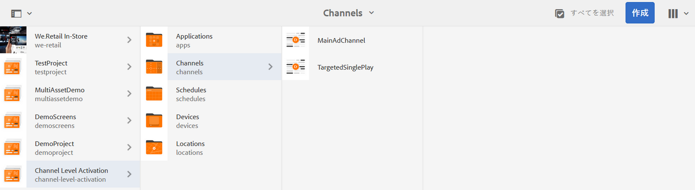
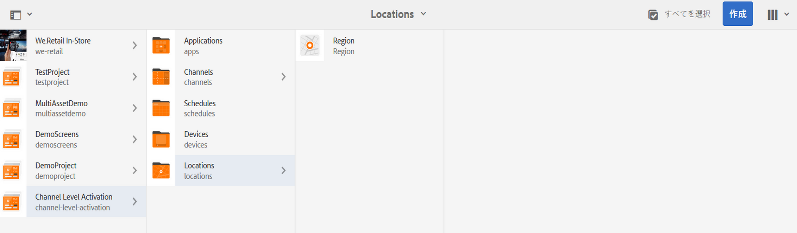
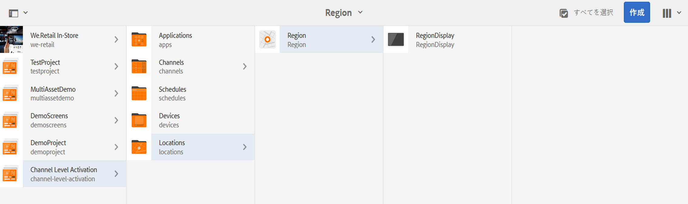
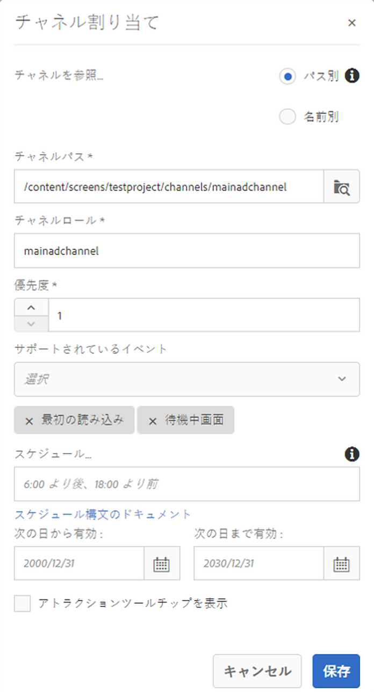
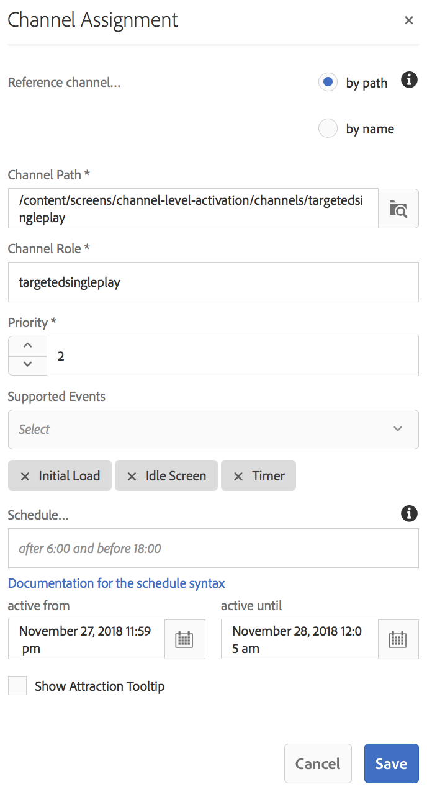

# チャネルレベルのアクティベーション {#channel-level-activation-single-event-playback}

このページでは、チャネルで使用されるアセットのチャネルレベルのアクティベーションについて説明します。

この節では、以下のトピックについて説明します。

* 概要
* アクティベーションウィンドウ
* チャネルレベルのアクティベーションを単一イベント再生として使用する方法
* チャネル内アセットの繰り返し処理
   * 日分割
   * 週分割
   * 月分割
   * 分割の組み合わせ
* チャネルレベルのアクティベーションを単一イベント再生として使用する方法

## 概要 {#overview}

***チャネルレベルのアクティベーション***&#x200B;を使用すると、設定された特定のスケジュールに従ってチャネルを切り替えることができます。設定されたスケジュールに従って単一イベントチャネルがメインチャネルの代わりに再生され、メインチャネルが再びコンテンツを再生するようになるまで、特定の時間だけ再生されます。

以下の例では、次のキーワードに的を絞ったソリューションを示しています。

* グローバルシーケンス用の&#x200B;***メインシーケンスチャネル***
* 設定された時刻に 1 回だけ動作する&#x200B;***単一イベントチャネル***
* メインシーケンスチャネル内で発生する単一再生イベントに&#x200B;***設定されるスケジュールと優先度***

## アクティベーションウィンドウ {#using-channel-level-activation}

次の節では、AEM Screens プロジェクトのチャネルに含まれる単一イベント再生の作成について説明します。

### 前提条件 {#prerequisites}

この機能の実装を開始する前に、次の前提条件を満たしていることを確認してください。

* AEM Screens プロジェクト（この例では **チャネルレベルのアクティベーション**）を作成する

* **チャネル**&#x200B;フォルダーの下に **MainAdChannel** というチャネルを作成する

* **チャネル** フォルダーの下に **TargetedSinglePlay** という別のチャネルを作成する

* 両方のチャネルに関連アセットを追加する

次の画像は、**チャネル**&#x200B;フォルダーに **MainAdChannel** チャネルと **TargetedSinglePlay** チャネルを含む **チャネルレベルのアクティベーション** プロジェクトを示しています。

>[!NOTE]
>
>プロジェクトの作成方法とシーケンスチャネルの作成方法について詳しくは、以下のリソースを参照してください。
>
>* [プロジェクトの作成と管理](creating-a-screens-project.md)

* [チャネルの管理](managing-channels.md)

### 実装 {#implementation}

AEM Screens プロジェクトにチャネルレベルのアクティベーションを実装するには、主に次の 3 つのタスクが必要になります。

1. **チャネル、ロケーション、ディスプレイなどのプロジェクト分類のセットアップ**
1. **ディスプレイへのチャネルの割り当て**
1. **スケジュールと優先度のセットアップ**

この機能を実装するには、以下の手順に従います。

1. **ロケーションを作成する**

   AEM Screens プロジェクトの「**ロケーション**」フォルダーに移動し、「**地域**」としてロケーションを作成します。

   

   >[!NOTE]
   ロケーションの作成方法については、**[ロケーションの作成と管理](managing-locations.md)**&#x200B;を参照してください。

1. **ロケーションにディスプレイを作成する**

   1. **チャネルレベルのアクティベーション**／**ロケーション**／**地域**&#x200B;に移動します。
   1. 「**地域**」を選択し、アクションバーの「**+ 作成**」をクリックします。
   1. ウィザードで「**ディスプレイ**」を選択し、「**RegionDisplay**」というタイトルのディスプレイを作成します。

   

1. **ディスプレイにチャネルを割り当てる**

   **MainAdChannel** の場合は次の手順に従います。

   1. **チャネルレベルのアクティベーション**／**ロケーション**／**地域**／**RegionDisplay** に移動し、アクションバーの「**チャネルを割り当て**」をクリックします。
   1. **チャネル割り当て**&#x200B;ダイアログボックスが開きます。
   1. 「**チャネルを参照...**」で「パス別」を選択します。
   1. 「**チャネルパス**」で&#x200B;**チャネルレベルのアクティベーション**／***チャネル***／***MainAdChannel*** を選択します。
   1. 「**チャネルロール**」は **mainadchannel** に設定します。
   1. 「**優先度**」で「**1**」を選択します。
   1. 「**サポートされているイベント**」で「**最初の読み込み**」および「**待機中画面**」を選択します。
   1. 「**保存**」をクリックします。

   

   >[!NOTE]
   ディスプレイダッシュボードからチャネルを割り当てることもできます。それには、**チャネルレベルのアクティベーション**／**ロケーション**／**地域**／**RegionDisplay** に移動し、アクションバーの「**ダッシュボード**」をクリックします。**割り当てられたチャネルとスケジュール**&#x200B;パネルで「**+ チャネルを割り当て**」をクリックします。

   同様に、**TargetedSinglePlay** チャネルを次の手順でディスプレイに割り当てます。

   1. **チャネルレベルのアクティベーション**／**ロケーション**／**地域**／**RegionDisplay** に移動し、アクションバーの「**チャネルを割り当て**」をクリックします。
   1. **チャネル割り当て**&#x200B;ダイアログボックスが開きます。
   1. 「**チャネルを参照...**」で「パス別」を選択します。
   1. 「**チャネルパス**」で&#x200B;**チャネルレベルのアクティベーション**／***チャネル***／***TargetedSinglePlay*** を選択します。
   1. 「**チャネルロール**」は **targetedsingleplay** に設定します。
   1. 「**優先度**」を「**2**」に設定します。
   1. 「**サポートされているイベント**」として「**最初の読み込み**」、「**待機中画面**」、「**タイマー**」を選択します（以下の図を参照）。
   1. 「**次の日から有効**」として 2018 年 11 月 27 日午後 11 時 59 分を、「**次の日まで有効**」として 2018 年 11 月 28 日午前 12 時 5 分を、それぞれ選択します。
   1. 「**保存**」をクリックします。

   >[!CAUTION]
   **TargetedSinglePlay** チャネルの優先度を **MainAdSegment** チャネルよりも高く設定する必要があります。

   

   >[!NOTE]
   同じ日を選択するには、翌日を選択し、手動で同じ日付に編集する必要があります。ただし、時刻は後になるようにします。これにより、ユーザーが過去の日付を選択できないようになります。以下の例を参照してください。

   

## 結果の表示 {#viewing-the-results}

チャネルとディスプレイのセットアップが完了したら、AEM Screens Player を起動してコンテンツを表示してください。

プレイヤーに **MainAdChannel** チャネルのコンテンツが表示され、（スケジュールで設定したとおりに）午後 11 時 59 分になると **TargetedSinglePlay** チャネルのコンテンツが 午前 12 時 5 分まで表示されます。その後は、**MainAdChannel** のコンテンツの再生が再開されます。

>[!NOTE]
AEM Screens Player については、次のリソースを参照してください。
[AEM Screens Player のダウンロード](https://download.macromedia.com/screens/)
[AEM Screens Player の操作](working-with-screens-player.md)

## チャネル内アセットの繰り返し処理 {#handling-recurrence-in-assets}

必要に応じて、毎日、毎週または毎月、特定の間隔でチャネル内のアセットが繰り返されるようにスケジュールを設定することもできます。

例えば、金曜日の午後 1:00 から午後 10:00 までの間のみ、コンテンツを表示するとします。「**アクティベーション**」タブを使用して、アセットの繰り返し間隔を希望どおり設定できます。

### 日分割 {#day-parting}

1. チャネルを選択し、アクションバーの「**ダッシュボード**」をクリックして、チャネルダッシュボードを開きます。

1. **チャネルの割り当て**&#x200B;ダイアログボックスから開始日時と終了日時を入力した後、式または自然テキストバージョンを使用して繰り返しスケジュールを指定できます。

   >[!NOTE]
   必要に応じて、「**次の日から開始**」フィールドと「**次の日まで有効**」フィールドをスキップするか、それらを含めて「スケジュール」フィールドに式を追加できます。

1. 「**スケジュール**」に式を入力すると、特定の日時間隔でアセットが表示されます。

#### 日分割の式の例 {#example-one}

ディスプレイにチャネルを割り当てる際にスケジュールに追加できる式の例を次の表にまとめます。

| **式** | **解釈** |
|---|---|
| 午前 8:00 より前 | チャネル内のアセットは毎日午前 8:00 まで再生されます |
| 午後 2:00 より後 | チャネル内のアセットは毎日午後 2:00 から再生されます |
| 12:15 より後、12:45 より前 | チャネル内のアセットは、毎日午後 12:15 から 30 分間再生されます |
| 12:15 より前、12:45 より後 | チャネル内のアセットは、毎日午後 12:15 までと午後 12:45 から再生されます |
| 月、火、水、または月 ～ 水 | チャネル内のアセットは月曜から水曜まで再生されます |
| 1 月 1 日の午後 2:00 より後、1 月 2 日を経て、1 月 3 日の午前 3:00 より前 | チャネル内アセットの再生は、1 月 1 日の午後 2:00 に開始し、1 月 2 日の終日を経て 1 月 3 日の午前 3:00 まで続きます |
| 1 月 1～2 日の午後 2:00 より後、1 月 2～3 日の午前 3:00 より前 | チャネル内アセットの再生は、1 月 1 日の午後 2:00 に開始し、1 月 2 日の午前 3:00 まで続いた後、1 月 2 日の午後 2:00 に再開し、1 月 3 日の午前 3:00 まで続きます。 |

>[!NOTE]
*午前／午後*&#x200B;表記（例：午後 2:00）ではなく、_24 時間_&#x200B;表記（例：14:00）を使用することもできます。

### 週分割 {#week-parting}

1. チャネルを選択し、アクションバーの「**ダッシュボード**」をクリックして、チャネルダッシュボードを開きます。

1. **チャネルの割り当て**&#x200B;ダイアログボックスから開始日時と終了日時を入力した後、式または自然テキストバージョンを使用して繰り返しスケジュールを指定できます。

   >[!NOTE]
   必要に応じて、「**次の日から開始**」フィールドと「**次の日まで有効**」フィールドをスキップするか、それらを含めて「スケジュール」フィールドに式を追加できます。

1. 「**スケジュール**」に式を入力すると、特定の日時間隔でアセットが表示されます。

#### 週分割の式の例 {#example-two}

ディスプレイにチャネルを割り当てる際にスケジュールに追加できる式の例を次の表にまとめます。

| **式** | **解釈** |
|---|---|
| 月、火、水、または月 ～ 水 | チャネル内のアセットは月曜から水曜まで再生されます |
| 午前 8:00 より前 | チャネル内のアセットは毎日午前 8:00 まで再生されます |
| 午後 2:00 より後 | チャネル内のアセットは毎日午後 2:00 から再生されます |
| 12:15 より後、12:45 より前 | チャネル内のアセットは、毎日午後 12:15 から 30 分間再生されます |
| 12:15 より前、12:45 より後 | 毎日午後 0 時 15 分までと午後 0 時 45 分からチャネルが再生されます。 |

>[!NOTE]
*午前／午後*&#x200B;表記（例：午後 2:00）ではなく、_24 時間_&#x200B;表記（例：14:00）を使用することもできます。

### 月分割 {#month-parting}

1. チャネルを選択し、アクションバーの「**ダッシュボード**」をクリックして、チャネルダッシュボードを開きます。

1. **チャネルの割り当て**&#x200B;ダイアログボックスから開始日時と終了日時を入力した後、式または自然テキストバージョンを使用して繰り返しスケジュールを指定できます。

   >[!NOTE]
   必要に応じて、「**次の日から開始**」フィールドと「**次の日まで有効**」フィールドをスキップするか、それらを含めて「スケジュール」フィールドに式を追加できます。

1. 「**スケジュール**」に式を入力すると、特定の日時間隔でアセットが表示されます。

#### 月分割の式の例 {#example-three}

ディスプレイにチャネルを割り当てる際にスケジュールに追加できる式の例を次の表にまとめます。

| **式** | **解釈** |
|---|---|
| 2 月、5 月、8 月、11 月 | チャネル内のアセットは、2 月、5 月、8 月、11 月に再生されます。 |

>[!NOTE]
曜日や月を定義する場合は、省略形または通常の表記を使用できます（月／月曜日、1／1 月など）。

>[!NOTE]
*午前／午後*&#x200B;表記（例：午後 2:00）ではなく、_24 時間_&#x200B;表記（例：14:00）を使用することもできます。

### 分割の組み合わせ {#combined-parting}

1. チャネルを選択し、アクションバーの「**ダッシュボード**」をクリックして、チャネルダッシュボードを開きます。

1. **チャネルの割り当て**&#x200B;ダイアログボックスから開始日時と終了日時を入力した後、式または自然テキストバージョンを使用して繰り返しスケジュールを指定できます。

   >[!NOTE]
   必要に応じて、「**次の日から開始**」フィールドと「**次の日まで有効**」フィールドをスキップするか、それらを含めて「スケジュール」フィールドに式を追加できます。

1. 「**スケジュール**」に式を入力すると、特定の日時間隔でアセットが表示されます。

#### 分割の組み合わせの式の例 {#example-four}

ディスプレイにチャネルを割り当てる際にスケジュールに追加できる式の例を次の表にまとめます。

| **式** | **解釈** |
|---|---|
| 6:00 ～ 18:00（1 月～ 3 月の月曜および水曜） | アセットは、1 月から 3 月末の月曜日と水曜日、午前 6 時から午後 6 時の間、チャンネルで再生される |
| 1 月 1 日の午後 2:00 より後、1 月 2 日を経て、1 月 3 日の午前 3:00 より前 | チャネル内アセットの再生は、1 月 1 日の午後 2:00 に開始し、1 月 2 日の終日を経て 1 月 3 日の午前 3:00 まで続きます |
| 1 月 1～2 日の午後 2:00 より後、1 月 2～3 日の午前 3:00 より前 | チャネル内アセットの再生は、1 月 1 日の午後 2:00 に開始し、1 月 2 日の午前 3:00 まで続いた後、1 月 2 日の午後 2:00 に再開し、1 月 3 日の午前 3:00 まで続きます。 |

>[!NOTE]
曜日や月を定義する場合は、省略形または通常の表記を使用できます（月／月曜日、1／1 月など）。さらに、_午前／午後_&#x200B;表記（例：午後 2:00）ではなく、*24 時間*&#x200B;表記（例：14:00）を使用することもできます。
