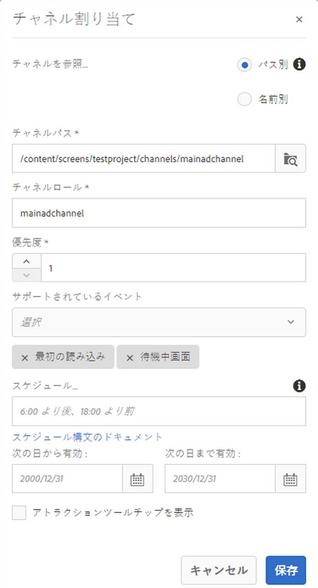
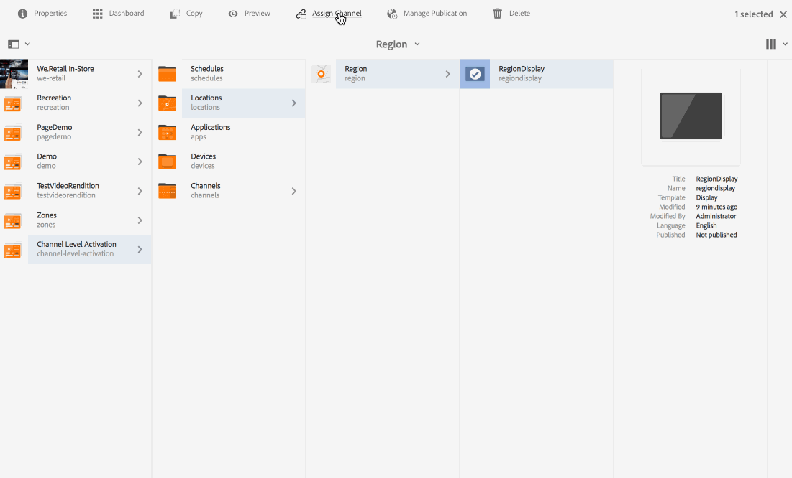

# チャネルレベルのアクティベーション {#channel-level-activation-single-event-playback}

>[!IMPORTANT]
>このコンテンツは、AEM オンプレミス/AMS （AEM 6.5LTSおよびAEM 6.5）に対して有効です。 AEM as a Cloud Service Screensの内容については、[AEM as a Cloud Service ガイド &#x200B;](https://experienceleague.adobe.com/ja/docs/experience-manager-cloud-service/content/screens-as-cloud-service/overview/introduction)を参照してください。

このページでは、チャネルで使用されるアセットのチャネルレベルのアクティベーションについて説明します。

この節では、以下のトピックについて説明します。

* 概要
* アクティベーションウィンドウ
* チャネルレベルのアクティベーションを単一イベント再生として使用する方法
* チャネル内アセットの繰り返し処理
   * 時間帯区分
   * 週分割
   * 月分割
   * 分割の組み合わせ
* チャネルレベルのアクティベーションを単一イベント再生として使用する方法

## 概要 {#overview}

***チャネルレベルのアクティベーション***&#x200B;を使用すると、設定された特定のスケジュールに従ってチャネルを切り替えることができます。 設定されたスケジュールに従って単一イベントチャネルがメインチャネルの代わりに再生され、メインチャネルが再びコンテンツを再生するようになるまで、特定の時間だけ再生されます。

以下の例では、次のキーワードに的を絞ったソリューションを示しています。

* グローバルシーケンス用の&#x200B;***メインシーケンスチャネル***
* 設定された時刻に 1 回だけ動作する&#x200B;***単一イベントチャネル***
* メインシーケンスチャネル内で発生する単一再生イベントに&#x200B;***設定されるスケジュールと優先度***

## アクティベーションウィンドウ {#using-channel-level-activation}

次の節では、AEM Screens プロジェクトのチャネルに含まれる単一イベント再生の作成について説明します。

### 前提条件 {#prerequisites}

この機能の実装を開始する前に、チャネルレベルのアクティベーションを実装するための次の前提条件を満たしていることを確認してください。

* AEM Screens プロジェクト（この例では **Channel Level Activation**）を作成する

* **Channels** フォルダーの下に **MainAdChannel** というチャネルを作成する

* **Channels** フォルダーの下に **TargetedSinglePlay** という別のチャネルを作成する

* 両方のチャネルに関連アセットを追加する

次の画像は、**Channels** フォルダーに **MainAdChannel** チャネルと **TargetedSinglePlay** チャネルを含む **Channel Level Activation** プロジェクトを示しています。

>[!NOTE]
>
>プロジェクトの作成方法とシーケンスチャネルの作成方法について詳しくは、以下のリソースを参照してください。
>
>* [プロジェクトの作成と管理](creating-a-screens-project.md)
>
>* [チャネルの管理](managing-channels.md)
>

### 実装 {#implementation}

AEM Screens プロジェクトにチャネルレベルのアクティベーションを実装するには、主に次の 3 つのタスクが必要になります。

1. **チャネル、ロケーション、ディスプレイなどのプロジェクト分類のセットアップ**
1. **ディスプレイへのチャネルの割り当て**
1. **スケジュールと優先度のセットアップ**

この機能を実装するには、以下の手順に従います。

1. **ロケーションを作成する**

   AEM Screens プロジェクトの「**ロケーション**」フォルダーに移動し、「**地域**」としてロケーションを作成します。

   

   >[!NOTE]
   >
   >ロケーションの作成方法については、**[ロケーションの作成と管理](managing-locations.md)**&#x200B;を参照してください。

1. **ロケーションにディスプレイを作成する**

   1. **チャネルレベルのアクティベーション**／**ロケーション**／**地域**&#x200B;に移動します。
   1. **Region** をクリックし、アクションバーの「**+ 作成**」をクリックします。
   1. ウィザードで「**ディスプレイ**」をクリックし、**RegionDisplay** というタイトルのディスプレイを作成します。

   

1. **ディスプレイにチャネルを割り当てる**

   **MainAdChannel** の場合は次の手順に従います。

   1. **チャネルレベルのアクティベーション**／**ロケーション**／**地域**／**RegionDisplay** に移動し、アクションバーの「**チャネルを割り当て**」をクリックします。
   1. **チャネルの割り当て**&#x200B;ダイアログボックスで、パスで「**参照チャネル**」をクリックします。
   1. 「**チャネルパス**」をクリックし、**Channel Level Activation**／***Channels***／***MainAdChannel*** をクリックします。
   1. 「**チャネルロール**」は **mainadchannel** に設定します。
   1. 「**優先度**」をクリックし、**1** に設定します。
   1. **初期読み込み**&#x200B;や&#x200B;**アイドル画面**&#x200B;など、**サポートされているイベント**&#x200B;をクリックします。
   1. 「**保存**」をクリックします。

   

   >[!NOTE]
   >
   >また、ディスプレイダッシュボードからチャネルを割り当てることもできます。 **Channel Level Activation**／**Locations**／**Region**／**RegionDisplay** に移動します。 アクションバーで、「**ダッシュボード**」を選択します。 **割り当てられたチャネルとスケジュール**&#x200B;パネルで、「**+ チャネルを割り当て**」をクリックします。

   同様に、**TargetedSinglePlay** チャネルを次の手順でディスプレイに割り当てます。

   1. **Channel Level Activation**／**Locations**／**Region**／**RegionDisplay** に移動し、アクションバーの「**チャネルを割り当て**」をクリックします。
   1. **チャネルの割り当て**&#x200B;ダイアログボックスで、パスで「**参照チャネル**」をクリックします。
   1. 「**チャネルパス**」をクリックし、**Channel Level Activation**／***Channels***／***TargetedSinglePlay*** をクリックします。
   1. 「**チャネルロール**」は **targetedsingleplay** に設定します。
   1. **優先度**&#x200B;を「**2**」に設定します。
   1. **サポートされているイベント**&#x200B;で「**最初の読み込み**」、「**待機中画面**」、「**タイマー**」をクリックします（下図を参照）。
   1. **アクティブから**&#x200B;で、2018年11月27日、午後11:59に設定し、**アクティブから**&#x200B;で、2018年11月28日、午前12:05に設定します。
   1. 「**保存**」をクリックします。

   >[!CAUTION]
   >
   >**TargetedSinglePlay** チャネルの優先度を **MainAdSegment** チャネルよりも高く設定します。

   

   >[!NOTE]
   >
   >同じ日を選択するには、翌日をクリックし、手動で編集して同じ日付にします。ただし、時刻は後になるようにします。 そうすると、ユーザーが過去の日付を選択できないようになります。 次の例を参照してください。

   

## 結果の表示 {#viewing-the-results}

チャネルとディスプレイのセットアップが完了したら、AEM Screens Player を起動してコンテンツを表示してください。

プレーヤーは&#x200B;**MainAdChannel**&#x200B;のコンテンツを表示し、正確に午後11:59に表示します（スケジュールで設定されています）。**TargetedSinglePlay** チャネルは午前12:05までそのコンテンツを表示し、次に&#x200B;**MainAdChannel**&#x200B;はコンテンツの再生を再開します。

>[!NOTE]
>
>AEM Screens Player については、次のリソースを参照してください。AEM Screens PlayerのダウンロードAEM Screens Player での作業&rbrack;(working-with-screens-player.md)

## チャネル内アセットの繰り返し処理 {#handling-recurrence-in-assets}

必要に応じて、毎日、毎週または毎月、特定の間隔でチャネル内のアセットが繰り返されるようにスケジュールを設定できます。

チャンネルのコンテンツを金曜日の午後1:00時から午後10:00時までのみ表示するとします。「**アクティベーション**」タブを使用して、アセットの目的の繰り返し間隔を設定できます。

### 日分割 {#day-parting}

1. チャネルをクリックし、アクションバーの「**ダッシュボード**」をクリックします。

1. **チャネルの割り当て**&#x200B;ダイアログボックスから開始日時と終了日時を入力した後、式または自然テキストバージョンを使用して繰り返しスケジュールを指定できます。

   >[!NOTE]
   >
   >必要に応じて、**次の日から開始**&#x200B;フィールドと&#x200B;**次の日まで有効**&#x200B;フィールドをスキップするか、それらを含めてスケジュールフィールドに式を追加できます。

1. 「**スケジュール**」に式を入力すると、特定の日時間隔でアセットが表示されます。

#### 日分割の式の例 {#example-one}

ディスプレイにチャネルを割り当てる際にスケジュールに追加できる式の例を次の表にまとめます。

| **式** | **解釈** |
|---|---|
| 午前8:00前。 | チャンネル内のアセットは、毎日午前8:00前に再生されます |
| 午後2:00時以降。 | チャネル内のアセットは、毎日の午後2:00時以降に再生されます |
| 12:15以降12:45以前 | チャネル内のアセットは、毎日12:15時間後に30分間再生されます |
| before 12:15 also after 12:45 | チャネル内のアセットは、毎日午後12:15までに再生され、午後12:45以降も再生されます。 |
| 月、火、水、または月 ～ 水 | チャネル内のアセットは月曜から水曜まで再生されます |
| 1月の午後2:00後の最初の日、1月の2日目、および午前3:00前の1月の3日目。 | チャンネル内のアセットは、1月1日の午後2時から再生を開始し、1月3日の午前3時1分まで1日中再生を続けます:00:00 |
| 1月2～2日の午後2:00後。1月2～3日の午前3:00前。 | チャネル内のアセットは、1月1日の午後2:00時にプレーヤーを開始し、1月2日の午前3:00まで再生を続け、1月2日の午後2:00に再び開始し、1月3日の午前3:00まで再生を続けます |

>[!NOTE]
>
>*A.M./P.M.* （2:00 P.M.）の代わりに&#x200B;_軍時間_&#x200B;の表記法（14:00）を使用することもできます。

### 週分割 {#week-parting}

1. チャネルをクリックし、アクションバーの「**ダッシュボード**」をクリックします。

1. **チャネルの割り当て**&#x200B;ダイアログボックスから開始日時と終了日時を入力した後、式または自然テキストバージョンを使用して繰り返しスケジュールを指定できます。

   >[!NOTE]
   >
   >必要に応じて、**次の日から開始**&#x200B;フィールドと&#x200B;**次の日まで有効**&#x200B;フィールドをスキップするか、それらを含めてスケジュールフィールドに式を追加できます。

1. 「**スケジュール**」に式を入力すると、特定の日時間隔でアセットが表示されます。

#### 週分割の式の例 {#example-two}

ディスプレイにチャネルを割り当てる際にスケジュールに追加できる式の例を次の表にまとめます。

| **式** | **解釈** |
|---|---|
| 月、火、水、または月 ～ 水 | チャネル内のアセットは月曜から水曜まで再生されます |
| 午前8:00前。 | チャンネル内のアセットは、毎日午前8:00前に再生されます |
| 午後2:00時以降。 | チャネル内のアセットは、毎日の午後2:00時以降に再生されます |
| 12:15以降12:45以前 | チャネル内のアセットは、毎日12:15時間後に30分間再生されます |
| before 12:15 also after 12:45 | チャンネルは毎日午後12時:15分前に再生され、午後12時:45分後にも再生されます。 |

>[!NOTE]
>
>*A.M./P.M.* （2:00 P.M.）の代わりに&#x200B;_軍時間_&#x200B;の表記法（14:00）を使用することもできます。

### 月分割 {#month-parting}

1. チャネルをクリックし、アクションバーの「**ダッシュボード**」をクリックします。

1. **チャネルの割り当て**&#x200B;ダイアログボックスから開始日時と終了日時を入力した後、式または自然テキストバージョンを使用して繰り返しスケジュールを指定できます。

   >[!NOTE]
   >
   >必要に応じて、**次の日から開始**&#x200B;フィールドと&#x200B;**次の日まで有効**&#x200B;フィールドをスキップするか、それらを含めてスケジュールフィールドに式を追加できます。

1. 「**スケジュール**」に式を入力すると、特定の日時間隔でアセットが表示されます。

#### 月分割の式の例 {#example-three}

ディスプレイにチャネルを割り当てる際にスケジュールに追加できる式の例を次の表にまとめます。

| **式** | **解釈** |
|---|---|
| of `February,May,August,November` | アセットは 2月、5月、8月、および 11月にチャネルで再生されます |

>[!NOTE]
>
>曜日や月を定義する場合は、省略形または通常の表記を使用できます（Mon/Monday および Jan/Januaryなど）。

>[!NOTE]
>
>*A.M./P.M.* （2:00 P.M.）の代わりに&#x200B;_軍時間_&#x200B;の表記法（14:00）を使用することもできます。

### 分割の組み合わせ {#combined-parting}

1. チャネルをクリックし、アクションバーの「**ダッシュボード**」をクリックします。

1. **チャネルの割り当て**&#x200B;ダイアログボックスから開始日時と終了日時を入力した後、式または自然テキストバージョンを使用して繰り返しスケジュールを指定できます。

   >[!NOTE]
   >
   >必要に応じて、**次の日から開始**&#x200B;フィールドと&#x200B;**次の日まで有効**&#x200B;フィールドをスキップするか、それらを含めてスケジュールフィールドに式を追加できます。

1. 「**スケジュール**」に式を入力すると、特定の日時間隔でアセットが表示されます。

#### 分割の組み合わせの式の例 {#example-four}

ディスプレイにチャネルを割り当てる際にスケジュールに追加できる式の例を次の表にまとめます。

| **式** | **解釈** |
|---|---|
| 月の6:00後18:00前、1月3月の水 | アセットは、1月から 3月末の月曜日と水曜日、午前 6 時から午後 6 時の間、チャネルで再生されます |
| 1月の午後2:00後の最初の日、1月の2日目、および午前3:00前の1月の3日目。 | チャンネル内のアセットは、1月1日の午後2時から再生を開始し、1月3日の午前3時1分まで1日中再生を続けます:00:00 |
| 1月2～2日の午後2:00後。1月2～3日の午前3:00前。 | チャネル内のアセットは、1月1日の午後2:00時にプレーヤーを開始し、1月2日の午前3:00まで再生を続け、1月2日の午後2:00に再び開始し、1月3日の午前3:00まで再生を続けます |

>[!NOTE]
>
>曜日や月を定義する場合は、省略形または通常の表記を使用できます（月／月曜日、1／1月など）。 また、*A.M./P.M.* （午後2:00）の代わりに&#x200B;_軍時間_&#x200B;の表記法（14:00）を使用することもできます。

