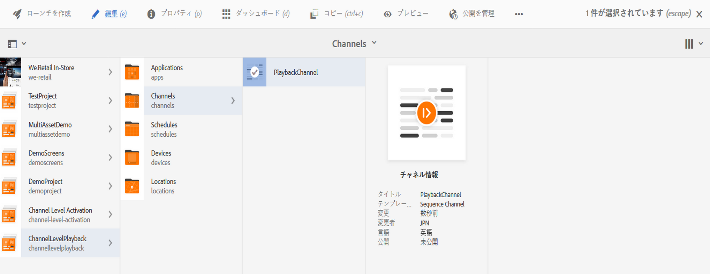
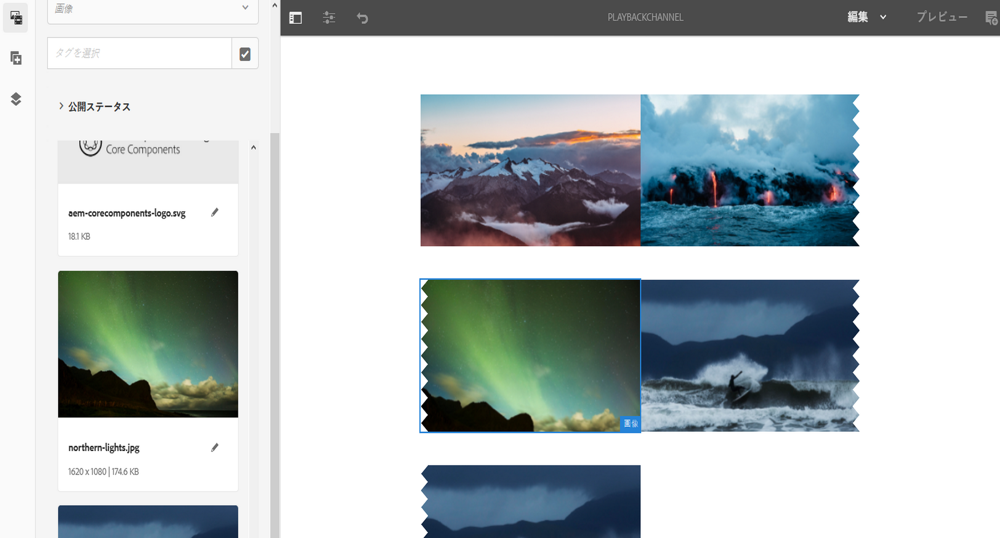
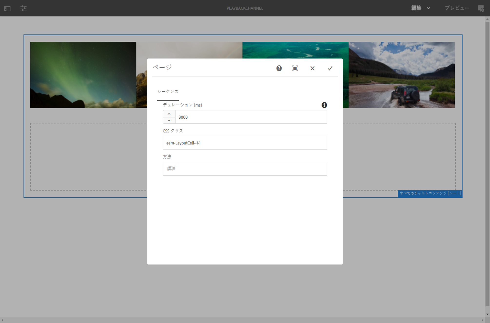

# チャネルレベルの一括画像再生時間 {#channel-level-bulk-image-playback-duration}

## 概要 {#overview}

シーケンスチャネルを作成し、そこに画像を追加すると、デフォルトでは、すべての画像はチャネルレベル設定で定義された再生時間を前提とします。それでも、個々の画像でこのデフォルトを上書きし、異なる再生時間にすることはできます。それには、特定の画像コンポーネントの再生時間を編集します。

### 前提条件 {#prerequisites}

この機能の実装を開始する前に、前提条件として、プロジェクトをセットアップしておく必要があります。例：

1. AEM Screens プロジェクト（例：**ChannelLevelPlayback**）を作成する。

1. **チャネル**&#x200B;フォルダーの下に **PlaybackChannel** というシーケンスチャネルを作成する。

1. **PlaybackChannel** にコンテンツを追加する。

## チャネルレベル画像再生時間の割り当ての編集 {#editing-channel-level-image-playback-duration-assignment}

以下の節では、AEM Screens チャネルのコンテンツの再生時間を編集する方法について説明します。

### チャネル内の画像の再生時間を更新する方法 {#updating-the-playback-duration-for-images-in-a-channel}

チャネルレベルの画像再生時間の割り当てを更新するには、以下の手順に従います。

1. シーケンスチャネル **PlaybackChannel** に移動します。

   

1. アクションバーの「**編集**」をクリックして、エディターを開きます。

   

1. チャネルエディターで画像を 2 つ以上追加します（次の図を参照）。

   

1. チャネル内のすべての画像を選択し、左上のレンチアイコンをクリックして（下図を参照）、チャネルレベルの設定ダイアログボックスを開きます。

   

1. **ページ**&#x200B;ダイアログボックスが開きます。

   >[!NOTE]
   >デフォルトでは、チャネル内の画像は再生時間が 8 秒に設定されています。

   

   「**デュレーション (ms)**」を「8000」から「3000」（3 秒）へと編集します。**ページ**&#x200B;ダイアログボックスの右上にあるチェックマークをクリックして、変更を保存します。

   

### 結果の表示 {#viewing-the-result}

チャネルの再生時間（この例では 3 つの画像すべての再生時間）を更新すると、画像が 8 秒間（デフォルト値）ではなく 3 秒間再生されるようになります。

