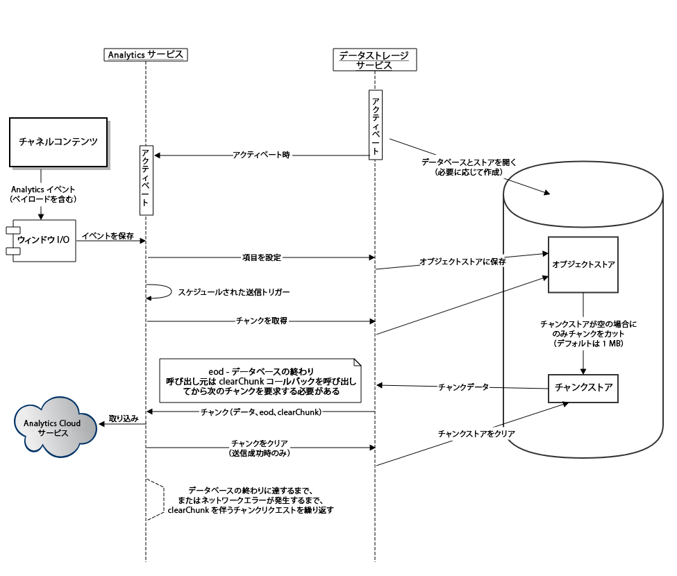

# AEM ScreensでのAdobe Analyticsの設定 {#configuring-adobe-analytics-with-aem-screens}

>[!CAUTION]
>
>このAEM Screens機能は、AEM 6.4.2機能パック2およびAEM 6.3.3機能パック4をインストールしている場合にのみ使用できます。

>これらのFeature packのいずれかにアクセスするには、アドビサポートに問い合わせてアクセスをリクエストする必要があります。 アクセス権が付与されると、パッケージ共有から機能パックをダウンロードできるようになります。
>
この節では、以下のトピックについて説明します。

* **AEM Screensを使用したAdobe Analyticsでの順序付け**
* **オフラインAdobe Analyticsを使用したカスタムイベントの送信**

## AEM Screensを使用したAdobe Analyticsでの順序付け {#sequencing-in-adobe-analytics-with-aem-screens}

シーケンス ***処理は*** 、Adobe Analyticsサービスをアクティブにするデータストレージサービスから開始します。 チャネルコンテンツは、Adobe Analyticsイベントを給与計算で送信します。つまり、データテストの取得がWindows I/Oに送信され、滞在イベントがトリガーされます。 イベントはインデックスDBに保存され、さらにオブジェクトストアに格納されます。 管理者はスケジュールに基づいて、データを設定し、オブジェクトストアからデータを切り取り、さらにチャンクストアに転送します。 接続時に、最大量のデータを送信しようとします。

### シーケンス図 {#sequencing-diagram}

次の順序図は、Adobe AnalyticsとAEM Screensの統合を説明しています。

## オフラインAdobe Analyticsを使用したカスタムイベントの送信 {#sending-custom-events-using-offline-adobe-analytics}

次の表に、イベントの標準データモデルの概要を示します。 Adobe Analyticsに送信されるすべてのフィールドが表示されます。

<table>
 <tbody>
  <tr>
   <td><strong>セクション</strong></td> 
   <td><strong>プロパティラベル</strong></td> 
   <td><strong>プロパティ名/キー</strong></td> 
   <td><strong>必須</strong></td> 
   <td><strong>データタイプ</strong></td> 
   <td><strong>プロパティタイプ</strong>  </td> 
   <td><strong>説明</strong></td> 
  </tr>
  <tr>
   <td><strong><em>コア/イベント</em></strong></td> 
   <td>イベントGUID</td> 
   <td>event.guid</td> 
   <td>推奨</td> 
   <td>string</td> 
   <td>UUID</td> 
   <td>イベントのインスタンスを識別する一意のID</td> 
  </tr>
  <tr>
   <td> </td> 
   <td>イベントの収集日時</td> 
   <td>event.coll_dts</td> 
   <td>オプション</td> 
   <td>string</td> 
   <td>timestamp - UTC</td> 
   <td>収集日時</td> 
  </tr>
  <tr>
   <td> </td> 
   <td>イベントの日時（開始）</td> 
   <td>event.dts_start</td> 
   <td>推奨</td> 
   <td>string</td> 
   <td>timestamp - UTC</td> 
   <td>イベント開始日時を指定しない場合、イベント時間はサーバーが受信した時間と見なされます</td> 
  </tr>
  <tr>
   <td> </td> 
   <td>イベントの日時（終了）</td> 
   <td>event.dts_end</td> 
   <td>オプション</td> 
   <td>string</td> 
   <td>timestamp - UTC</td> 
   <td>イベント完了日時</td> 
  </tr>
  <tr>
   <td> </td> 
   <td>ワークフロー</td> 
   <td>event.workflow</td> 
   <td>推奨</td> 
   <td>string</td> 
   <td> </td> 
   <td>ワークフロー名（画面）</td> 
  </tr>
  <tr>
   <td> </td> 
   <td>メインDMeカテゴリ</td> 
   <td>event.category</td> 
   <td>必須</td> 
   <td>string</td> 
   <td> </td> 
   <td>メインカテゴリ（デスクトップ、モバイル、WEB、プロセス、SDK、サービス、エコシステム） — イベントタイプのグループ — プ <strong>レイヤーを送信</strong></td> 
  </tr>
  <tr>
   <td> </td> 
   <td>サブカテゴリ</td> 
   <td>event.subcategory</td> 
   <td>推奨</td> 
   <td>string</td> 
   <td> </td> 
   <td>サブカテゴリ — ワークフローのセクション、画面の領域など （最近使用したファイル、CCファイル、モバイル作品など）。</td> 
  </tr>
  <tr>
   <td> </td> 
   <td>イベント/アクションタイプ</td> 
   <td>event.type</td> 
   <td>必須</td> 
   <td>string</td> 
   <td> </td> 
   <td>イベントタイプ（レンダリング、クリック、ピンチ、ズーム） — 主なユーザ操作</td> 
  </tr>
  <tr>
   <td> </td> 
   <td>Subtype</td> 
   <td>event.subtype</td> 
   <td>推奨</td> 
   <td>string</td> 
   <td> </td> 
   <td>イベントサブタイプ（作成、更新、削除、公開など） — ユーザーアクションの追加の詳細</td> 
  </tr>
  <tr>
   <td> </td> 
   <td>オフライン</td> 
   <td>event.offline</td> 
   <td>オプション</td> 
   <td>boolean</td> 
   <td> </td> 
   <td>アクションがオフライン/オンラインの間にイベントが生成されました(true/false)</td> 
  </tr>
  <tr>
   <td> </td> 
   <td>User Agent</td> 
   <td>event.user_agent</td> 
   <td>推奨（Webプロパティ）</td> 
   <td>string</td> 
   <td> </td> 
   <td>ユーザーエージェント</td> 
  </tr>
  <tr>
   <td> </td> 
   <td>言語/ロケール</td> 
   <td>event.language</td> 
   <td>推奨</td> 
   <td>string</td> 
   <td> </td> 
   <td>ユーザーロケールは、RFC 3066の言語タグ付け規則に基づく文字列（例：en-US、fr-FR、es-ES）です。</td> 
  </tr>
  <tr>
   <td> </td> 
   <td>デバイスGUID</td> 
   <td>event.device_guid</td> 
   <td>オプション</td> 
   <td>string  </td> 
   <td>UUID</td> 
   <td>デバイスGUID（マシンID、IPアドレス+サブネットマスク+ネットワークID +ユーザーエージェントのハッシュなど）を識別します。登録時に生成されたプレイヤーのユーザー名をここで送信します。</td> 
  </tr>
  <tr>
   <td> </td> 
   <td>数</td> 
   <td>event.count</td> 
   <td>オプション</td> 
   <td>number</td> 
   <td> </td> 
   <td>イベントが発生した回数 — ビデオの長さを送信します</td> 
  </tr>
  <tr>
   <td> </td> 
   <td>値</td> 
   <td>event.value</td> 
   <td>オプション</td> 
   <td>string</td> 
   <td> </td> 
   <td>イベントの値（例：設定のオン/オフ）</td> 
  </tr>
  <tr>
   <td> </td> 
   <td>ページ名</td> 
   <td>event.pagename</td> 
   <td>AAに必要</td> 
   <td>string</td> 
   <td> </td> 
   <td>カスタムページ名に対するAdobe Analyticsのサポート</td> 
  </tr>
  <tr>
   <td> </td> 
   <td>URL</td> 
   <td>event.url</td> 
   <td>オプション</td> 
   <td>string</td> 
   <td> </td> 
   <td>WebプロパティまたはモバイルスキーマのURL — 完全修飾URLが含まれている必要があります</td> 
  </tr>
  <tr>
   <td> </td> 
   <td>エラーコード</td> 
   <td>event.error_code</td> 
   <td> </td> 
   <td>string</td> 
   <td> </td> 
   <td>失敗コード</td> 
  </tr>
  <tr>
   <td> </td> 
   <td>エラーの種類</td> 
   <td>event.error_type</td> 
   <td> </td> 
   <td>string</td> 
   <td> </td> 
   <td>失敗タイプ</td> 
  </tr>
  <tr>
   <td> </td> 
   <td>エラーの説明</td> 
   <td>event.error_description</td> 
   <td> </td> 
   <td>string</td> 
   <td> </td> 
   <td>失敗の説明  </td> 
  </tr>
  <tr>
   <td><strong><em>ソース/元の製品</em></strong></td> 
   <td>名前</td> 
   <td>source.name</td> 
   <td>必須</td> 
   <td>string</td> 
   <td> </td> 
   <td>アプリ名(AEM Screens)</td> 
  </tr>
  <tr>
   <td> </td> 
   <td>バージョン</td> 
   <td>source.version</td> 
   <td>必須</td> 
   <td>string</td> 
   <td> </td> 
   <td>ファームウェアのバージョン</td> 
  </tr>
  <tr>
   <td> </td> 
   <td>プラットフォーム</td> 
   <td>source.platform</td> 
   <td>必須</td> 
   <td>string</td> 
   <td> </td> 
   <td>navigator.platform</td> 
  </tr>
  <tr>
   <td> </td> 
   <td>デバイス</td> 
   <td>source.device</td> 
   <td>必要な実行</td> 
   <td>string</td> 
   <td> </td> 
   <td>プレイヤ名</td> 
  </tr>
  <tr>
   <td> </td> 
   <td>OSバージョン</td> 
   <td>source.os_version</td> 
   <td>必要な実行</td> 
   <td>string</td> 
   <td> </td> 
   <td>O/Sバージョン</td> 
  </tr>
  <tr>
   <td><strong><em>コンテンツ</em></strong></td> 
   <td>アクション</td> 
   <td>content.action</td> 
   <td>必須</td> 
   <td>string</td> 
   <td> </td> 
   <td>実際に再生されたレンディションを含むアセットのURL</td> 
  </tr>
  <tr>
   <td> </td> 
   <td>MIME タイプ</td> 
   <td>content.mimetype</td> 
   <td>オプション</td> 
   <td>string</td> 
   <td> </td> 
   <td>コンテンツのMIMEタイプ</td> 
  </tr>
  <tr>
   <td><strong><em>取引</em></strong></td> 
   <td>取引番号</td> 
   <td>trn.number</td> 
   <td>必須</td> 
   <td>string</td> 
   <td>UUID</td> 
   <td>UUID v4に準拠することが望ましい一意のID</td> 
  </tr>
  <tr>
   <td> </td> 
   <td>製品の説明</td> 
   <td>trn.product</td> 
   <td>必須</td> 
   <td>string</td> 
   <td> </td> 
   <td>アセットのURL（レンディションを除く）</td> 
  </tr>
  <tr>
   <td> </td> 
   <td>数量</td> 
   <td>trn.quantity</td> 
   <td>必須</td> 
   <td>string</td> 
   <td> </td> 
   <td>再生時間</td> 
  </tr>
 </tbody>
</table>

