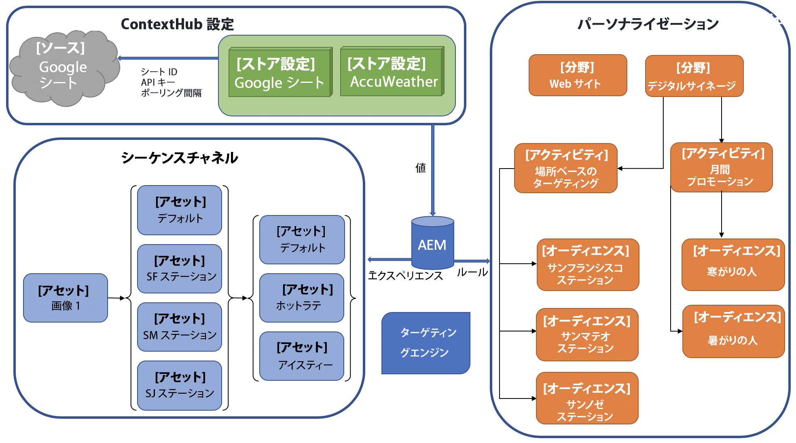
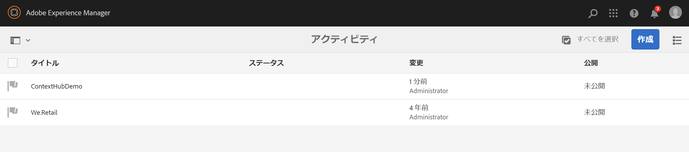
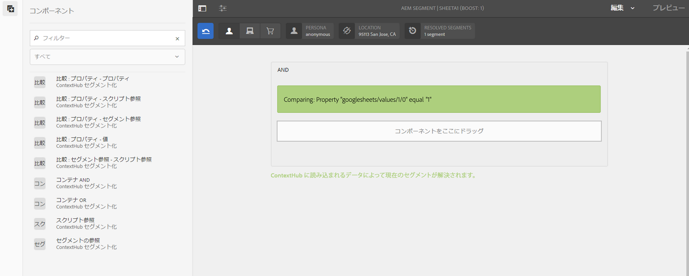
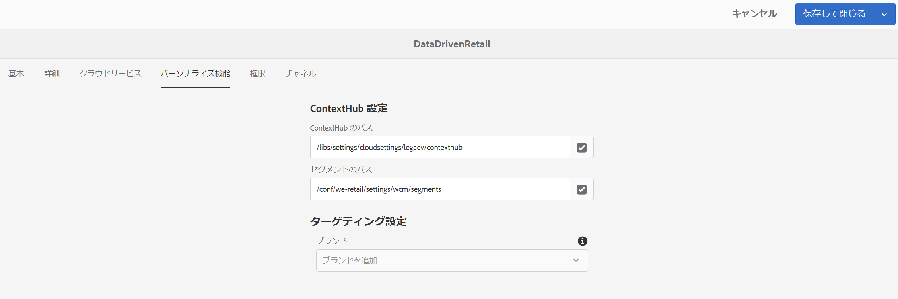
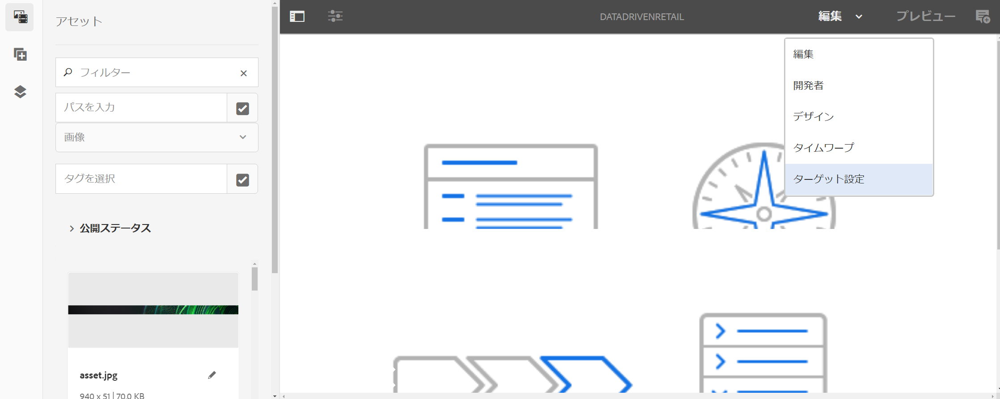

# AEM ScreensでのContextHubの設定 {#configuring-contexthub-in-aem-screens}

ここでは、データストアを使用したデータ主導型アセットの変更の作成と管理について説明します。

## キーワード {#key-terms}

AEM Screensプロジェクトで在庫主導型チャネルを作成し管理する詳細を確認する前に、様々なシナリオに関連する重要な用語をいくつか知る必要があります。

**ブランド** ：高レベルのプロジェクトの説明を指します。

**Areaは** 、Digital Ad SignageなどのAEM Screensプロジェクト名を指します。

**アクティビティ** ：在庫主導、天候主導、部門可用性主導などのルールカテゴリを定義します。

**オーディエンス** ：ルールを定義します。

**「セグメント** 」は、温度が華氏50度を下回る場合など、特定のルールで再生するアセットのバージョンを指し、画面にはホットコーヒーの画像が表示されます。それ以外の場合は冷たい飲み物が表示されます。

次の図に、ContextHub設定がアクティビティ、オーディエンス、チャネルとどのように一致するかを視覚的に示します。



## 前提条件 {#preconditions}

AEM Screensプロジェクト用にContext Hub Configurations用のデータストアを設定する前に、（デモ用に）Googleシートを設定する必要があります。

>[!CAUTION]
>
>次の例では、値が取得されるサンプルデータベースシステムとしてGoogleシートが使用されており、この値は教育目的でのみ使用されます。 アドビでは、実稼働環境でのGoogleシートの使用は推奨しません。
>
>詳しくは、Googleドキュメントの [Get API keyを参照](https://developers.google.com/maps/documentation/javascript/get-api-key) してください。

## 手順1:データストアの設定 {#step-setting-up-a-data-store}

次の手順に従って、ContextHub設定を使用し、AEM Screensチャネルへのパスをセグメント化するデータストアを設定します。

1. **ContextHubへの移動**

   AEMインスタンスに移動し、左側のサイドバーにあるツールアイコンをクリックします。 下の図 **に示すように** 、Sites **—&gt;** ContextHubをクリックします。

   

1. **新しいContextHubストア設定の作成**

   1. グローバル/ **デフォ** ルト **/** ContextHub設定に移 **動します**。

   1. **作成/設定コンテナをクリックし **、タイトルをContextHubDemo*** *と入力します。

   1. **** ContextHubDemo **/****** ContentHub Store Configurationに移動します。をクリックして、 **設定ウィザード**。

   1. Titleを **Google Sheets** , **Name**&#x200B;として入力します **。** Google Sheets **********, Nameとして入力します。**

   1. 「**次へ**」をクリックします。
   1. 特定のjson設定を入力します**。**例えば、デモ用に次のJSONを使用できます。
   1. 「**保存**」をクリックします。

   ```
   {
     "service": {
       "host": "sheets.googleapis.com",
       "port": 80,
       "path": "/v4/spreadsheets/<your sheet it>/values/Sheet1",
       "jsonp": false,
       "secure": true,
       "params": {
         "key": "<your API key>"
       }
     },
     "pollInterval": 3000
   }
   ```

   >[!NOTE]
   >
   >上記のサンプルコードで **は** 、pollIntervalは値が更新される頻度をミリ秒単位で定義します。
   >
   >
   >Googleシートの設定時に取 *得した&lt;シートID&gt;**と&lt;APIキー&gt;*（Googleシートの設定時に取得したコード）に置き換えます。

   >[!CAUTION]
   Googleシートを作成して既存のフォルダーの外部（例えば、独自のプロジェクトフォルダー内）に設定を保存した場合、ターゲット設定は初期状態では機能しません。
   Googleシートストアの設定をグローバルレガシーフォルダーの外に設定する場合は、 **Store Nameを** Segmentation **and** Store Typeに **aem.segmentationPoliteとして設定する必要があり******&#x200B;ます。 さらに、上記の定義に従ってjsonを定義するプロセスをスキップする必要があります。

1. **アクティビティでのブランドの作成**

   1. AEMインスタンスからパーソナライゼーション **/アクティビティに移****動します**

   1. Click **Create** &gt; **Create Brand**

   1. Select **Brand** from the **Create Page** wizard and click **Next**

   1. Enter the **Title** as **ContextHubDemo** and click **Create**. これで、以下に示すようにブランドが作成されました。
   


   >[!CAUTION]
   既知の問題：
   領域を追加するには、URLからマスターを削除します。例えば、
   `https://localhost:4502/libs/cq/personalization/touch-ui/content/v2/activities.html/content/campaigns/contexthubdemo/master`

1. **ブランドのエリアの作成**

   次の手順に従って、ブランドのエリアを作成します。

   1. 「作成」 **をクリックし** 、「領域を **作成」をクリックします**

   1. Select **Area** from the **Create Page** wizard and click Next

   1. Enter the **Title** as **GoogleSheets** and click **Create**.
アクティビティに領域が作成されます。

## 手順2:オーディエンスセグメントの設定 {#step-setting-up-audience-segmentation}

データストアを設定し、ブランドを定義したら、次の手順に従ってオーディエンスセグメントを設定します。

1. **オーディエンスでのセグメントの作成**

   1. AEMインスタンスから **Personalization** / **Audiences** / **We.Retailに移動します**。

   1. 作成/コンテ **キストハブセ****グメントを作成をクリックします。** 「新規ContextHub **セグメント** 」ダイアログが開きます。

   1. Enter the **Title** as **SheetA1 1** and click **Create**. 同様に、「 **SheetA2 2」という名前の別のセグメントを作成します**。

1. **セグメントの編集**

   1. セグメント **Sheets A1 1** （手順5で作成）を選択し、アクションバーの「編集 **** 」をクリックします。

   1. 比較をドラッグ&amp;ドロ **ップ：プロパティ** — エディターの値コンポーネント。
   1. レンチアイコンをクリックして、「 **Comparing a property with value** 」ダイアログボックスを開きます。
   1. 「プ **ロパティ名」のドロップダウンから「googlesheets/value/1/0** 」を選 **択します**。

   1. ドロップダウ **ンメニュー** から「演算子 **** 」を「等しい」に選択します。

   1. 「値」に **1を入力****します**。
   >[!NOTE]
   AEMは、セグメントを緑色で表示することで、Googleシートのデータを検証します。

   

   同様に、プロパティ値を **Sheets A1 2に編集します**。

   1. 比較をドラッグ&amp;ドロ **ップ：プロパティ** — エディターの値コンポーネント。
   1. レンチアイコンをクリックして、「 **Comparing a property with value** 」ダイアログボックスを開きます。
   1. 「プ **ロパティ名」のドロップダウンから「googlesheets/value/1/0** 」を選 **択します**。

   1. ドロップダウ **ンメニュー** から「演算子 **** 」を「等しい」に選択します。

   1. 「値」に **2を入力し** ます ****。
   >[!NOTE]
   前述の手順で適用したルールは、以下の使用例を実装するためのセグメントの設定方法の例に過ぎません。

## 手順3:チャネルでのターゲット設定の有効化 {#step-enabling-targeting-in-channels}

チャネルでターゲット設定を有効にするには、次の手順に従います。

1. AEM Screensチャネル**のいずれかに移動します。 **次の手順は、AEM Screensチャネルで作成されたDataDrivenRetailを使用して **ターゲティングを** 有効にする方法を示しています。

1. チャネルDataDrivenRetailを選択し **、アクションバ** ーで **** 「プロパティ」をクリックします。

   

1. 「パーソナライ **ゼーション** 」タブを選択して、ContextHub設定を設定します。

   1. ContextHub As **** libs **&gt; settings** &gt; settings **settings** &gt; settings **&gt;************** settingsDefault Context Context Click Hub Click Hub Select selectHub Select Select Hubsを選択します。

   1. Segments Path as **conf** / **Retail** / **settings/** we **wcm Segments/Select Segmentsを選択し、Segments Path as** conf **/Retail Retail Segments/we********** wcmSelect Segmentsを選択します。

   1. 「**保存して閉じる**」をクリックします。
   >[!NOTE]
   コンテキストハブの設定とセグメントを最初に保存したContextHubとセグメントパスを使用します。

   

1. DataDrivenAssets/ **ChannelsからDataDrivenRetailに移動して選択し、** アクションバー **から** 「編集 **」****** をクリックします。

   >[!NOTE]
   すべてを正しく設定した場合は、次の図に示すように、エディターのドロップダウンに **** 「ターゲット設定」オプションが表示されます。

   

   >[!NOTE]
   チャネルにContextHub設定を設定したら、以下のすべての使用例に従う場合は、1 ～ 4の前述の手順に従ってください。他の3つのシーケンスチャネルも同様に設定します。

## 詳細情報：使用例 {#learn-more-example-use-cases}

AEM ScreensプロジェクトにContextHubを設定した後、様々な使用例に従って、データがトリガーしたアセットが様々な業界でどのように重要な役割を果たすかを理解できます。

1. **[小売在庫ターゲットの有効化](retail-inventory-activation.md)**
1. **[旅行センターの温度有効化](local-temperature-activation.md)**
1. **[接客予約有効化](hospitality-reservation-activation.md)**
