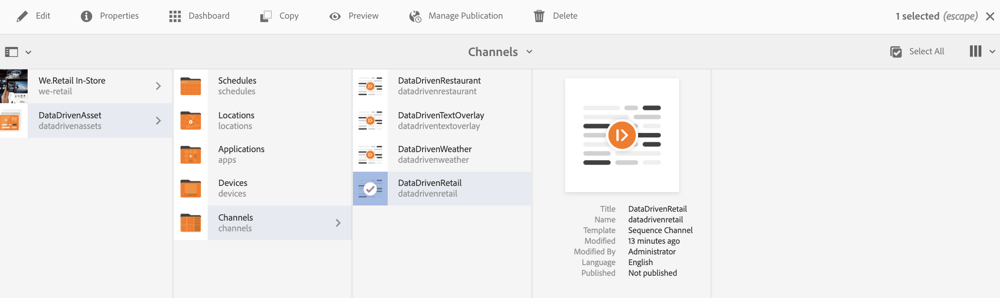

# AEM Screens プロジェクトでの ContextHub の設定 {#configuring-contexthub-in-aem-screens}

ここでは、データストアを使用したデータ主導型アセット変更の作成と管理について重点的に説明します。

## キーワード {#key-terms}

AEM Screens プロジェクトの在庫主導型チャネルを作成および管理する方法の詳細に立ち入る前に、様々なシナリオに関連する重要なキーワードをいくつか理解しておく必要があります。

**ブランド**：プロジェクトの概要を指します。

**領域**：「Digital Ad Signage」などの AEM Screens プロジェクト名を指します。

**アクティビティ**：在庫主導型、天候主導型、部門稼働状況主導型などのルールカテゴリを定義します。

**オーディエンス**：ルールを定義します。

**セグメント**：温度が華氏 50 度を下回った場合はスクリーンにホットコーヒーの画像を表示し、それ以外の場合は冷たい飲み物の画像を表示するといった一定のルールで再生するアセットのバージョンを指します。

以下の図は、ContextHub 設定がアクティビティ、オーディエンス、チャネルと一致する様子を視覚的に示しています。


## 前提条件 {#preconditions}

AEM Screens プロジェクトに Context Hub を設定するためのデータストアのセットアップを開始する前に、（デモ用に）Google シートをセットアップする必要があります。

>[!CAUTION]
>
>次の例では、値の取得先となるサンプルデータベースシステムとして Google シートを使用していますが、この Google シートはあくまで教育用のものです。アドビでは、実稼働環境への Google シートの使用はお勧めしません。
>
>詳しくは、Google ドキュメントの [Get an API Key](https://developers.google.com/maps/documentation/javascript/get-api-key) を参照してください。

## 手順 1：データストアのセットアップ {#step-setting-up-a-data-store}

以下の手順に従って、ContextHub 設定と AEM Screens チャネルへのセグメントパスを使用するためのデータストアをセットアップします。

1. **ContextHub に移動する**

   AEM インスタンスに移動し、左側のサイドバーにあるツールアイコンをクリックします。**サイト**／**ContextHub** をクリックします（下図を参照）。

   

1. **新しい ContextHub ストア設定の作成**

   1. **グローバル**／**デフォルト**／**ContextHub 設定**&#x200B;に移動します。

   1. **作成／設定コンテナ**&#x200B;をクリックし、タイトルに「ContextHubDemo」と入力します。

   1. **ContextHubDemo**／**ContextHub ストア設定...** に&#x200B;**移動**&#x200B;して、**設定ウィザード**&#x200B;を開きます。

   1. 「**タイトル**」に「**Google Sheets**」、「**ストア名**」に「**googlesheets**」、「**ストアの種類**」に「**contexthub.generic-jsonp**」と、それぞれ入力します。

   1. 「**次へ**」をクリックします。
   1. 固有の JSON 設定を入力します。例えば、デモ目的では次の設定を使用できます。
   1. 「**保存**」をクリックします。

   ```
   {
     "service": {
       "host": "sheets.googleapis.com",
       "port": 80,
       "path": "/v4/spreadsheets/<your sheet it>/values/Sheet1",
       "jsonp": false,
       "secure": true,
       "params": {
         "key": "<your API key>"
       }
     },
     "pollInterval": 3000
   }
   ```

   >[!NOTE]
   >
   >上記のサンプルコードで、**pollInterval** は、値が更新される頻度をミリ秒単位で定義します。
   >
   >
   >上記の JSON コードの該当するプレースホルダーを、Google シートのセットアップ時に取得した実際の *&lt;シート ID&gt;* と *&lt;API キー&gt;* に置き換えます。

   >[!CAUTION]
   Google シートのストア設定を従来のフォルダー以外（例えば、独自のプロジェクトフォルダー内など）で作成した場合、ターゲティングは初期状態では機能しません。
   Google シートのストア設定を従来のグローバルフォルダー以外で指定する場合は、「**ストア名**」を「**segmentation**」に、「**ストアの種類**」を「**aem.segmentation**」に、それぞれ設定する必要があります。さらに、上記の JSON 設定を定義する手順をスキップする必要があります。

1. **アクティビティにブランドを作成する**

   1. AEM インスタンスで、**パーソナライゼーション**／**アクティビティ**&#x200B;に移動します。

   1. **作成**／**ブランドを作成**&#x200B;をクリックします。

   1. **ページを作成**&#x200B;ウィザードから「**ブランド**」を選択し、「**次へ**」をクリックします。

   1. 「**タイトル**」に「**ContextHubDemo**」と入力し、「**作成**」をクリックします。これで、以下のようにブランドが作成されました。
   


   >[!CAUTION]
   既知の問題：
   領域を追加するには、URL（例えば下記）から「master」を削除します。
   `https://localhost:4502/libs/cq/personalization/touch-ui/content/v2/activities.html/content/campaigns/contexthubdemo/master`

1. **ブランドに領域を作成する**

   以下の手順に従って、ブランドに領域を作成します。

   1. 「**作成**」、「**領域を作成**」を順にクリックします。

   1. **ページを作成**&#x200B;ウィザードから「**領域**」を選択し、「次へ」をクリックします。

   1. 「**タイトル**」に「**GoogleSheets**」と入力し、「**作成**」をクリックします。これで、アクティビティに領域が作成されます。

## 手順 2：オーディエンスのセグメント化のセットアップ {#step-setting-up-audience-segmentation}

データストアをセットアップし、ブランドを定義したら、以下の手順に従ってオーディエンスセグメントをセットアップします。

1. **オーディエンスにセグメントを作成する**

   1. AEM インスタンスで、**パーソナライゼーション**／**オーディエンス**／**We.Retail** に移動します。

   1. **作成**／**Context Hub セグメントを作成**&#x200B;をクリックします。**新しい ContextHub セグメント**&#x200B;ダイアログボックスが開きます。

   1. 「**タイトル**」に「**SheetA1 1**」と入力し、「**作成**」をクリックします。同様に、「**SheetA2 2**」というタイトルの別のセグメントを作成します。

1. **セグメントを編集する**

   1. （上記手順で作成した）セグメント「**SheetA1 1**」を選択し、アクションバーの「**編集**」をクリックします。

   1. **比較 : プロパティ - 値**&#x200B;コンポーネントをエディターにドラッグ＆ドロップします。
   1. レンチアイコンをクリックして、**プロパティと値の比較**&#x200B;ダイアログボックスを開きます。
   1. 「**プロパティ名**」のドロップダウンから「**googlesheets/value/1/0**」を選択します。

   1. 「**演算子**」のドロップダウンメニューから「**次と等しい**」を選択します。

   1. 「**値**」に「**1**」を入力します。
   >[!NOTE]
   AEM で Google シートのデータが検証されると、セグメントが緑色で表示されます。

   

   同様に、「**SheetA2 2**」セグメントのプロパティ値を編集します。

   1. **比較 : プロパティ - 値**&#x200B;コンポーネントをエディターにドラッグ＆ドロップします。
   1. レンチアイコンをクリックして、**プロパティと値の比較**&#x200B;ダイアログボックスを開きます。
   1. 「**プロパティ名**」のドロップダウンから「**googlesheets/value/1/0**」を選択します。

   1. 「**演算子**」のドロップダウンメニューから「**次と等しい**」を選択します。

   1. 「**値**」に「**2**」を入力します。
   >[!NOTE]
   上記の手順で適用したルールは、以下の使用例を実装するためのセグメントのセットアップ方法に関する例にすぎません。

## 手順 3：チャネルでのターゲティングの有効化 {#step-enabling-targeting-in-channels}

以下の手順に従って、チャネルでターゲティングを有効にします。

1. AEM Screens チャネルのいずれかに移動します。以下の手順は、AEM Screens チャネルに作成した **DataDrivenRetail** を使用してターゲティングを有効にする方法を示しています。

1. **DataDrivenRetail** チャネルを選択し、アクションバーの「**プロパティ**」をクリックします。

   

1. 「**パーソナライゼーション**」タブを選択して、ContextHub 設定をセットアップします。

   1. 「**ContextHub のパス**」として **libs**/**settings**/**cloudsettings**/**legacy**/**contexthub** を選択し、「**選択**」をクリックします。

   1. 「**セグメントのパス**」として **conf**/**we-retail**/**settings**/**wcm**/**segments** を選択し、「**選択**」をクリックします。

   1. 「**保存して閉じる**」をクリックします。
   >[!NOTE]
   ContextHub 設定とセグメントをそれぞれ最初に保存した、Context Hub とセグメントのパスを使用します。

   

1. **DataDrivenAssets**／**チャネル**&#x200B;に移動して「**DataDrivenRetail**」を選択し、アクションバーの「**編集**」をクリックします。

   >[!NOTE]
   すべてを正しくセットアップしたら、下図に示すように、エディターのドロップダウンに「**ターゲティング**」オプションが表示されます。

   

   >[!NOTE]
   チャネルの ContextHub 設定を完了したら、以下のすべての使用例に従う場合は、他の 3 つのシーケンスチャネルについても必ず上記の手順 1～4 に従ってください。

## 詳細情報：使用例 {#learn-more-example-use-cases}

AEM Screens プロジェクトに ContextHub を設定したら、以下の様々な使用例を通じて、データでトリガーされるアセットが様々な業界でいかに重要な役割を果たしているかを理解できます。

1. **[小売店向けの在庫に応じたアクティブ化](retail-inventory-activation.md)**
1. **[旅行センター向けの気温に応じたアクティブ化](local-temperature-activation.md)**
1. **[接客業向けの予約状況に応じたアクティブ化](hospitality-reservation-activation.md)**
