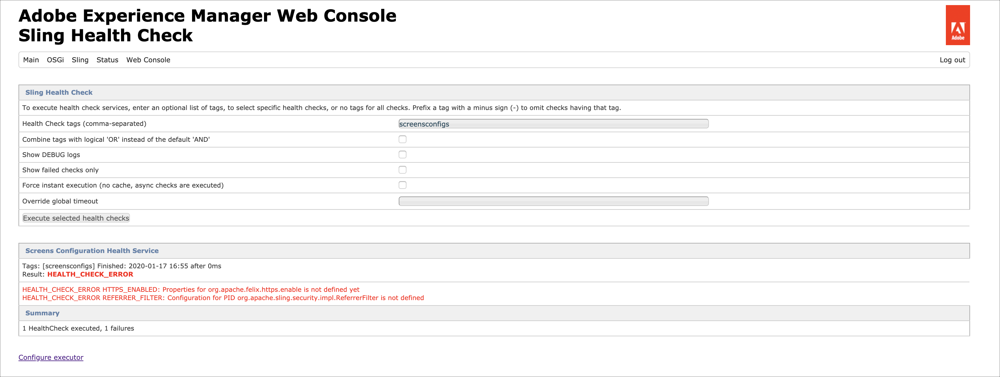

# AEM Screens の設定とデプロイ {#configuring-and-deploying-aem-screens}

このページでは、デバイスに Screens Player をインストールして設定する方法について説明します。

## サーバーの設定 {#server-configuration}

>[!NOTE]
>
>**重要**：
>
>AEM Screens Player は、クロスサイトリクエストフォージェリ（CSRF）トークンを利用していません。したがって、AEM Screens で使用できるように AEM サーバーを設定するには、空のリファラーを許可して、リファラーフィルターをスキップします。

## ヘルスチェックフレームワーク {#health-check-framework}

ヘルスチェックフレームワークを使用すると、AEM Screensプロジェクトを実行する前に、必要な設定が2つあるかどうかをユーザーが確認できます。

次の2つの設定チェックを確認して、AEM Screensプロジェクトを実行できます。つまり、次の2つのフィルターの状態を確認できます。

1. **空のリファラーを許可**
2. **https**

次の手順に従って、AEM Screensでこれら2つの重要な設定が有効になっているかどうかを確認します。

1. 「 [Adobe Experience Manager Web ConsoleSling Health Check」に移動します](http://localhost:4502/system/console/healthcheck?tags=screensconfigs&overrideGlobalTimeout=)。

   

2. 上記の2つのプ **ロパティの検証を実行するには** 、[選択したヘルスチェックの実行]をクリックします。

   両方のフィルターが有効な場合、 **Screens Configuration Health Serviceは** 「 **Result** 」を「 **OK** 」と表示し、両方の設定が有効になります。

   

   一方または両方のフィルタが無効になっている場合は、下の図に示すように、ユーザーに対してアラートが表示されます。

   両方のフィルターが無効な場合、次のアラートが表示されます。
   

>[!NOTE]
>
>* Apache Slingリファラーフィルタ **ーを有効にするには**、「空のリファラー要求 [を許可する」を参照してください](/help/user-guide/configuring-screens-introduction.md#allow-empty-referrer-requests)。
>* HTTPサービスを有効にす **るには** 、 [Apache Felix JettyベースのHTTPサービスを参照してください](/help/user-guide/configuring-screens-introduction.md#allow-apache-felix-service)。

### 前提条件 {#prerequisites}

以下の主要なポイントは、AEM ScreensでAEMサーバーを使用する準備が整うように設定する場合に役立ちます。

#### 空のリファラー要求の許可 {#allow-empty-referrer-requests}

1. AEM インスタンスでハンマーアイコン／**操作**／**Web コンソール**&#x200B;をクリックして、「**Adobe Experience Manager Web コンソール設定**」に移動します。

   

1. **Adobe Experience Manager Web コンソール設定**&#x200B;が開きます。「sling referrer」を検索します。

   「sling referrer」プロパティを検索するには、**Command + F** キー（**Mac**）または **Ctrl + F** キー（**Windows**）を押します。

   

1. 「**Allow Empty**」オプションをオンにします（下図を参照）。

   

1. 「**保存**」をクリックして、Apache Sling Referrer Filter の「Allow Empty」を有効にします。

#### Apache Felix JettyベースのHTTPサービス {#allow-apache-felix-service}

1. AEM インスタンスでハンマーアイコン／**操作**／**Web コンソール**&#x200B;をクリックして、「**Adobe Experience Manager Web コンソール設定**」に移動します。

   

1. **Adobe Experience Manager Web コンソール設定**&#x200B;が開きます。Apache Felix JettyベースのHTTPサービスを検索します。

   For searching this property, press **Command+F** for **Mac** and **Control+F** for **Windows**.

1. Check the **ENABLE HTTP** option, as shown in the figure below.

   

1. 「保存」 **をクリックし** 、 *httpサービスを有効にします* 。

#### AEM Screens のタッチ操作対応 UI の有効化 {#enable-touch-ui-for-aem-screens}

AEM Screens にはタッチ操作対応 UI が必要で、Adobe Experience Manager（AEM）のクラシック UI では AEM Screens は動作しません。

1. *&lt;yourAuthorInstance>/system/console/configMgr/com.day.cq.wcm.core.impl.AuthoringUIModeServiceImpl* に移動します。
1. 「**Default authoring UI mode**」が「**TOUCH**」に設定されていることを確認します（下図を参照）。

また、*&lt;yourAuthorInstance>*／*ツール（ハンマーアイコン）*／**操作**／**Web コンソール**&#x200B;をクリックし、**WCM Authoring UI Mode Service** を検索して、同じ設定を実行することもできます。

>[!NOTE]
>
>ユーザーの環境設定を使用して、特定のユーザーに対して常にクラシック UI を有効にすることができます。

#### NOSAMPLECONTENT 実行モードの AEM {#aem-in-nosamplecontent-runmode}

実稼動環境での AEM の実行には、**NOSAMPLECONTENT** 実行モードを使用します。次の場所に移動して、（追加の応答ヘッダーセクションにある）*X-Frame-Options=SAMEORIGIN* ヘッダーを削除します。

`https://localhost:4502/system/console/configMgr/org.apache.sling.engine.impl.SlingMainServlet`.

これは、AEM Screens Player でオンラインチャネルを再生するために必要です。

#### パスワード制限 {#password-restrictions}

***DeviceServiceImpl ***の最新の変更により、パスワード制限を削除する必要がなくなりました。

次のリンクから ***DeviceServiceImpl ***を設定して、Screens デバイスユーザーのパスワードを作成する際のパスワード制限を有効にすることができます。

`https://localhost:4502/system/console/configMgr/com.adobe.cq.screens.device.impl.DeviceService`

以下の手順に従って ***DeviceServiceImpl ***を設定します。

1. AEM インスタンスでハンマーアイコン／**操作**／**Web コンソール**&#x200B;をクリックして、「**Adobe Experience Manager Web コンソール設定**」に移動します。

1. 「Adobe Experience Manager Web コンソール設定」が開きます。「deviceservice」を検索します。このプロパティを検索するには、**Command + F** キー（**Mac**）または **Ctrl + F** キー（**Windows**）を押します。

#### Dispatcher 設定 {#dispatcher-configuration}

AEM Screens プロジェクトの Dispatcher を設定する方法については、[AEM Screens プロジェクトの Dispatcher の設定](dispatcher-configurations-aem-screens.md)を参照してください。

#### Java エンコーディング {#java-encoding}

***Java エンコーディング&#x200B;***を Unicode に設定します。例えば、*Dfile.encoding=Cp1252 *は機能しません。

>[!NOTE]
>
>**推奨事項：**
>
>実稼動環境では AEM Screens サーバーに HTTPS を使用することをお勧めします。

