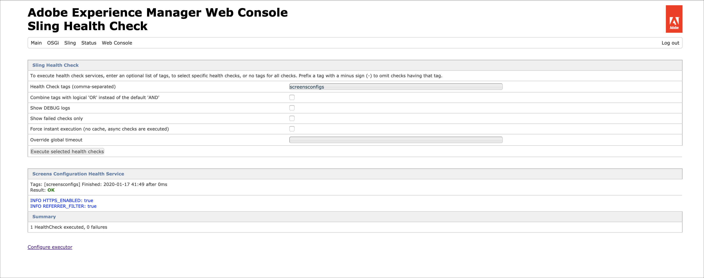

# AEM Screens の設定とデプロイ {#configuring-and-deploying-aem-screens}

このページでは、デバイスに Screens Player をインストールして設定する方法について説明します。

## サーバーの設定 {#server-configuration}

>[!IMPORTANT]
>
>AEM Screens Player は、クロスサイトリクエストフォージェリ (CSRF) トークンを使用しません。 したがって、AEMサーバーをAEM Screens用に使用できるように設定するには、空のリファラーを許可してリファラーフィルターをスキップします。

## ヘルスチェックフレームワーク {#health-check-framework}

ヘルスチェックフレームワークを使用すると、AEM Screens プロジェクトを実行する前に、必要な設定が 2 つあるかどうかを確認できます。

次の 2 つの設定を確認して、AEM Screens プロジェクトを実行できます。つまり、次の 2 つのフィルターの状態を確認できます。

1. **空のリファラーの許可**
2. **https**

次の手順に従って、AEM Screens でこれら 2 つの重要な設定が有効になっているかどうかを確認します。

1. [Adobe Experience Manager Web コンソール Sling Health Check ](http://localhost:4502/system/console/healthcheck?tags=screensconfigs&amp;overrideGlobalTimeout=)に移動します。

   

2. 選択 **選択したヘルスチェックを実行** 上記の 2 つのプロパティに対して検証を実行できます。

   両方のフィルターが有効な場合、**Screens Configuration Health Service** では&#x200B;**結果**&#x200B;が&#x200B;**OK**&#x200B;と表示され、両方の設定が有効となっています。

   

   一方または両方のフィルターが無効になっている場合は、下の図に示すように、ユーザーに対してアラートが表示されます。

   両方のフィルターが無効な場合、次のアラートが表示されます。
   

>[!NOTE]
>
>* **Apache Sling Referrer Filter** を有効にするには、[空のリファラー要求の許可](/help/user-guide/configuring-screens-introduction.md#allow-empty-referrer-requests)を参照してください。
>* **HTTP** サービスを有効にするには、[Apache Felix Jetty Based HTTP Service ](/help/user-guide/configuring-screens-introduction.md#allow-apache-felix-service)を参照してください。

### 前提条件 {#prerequisites}

AEM Screens で使用できるように AEM サーバーを設定する際に役立つ重要なポイントを次に示します。

#### 空のリファラー要求の許可 {#allow-empty-referrer-requests}

1. に移動します。 **Adobe Experience Manager Web コンソールの設定** AEMインスタンスを使用し、ハンマーアイコンを使用します。 **運用** > **Web コンソール**.

   

1. **Adobe Experience Manager Web コンソール設定**&#x200B;が開きます。「sling referrer」を検索します。

   「sling referrer」プロパティを検索するには、**Command + F** キー（**Mac**）または **Ctrl + F** キー（**Windows**）を押します。

1. 「**Allow Empty**」オプションをオンにします（下図を参照）。

   

1. 「**保存**」をクリックして、Apache Sling Referrer Filter の「Allow Empty」を有効にします。

#### Apache Felix Jetty Based HTTP Service {#allow-apache-felix-service}

1. に移動します。 **Adobe Experience Manager Web コンソールの設定** AEMインスタンスを使用し、ハンマーアイコンを使用します。 **運用** > **Web コンソール**.

   

1. **Adobe Experience Manager Web コンソール設定**&#x200B;が開きます。「Apache Felix Jetty Based HTTP Service」を検索します。

   このプロパティを検索するには、**Command+F** キー（**Mac**）または **Ctrl+F** キー（**Windows**）を押します。

1. 「**ENABLE HTTP**」オプションをオンにします（下図を参照）。

   

1. 「**Save**」をクリックし、*HTTP* サービスを有効にします。

#### AEM Screens のタッチ操作対応 UI の有効化 {#enable-touch-ui-for-aem-screens}

AEM Screensは、タッチ UI が必要で、Adobe Experience Manager(AEM) のクラシック UI では動作しません。

1. `*<yourAuthorInstance>/system/console/configMgr/com.day.cq.wcm.core.impl.AuthoringUIModeServiceImpl*` に移動します。
1. 「**Default authoring UI mode**」が「**TOUCH**」に設定されていることを確認します（下図を参照）。

また、yourAuthorInstance を使用して同じ設定を実行することもできます *>* ツール（ハンマーアイコン） > **運用** > **Web コンソール** およびを検索します。 **WCM オーサリング UI モードサービス**.

>[!NOTE]
>
>ユーザーの環境設定を使用して、特定のユーザーに対して常にクラシック UI を有効にすることができます。

#### AEM （NOSAMPLECONTENT 実行モード） {#aem-in-nosamplecontent-runmode}

実稼動環境でAEMを実行する場合は、 **NOSAMPLECONTENT** 実行モード。 次の場所に移動して、（追加の応答ヘッダーセクションにある）*X-Frame-Options=SAMEORIGIN* ヘッダーを削除します。

`https://localhost:4502/system/console/configMgr/org.apache.sling.engine.impl.SlingMainServlet`。

これは、AEM Screens Player でオンラインチャネルを再生するために必要です。

#### パスワード制限 {#password-restrictions}

***DeviceServiceImpl*** の最新の変更により、パスワード制限を削除する必要がなくなりました。

次の項目を設定できます。 ***DeviceServiceImpl*** 次のリンクから、画面デバイスユーザーのパスワードを作成する際のパスワード制限を有効にします。

`https://localhost:4502/system/console/configMgr/com.adobe.cq.screens.device.impl.DeviceService`

以下の手順に従って ***DeviceServiceImpl*** を設定します。

1. に移動します。 **Adobe Experience Manager Web コンソールの設定** AEMインスタンスのハンマーアイコンで、 > **運用** > **Web コンソール**.

1. **Adobe Experience Manager Web コンソール設定**&#x200B;が開きます。`*deviceservice*` を検索します。プロパティを検索するには、 **Command + F** (macOSと **Ctrl + F** (Microsoft® Windows の場合 )

#### Dispatcher 設定 {#dispatcher-configuration}

AEM Screensプロジェクト用の Dispatcher の設定方法については、 [AEM Screensプロジェクト用の Dispatcher の設定](dispatcher-configurations-aem-screens.md).

#### Java™エンコーディング {#java-encoding}

を設定します。 ***Java™エンコーディング*** を Unicode に変更します。 例： `*Dfile.encoding=Cp1252*` は機能しません。

>[!NOTE]
>
>実稼動環境ではAEM Screens Server に HTTPS を使用します。
