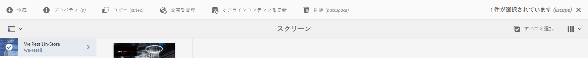

# サービスとしてのコンテンツの更新 {#content-update-as-a-service}

この節では、サービスとしてのコンテンツの更新に関する次のトピックについて説明します。

* **概要**
* **オフライン一括更新の使用**

>[!CAUTION]
>
>このAEM Screens機能は、AEM 6.3 Feature Pack 3またはAEM 6.4 Screens Feature Pack 1をインストールしている場合にのみ使用できます。
>
>この機能パックにアクセスするには、アドビサポートに連絡してアクセス権をリクエストする必要があります。アクセス権が付与されると、パッケージ共有から機能パックをダウンロードできるようになります。

## 概要 {#overview}

オフラインの一括更新を使用すると、すべてのチャネルを一括して更新できます。 特定のチャネルに移動してコンテンツを更新する手間を省きます。 その代わりに、1つの特定のプロジェクトのチャネル内のすべてのコンテンツを一度に更新できます。

また、ネットワークトラフィックが少ない時間にこのアクティビティをスケジュールすることもできます。

>[!NOTE]
>
>オフラインの一括更新機能は、変更されたチャネルのみを更新するように最適化されています。

## オフライン一括更新の使用 {#using-bulk-offline-update}

ユーザーインターフェイス(UI)からオフライン一括更新を手動で使用したり、OSGiサービスから一括更新をスケジュールしたりできます。

### AEM Screensユーザーインターフェイスの使用 {#using-aem-screens-user-interface}

次の手順に従って、AEM Screensプロジェクトでオフラインの一括更新を使用します。

1. AEM Screensプロジェクトに移動します。
1. プロジェクトを選択し、アクションバー **の「オフラインコンテンツを更新** 」をクリックして、チャネルコンテンツを手動で更新します。

   

### Adobe Experience Manager Web Console Configuration {#adobe-experience-manager-web-console-configuration}

次の手順に従って、AEM Screensプロジェクトでオフラインの一括更新を使用します。

1. Adobe Experience Manager Web Console Configuration.
1. オフライン更新サービスの一括検索

   

1. 次のプロパティを追加します。

   **プロジェクトパス** :AEM Screensプロジェクトのパスを指定します。 通常はパスです `/content/screens/<Name of your project>`。

   *例えば*、 `/content/screens/we-retail`。 このパスは、AEM Screensの下の任意のプロジェクトを選択することで、URL内で見つけることができます（アイコンをクリックしないでください）。

   >[!NOTE]
   >
   >チャネルを基準としたプロジェクトパスを指定します。

   **スケジュールの頻度** （例：午後5時、または17時）を指定します。この時刻にこのサービスでオフラインコンテンツを更新する必要があります。

1. 「保 **存** 」をクリックして設定を保存すると、指定した時間にコンテンツが更新されます。

