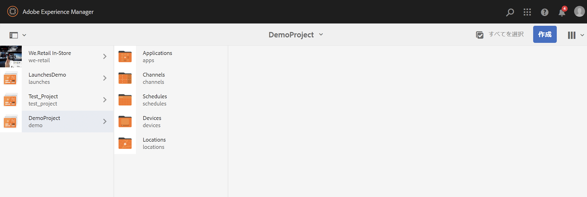

# プロジェクトの作成と管理 {#creating-and-managing-projects}

AEM Screens には、Adobe Experience Manager のリンク（左上）を選択し、「スクリーン」を選択するとアクセスできます。

または、次の場所に直接移動できます。 `http://localhost:4502/screens.html/content/screens`

異なるプロジェクトは、ブランド、デプロイメント、お客様なども異なる場合があります。

>[!NOTE]
>
>**ナビゲーションのヒント：**
>
>カーソルキーを使用しても、AEM 内の様々なフォルダーを移動できます。さらに、特定のエンティティを選択し、スペースバーを押すと、その特定のフォルダーのプロパティを編集または表示できます。

## 新しいスクリーンプロジェクトの作成 {#creating-a-new-screens-project}

下の手順に従って、新しいスクリーンプロジェクトを作成します。

1. AEM ダッシュボードから「**スクリーン**」を選択します。
1. Click **Create **--&gt;** Create Project **and **Create Screens Project** wizard will open.

1. Select the **Screens** template and click **Next**.

1. Enter the properties (**Title** and **Name**) as required and click **Create**.

>[!NOTE]
>
>By default, the initial structure will contain the **Schedules**, **Locations**, **Applications**, **Channels**, and **Devices** master pages, but this can be manually adjusted if needed. 使用可能なオプションがプロジェクトに関連しない場合は、オプションを削除できます。

プロジェクトが作成され、スクリーンプロジェクトコンソールに戻ります。これでプロジェクトを選択できます。

下の図に示すように、プロジェクトには 4 種類のフォルダーがあります。

* **スケジュール**
* **ロケーション**
* **アプリ管理**
* **チャネル**
* **デバイス**

### プロパティの表示 {#viewing-properties}

Once you create the Screens project, click **Properties** on the action bar to edit properties of an exiting AEM Screens project.

The following options allow you to edit/change properties of your *DemoProject*.

### カスタムフォルダーの作成 {#creating-a-custom-folder}

また、Schedules **、** Locations **、Applications**、Channels、Devices **Master、Devices********** Devicesの各マスターページに、独自のカスタムフォルダを作成することもできます。

カスタムフォルダーを作成するには：

1. Select your project and click on **Create** next to plus icon in the action bar.
1. **作成**&#x200B;ウィザードが開いて、適切なオプションを選択します。
1. 「**次へ**」をクリックします。
1. プロパティを入力して、「**作成**」をクリックします。

次の手順は、DemoProjectの **Applications** マスターページにapplicationsフォルダーを作成する方法を示 *します*。

### 次の手順 {#the-next-steps}

Once you have created your own project, see [Channel Management](managing-channels.md) to create and manage content in your channel.

また、独自のスケジュール、アプリケーション、場所、またはデバイスを作成できます。
