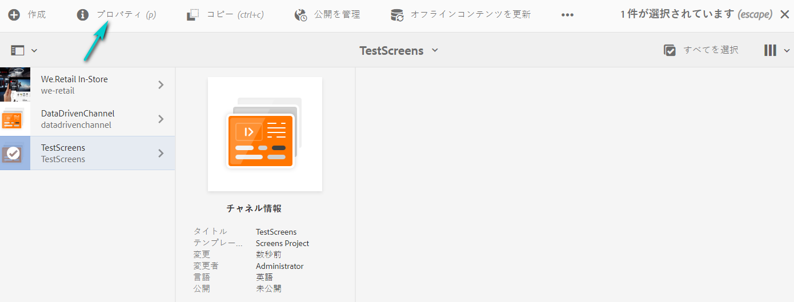
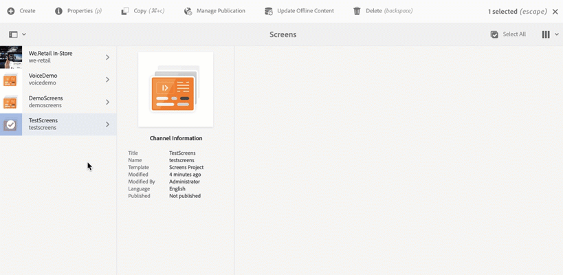

# プロジェクトの作成と管理 {#creating-and-managing-projects}

Adobe Experience Manager のリンク（左上）を選択し、「Screens」を選択すると、AEM Screens にアクセスできます。

Alternatively, you can navigate directly to: `http://localhost:4502/screens.html/content/screens`

>[!NOTE]
>**ナビゲーションのヒント：**
>カーソルキーを使用しても、AEM 内の様々なフォルダーを移動できます。また、特定のエンティティを選択したら、スペースバーを押して、その特定のフォルダのプロパティを編集したり、表示したりします。

## 新しい Screens プロジェクトの作成 {#creating-a-new-screens-project}

以下の手順に従って、新しい Screens プロジェクトを作成します。

1. AEMインスタンスから「 **画面** 」を選択します。

1. Click **Create Screens Project**.

1. Enter the title as **TestScreens** and click **Save**.

プロジェクトが作成され、Screens プロジェクトコンソールに戻ります。これでプロジェクトを選択できます。

下の図に示すように、プロジェクトには 4 種類のフォルダーがあります。

* **スケジュール**
* **ロケーション**
* **アプリ管理**
* **デバイス**
* **チャネル**

>[!NOTE]
>
>初期構造には、デフォルトで、**スケジュール**、**ロケーション**、**アプリケーション**、**チャネル**、**デバイス**&#x200B;の各マスターページが含まれていますが、必要に応じて手動で調整できます。使用可能なオプションがプロジェクトに関係ない場合は、そのオプションを削除できます。

## プロパティの表示 {#viewing-properties}

画面プロジェクトを作成したら、プロジェクトを選択し、アクションバーの「 **プロパティ** 」をクリックして、プロジェクトのプロパティを編集します。

The following options allow you to edit/change properties of your **TestScreens**.

## カスタムフォルダーの作成 {#creating-a-custom-folder}

プロジェクトで使用可能な&#x200B;**スケジュール**、**ロケーション**、**アプリケーション**、**チャネル**、**デバイス**&#x200B;の各マスターページの下に独自のカスタムフォルダーを作成することもできます。

カスタムフォルダーを作成するには：

1. プロジェクトを選択し、アクションバーのプラスアイコンの横にある「**作成**」をクリックします。
1. **作成**&#x200B;ウィザードが開いて、適切なオプションを選択します。
1. 「**次へ**」をクリックします。
1. プロパティを入力して、「**作成**」をクリックします。

The following steps show the creation of an applications folder to your **Applications** master page in **TestScreens**.

### 次の手順 {#the-next-steps}

独自のプロジェクトを作成したら、[チャネル管理](managing-channels.md)を参照して、チャネルのコンテンツを作成および管理します。

