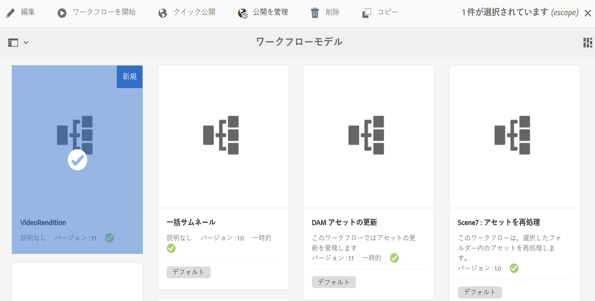
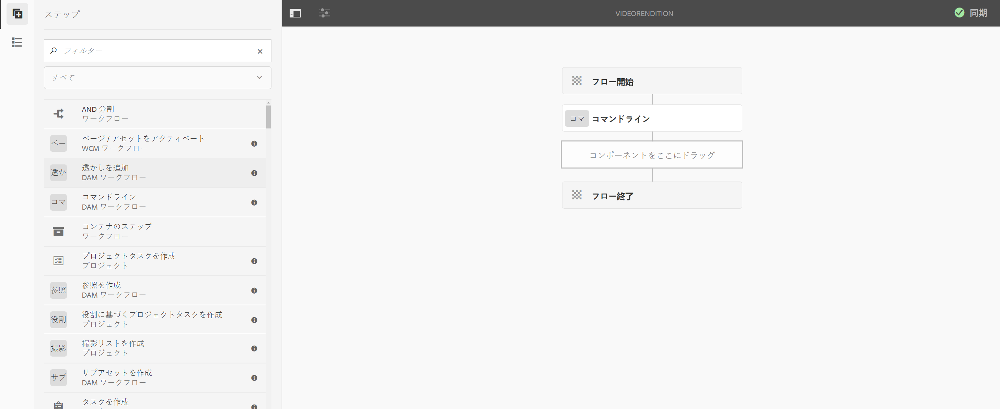
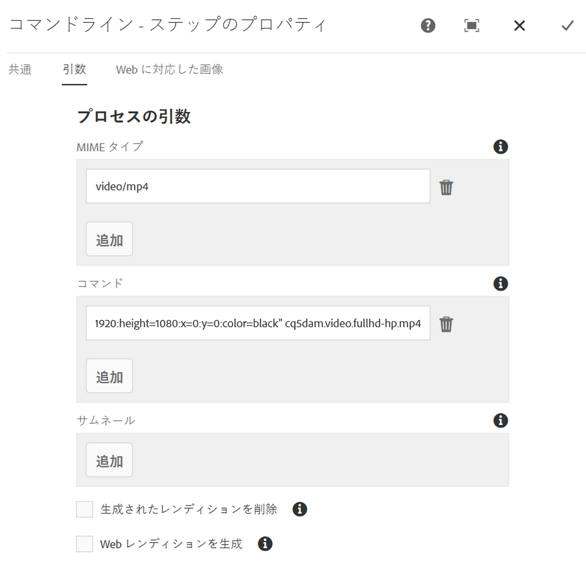
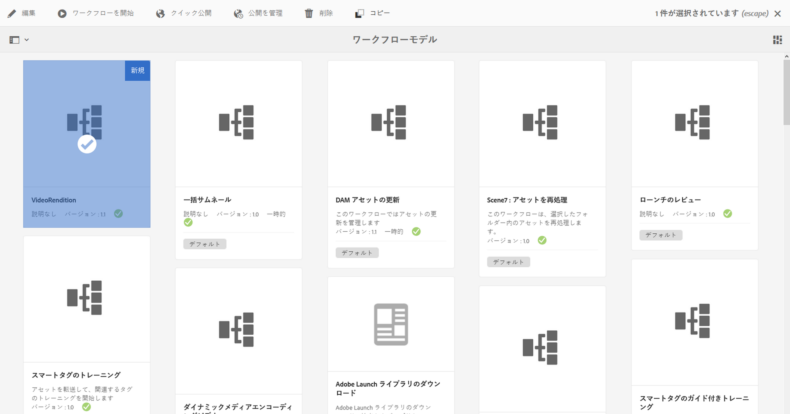
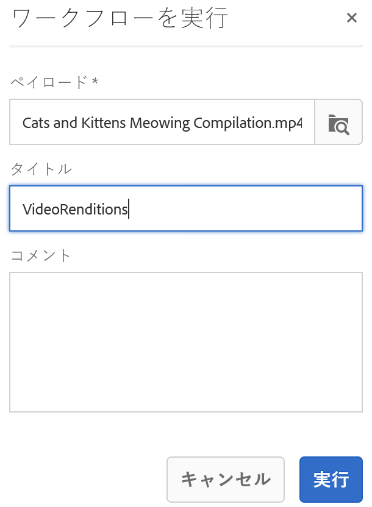
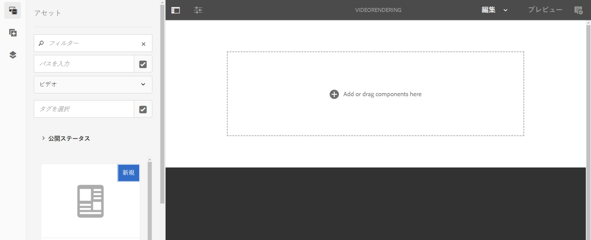
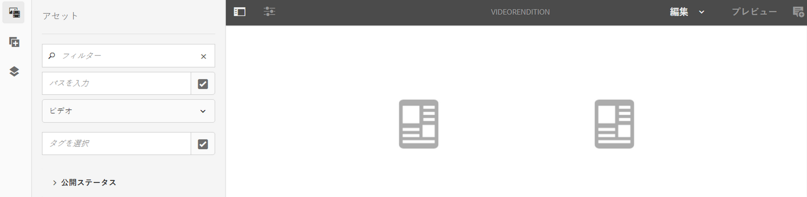
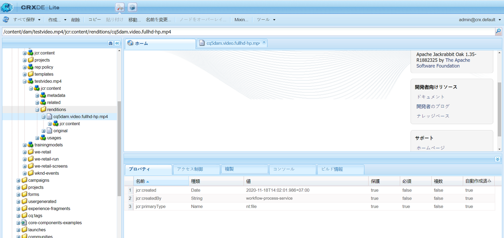

# ビデオパディングワークフローの作成 {#creating-a-video-padding-workflow}

ここでは、以下のトピックについて説明します。

* **概要**
* **前提条件**
* **ビデオパディングワークフローの作成**
   * **ワークフローの作成**
   * **AEM Screens プロジェクトでのワークフローの使用**

* **ワークフローの出力の検証**

## 概要 {#overview}

次の使用例では、チャネルへのビデオ（例：1280 x 720）の配置が必要になります。このチャネルのディスプレイは 1920 x 1080 で、0x0（左上）にビデオが配置されます。ビデオは、引き伸ばしや変更を一切おこなわないでください。また、ビデオコンポーネントで「**カバー**」は使用しません。

ビデオは横がピクセル 1～1280、縦がピクセル 1～720 のオブジェクトとして表示され、チャンネルの残りの部分はデフォルトの色になります。

## 前提条件 {#prerequisites}

ビデオのワークフローを作成する前に、次の前提条件を満たしてください。

1. AEM インスタンスの **Assets** フォルダーにビデオをアップロードする
1. AEM Screens プロジェクト（例：**TestVideoRendition**）と、**VideoRendering** という名前のチャネルを作成します（下図を参照）。

## ビデオパディングワークフローの作成 {#creating-a-video-padding-workflow-1}

ビデオパディングワークフローを作成するには、ビデオのワークフローを作成したあと、同じワークフローを AEM Screens プロジェクトのチャネルでも使用する必要があります。

以下の手順に従って、ワークフローを作成して使用します。

1. ワークフローの作成
1. AEM Screens プロジェクトでのワークフローの使用

### ワークフローの作成 {#creating-a-workflow}

以下の手順に従って、ビデオのワークフローを作成します。

1. AEM インスタンスに移動し、サイドレールのハンマーアイコンをクリックします。**ワークフロー**／**モデル**&#x200B;を選択して、新しいモデルを作成します。

   

1. **モデル**／**作成**／**モデルを作成**&#x200B;をクリックします。**ワークフローモデルを追加**&#x200B;で、「**タイトル**」（**VideoRendition**）と「**名前**」を入力します。「**完了**」をクリックして、ワークフローモデルを追加します。

   

1. ワークフローモデルを作成したら、モデル（**VideoRendition**）を選択し、アクションバーの「**編集**」をクリックします。

   

1. **コマンドライン**&#x200B;コンポーネントをワークフローにドラッグ＆ドロップします。

   

1. **コマンドライン**&#x200B;コンポーネントを選択し、プロパティダイアログボックスを開きます。

   

1. **コマンドライン - 手順のプロパティ**&#x200B;ダイアログボックスで、「**引数**」タブを選択してフィールドに入力します。

   「**MIME タイプ**」フィールドに形式（***video/mp4***）を入力し、ワークフローを開始するコマンド（/usr/local/Cellar/ffmpeg -i ${filename} -vf &quot;pad=1920:height=1080:x=0:y=0:color=black&quot; cq5dam.video.fullhd-hp.mp4）を「**コマンド**」フィールドに入力します。

   「**MIME タイプ**」と「**コマンド**」について詳しくは、以下の注記を参照してください。

   

1. ワークフロー（**VideoRenditions**）を選択し、アクションバーの「**ワークフローを開始**」をクリックして、**ワークフローを実行**&#x200B;ダイアログボックスを開きます。

   

1. 「**ペイロード**」でアセットのパス（***/content/dam/huseinpeyda-crossroads01_512kb 2.mp4***）を選択し、「**タイトル**」に「***RunVideo***」と入力して、「**実行**」をクリックします。

   

### AEM Screens プロジェクトでのワークフローの使用 {#using-the-workflow-in-an-aem-screens-project}

以下の手順に従って、AEM Screens プロジェクトでワークフローを使用します。

1. AEM Screens プロジェクト（**TestVideoRendition**／**チャネル**／**VideoRendition**）に移動します。

   

1. アクションバーの「**編集**」をクリックします。最初に&#x200B;**アセット**&#x200B;フォルダーにアップロードしたビデオをドラッグ＆ドロップします。

   

1. ビデオをアップロードしたら、「**プレビュー**」をクリックして出力を表示します。

   

## ワークフローの出力の検証 {#validating-the-output-for-the-workflow}

出力は、次のいずれかの方法で検証できます。

* チャネル内のビデオのプレビューを確認する
* CRXDE Lite で ***/content/dam/testvideo.mp4/jcr:content/renditions/cq5dam.video.fullhd-hp.mp4*** に移動する（下図を参照）

