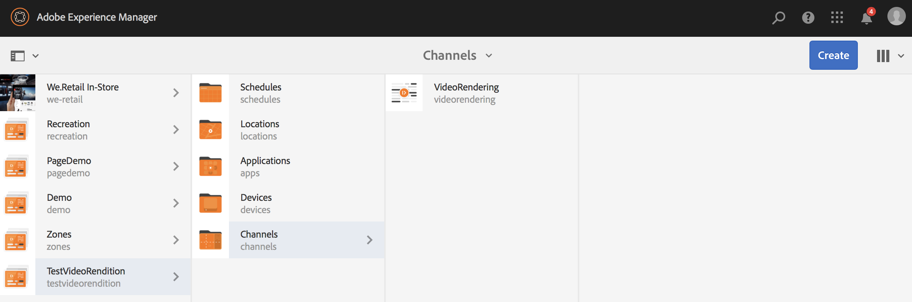
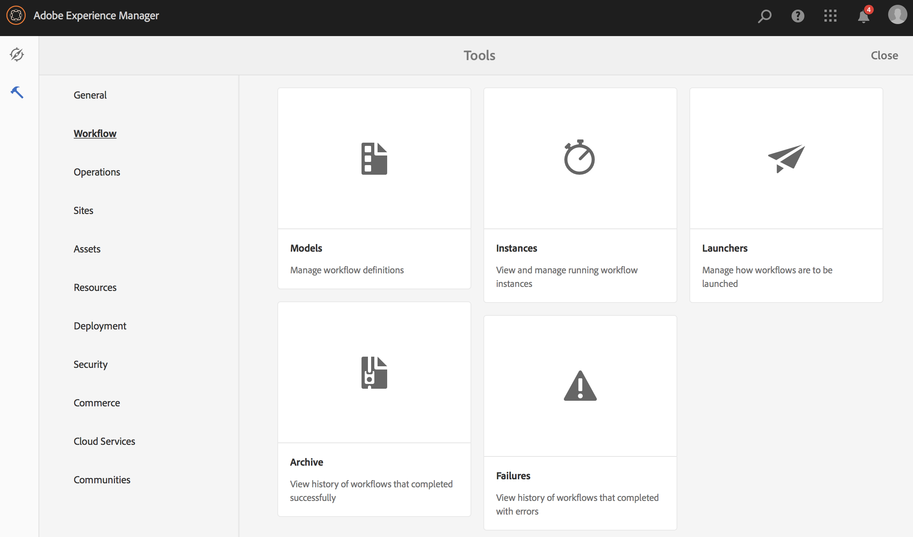
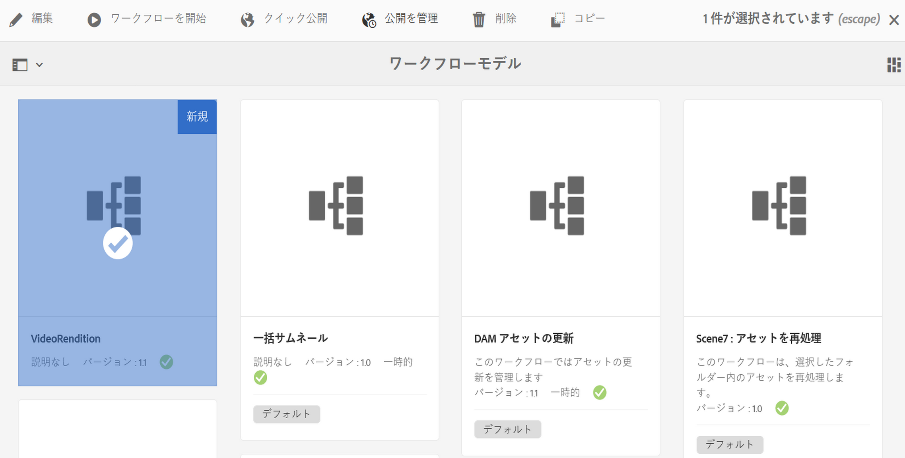
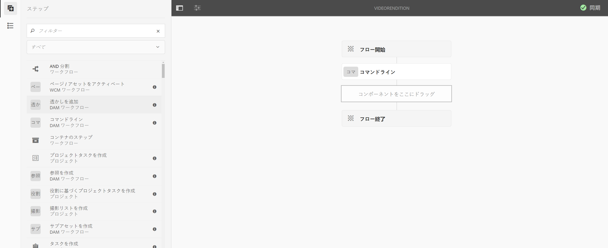
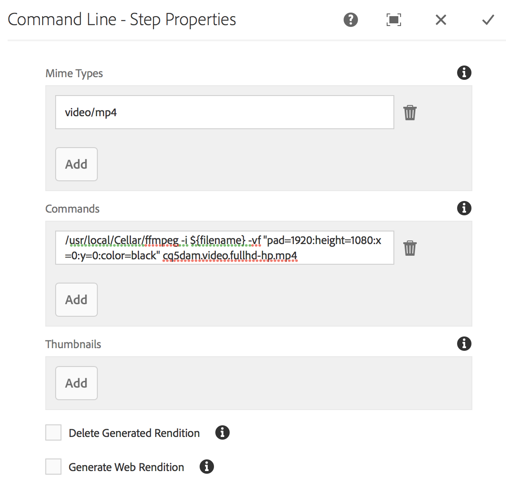
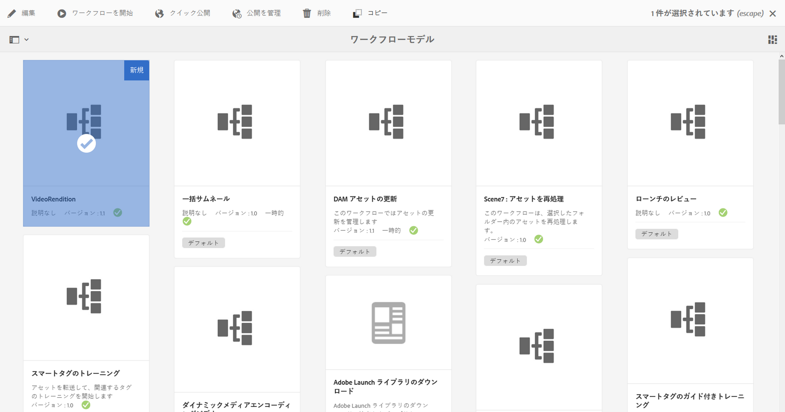
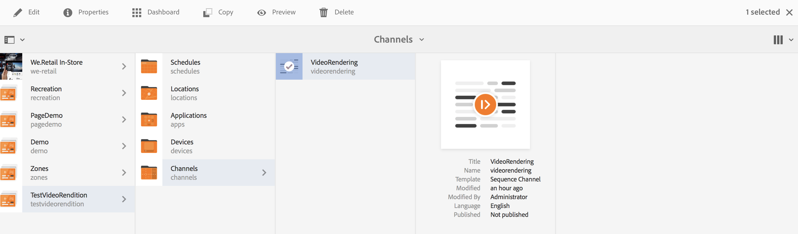
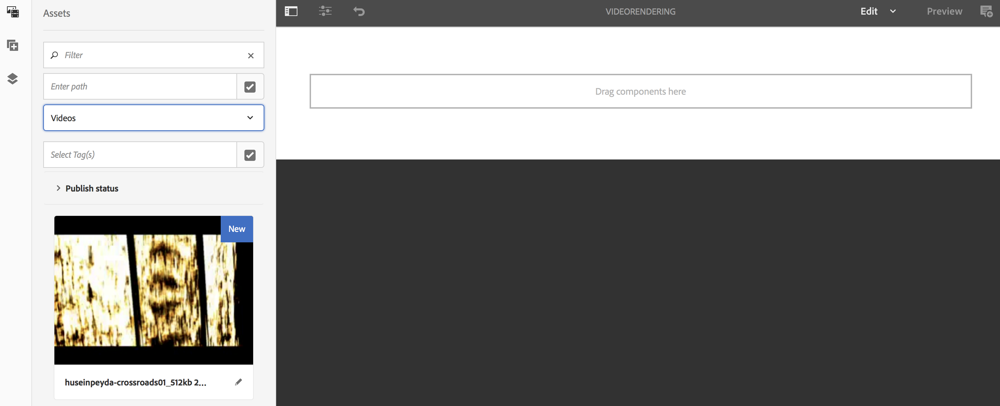
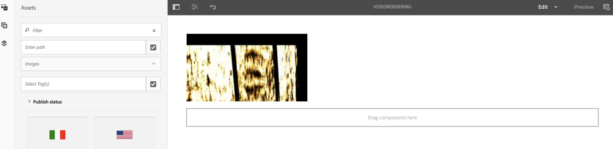

# ビデオパディングワークフローの作成 {#creating-a-video-padding-workflow}

>[!IMPORTANT]
>このコンテンツは、AEM オンプレミス/AMS （AEM 6.5LTSおよびAEM 6.5）に対して有効です。 AEM as a Cloud Service Screensの内容については、[AEM as a Cloud Service ガイド ](https://experienceleague.adobe.com/en/docs/experience-manager-cloud-service/content/screens-as-cloud-service/overview/introduction)を参照してください。

ここでは、以下のトピックについて説明します。

* **概要**
* **前提条件**
* **ビデオパディングワークフローの作成**
   * **ワークフローの作成**
   * **AEM Screens プロジェクトでのワークフローの使用**

* **ワークフローの出力の検証**

## 概要 {#overview}

次の使用例では、チャネルへのビデオ（例：1280 x 720）の配置が必要になります。このチャネルのディスプレイは 1920 x 1080 で、0x0（左上）にビデオが配置されます。 ビデオは、引き伸ばしや変更を一切おこなわないでください。また、ビデオコンポーネントで「**カバー**」は使用しません。

ビデオは横がピクセル 1～1280、縦がピクセル 1～720 のオブジェクトとして表示されます。 チャンネルの残りの部分はデフォルトのカラーです。

## 前提条件 {#prerequisites}

ビデオのワークフローを作成する前に、次の前提条件を満たしてください。

1. AEM インスタンスの **Assets** フォルダーにビデオをアップロードする
1. AEM Screens プロジェクト（例：**TestVideoRendition**）と、**VideoRendering** という名前のチャネルを作成します（下図を参照）。

## ビデオパディングワークフローの作成 {#creating-a-video-padding-workflow-1}

ビデオパディングワークフローを作成するには、ビデオのワークフローを作成したあと、同じワークフローを AEM Screens プロジェクトのチャネルでも使用します。

以下の手順に従って、ワークフローを作成して使用します。

1. ワークフローの作成
1. AEM Screens プロジェクトでのワークフローの使用

### ワークフローの作成 {#creating-a-workflow}

以下の手順に従って、ビデオのワークフローを作成します。

1. AEM インスタンスに移動します。
1. サイドパネルからツールをクリックします。
1. **ワークフロー**／**モデル**&#x200B;をクリックすると、モデルを作成できます。

   

1. **モデル**／**作成**／**モデルを作成**&#x200B;をクリックします。 **ワークフローモデルを追加**&#x200B;で、「**タイトル**」（**VideoRendition** など）と「**名前**」を入力します。 「**完了**」をクリックして、ワークフローモデルを追加します。

   

1. ワークフローモデルを作成したら、モデル（**VideoRendition**）をクリックし、アクションバーの「**編集**」をクリックします。

   

1. **`Command Line`**&#x200B;コンポーネントをワークフローにドラッグ＆ドロップします。

   

1. **`Command Line`**&#x200B;コンポーネントをクリックし、プロパティダイアログボックスを開きます。

   

1. 「**引数**」タブをクリックします。
1. 「**コマンドライン – ステップのプロパティ**」ダイアログボックスで、**Mime Types** （***video/mp4***）という形式で入力し、コマンド（{***`/usr/local/Cellar/ffmpeg -i ${filename} -vf "pad=1920:height=1080:x=0:y=0:color=black" cq5dam.video.fullhd-hp.mp4`***）を入力します。 このコマンドは、「**コマンド**」フィールド内のワークフローを開始します。

   「**MIME タイプ**」と「**コマンド**」について詳しくは、以下の注記を参照してください。

   

1. ワークフロー（**VideoRenditions**）をクリックします。
1. アクションバーの「**ワークフローを開始**」をクリックします。

   

1. **ワークフローを実行**&#x200B;ダイアログボックスで、「**ペイロード**」内のアセットのパス（***/content/dam/huseinpeyda-crossroads01_512kb 2.mp4***）をクリックし、「**タイトル**」を ***RunVideo*** と入力して、「**実行**」をクリックします。

   

### AEM Screens プロジェクトでのワークフローの使用 {#using-the-workflow-in-an-aem-screens-project}

以下の手順に従って、AEM Screens プロジェクトでワークフローを使用します。

1. AEM Screens プロジェクト（**TestVideoRendition**／**チャネル**／**VideoRendition**）に移動します。

   

1. アクションバーの「**編集**」をクリックします。 最初に&#x200B;**アセット**&#x200B;フォルダーにアップロードしたビデオをドラッグ＆ドロップします。

   

1. ビデオをアップロードしたら、「**プレビュー**」をクリックして出力を表示します。

   

## ワークフローの出力の検証 {#validating-the-output-for-the-workflow}

出力は、次のいずれかの方法で検証できます。

* チャネル内のビデオのプレビューを確認する
* 次の図に示すように、CRXDE Liteの&#x200B;***/content/dam/testvideo.mp4/jcr:content/renditions/cq5dam.video.fullhd-hp.mp4***&#x200B;に移動します。

