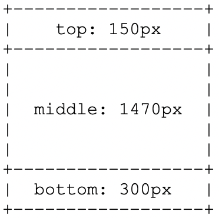

# マルチゾーンレイアウトでのカスタムテンプレートの作成 {#creating-custom-templates-multizone}

次の例は、multiZoneレイアウトでカスタムテンプレートを作成する方法を示しています。

例えば、次の節では、マルチゾーンレイアウトでのカスタムテンプレートの作成方法を示します。




## 特定の設定を使用したカスタムテンプレートの作成 {#basic-flow-setting}

カスタムテンプレートを作成するには、次の手順に従います。

1. テンプレートの作成先 `/apps/<project>/templates/my-custom-layout`

```shell
<?xml version="1.0" encoding="UTF-8"?>
<jcr:root xmlns:sling="http://sling.apache.org/jcr/sling/1.0" xmlns:cq="http://www.day.com/jcr/cq/1.0" xmlns:jcr="http://www.jcp.org/jcr/1.0" xmlns:nt="http://www.jcp.org/jcr/nt/1.0"
    jcr:description="My Custom 3-zones layout "
    jcr:primaryType="cq:Template"
    jcr:title="3-zones layout"
    allowedParents="[/libs/screens/core/templates/channelfolder]"
    allowedPaths="[/content/screens(/.*)?]"
    ranking="{Long}20000">
    <jcr:content
        cq:cssClass="aem-Layout aem-Layout--3x1 my-CustomLayout"
        cq:designPath="/apps/settings/wcm/designs/<project>"
        cq:deviceGroups="[mobile/groups/responsive]"
        jcr:primaryType="cq:PageContent"
        sling:resourceSuperType="screens/core/components/channel"
        sling:resourceType="screens/core/components/multiscreenchannel">
        <r1c1
            cq:cssClass="aem-LayoutCell--1-1 my-CustomLayout-top"
            jcr:primaryType="nt:unstructured"
            sling:resourceType="wcm/foundation/components/responsivegrid"/>
        <r2c1
            cq:cssClass="aem-LayoutCell--1-1 my-CustomLayout-middle"
            jcr:primaryType="nt:unstructured"
            sling:resourceType="wcm/foundation/components/responsivegrid"/>
        <r3c1
            cq:cssClass="aem-LayoutCell--1-1 my-CustomLayout-bottom"
            jcr:primaryType="nt:unstructured"
            sling:resourceType="wcm/foundation/components/responsivegrid"/>
        <cq:responsive jcr:primaryType="nt:unstructured">
            <breakpoints jcr:primaryType="nt:unstructured"/>
        </cq:responsive>
        <offline-config/>
    </jcr:content>
</jcr:root>
```

1. でページデザインを作成しま `/apps/settings/wcm/designs/<project>`す。

   >[!NOTE]
   >
   >上記の項目がパスと一 `cq:designPath` 致することを確認します。

1. 新しいパ **スを指すようにデザインのoffline-config** ノードを更新します

1. フォルダ **ーに** static.css `/apps/settings/wcm/designs/<project>` ファイルを追加し、そのコンテンツを

```shell
.cq-Screens-channel--multizone.my-CustomLayout {}
.cq-Screens-channel--multizone.my-CustomLayout .my-CustomLayout-top { height: 150px; }
.cq-Screens-channel--multizone.my-CustomLayout .my-CustomLayout-middle { height: 1470px; }
.cq-Screens-channel--multizone.my-CustomLayout .my-CustomLayout-bottom { height: 300px; }
```

## 背景レイヤーとしての画像の挿入 {#inserting-image}

画像を背景レイヤーとしてレイアウトに挿入できます。

CSSルールを調整して、「data-uri」と呼ばれるものを使用し、CSSファイル内の画像（Base64エンコード済み）を直接インライン化できます。

これは次のように行います。
`.cq-Screens-channel--multizone.my-CustomLayout { background: url('data:image/…;base64,…') no-repeat center center; }`

または、次の手順に従うこともできます。

1. 画像がチャネルのオフライン設定に含まれていることを確認します
1. 「data-uri」バリアントの代わりに、上記のCSSの画像への直接リンクを使用します。


## 背景色の更新 {#updating-color}

背景色を変更するには、xmlファイルに次のコードを追加します。

`.cq-Screens-channel--multizone.my-CustomLayout { background-color: …; }`
