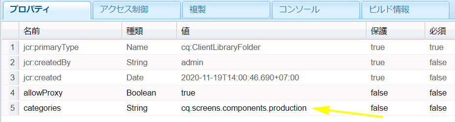

# AEM Screens用カスタムコンポーネントの開発 {#developing-a-custom-component-for-aem-screens}

次のチュートリアルでは、AEM Screens用のカスタムコンポーネントを作成する手順について説明します。 AEM Screensは、他のAEM製品の多くの既存のデザインパターンやテクノロジーを再利用します。 このチュートリアルでは、AEM Screens用に開発する際の相違点と特別な考慮事項について説明します。

## 概要 {#overview}

このチュートリアルは、AEM Screensを初めて使用する開発者を対象としています。 このチュートリアルでは、AEM Screensのシーケンスチャネル用に、シンプルな「Hello World」コンポーネントを構築します。 ダイアログを使用すると、作成者は表示されたテキストを更新できます。


## 前提条件 {#prerequisites}

このチュートリアルを完了するには、次の手順を実行する必要があります。

1. [AEM 6.5](https://helpx.adobe.com/experience-manager/6-4/release-notes.html) また [はAEM 6.3](https://helpx.adobe.com/experience-manager/6-3/release-notes.html) +最新画面機能パック

1. [AEM Screens Player](https://helpx.adobe.com/experience-manager/6-4/sites/deploying/using/configuring-screens-introduction.html)
1. ローカル開発環境

チュートリアルの手順とスクリーンショットは、 **CRXDE-Liteを使用して実行します**。 IDEを使用してチュートリアルを完了することもできます。 AEMでの開発にIDEを使用する方法につい [て詳しくは、こちらを参照してください。](https://helpx.adobe.com/experience-manager/kt/sites/using/getting-started-wknd-tutorial-develop/part1.html#eclipse-ide)


## Project Setup {#project-setup}

Screensプロジェクトのソースコードは、通常、マルチモジュールMavenプロジェクトとして管理されます。 このチュートリアルを迅速に進めるために、 [AEM Project Archetype 13を使用してプロジェクトを事前に生成しました](https://github.com/Adobe-Marketing-Cloud/aem-project-archetype)。 Maven AEMプロジェクトア [ーキタイプを使用したプロジェクトの作成について詳しくは、こちらを参照してください](https://helpx.adobe.com/experience-manager/kt/sites/using/getting-started-wknd-tutorial-develop/part1.html#maven-multimodule)。

1. [CRXパッケージマネージャーを使用して、次のパッケージをダウンロードしてインストールしま](http://localhost:4502/crx/packmgr/index.jsp)す。

   [ファイルの取得](assets/base-screens-weretail-runuiapps-001-snapshot.zip)

   [ファイルの取得](assets/base-screens-weretail-runuicontent-001-snapshot.zip)
   **Eclipseまたは** 、他のIDEを使用して作業する場合は、以下のソースパッケージをダウンロードします。 Mavenコマンドを使用して、プロジェクトをローカルAEMインスタンスにデプロイします。

   **`mvn -PautoInstallPackage clean install`**

   HelloWorld SRC Screens We.Retail Runプロジェクトの開始

   [ファイルの取得](assets/src-screens-weretail-run.zip)

1. CRX Package Managerで [](http://localhost:4502/crx/packmgr/index.jsp) 、次の2つのパッケージがインストールされていることを確認します。

   1. **screens-weretail-run.ui.content-0.0.1-SNAPSHOT.zip**
   1. **screens-weretail-run.ui.apps-0.0.1-SNAPSHOT.zip**
   

   CRX Package Managerを使用してインストールされるScreens We.Retail Run Ui.AppsおよびUi.Contentパッケージ

1. screens-weretail-run.ui.appsパッケ **ージは** 、下にコードをインストールしま `/apps/weretail-run`す。

   このパッケージには、プロジェクトのカスタムコンポーネントのレンダリングを行うコードが含まれています。 このパッケージには、コンポーネントコードと、必要なJavaScriptまたはCSSが含まれています。 このパッケージに **は、プロジェクトで必要なJavaコードを含む** screens-weretail-run.core-0.0.1-SNAPSHOT.jarも埋め込まれます。

   >[!NOTE]
   >
   >このチュートリアルでは、Javaコードは記述されません。 より複雑なビジネスロジックが必要な場合は、Core javaバンドルを使用してバックエンドJavaを作成し、導入できます。

   

   CRXDE liteでのui.appsコードの表現

   helloworldコンポ **ーネントは** 、現在、プレースホルダーに過ぎません。 チュートリアルの過程で、作成者がコンポーネントに表示されるメッセージを更新できる機能が追加されます。

1. screens-weretail-run.ui.contentパッケ **ージは** 、次の下にコードをインストールします。

   * `/conf/we-retail-run`
   * `/content/dam/we-retail-run`
   * `/content/screens/we-retail-run`
   このパッケージには、プロジェクトに必要な開始コンテンツと設定構造が含まれています。 **`/conf/we-retail-run`** We.Retail runプロジェクトのすべての設定が含まれます。 **`/content/dam/we-retail-run`** プロジェクトのデジタルアセットの開始が含まれます。 **`/content/screens/we-retail-run`** には、Screensのコンテンツ構造が含まれます。 これらのパスの下のコンテンツは主にAEMで更新されます。 環境（ローカル、開発、ステージ、実稼動）間の一貫性を高めるために、多くの場合、基本コンテンツ構造がソース管理に保存されます。

1. **AEM Screens/We.Retail runプロジェクトに移動します。**

   AEMのスタートメニューから、「画面」アイコンをクリックします。 We.Retail Runプロジェクトが表示されることを確認します。

   

## Hello worldコンポーネントの作成 {#hello-world-cmp}

Hello worldコンポーネントは、ユーザーが画面に表示するメッセージを入力できる単純なコンポーネントです。 コンポーネントは、 [AEM Screensコンポーネントテンプレートに基づいています。https://github.com/Adobe-Marketing-Cloud/aem-screens-component-template](https://github.com/Adobe-Marketing-Cloud/aem-screens-component-template).

AEM Screensには、従来のWCMサイトコンポーネントには必ずしも当てはまらない興味深い制約がいくつかあります。

* ほとんどの画面コンポーネントは、対象のデジタル署名デバイス上でフルスクリーンで実行する必要があります
* スライドショーを生成するには、ほとんどの画面コンポーネントをシーケンスチャネルに埋め込む必要があります
* オーサリングでは、シーケンスチャネル内の個々のコンポーネントを編集できるので、フルスクリーンのレンダリングは問題になりません。

1. CRXDE- **Lite** （またはIDEが選択） `http://localhost:4502/crx/de/index.jsp` で、 `/apps/weretail-run/components/content/helloworld.`

   Add the following properties to the `helloworld` component:

   ```
       jcr:title="Hello World"
       sling:resourceSuperType="foundation/components/parbase"
       componentGroup="We.Retail Run - Content"
   ```

   

   /apps/wertail-run/components/content/helloworldのプロパティ

   helloworldコンポ **ーネントは** 、シーケンスチャネル内で正しく使用できるように、 **foundation/components/parbase** コンポーネントを拡張します。

1. Create a file beneath `/apps/weretail-run/components/content/helloworld` named `helloworld.html.`

   以下のようにファイルを設定します。

   ```xml
   <!--/*
   
    /apps/weretail-run/components/content/helloworld/helloworld.html
   
   */-->
   
   <!--/* production: preview authoring mode + unspecified mode (i.e. on publish) */-->
   <sly data-sly-test.production="${wcmmode.preview || wcmmode.disabled}" data-sly-include="production.html" />
   
   <!--/* edit: any other authoring mode, i.e. edit, design, scaffolding, etc. */-->
   <sly data-sly-test="${!production}" data-sly-include="edit.html" />
   ```

   画面コンポーネントでは、使用するオーサリングモードに応じて [2種類のレンダリング](https://helpx.adobe.com/experience-manager/6-4/sites/authoring/using/author-environment-tools.html#PageModes) が必要になります。

   1. **実稼働**:プレビューまたは公開モード(wcmmode=disabled)
   1. **編集**:編集、デザイン、スキャフォールド、開発者など、他のすべてのオーサリングモードで使用されます。
   `helloworld.html`は切り替えとして機能し、現在アクティブなオーサリングモードを確認し、別のHTLスクリプトにリダイレクトします。 スクリーンコンポーネントで使用される一般的な規則は、編集モードのスクリプ `edit.html` トと実稼働モードのスクリプ `production.html` トを持つことです。

1. Create a file beneath `/apps/weretail-run/components/content/helloworld` named `production.html.`

   以下のようにファイルを設定します。

   ```xml
   <!--/*
    /apps/weretail-run/components/content/helloworld/production.html
   
   */-->
   
   <div data-duration="${properties.duration}" class="cmp-hello-world">
    <h1 class="cmp-hello-world__message">${properties.message}</h1>
   </div>
   ```

   上記は、Hello worldコンポーネントの実稼働用マークアップです。 コンポーネン `data-duration` トはシーケンスチャネルで使用されるので、アトリビュートが含まれます。 この属 `data-duration` 性は、シーケンスチャネルがシーケンス項目を表示する期間を知るために使用されます。

   コンポーネントは、とタグをテ `div` キストと共 `h1` にレンダリングします。 `${properties.message}` は、という名前のJCRプロパティのコンテンツを出力するHTLスクリプトの一部で `message`す。 後で作成されるダイアログで、ユーザーはプロパティテキストの値を入力で `message` きます。

   また、BEM（ブロック要素修飾子）表記がコンポーネントで使用されることにも注意してください。 BEMは、再利用可能なコンポーネントを容易に作成できるCSSコーディング規則です。 BEMは、 [AEMのコアコンポーネントで使用される表記です](https://github.com/Adobe-Marketing-Cloud/aem-core-wcm-components/wiki/CSS-coding-conventions)。 詳しくは、以下を参照してください。https://getbem.com/ [](https://getbem.com/)

1. Create a file beneath `/apps/weretail-run/components/content/helloworld` named `edit.html.`

   以下のようにファイルを設定します。

   ```xml
   <!--/*
   
    /apps/weretail-run/components/content/helloworld/edit.html
   
   */-->
   
   <!--/* if message populated */-->
   <div
    data-sly-test.message="${properties.message}"
    class="aem-Screens-editWrapper cmp-hello-world">
    <p class="cmp-hello-world__message">${message}</p>
   </div>
   
   <!--/* empty place holder */-->
   <div data-sly-test="${!message}"
        class="aem-Screens-editWrapper cq-placeholder cmp-hello-world"
        data-emptytext="${'Hello World' @ i18n, locale=request.locale}">
   </div>
   ```

   上記は、Hello worldコンポーネントの編集マークアップです。 ダイアログメッセージが入力されている場合、最初のブロックにはコンポーネントの編集バージョンが表示されます。

   ダイアログメッセージが入力されていない場合は、2番目のブロックがレンダリングされます。 とは、ラ `cq-placeholder` ベル `data-emptytext` Hello worldをプレー ***スホルダーとしてレンダリングします*** 。 複数のロケールでのオーサリングをサポートするために、ラベルの文字列をi18nを使用して国際化できます。

1. **Hello worldコンポーネントに使用する画面の画像ダイアログをコピーします。**

   最も簡単な方法は、既存のダイアログから開始して、変更を加えることです。

   1. ダイアログのコピー元： `/libs/screens/core/components/content/image/cq:dialog`
   1. ダイアログを下に貼り付け `/apps/weretail-run/components/content/helloworld`
   

1. **Hello worldダイアログを更新して、メッセージ用のタブを含めます。**

   ダイアログを更新して、次の条件に一致するようにします。 XMLでは、最後のダイアログのJCRノード構造を次に示します。

   ```xml
   <?xml version="1.0" encoding="UTF-8"?>
   <jcr:root xmlns:sling="https://sling.apache.org/jcr/sling/1.0" xmlns:cq="https://www.day.com/jcr/cq/1.0" xmlns:jcr="https://www.jcp.org/jcr/1.0" xmlns:nt="https://www.jcp.org/jcr/nt/1.0"
       jcr:primaryType="nt:unstructured"
       jcr:title="Hello World"
       sling:resourceType="cq/gui/components/authoring/dialog">
       <content
           jcr:primaryType="nt:unstructured"
           sling:resourceType="granite/ui/components/coral/foundation/tabs"
           size="L">
           <items jcr:primaryType="nt:unstructured">
               <message
                   jcr:primaryType="nt:unstructured"
                   jcr:title="Message"
                   sling:resourceType="granite/ui/components/coral/foundation/fixedcolumns">
                   <items jcr:primaryType="nt:unstructured">
                       <column
                           jcr:primaryType="nt:unstructured"
                           sling:resourceType="granite/ui/components/coral/foundation/container">
                           <items jcr:primaryType="nt:unstructured">
                               <message
                                   jcr:primaryType="nt:unstructured"
                                   sling:resourceType="granite/ui/components/coral/foundation/form/textfield"
                                   fieldDescription="Message for component to display"
                                   fieldLabel="Message"
                                   name="./message"/>
                           </items>
                       </column>
                   </items>
               </message>
               <sequence
                   jcr:primaryType="nt:unstructured"
                   jcr:title="Sequence"
                   sling:resourceType="granite/ui/components/coral/foundation/fixedcolumns">
                   <items jcr:primaryType="nt:unstructured">
                       <column
                           jcr:primaryType="nt:unstructured"
                           sling:resourceType="granite/ui/components/coral/foundation/container">
                           <items jcr:primaryType="nt:unstructured">
                               <duration
                                   jcr:primaryType="nt:unstructured"
                                   sling:resourceType="granite/ui/components/coral/foundation/form/numberfield"
                                   defaultValue=""
                                   fieldDescription="Amount of time the image will be shown in the sequence, in milliseconds"
                                   fieldLabel="Duration (ms)"
                                   min="0"
                                   name="./duration"/>
                           </items>
                       </column>
                   </items>
               </sequence>
           </items>
       </content>
   </jcr:root>
   ```

   メッセージのテキストフィールドは、という名前のプロパティに保存さ `message` れ、期間の数値フィールドは、という名前のプロパティに保存されま `duration`す。 これら2つのプロパティは、HTLでと `/apps/weretail-run/components/content/helloworld/production.html` して参照さ `${properties.message}` れま `${properties.duration}`す。

   

   Hello World — 完了したダイアログ

## クライアント側ライブラリの作成 {#clientlibs}

クライアント側ライブラリは、AEM実装に必要なCSSファイルとJavaScriptファイルを整理および管理するメカニズムを提供します。

AEM Screensコンポーネントは、編集モードとプレビュー/制作モードではレンダリングが異なります。 2つのクライアントライブラリが作成されます。1つは編集モード用、もう1つはプレビュー/実稼働用です。

1. Hello worldコンポーネント用のクライアント側ライブラリ用のフォルダーを作成します。

   Beneath `/apps/weretail-run/components/content/helloworld`create a new folder named `clientlibs`.

   

1. Beneath the `clientlibs` folder create a new node named `shared` of type `cq:ClientLibraryFolder.`

   

1. 共有クライアントライブラリに次のプロパティを追加します。

   * `allowProxy` | Boolean | `true`

   * `categories`| String[] | `cq.screens.components`
   

   /apps/wertail-run/components/content/helloworld/clientlibs/sharedのプロパティ

   categoriesプロパティは、クライアントライブラリを識別する文字列です。 cq.screens.componentsカテゴリは、編集モードとプレビュー/実稼働モードの両方で使用されます。 したがって、sharedclientlibで定義されたCSS/JSは、すべてのモードで読み込まれます。

   実稼働環境では、/appsに直接パスを公開しないことをお勧めします。 allowProxyプロパティは、クライアントライブラリのCSSとJSがプレフィックスof/etc.clientlibsを介して参照されるようにします。

1. 共有フォルダーの下に `css.txt` という名前のファイルを作成します。

   以下のようにファイルを設定します。

   ```
   #base=css
   
   styles.less
   ```

1. フォルダーの下に名前を付け `css` たフォルダーを作 `shared` 成します。 フォルダーの下に、という名前の `style.less` ファイルを追 `css` 加します。 クライアントライブラリの構造は次のようになります。

   

   CSSを直接記述する代わりに、このチュートリアルではLESSを使用します。 [LESSは](https://lesscss.org/) 、CSS変数、ミックスイン、関数をサポートする、一般的なCSSプリコンパイラーです。 AEM のクライアントライブラリは、LESS のコンパイルをネイティブにサポートしています。Sassまたは他のプリコンパイラーを使用できますが、AEMの外部でコンパイルする必要があります。

1. 次の値 `/apps/weretail-run/components/content/helloworld/clientlibs/shared/css/styles.less` を入力します。

   ```css
   /**
       Shared Styles
      /apps/weretail-run/components/content/helloworld/clientlibs/shared/css/styles.less
   
   **/
   
   .cmp-hello-world {
       background-color: #fff;
   
    &__message {
     color: #000;
     font-family: Helvetica;
     text-align:center;
    }
   }
   ```

1. クライアントライブラリフォルダ `shared` ーをコピーして貼り付け、という名前の新しいクライアントライブラリを作成しま `production`す。

   

   共有クライアントライブラリをコピーして、新しい実稼働クライアントライブラリを作成します

1. 本番用クライアント `categories` ライブラリのプロパティを `cq.screens.components.production.`

   これにより、プレビュー/実稼働モードでのみスタイルが読み込まれます。

   

   /apps/wertail-run/components/content/helloworld/clientlibs/productionのプロパティ

1. 次の値 `/apps/weretail-run/components/content/helloworld/clientlibs/production/css/styles.less` を入力します。

   ```css
   /**
       Production Styles
      /apps/weretail-run/components/content/helloworld/clientlibs/production/css/styles.less
   
   **/
   .cmp-hello-world {
   
       height: 100%;
       width: 100%;
       position: fixed;
   
    &__message {
   
     position: relative;
     font-size: 5rem;
     top:25%;
    }
   }
   ```

   上記のスタイルでは、メッセージは実稼働モードでのみ、画面の中央に表示されます。

3番目のクライアントライブラリカテゴリ：コンポ `cq.screens.components.edit` ーネントに編集専用のスタイルを追加する場合に使用できます。

| Clientlibカテゴリ | 使用方法 |
|---|---|
| `cq.screens.components` | 編集モードと実稼働モードの両方で共有されるスタイルとスクリプト |
| `cq.screens.components.edit` | 編集モードでのみ使用されるスタイルとスクリプト |
| `cq.screens.components.production` | 実稼働モードでのみ使用されるスタイルとスクリプト |

## デザインページの作成 {#design-page}

AEM Screensでは、グローバルな変 [更に対して静的なページテンプ](https://helpx.adobe.com/experience-manager/6-5/sites/developing/using/page-templates-static.html) レートとデザイン設定 [](https://helpx.adobe.com/experience-manager/6-4/sites/authoring/using/default-components-designmode.html) を使用します。 設計構成は、チャネル上のParsysに許可されるコンポーネントを設定する際に頻繁に使用されます。 ベストプラクティスは、これらの設定をアプリに固有の方法で保存することです。

We.Retail Runプロジェクトに固有のすべての設定を保存するWe.Retail Run designページが作成されます。

1. CRXDE **-Liteで** 、 `http://localhost:4502/crx/de/index.jsp#/apps/settings/wcm/designs``/apps/settings/wcm/designs`
1. のタイプで名前を付けた新しいノードをdesignsフォルダ `we-retail-run` ーの下に作成しま `cq:Page`す。
1. ページの下 `we-retail-run` に、「type」という名前の別のノード `jcr:content` を追加しま `nt:unstructured`す。 Add the following properties to the `jcr:content` node:

   | 名前 | 種類 | 値 |
   |---|---|---|
   | jcr:title | String | We.Retail Run |
   | sling:resourceType | String | wcm/core/components/designer |
   | cq:doctype | String | html_5 |

   

   /apps/settings/wcm/designs/we-retail-runのデザインページ

## シーケンスチャネルの作成 {#create-sequence-channel}

Hello worldコンポーネントは、シーケンスチャネルでの使用を想定しています。 コンポーネントをテストするために、新しいシーケンスチャネルが作成されます。

1. AEMのスタートメニューで、 **Screens** / **We.Retail** Run/に移動し、「チャネル」を選 **択します**。

1. Click the **Create** button

   1. 「エンティティ **を作成」を選択**
   

1. 作成ウィザードで、次の操作を行います。

1. テンプレートステップ — 選択**シーケンスチャネル**

   1. プロパティ手順
   * 「基本」タブ/タイトル=アイド **ルチャネル**
   * [チャネル]タブ/[チャネルをオンラ **インにする]を選択**
   

1. アイドルチャネルのページプロパティを開きます。 「デザイン」フィールドを更新して、前のセクシ `/apps/settings/wcm/designs/we-retail-run,`ョンで作成したデザインページを参照します。

   

   /apps/settings/wcm/designs/we-retail-runを指すデザイン設定

1. 新しく作成したアイドルチャネルを編集して開きます。

1. ページモードをデザインモード **に切り替え**

   1. Parsysのレンチ **アイコンをクリックし** 、許可されるコンポーネントを設定します

   1. 「 **Screens** 」グループと「 **We.Retail Run - Content** 」グループを選択します。
   

1. ページモードを「編集」に切り **替えます**。 Hello worldコンポーネントをページに追加し、他のシーケンスチャネルコンポーネントと組み合わせることができるようになりました。

   

1. CRXDE- **Liteで** 、に `http://localhost:4502/crx/de/index.jsp#/apps/settings/wcm/designs/we-retail-run/jcr%3Acontent/sequencechannel/par` 移動します `/apps/settings/wcm/designs/we-retail-run/jcr:content/sequencechannel/par`。 プロパティに `components` 、が含まれることに注 `group:Screens`意しま `group:We.Retail Run - Content`す。

   

   /apps/settings/wcm/designs/we-retail-runの下のデザイン設定

## まとめ {#putting-it-all-together}

次のビデオでは、完成したコンポーネントと、それをシーケンスチャンネルに追加する方法を示します。 その後、チャネルがロケーションディスプレイに追加され、最終的に画面プレイヤーに割り当てられます。

>[!VIDEO](https://video.tv.adobe.com/v/22385?quaity=9&captions=jpn)

## 完了したコード {#finished-code}

チュートリアルの完成したコードを以下に示します。 screens-weretail-run.ui.apps-0.0.1- **SNAPSHOT.zip****** とscreens-weretail-run.ui.content-0.0.1-SNAPSHOT.zipは、コンパイル済みのAEMパッケージです。 **SRC-screens-wertail-run-0.0.1.zip **は、Mavenを使用してデプロイできる非コンパイルのソースコードです。

[ファイルの取得](assets/screens-weretail-runuiapps-001-snapshot.zip)

[ファイルの取得](assets/screens-weretail-runuicontent-001-snapshot.zip)

[ファイルの取得](assets/screens-weretail-run.zip)
