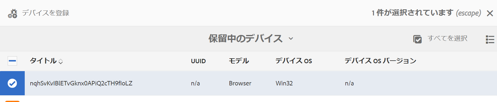

# デバイスの登録 {#device-registration}

ここでは、AEM Screens プロジェクトでのデバイス登録プロセスについて説明します。

## デバイスの登録 {#registering-a-device}

デバイスの登録プロセスは、次の 2 台の異なるマシンで実行されます。

* 登録する実際のデバイス （サイネージディスプレイなど）
* デバイスの登録に使用するAEM サーバー

>[!NOTE]
>
>最新の Windows プレーヤー（*.exe*）を [AEM 6.4 Screens Player のダウンロード](https://download.macromedia.com/screens/)ページからダウンロードしたら、以下の手順に従ってプレーヤーのアドホックインストールを完了します。
>
>1. 左上隅のを長押して、管理パネルを開きます。
>1. 左のアクションメニューから「**設定**」に移動し、AEM インスタンスの場所のアドレスを「**サーバー**」に入力して、「**保存**」をクリックします。
>1. 「」を選択します **登録** 左側のアクションメニューからのリンクと以下の手順に従って、デバイス登録プロセスを完了します。
>


1. デバイスで、AEM Screens Player を起動します。 登録 UI が表示されます。

   

1. AEM で、プロジェクトの&#x200B;**デバイス**&#x200B;フォルダーに移動します。

   >[!NOTE]
   >
   >AEM ダッシュボードでの Screens のプロジェクトの作成について詳しくは、 [Screens プロジェクトの作成と管理](creating-a-screens-project.md).

1. アクションバーの「**デバイスマネージャー**」ボタンをタップまたはクリックします。

   

1. 右上にある「**デバイスの登録**」ボタンをタップまたはクリックします。

   

1. 目的の（手順 1 と同じ）デバイスを選択し、「**デバイスを登録**」をタップまたはクリックします。

   

1. AEM で、デバイスから登録コードが送信されるのを待機します。

   

1. デバイスで、**登録コード**&#x200B;を確認します。

   

1. 両方のコンピューターの&#x200B;**登録コード**&#x200B;が同じである場合は、AEM の「**検証**」ボタンをタップまたはクリックします（手順 6 を参照）。
1. デバイスの名前を設定し、「**登録**」をクリックします。

   

1. 「**完了**」をタップまたはクリックして、登録プロセスを完了します。

   

   >[!NOTE]
   >
   >この **新規登録** 新しいデバイスを登録できます。
   >
   >「**ディスプレイを割り当て**」をタップまたはクリックすると、デバイスをディスプレイに直接追加できます。

   クリックした場合 **終了**&#x200B;デバイスをディスプレイに割り当てる必要があります。

   

   >[!NOTE]
   >
   >Screens プロジェクトのディスプレイの作成と管理について詳しくは、以下を参照してください。 [ディスプレイの作成と管理](managing-displays.md).

### ディスプレイへのデバイスの割り当て {#assigning-device-to-a-display}

デバイスをディスプレイにまだ割り当てていない場合は、以下の手順に従って、デバイスを AEM Screens プロジェクト内のディスプレイに割り当てます。

1. デバイスを選択し、アクションバーの「**デバイスを割り当て**」をクリックします。

   

1. 「**ディスプレイ / デバイス設定パス**」でディスプレイのパスを選択します。

   

1. パスを選択したら、「**割り当て**」をクリックします。

   

1. デバイスが正常に割り当てられたら、「**完了**」をクリックします（下図を参照）。

   

   また、をクリックすると表示ダッシュボードを表示できます **終了**.

   

## デバイスマネージャからのデバイスの検索 {#search-device}

デバイスをプレーヤーに登録すると、デバイスマネージャーの UI からすべてのデバイスを表示できます。

1. AEM Screens プロジェクトからデバイスマネージャー UI （例：）に移動します。 **DemoScreen** > **デバイス**.

1. **デバイス**&#x200B;フォルダーを選択し、アクションバーの「**デバイスマネージャー**」クリックします。

   

1. 登録済みデバイスのリストが表示されます。

1. 長いリストの登録済みデバイスがある場合、アクションバーの検索アイコンを使用して検索できるようになりました。

   

   または、

   `/`（スラッシュ）をクリックして検索機能を起動します。

   


### 検索機能の制限 {#limitations}

* に存在する単語を検索できる *デバイス ID* または *デバイス名*.

  >[!NOTE]
  >デバイス名は、「*BostonStoreLobby*」のように 1 単語ではなく、「*Boston Store Lobby*」のように複数の単語で作成することをお勧めします。

* 次のようなデバイス名を作成する場合： *ボストン店ロビー*、任意の単語を検索します *ボストン*, *store*、または *ロビー*. ただし、デバイス名が *ボストンストアロビー*&#x200B;を探します。 *ボストン* 結果は表示されません。

* ワイルドカード（`*`）は、検索でサポートされています。で始まる名前のデバイスをすべて検索したい場合 *ボストン*、以下を使用できます *ボストン**.

* デバイス名が *ボストンストアロビー* およびを検索しています *ボストン* が結果を返さず、次を使用する *ボストン**を指定すると、検索条件に一致する結果が返されます。

## デバイスの登録の制限 {#limitations-on-device-registration}

システム全体のユーザーパスワード制限により、デバイスの登録が失敗する場合があります。 デバイス登録は、ランダムに生成されたパスワードを使用してデバイスユーザーを作成します。

によってパスワードが制限されている場合 *AuthorizableActionProvider* 設定、デバイスユーザーの作成に失敗する場合があります。

>[!NOTE]
>
>現在の生成されたランダムパスワードは、33 から 122 の範囲の 36 個の ASCII 文字（ほとんどすべての特殊文字を含む）で構成されます。

```java
25.09.2016 16:54:03.140 *ERROR* [59.100.121.82 [1474844043109] POST /content/screens/svc/registration HTTP/1.1] com.adobe.cq.screens.device.registration.impl.RegistrationServlet Error during device registration
javax.jcr.nodetype.ConstraintViolationException: Password violates password constraint (^(?=.*\d).{7,9}$).
        at org.apache.jackrabbit.oak.spi.security.user.action.PasswordValidationAction.validatePassword(PasswordValidationAction.java:105)
        at org.apache.jackrabbit.oak.spi.security.user.action.PasswordValidationAction.onPasswordChange(PasswordValidationAction.java:76)
        at org.apache.jackrabbit.oak.security.user.UserManagerImpl.onPasswordChange(UserManagerImpl.java:308)
```

### その他のリソース {#additional-resources}

AEM Screens Player について詳しくは、[AEM Screens Player](working-with-screens-player.md) を参照してください。
