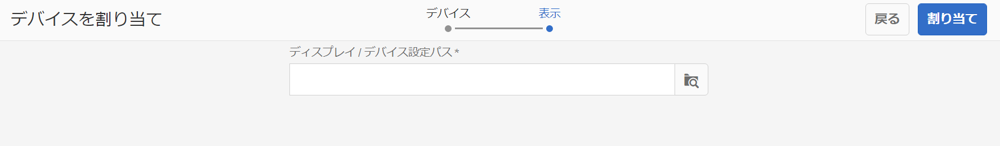

# デバイスの登録 {#device-registration}

次のページでは、AEM Screensプロジェクトでのデバイス登録プロセスについて説明します。

## Registering a Device {#registering-a-device}

デバイスの登録プロセスは、2台の別々のマシンで実行されます。

* 実際に登録するデバイス（サイネージディスプレイなど）
* デバイスの登録に使用する AEM サーバー

>[!NOTE]
>
>最新のWindows Player (*.exe*)を [](https://download.macromedia.com/screens/) AEM 6.4 playerのダウンロードページからダウンロードしたら、プレイヤー上の手順に従ってアドホックインストールを完了します。
>
>1. 左上隅を長押しして、管理パネルを開きます。
>1. 左側のアクシ **ョンメニューから「** Configuration **」に移動し、「** Server **」にAEMインスタンスの場所のアドレスを入力し、「** Save」をクリックします。
>1. 左側のアクションメ **ニューの** 「Registration」リンクをクリックし、以下の手順でデバイス登録プロセスを完了します。
>


1. デバイスで AEM Screens プレーヤーを起動します。登録用の UI が表示されます。

   

1. AEM で、プロジェクトの&#x200B;**デバイス**&#x200B;フォルダーに移動します。

   >[!NOTE]
   >
   >To get more information on creating a new project for Screens in the AEM dashboard, see [Create and Manage Screens Project](creating-a-screens-project.md).

1. アクションバーの「**デバイスマネージャー**」ボタンをタップ／クリックします。

   

1. 右上にある「**デバイスの登録**」ボタンをタップ／クリックします。

   

1. 目的の（手順 1 と同じ）デバイスを選択し、「**デバイスを登録**」をタップ／クリックします。

   

1. AEM で、デバイスから登録コードが送信されるのを待機します。

   

1. デバイスで、**登録コード**&#x200B;を確認します。

   

1. If the **Registration Code** is the same on both machines, tap/click **Validate** button in AEM, as shown in the step (6).
1. デバイスの名前を設定し、「**登録**」をクリックします。

   

1. 「**完了**」をタップまたはクリックして、登録プロセスを完了します。

   

   >[!NOTE]
   >
   >[新し **いデバイスを登録** ]を使用すると、新しいデバイスを登録できます。
   >
   >The **Assign Display** lets you directly add the device to a display.

   [完了]をクリ **ックする**&#x200B;と、デバイスをディスプレイに割り当てる必要があります。

   

   >[!NOTE]
   >
   >画面プロジェクトのディスプレイの作成と管理の詳細については、「ディスプレイの作成と管 [理」を参照してください](managing-displays.md)。

### デバイスをディスプレイに割り当てる {#assigning-device-to-a-display}

デバイスをディスプレイに割り当てていない場合は、次の手順に従って、AEM Screensプロジェクト内のディスプレイにデバイスを割り当てます。

1. デバイスを選択し、アクションバ **ーで「Assign Device** 」をクリックします。

   

1. 「ディスプレイ/デバイス設定パス」 **で表示のパスを選択します**。

   

1. パスを **選択し** 、「割り当て」をクリックします。

   

1. 次の図に **示すように** 、デバイスが正常に割り当てられたら、「完了」をクリックします。

   

   また、「完了」をクリックすると、ダッシュボードを表示で **きます**。

   

## デバイスの登録の制限 {#limitations-on-device-registration}

システム全体のユーザーパスワードの制限により、デバイスの登録に失敗することがあります。デバイスの登録では、デバイスのユーザーを作成するためにランダム生成されたパスワードが使用されます。

このパスワードが *AuthorizableActionProvider* 設定により制限されている場合は、デバイスのユーザーの作成に失敗することがあります。

>[!NOTE]
>
>現在生成されるランダムパスワードは、33 ～ 122 の範囲の 36 文字の ASCII 文字で構成されています（ほとんどすべての特殊文字が含まれます）。

```java
25.09.2016 16:54:03.140 *ERROR* [59.100.121.82 [1474844043109] POST /content/screens/svc/registration HTTP/1.1] com.adobe.cq.screens.device.registration.impl.RegistrationServlet Error during device registration
javax.jcr.nodetype.ConstraintViolationException: Password violates password constraint (^(?=.*\d).{7,9}$).
        at org.apache.jackrabbit.oak.spi.security.user.action.PasswordValidationAction.validatePassword(PasswordValidationAction.java:105)
        at org.apache.jackrabbit.oak.spi.security.user.action.PasswordValidationAction.onPasswordChange(PasswordValidationAction.java:76)
        at org.apache.jackrabbit.oak.security.user.UserManagerImpl.onPasswordChange(UserManagerImpl.java:308)
```

### その他のリソース {#additional-resources}

To learn about AEM Screens Player, see [AEM Screens Player](working-with-screens-player.md).
