# 動的埋め込みシーケンスの使用 {#using-dynamic-embedded-sequence}

動的埋め込みシーケンスの使用に関するトピックを次に示します。

* **概要**
* **AEM Screensでの動的埋め込みエクスペリエンスの使用**
* **結果の表示**
* **ユーザーの制限とACLの変更**

## 概要 {#overview}

***動的埋め込みシーケンスは*** 、親の子階層に従う大きなプロジェクト用に作成され、子は場所フォルダー内で参照され、チャンネルフォルダー内では参照されません。 It allows the user to embed a sequence inside a channel by ***Channel Role***. ユーザーは、メインチャネル内の埋め込みシーケンスを使用して、様々なオフィス用の場所固有のプレースホルダーを定義できます。

ディスプレイにチャネルを割り当てる際、ディスプレイのパスを指定するか、実際のチャネルに解決されるチャネルの役割をコンテキストで指定するかを選択できます。

動的埋め込みシーケンスを使用するには、チャネルの役割でチャネルを割 ***り当てます***。 チャネルの役割は、表示のコンテキストを定義します。 役割は様々なアクションによってターゲット設定され、役割を果たす実際のチャネルとは独立しています。 ここでは、役割別のチャネルを定義する使用例と、そのコンテンツをグローバルチャネルで利用する方法を説明します。ロールは、割り当ての識別子、またはのコンテキストでのチャネルのエイリアスと考えることもできます。

### 動的埋め込みシーケンスを使用する利点 {#benefits-of-using-dynamic-embedded-sequences}

channelsフォルダーの代わりに場所の内側にシーケンスチャネルを配置する主な利点は、ローカル作成者や地域の作成者が、階層の上位のチャネルを編集するのを制限されながら、関連するコンテンツを編集できるようにすることです。

Referencing a *Channel By Role*, allows you to create local version of a channel, in order to dynamically resolve location-specific content and also allows you to create a global channel that leverages the content for the location-specific channels.

>[!NOTE]
>
>**埋め込みシーケンスと動的埋め込みシーケンス**
>
>動的埋め込みシーケンスは、埋め込みシーケンスに似ていますが、あるチャネルに対して行われた変更や更新が相対的に他のチャネルに反映される階層に従うことができます。 親子の階層に従い、画像やビデオなどのアセットも含まれます。
>
>***動的埋め込みシーケンス*** ：場所固有のコンテンツを表示できますが、埋め込みシーケ ***ンスは*** 、コンテンツの一般的なスライドショーのみを表示できます。 さらに、動的埋め込みシーケンスの設定時に、チャネルの役割と名前を使用してチャネルを設定する必要があります。 実際の実装については、以下の手順を参照してください。
>
>埋め込みシーケンスの実装について詳しくは、「AEM Screensでの埋め込みシーケンス [」を参照](embedded-sequences.md) してください。

次の例は、次のキーワードに焦点を当てた解決策を示しています。

* グロー ***バルシーケンスの*** 、主シーケンスチャネル
* ***シーケンスの各ローカルで*** 、カスタマイズ可能な部分の動的埋め込みシーケンスコンポーネント
* ***動的な埋め込みシーケンス*** ・コンポーネントの役割に一致する、表示内の役割を持つ個々 *のシーケンス・チャネ* ルです ****。**

>[!NOTE]
>
>To learn more about channel assignment, see **[Channel Assignment](channel-assignment.md)** under Authoring section in AEM Screens documentation.

## 動的埋め込みシーケンスの使用 {#using-dynamic-embedded-sequence-2}

次の節では、AEM Screensチャンネルでの動的埋め込みシーケンスの作成について説明します。

### 前提条件 {#prerequisites}

この機能の実装を開始する前に、動的埋め込みシーケンスの実装を開始するための次の前提条件が満たされていることを確認してください。

* AEM Screensプロジェクトの作成(この例では **Demo**)

* チャネルフォルダーの下に **グローバル** チャネル **を作成**

* グローバルチャネルに **コンテンツを追加** (*関連アセッ&#x200B;**トについてはResources.zip**を確認してください*)

次の画像は、 **Channelsフォルダー内の** Global **channelを使用する** Demo **Projectを** 示しています。
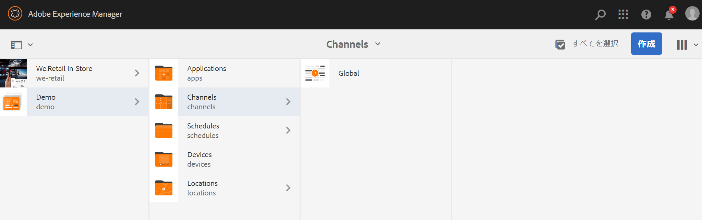

### リソース {#resources}

次のリソース（画像をダウンロードし、アセットに追加）をダウンロードし、デモ用にチャネルコンテンツとしてさらに使用できます。

[ファイルの取得](assets/resources.zip)

>[!NOTE]
>
>プロジェクトの作成方法とシーケンスチャネルの作成方法に関する詳細は、以下のリソースを参照してください。
>
>* **[プロジェクトの作成と管理](creating-a-screens-project.md)**
>* **[チャネルの管理](managing-channels.md)**
>

AEM Screensプロジェクトに動的埋め込みシーケンスを実装するには、次の3つの主なタスクが必要です。

1. **チャネル、場所、表示を含むプロジェクト分類の設定**
1. **スケジュールの作成**
1. **各表示へのスケジュールの割り当て**

次の手順に従って機能を実装します。

>[!CAUTION]
>
>動的埋め込みシーケンスを実装する際は、各場所の下にチャネルを作成する際に **、「名前** 」フィールドと「タイ **トル** 」フィールドに注意してください。 命名に関する指示には注意深く従ってください。

1. **2つの場所フォルダーを作成します。**

   AEM Screensプロジェクトの **Locations** フォルダーに移動し、2つの場所フォルダーを「地域A **」と「地域B」** として作成します ****。

   >[!NOTE]
   >
   >Region A **locationフォルダーを作成する際は、** TitleをRegion A **、** Name **Nameを空にし、自動的に** Region A-region NameをPickedupにして、 **TitleをRegion A****** 、Nameフィールドは空のままにしてください。
   >
   >同様に、次に示すように、場所フォルダー **Region bを作成します**。

   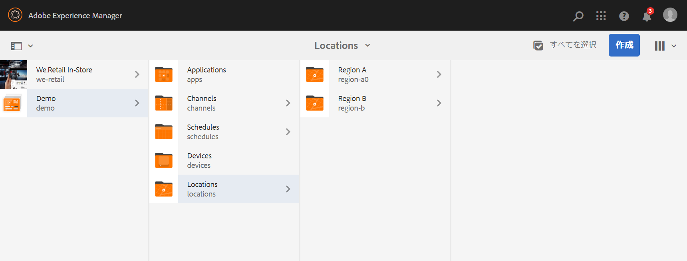

   >[!NOTE]
   >
   >場所の作成方法については、「場所の作成と管理」を **[参照してください](managing-locations.md)**。

1. **各場所フォルダーの下に2つの場所と1つのチャネルを作成します。**

   1. 「 **Demo** 」 —&gt;「 **Locations** 」 —&gt;「 **Region A**」に移動します。
   1. Select **Region A** and click **+ Create** from the action bar.
   1. 「 **Location** 」を選択し、「 **Title** 」を「 **Store 1」に設定します**。 同様に、「 **Store 2** with **Title」を「Store 2」に設定して、ウィザードから別の場所を作** 成します **。2**. 「 **Name** 」フィールドは、 **Store 1** と **Store 2の作成時に空のままにで**&#x200B;きます。
   1. 手順(b)を繰り返し、ウィザードから「シーケ **ンスチャネル** 」を選択します。 このチャネ **ルの「** タイ **トル** 」に「地域A **」、「** 名前」に「**地域**」と入力します。
   >[!CAUTION]
   >
   >チャネル領域 **Aの作成時に**、「 **Title** 」に**Region A **、「 **Name** 」にregion ****&#x200B;を入力します。

   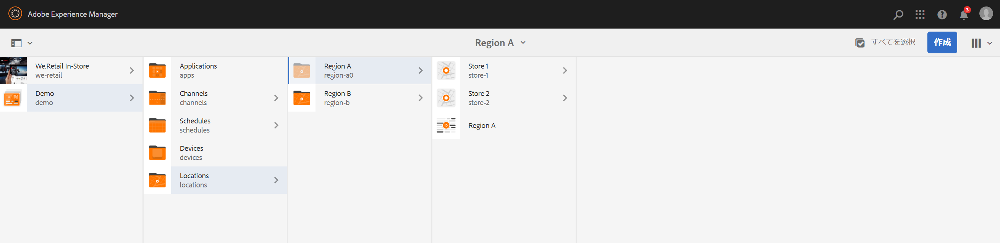

   同様に、地域Bの下に **Store 3** と **Store 4という名前の2つの場所を** 作成します ****。 また、タイトルを **** B **、名前を**************&#x200B;領域、名前を

   >[!CAUTION]
   >
   >地域Aと地域Bで作成したチャネルには、地域と同じ名前を使用で **きる****ことを確認** します ****。

   

1. **各場所の下に表示とチャネルを作成します。**

   1. **Demo** —&gt; **Locations** —&gt; **Region A** — **Store 1** Storeに移動します。
   1. Select **Store 1** and click **+ Create** from the action bar.
   1. ウィザ **ードで** 「Display」を選択し、「 **Store1Display」を作成します。**
   1. 手順(b)を繰り返し、この時点でウィザードから「シーケ **ンスチャネル** 」を選択します。 タイトル **をStore** 1Channelとして、名前をstore **** Channelとして入力 ********&#x200B;します。
   >[!CAUTION]
   >
   >シーケンスチャネルを作成する場合、チャネルのタイトルを **** ( **Title** )に設定する必要がありますが、名前(Name)はすべてのローカルチャネルで同じにする必要があります。
   >
   >この例では、 **AとBの下** Aと **Bの下** Bと **同じ名前を共有し、Cの下** Cの下Cの下Cの下Cの下Cの下Cの下Cの下C2の下Cの下Cの下Cの下CのC4のSStore **************************** SのStore SS SSのStore S

   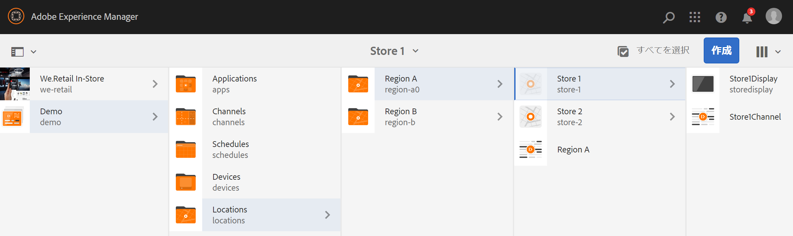

   同様に、「 **Store2Display** 」という表示を作成し、「** Store **2**」の下に「** Store2Channel」というチャネルを作成します(名前は「 **store**」)。

   >[!NOTE]
   >
   >ストア1とストア2で作成したチャネルにストアと同じ名前を使用で **きることを確** 認し **ます******。

   

   上記の手順に従って、チャネルを作成し、地域Bの下の **Store 3** 、 **Store 4** に表 **示します**。 繰り返しますが、チャネル **Store3Channelとチャネル** Store4Channelを作成する際に **、ストアと同じ名前を使用するようにし********** てください。

   次の画像は、 **Store 3のディスプレイとチャネルを示しています**。

   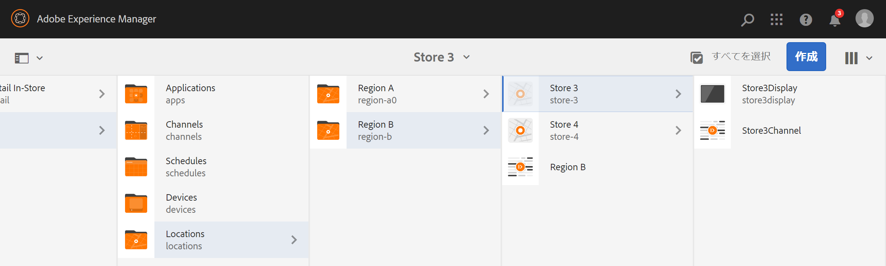

   次の画像は、 **Store 4の表示とチャネルを示してい**&#x200B;ます。

   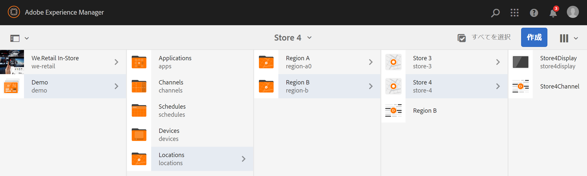

1. **チャネルのそれぞれの場所にコンテンツを追加します。**

   デモ **-&gt;ロケーション** -&gt;地域A **-&gt;地域A-&gt;** 地域E-&gt;アクションバーから編 **集 —********** 編集に移動します。 チャネルに追加するアセットをドラッグ&amp;ドロップします。

   >[!NOTE]
   >
   >上記の ***Resources*** セクションの **** Resources.zipファイルを使用して、画像をチャネルコンテンツのアセットとして使用できます。

   

   同様に、 **Demo** -&gt; Region **B locations** -&gt; Region B locations **&gt; B********** ClickアクションバーからEdit Editをクリックし、EditをクリックしてアクションバーからEditをドラッグし、アセットをチャネルにドラッグします。次に例を示します。

   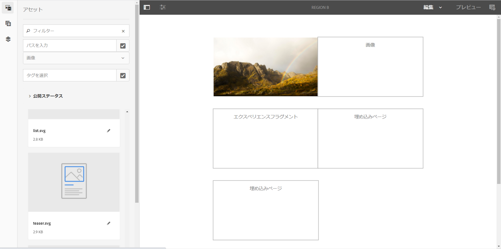

   前述の手順とリソースに従って、次のチャネルにコンテンツを追加します。

   * **Store1Channel**
   * **Store2Channel**
   * **Store3Channel**
   * **Store4Channel**

1. **スケジュールの作成**

   AEM Screensプロジェクトの **Schedules** フォルダーに移動して選択し、アクションバーの「 **Create** 」をクリックして新しいスケジュールを作成します。

   次の画像は、 **Demo** Projectで作成されたAdScheduleを示し **ています** 。

   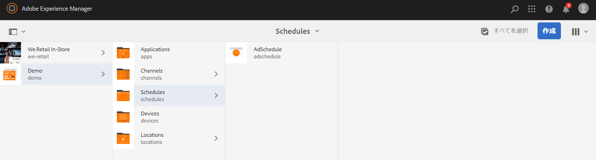

1. **チャネルをスケジュールに割り当てる**

   1. デモ —&gt;スケジュ **ール** —&gt; AdSchedule **（広告スケジュール）に移動し、アク********** ションバーから「ダッシュボード」をクリックします。
   1. [割り当て **済みチャネル** ]パネルの[+チャネルを割り当て **]をクリックして、[チャネルの割り当て****** ]ダイアログボックスを開きます。
   1. Select **Reference Channel**.. by path.
   1. チャネルパ **スを** Demo *** —&gt;** Channels ***—*** Global ***Global*** Global Pathとして選択します。
   1. Enter the **Channel Role** as **GlobalAdSegment**.
   1. 「サポートされ **るイベント** 」を「初 **期読み込み**」、「アイドル画面 **」、「ユーザーインタラク******&#x200B;ション」から選択します。
   1. 「**保存**」をクリックします。
   **地域の役割別にチャネルを割り当て：**

   1. [割り当て **済みチャネル** ]パネルの[+チャネルを割り当て **]をクリックして、[チャネルの割り当て****** ]ダイアログボックスを開きます。
   1. 参照チ **ャネル**.. 名前別.
   1. チャネル **名を地域** *.*と ****&#x200B;して入力します。
   1. Enter the **Channel Role** as **RegionAdSegment**.
   1. 「**保存**」をクリックします。
   **Assign Channel by Role for Store:**

   1. [割り当て **済みチャネル** ]パネルの[+チャネルを割り当て **]をクリックして、[チャネルの割り当て****** ]ダイアログボックスを開きます。
   1. 参照チ **ャネル**.. 名前別.
   1. チャネル名 **をストアとして** 入力 **します**。
   1. Enter the **Channel Role** as **StoreAdSegment**.
   1. 「**保存**」をクリックします。
   次の図は、割り当てられたチャネルをパス別および役割別に示しています。

   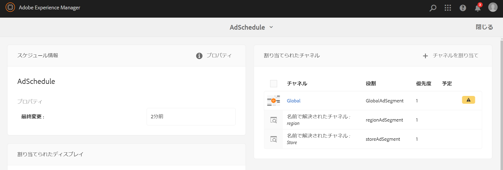

1. **グローバルチャネルへの動的埋め込みシーケンスの設定を参照してください。**

   最初に **** Demo **Projectで作成したグローバルチャネルに移動します** 。

   Click **Edit** from the action to open the editor.

   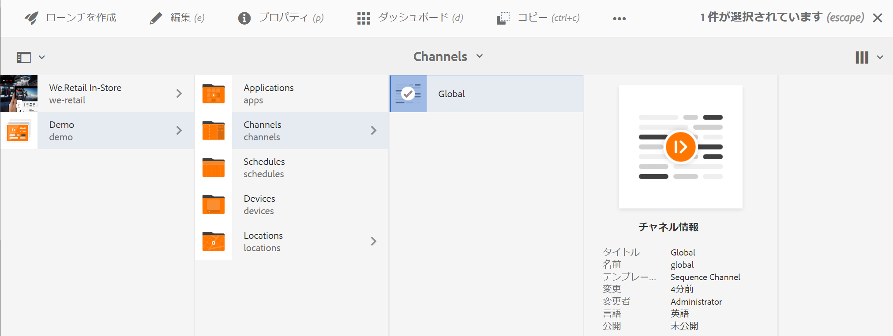

   2つのダイナミック埋め込みシーケ **ンスコンポーネントを** 、チャネルエディターにドラッグ&amp;ドロップします。

   いずれかのコンポーネントからプロパティを開き、RegionAdSegmentとして **チャネル割り当て** Roleを入 **力します**。

   同様に、他のコンポーネントを選択し、プロパティを開いて、チャネル割り当て **の役割をStoreAdSegment** として入 **力します**。

   

1. **各表示にスケジュールを割り当てる**

   1. 各ディスプレイ( **Demo** —&gt; Locations **&gt; Locations** — **Region a** —&gt; Store ******** 1 Store Display Display DisplayDisplayなど)に移動します。
   1. Click **Dashboard** from the action to open the display dashboard.
   1. **クリ**&#x200B;ック…[割り当てら **れたチャネルとスケジュール** ]パネルで、[ **+スケジュールの割り当て]をクリックします**。
   1. スケジュールのパスを選択します(例： **Demo** —&gt; **Schedules** —&gt;**AdSchedule**)。
   1. 「**保存**」をクリックします。

## 結果の表示 {#viewing-the-results}

チャネルの設定と表示が完了したら、AEM Screensプレーヤーを起動してコンテンツを表示してください。

>[!NOTE]
>
>AEM Screen playerについて詳しくは、次のリソースを参照してください。
>
>* [AEM Screensプレーヤーのダウンロード](https://download.macromedia.com/screens/)
>* [AEM Screens playerの操作](working-with-screens-player.md)

次の出力は、表示パスに応じて、AEM Screensプレーヤーでチャネルのコンテンツを確認するものです。

**シナリオ 1**:

表示パスを **Demo** —&gt; **Locations** —&gt; **Region A —&gt;** Store 1** —&gt;****** Display storeとして割り当てると、次のコンテンツはAEM playerの画面に表示されます。

**シナリオ 1**:

表示パスを **Demo** —&gt; **Locations** —&gt; **Region B —&gt;** Store 3** —&gt;****** Display storeとして割り当てると、次のコンテンツはAEM playerの画面に表示されます。

## ユーザーの制限とACLの変更 {#restricting-users-and-modifying-the-acls}

グローバル作成者、地域作成者またはローカル作成者を作成して、階層の上位のチャネルを編集するのを制限しながら、関連するコンテンツを編集できます。

ACLを変更して、ユーザーの場所に基づいてコンテンツへのユーザーのアクセスを制限する必要があります。

### 使用例 {#example-use-case}

次の例では、上記のDemoプロジェクト用に3人のユーザーを作成できます。

各グループに権限を割り当てるには、次の手順を実行します。

**グループ**:

* **Global-Author**: **Demoプロジェクト内のすべての場所とチャネルにアクセスでき、読み取り、書き込み** 、編集の権限を持つユーザーで構成されます。

* **Region-Author**:領域Aと領域Bに対する読み取り、書き込み、および編集権限を持つ **ユーザーで構** 成されます ****。

* **Store-Author**:Store 1、 **Store 2**、 **Store 3**、 **Store 4のみに対する読み取り、書き込み、編集の権限を持つユーザーで構成******&#x200B;されます。

#### ユーザーグループ、ユーザーの作成およびACLの設定手順 {#steps-for-creating-user-groups-users-and-setting-up-acls}

>[!NOTE]
>
>各個人またはチームが独自のプロジェクトを処理できるように、ACLを使用してプロジェクトを分類する方法の詳細については、「ACLの設定」を参照 **してください**。

次の手順に従って、グループ、ユーザーを作成し、権限に従ってACLを変更します。

1. **グループの作成**

   1. Navigate to **Adobe Experience Manager**.
   1. Click **Tools** --&gt; **Security** --&gt; **Groups**.
   1. 「グル **ープを作成** 」をクリックし **、** IDに「Global-Author **」と入力します**。
   1. 「**保存して閉じる**」をクリックします。
   同様に、「 **Region-Author」や「** Store-Author **」など、他の2つのグループを作成します**。

   

1. **ユーザーの作成とグループへのユーザーの追加**

   1. Navigate to **Adobe Experience Manager**.
   1. Click **Tools** --&gt; **Security** --&gt; **Users**.
   1. 「ユー **ザーを作成** 」をクリックし **、「** ID **」に「Global-User**」と入力します。
   1. このユー **ザーのパスワード** とパスワードの確認入力を行います。
   1. 「グループ **」タブをクリックし、「グループを選択」にグループ名を入力します。例えば、「** Global-Author **」と入力して、特定のグループ********** にGlobal-Userを追加します。
   1. 「**保存して閉じる**」をクリックします。
   同様に、 **Region-User** 、 **Store-Userなどの他の2人のユーザーを作成し、それらを** Region Authorに追加し、 ******** Store-Authorに追加します。

   >[!NOTE]
   >
   >ベストプラクティスは、ユーザーをグループに追加し、特定のユーザーのグループに権限を割り当てることです。

   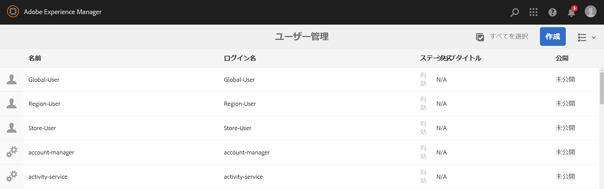

1. **すべてのグループを寄稿者に追加**

   1. Navigate to **Adobe Experience Manager**.
   1. Click **Tools** --&gt; **Security** --&gt; **Groups**.
   1. リストか **ら「寄稿者** 」を選択し、「メンバー」タ **ブを選択します** 。
   1. 「 **Group** (グローバル作成者 **)」、「** Region-Author」、 **「****** Store-Author投稿者」などを選択します。
   1. 「**保存して閉じる**」をクリックします。

1. **各グループの権限へのアクセス**

   1. 「 *Useradmin* 」に移動し、このUIを使用して異なるグループの権限を変更します。
   1. 次の図に示すよ **うに、「** Global-Author **」を検索し** 、「権限」タブをクリックします。
   1. 同様に、Region-Authorおよび **Store** -Authorの権限にア **クセスできます**。
   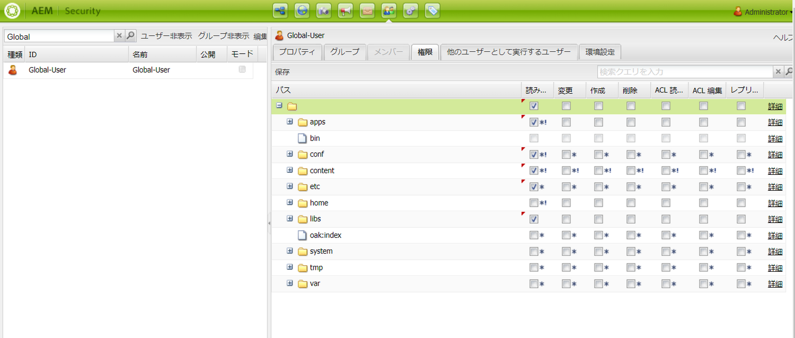

1. **各グループの権限の変更**

   **グローバル作成者の場合：**

   1. 「権限」タブに移 **動します** 。
   1. /content/screens/ ***demoに移動し*** 、すべての権限を確認します。
   1. /content/screens/ ***demo/locationsに移動し*** 、すべての権限を確認します
   1. /content/screens/demo/locations ***/*** region-aに移動し、すべての権限を確認します&#x200B;****** 。 同様に、region-bの権限を **確認します**。
   手順については、次の図を参照してください。
   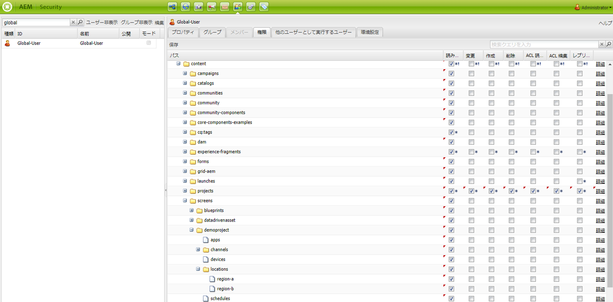

   次の図は、 **User** -Userが **Global Channel** Channel **,** And Regionにアクセスし、Global Channel **Channel Channel Regionが4、Store** Store **2、Store store 3、Store Store Store** Store 4Store Store Store Store Store Store Store Store Store Store NeStore Store Store Store Store Store The **Store Store Store Store Store Store Store Store Store Store The** Store Store Store Store S ******** Store 

   

   **地域 — 作成者の場合：**

   1. 「権限」タブに移 **動します** 。
   1. /content/screens/ ***demoに移動し*** 、「** Read**」権限のみを確認します。
   1. /content/screens/ ***demo/locationsに移動し、読み取り権限のみ*** (Read **** )を確認します。
   1. ***/content/screens/demo/channelsに移動し、グローバル ***チャネルの権限の確認を**解除&#x200B;**。***
   1. /content/screens/demo/locations ***/*** region-aに移動し、すべての権限を確認します&#x200B;****** 。 同様に、region-bの権限を **確認します**。
   手順については、次の図を参照してください。

   

   次の図は、地域ユーザが **A・地域と** B **・地域の両方にアクセスできることを示しています。** A・A・B・4・ **Store** 2・Store **2・Store** 4・Store **S・Store********** 4・Store N・TheGlobal Channal・Nnnalnal

   

   **Store-Authorの場合：**

   1. 「権限」タブに移 **動します** 。
   1. /content/screens/demoに移 ***動して*** 、読み取り権限のみを確認 **します** 。
   1. /content/screens/ ***demo/locationsに移動し、読み取り権限のみ*** (Read **** )を確認します。
   1. /content/screens/ ***demo/channelsに移動し*** 、グローバルチャネルの権限の確認を解除 **します** 。
   1. /content/screens/demo/locations/region-a ***に移動し、読み取り権限のみを確認し*** ます **** 。 同様に、 **region** -bの読み取り権限のみ **を選択します**。
   1. /content/screens/demo/locations ***/*** region-a /store-1に移動し、すべての権限を確認します&#x200B;****** 。 同様に、 **store-2、store-3および****store-4の権限を確認します**。
   手順については、次の図を参照してください。

   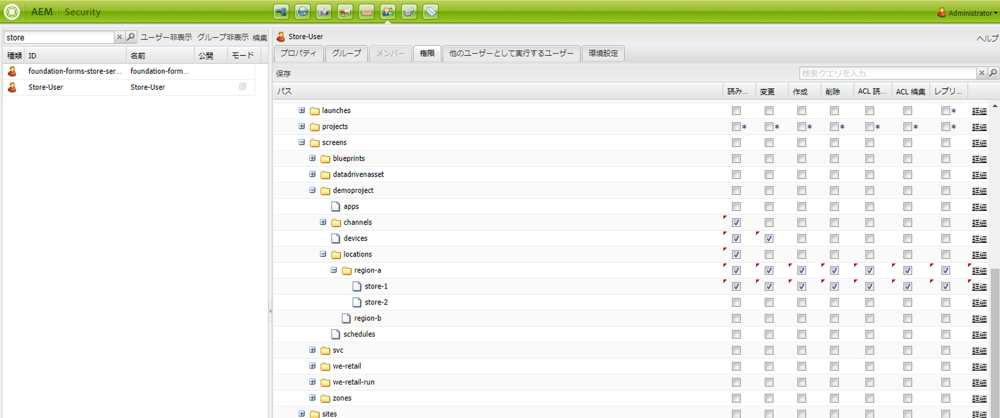

   次の図は、 **Store-User** ( **Store**) **User(** Store1 **,** 223) **4Store(Store)PermissionsToStore(Store)GlobalStore(Store)GrobalStore(Store)Gration(Store********AStoreStore(Store(StoreStoreStore)Store*StoreStore*Store*S)Store(S)Store(Store)Store**Store(StoreStoreStore*,** S) **Store,SeToS)** ToStoreSeGreare, **SToGan)ToToToToToGeToToGalToToToToStore(ToSe,**

   

>[!NOTE]
>
>権限の設定の詳細については、「ACLの設定」を参照 [してください](setting-up-acls.md)。

