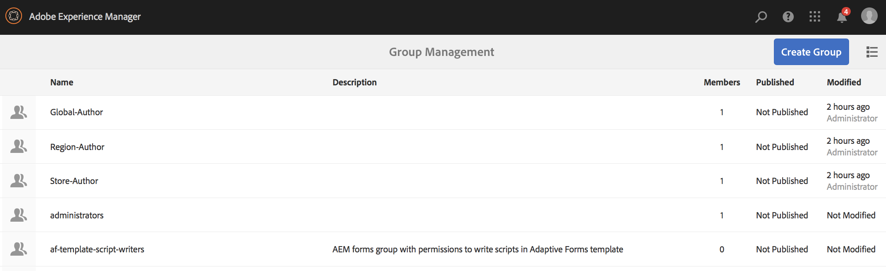

# 動的埋め込みシーケンスの使用 {#using-dynamic-embedded-sequence}

「動的埋め込みシーケンスの使用」では、以下のトピックについて説明します。

* **概要**
* **AEM Screens での動的埋め込みエクスペリエンスの使用**
* **結果の表示**
* **ユーザーの制限と ACL の変更**

## 概要 {#overview}

***動的埋め込みシーケンス***&#x200B;は、チャネルフォルダーではなくロケーションフォルダー内で子が参照される親子階層に従う大規模なプロジェクトの場合に作成されます。ユーザーは、***チャネルロール***&#x200B;別にチャネル内にシーケンスを埋め込むことができます。これにより、ユーザーは、メインチャネル内の埋め込みシーケンスを使用して、様々なオフィス向けにロケーション固有のプレースホルダーを定義できます。

チャネルをディスプレイに割り当てる際には、ディスプレイのパスを指定するか、（コンテキストにより実際のチャネルに解決される）チャネルロールを入力するかの 2 つのオプションがあります。

動的埋め込みシーケンスを使用するには、***チャネルロール***&#x200B;別にチャネルを割り当てます。チャネルロールはディスプレイのコンテキストを定義します。ロールは様々なアクションのターゲットになり、ロールを実行する実際のチャネルとは無関係です。ここでは、ロール別にチャネルを定義する使用例と、そのコンテンツをグローバルチャネルに利用する方法を説明します。ロールは、割り当て用の ID、またはディスプレイのコンテキストにおけるチャネルのエイリアスと考えることもできます。

### 動的埋め込みシーケンスを使用するメリット {#benefits-of-using-dynamic-embedded-sequences}

チャネルフォルダーではなくロケーションの中にシーケンスチャネルを配置する主なメリットは、ローカルまたは地域の作成者が、自分に関係のあるコンテンツを編集できる一方、上位階層のチャネルの編集を制限されることです。

*チャネルをロールで*&#x200B;参照することにより、ロケーション固有のコンテンツを動的に解決するために、チャネルのローカルバージョンを作成できます。また、ロケーション固有のチャネル用にコンテンツを活用するグローバルチャネルを作成することもできます。

>[!NOTE]
>
>**埋め込みシーケンスと動的埋め込みシーケンスの比較**
>
>動的埋め込みシーケンスは、埋め込みシーケンスと似ていますが、使用する際には階層に従うことができます。つまり、あるチャネルに対しておこなわれた変更／更新が、関連する他のチャネルにも反映されます。動的埋め込みシーケンスは、親子階層に従い、その中には画像やビデオなどのアセットも含まれます。
>
>***動的埋め込みシーケンス***&#x200B;ではロケーション固有のコンテンツを表示できるのに対して、***埋め込みシーケンス***&#x200B;では、コンテンツの一般的なスライドショーのみ表示できます。さらに、動的埋め込みシーケンスのセットアップ時に、チャネルのロールと名前を使用してチャネルを設定する必要があります。実際の実装については、以下の手順を参照してください。
>
>埋め込みシーケンスの実装について詳しくは、AEM Screens ドキュメントの[埋め込みシーケンス](embedded-sequences.md)を参照してください。

以下の例では、次のキーワードに的を絞ったソリューションを示しています。

* グローバルシーケンス用の&#x200B;***メインシーケンスチャネル***
* ローカルにカスタマイズ可能なシーケンス部分ごとの&#x200B;***動的埋め込みシーケンス***&#x200B;コンポーネント
* ディスプレイの&#x200B;***ロール***&#x200B;が&#x200B;*動的な埋め込みシーケンスコンポーネント*&#x200B;のロール&#x200B;**と一致するそれぞれのロケーションにある&#x200B;*個々のシーケンスチャネル*。**

>[!NOTE]
>
>チャネル割り当てについて詳しくは、AEM Screens ドキュメントのオーサリングに関する節の&#x200B;**[チャネル割り当て](channel-assignment.md)**&#x200B;を参照してください。

## 動的埋め込みシーケンスの使用 {#using-dynamic-embedded-sequence-2}

ここでは、AEM Screens チャネルでの動的埋め込みシーケンスの作成について説明します。

### 前提条件 {#prerequisites}

この機能の実装を開始する前に、次の前提条件を満たしていることを確認してください。

* AEM Screens プロジェクト（この例では **Demo**）を作成する

* **Channels** フォルダーの下に **Global** というチャネルを作成する

* **Global** チャネルにコンテンツを追加する（**&#x200B;関連するアセットについては **resources.zip** を確認してください）

次の画像は、**Channels** フォルダーに **Global** チャネルがある **Demo** プロジェクトを示しています。

### リソース {#resources}

次のリソース（画像）をダウンロードしてアセットに追加し、さらにデモ用のチャネルコンテンツとして使用できます。

[ファイルを入手](assets/resources.zip)

>[!NOTE]
>
>プロジェクトの作成方法とシーケンスチャネルの作成方法について詳しくは、以下のリソースを参照してください。
>
>* **[プロジェクトの作成と管理](creating-a-screens-project.md)**
>* **[チャネルの管理](managing-channels.md)**

>

AEM Screens プロジェクトに動的埋め込みシーケンスを実装するには、主に次の 3 つのタスクが必要になります。

1. **チャネル、ロケーション、ディスプレイなどのプロジェクト分類のセットアップ**
1. **スケジュールの作成**
1. **各ディスプレイへのスケジュールの割り当て**

この機能を実装するには、以下の手順に従います。

>[!CAUTION]
>
>動的埋め込みシーケンスを実装する場合は、各ロケーションにチャネルを作成する際に、「**名前**」フィールドと「**タイトル**」フィールドに注意してください。命名規則に慎重に従ってください。

1. **2 つのロケーションフォルダーを作成します。**

   AEM Screens プロジェクトの「**ロケーション**」フォルダーに移動し、「**Region A**」と「**Region B**」という 2 つのロケーションフォルダーを作成します。

   >[!NOTE]
   >
   >ロケーションフォルダー「**Region A**」を作成する際は、「**タイトル**」を「**Region A**」と入力してください。「**名前**」フィールドは空のままにしておくことができます。その場合は、「**region-a**」という名前が自動的に選択されます。
   >
   >以下のように、ロケーションフォルダー「**Region B**」を作成する場合も同様です。

   

   >[!NOTE]
   >ロケーションの作成方法については、**[ロケーションの作成と管理](managing-locations.md)**&#x200B;を参照してください。

1. **各ロケーションフォルダーに 2 つのロケーションと 1 つのチャネルを作成します。**

   1. **Demo**／**Locations**／**Region A** に移動します。
   1. 「**Region A**」を選択し、アクションバーの「**+ 作成**」をクリックします。
   1. ウィザードから「**ロケーション**」を選択し、「**タイトル**」を「**Store 1**」に設定します。同様に、ウィザードを使用して、「**タイトル**」が「**Store 2**」の別のロケーションを作成します。****「**Store 1**」と「**Store 2**」の作成時には、「**名前**」フィールドを空のままにしておくことができます。
   1. 上記の 2 番目の手順を繰り返し、今度はウィザードから「**シーケンスチャネル**」を選択します。このチャネルの「**タイトル**」に「**Region A**」、「**名前**」に「**region**」と入力します。

   >[!CAUTION]
   >
   >チャネル **Region A** を作成する際は、「**タイトル**」に「**Region A**」、「**名前**」に「**region**」と入力します。

   

   同様に、「**Region B**」で、「**Store 3**」および「**Store 4**」というタイトルの 2 つのロケーションを作成します。また、「**タイトル**」が「**Region B**」で「**名前**」が「**region**」の&#x200B;**シーケンスチャネル**&#x200B;も作成します。

   >[!CAUTION]
   >
   >**Region A** と **Region B** に作成したチャネルには、**region** という同じ名前を使用できることを確認してください。

   

1. **各ロケーションにディスプレイとチャネルを作成します。**

   1. **Demo**／**Locations**／**Region A**／**Store 1** に移動します。
   1. 「**Store 1**」を選択し、アクションバーの「**+ 作成**」をクリックします。
   1. ウィザードから「**ディスプレイ**」を選択し、「**Store1Display**」を作成します。
   1. 上記の 2 番目の手順を繰り返し、今度はウィザードから「**シーケンスチャネル**」を選択します。「**タイトル**」を「**Store1Channel**」、「**名前**」を「**store**」と入力します。

   >[!CAUTION]
   >
   >シーケンスチャネルを作成する際、チャネルの「**タイトル**」は要件に応じて設定できますが、「**名前**」はすべてのローカルチャネルで同じにする必要があります。
   >この例では、「**Region A**」と「**Region B**」のチャネルは「**region**」と「**Name**」が同じ、「**Store 1**」、「**Store 2**」、「**Store 3**」、おおよび「**Store 4**」は「**store**」と「**名前**」が同じになっています。

   

   同様に、**Store2Display** というディスプレイと、**Store2Channel** というチャネル（名前は **store**）を **Store 2** の中に作成します。

   >[!NOTE]
   >**Store 1** と **Store 2** に作成したチャネルには、**store** という同じ名前を使用できることを確認してください。

   

   前述の手順に従って、**Region B** の中の **Store 3** と **Store 4** にチャネルとディスプレイを作成します。繰り返しになりますが、**Store3Channel** チャネルと **Store4Channel** チャネルを作成する際は、必ず **store** という共通の「**名前**」にしてください。

   次の画像は、**Store 3** のディスプレイとチャネルを示しています。

   

   次の画像は、**Store 4** のディスプレイとチャネルを示しています。

   

1. **チャネルのそれぞれのロケーションにコンテンツを追加します。**

   **Demo**／**Locations**／**Region A**／**Region A** に移動し、アクションバーの「**編集**」をクリックします。チャネルに追加するアセットをドラッグ＆ドロップします。

   >[!NOTE]
   >上記の&#x200B;***リソース***&#x200B;で言及した **resources.zip** ファイルを使用して、その中の画像をチャネルコンテンツのアセットとして使用できます。

   

   同様に、**Demo**／**Locations**／**Region B**／**Region B** に移動し、アクションバーの「**編集**」をクリックして、アセットをチャネルにドラッグ＆ドロップします（下図を参照）。

   

   前述の手順とリソースに従って、次のチャネルにコンテンツを追加します。

   * **Store1Channel**
   * **Store2Channel**
   * **Store3Channel**
   * **Store4Channel**

1. **スケジュールを作成します。**

   AEM Screens プロジェクトの&#x200B;**スケジュール**&#x200B;フォルダーを選択し、アクションバーの「**作成**」をクリックして新しいスケジュールを作成します。

   次の画像は、**Demo** プロジェクトに作成した **AdSchedule** を示しています。

   

1. **スケジュールにチャネルを割り当てます。**

   1. **Demo**／**Schedules**／**AdSchedule** に移動し、アクションバーの「**ダッシュボード**」をクリックします。
   1. **割り当てられたチャネル**&#x200B;パネルの「**+ チャネルを割り当て**」をクリックして、**チャネル割り当て**&#x200B;ダイアログボックスを開きます。
   1. 「**チャネルを参照...**」で「パス別」を選択します。
   1. 「**チャネルパス**」で **Demo**／***Channels***／***Global*** を選択します。
   1. 「**チャネルロール**」に「**GlobalAdSegment**」と入力します。
   1. 「**サポートされているイベント**」として、「**最初の読み込み**」、「**待機中画面**」、「**ユーザーインタラクション**」を選択します。
   1. 「**保存**」をクリックします。

   **地域のチャネルをロール別に割り当てます。**

   1. **割り当てられたチャネル**&#x200B;パネルの「**+ チャネルを割り当て**」をクリックして、**チャネル割り当て**&#x200B;ダイアログボックスを開きます。
   1. 「**チャネルを参照...**」で「名前別」を選択します。
   1. 「**チャネル名**」に「**region**」と入力します *。
   1. 「**チャネルロール**」に「**RegionAdSegment**」と入力します。
   1. 「**保存**」をクリックします。

   **ストアのチャネルをロール別に割り当てます。**

   1. **割り当てられたチャネル**&#x200B;パネルの「**+ チャネルを割り当て**」をクリックして、**チャネル割り当て**&#x200B;ダイアログボックスを開きます。
   1. 「**チャネルを参照...**」で「名前別」を選択します。
   1. 「**チャネル名**」に「**store**」と入力します。
   1. 「**チャネルロール**」に「**StoreAdSegment**」と入力します。
   1. 「**保存**」をクリックします。

   次の図は、割り当てられたチャネルをパス別およびロール別に示しています。

   

1. **動的埋め込みシーケンスをグローバルチャネルに設定します。**

   **Demo** プロジェクトに最初に作成した **Global** チャネルに移動します。

   アクションバーの「**編集**」をクリックして、エディターを開きます。

   

   2 つの&#x200B;**動的埋め込みシーケンス**&#x200B;コンポーネントをチャネルエディターにドラッグ＆ドロップします。

   どちらか一方のコンポーネントのプロパティを開き、「**チャネル割り当ての役割**」に「**RegionAdSegment**」と入力します。

   同様に、もう一方のコンポーネントを選択し、プロパティを開いて、「**チャネル割り当ての役割**」に「**StoreAdSegment**」と入力します。

   

1. **各ディスプレイへのスケジュールの割り当て**

   1. **Demo**／**Locations**／**Region A**／**Store 1**／**Store1Display** などと、各ディスプレイに移動します。
   1. アクションバーの「**ダッシュボード**」をクリックして、ディスプレイダッシュボードを開きます。
   1. **割り当てられたチャネルとスケジュール**&#x200B;パネルで「**...**」をクリックし、さらに「**+ スケジュールを割り当て**」をクリックします。
   1. スケジュールのパスを選択します（例：**Demo**／**Schedules**／**AdSchedule**）。
   1. 「**保存**」をクリックします。

## 結果の表示 {#viewing-the-results}

チャネルとディスプレイのセットアップが完了したら、AEM Screens Player を起動してコンテンツを表示してください。

>[!NOTE]
>
>AEM Screens Player については、次のリソースを参照してください。
>
>* [AEM Screens Player のダウンロード](https://download.macromedia.com/screens/)
>* [AEM Screens Player での作業](working-with-screens-player.md)

以下では、ディスプレイパスに応じて、AEM Screens Player でチャネルのコンテンツを確認します。

**シナリオ 1**：

**Demo**／**Locations**／**Region A**／**Store 1**／**Store1Display** というディスプレイパスを割り当てた場合は、次のコンテンツが AEM Screens Player に表示されます。

**シナリオ 1**：

**Demo**／**Locations**／**Region B**／**Store 3**／**Store3Display** というディスプレイパスを割り当てた場合は、次のコンテンツが AEM Screens Player に表示されます。

## ユーザーの制限と ACL の変更 {#restricting-users-and-modifying-the-acls}

グローバル、地域またはローカルの作成者ユーザーを作成して、作成者が自分に関係のあるコンテンツを編集できる一方、上位階層のチャネルの編集を制限されるようにすることができます。

ユーザーの場所に基づいてコンテンツへのユーザーのアクセスを制限するように ACL を変更する必要があります。

### 使用例 {#example-use-case}

次の例では、上記の Demo プロジェクトのユーザーを 3 人作成できます。

各グループに割り当てられる権限は、次のとおりです。

**グループ**：

* **Global-Author**：**Demo** プロジェクト内のすべてのロケーションとチャネルにアクセスでき、読み取り、書き込み、編集の権限をすべて持っているユーザーで構成されます。

* **Region-Author**：**Region A** と **Region B** に対する読み取り、書き込み、編集の権限を持つユーザーで構成されます。

* **Store-Author**：**Store 1**、**Store 2**、**Store 3**、**Store 4** のみに対する読み取り、書き込み、編集の権限を持つユーザーで構成されます。

#### ユーザーグループとユーザーの作成および ACL の設定の手順 {#steps-for-creating-user-groups-users-and-setting-up-acls}

>[!NOTE]
>
>各個人または各チームが独自のプロジェクトを扱えるように、ACL を使用してプロジェクトを区別する方法について詳しくは、**ACL の設定**&#x200B;を参照してください。

グループとユーザーを作成し、ACL を権限に応じて変更するには、以下の手順に従います。

1. **グループの作成**

   1. **Adobe Experience Manager** に移動します。
   1. **ツール**／**セキュリティ**／**グループ**&#x200B;をクリックします。
   1. 「**グループを作成**」をクリックし、「**ID**」に「**Global-Author**」と入力します。
   1. 「**保存して閉じる**」をクリックします。

   同様に、**Region-Author** や **Store-Author** など、他の 2 つのグループを作成します。

   

1. **ユーザーの作成とグループへのユーザーの追加**

   1. **Adobe Experience Manager** に移動します。
   1. **ツール**／**セキュリティ**／**ユーザー**&#x200B;をクリックします。
   1. 「**ユーザーを作成**」をクリックし、「**ID**」に「**Global-User**」と入力します。
   1. このユーザーのパスワードを「**パスワード**」に入力し、パスワードの確認入力もおこないます。
   1. 「**グループ**」タブをクリックし、「**グループを選択**」でグループ名を入力します。例えば、「**Global-Author**」と入力して、その特定のグループに **Global-User** を追加します。
   1. 「**保存して閉じる**」をクリックします。

   同様に、**Region-User** や **Store-User** など、他の 2 人のユーザーを作成し、それらを **Region-Author** と **Store-Author** にそれぞれ追加します。

   >[!NOTE]
   >グループにユーザーを追加してから、個々のユーザーグループに権限を割り当てることをお勧めします。

   

1. **寄稿者へのすべてのグループの追加**

   1. **Adobe Experience Manager** に移動します。
   1. **ツール**／**セキュリティ**／**グループ**&#x200B;をクリックします。
   1. リストから「**寄稿者**」を選択し、「**メンバー**」タブを選択します。
   1. **Global-Author**、**Region-Author**、**Store-Author** などの&#x200B;**グループ**&#x200B;を寄稿者に選択します。
   1. 「**保存して閉じる**」をクリックします。

1. **各グループの権限へのアクセス**

   1. *useradmin* に移動し、この UI を使用して様々なグループの権限を変更します。
   1. **Global-Author** を検索し、「**権限**」タブをクリックします（下図を参照）。
   1. 同様に、**Region-Author** と **Store-Author** の権限にもアクセスできます。

   

1. **各グループの権限の変更**

   **Global-Author の場合：**

   1. 「**権限**」タブに移動します。
   1. ***/content/screens/demo*** に移動し、すべての権限を有効にします。
   1. ***/content/screens/demo/locations*** に移動し、すべての権限を有効にします。
   1. ***/content/screens/demo/locations/region-a*** に移動し、すべての権限を有効にします。同様に、**region-b** の権限を有効にします。

   この手順の参考として、次の図を参照してください。
   

   次の図を見ると、**Global-User** が **Global** チャネルのほか、**Store 1**、**Store 2**、**Store 3**、**Store 4** という 4 つの店舗がある **Region A** と **Region B** の両方にもアクセスできるようになったことがわかります。

   

   **Region-Author の場合：**

   1. 「**権限**」タブに移動します。
   1. ***/content/screens/demo*** に移動し、**読み取り**&#x200B;権限のみ有効にします。
   1. ***/content/screens/demo/locations*** に移動し、**読み取り**&#x200B;権限のみ有効にします。
   1. ***/content/screens/demo/channels*** に移動し、**Global** チャネルに対する権限を無効にします。
   1. ***/content/screens/demo/locations***/***region-a*** に移動し、すべての権限を有効にします。同様に、**region-b** の権限を有効にします。

   この手順の参考として、次の図を参照してください。

   

   次の図を見ると、Region-User が、**Store 1**、**Store 2**、**Store 3**、**Store 4** という 4 つの店舗がある **Region A** と **Region B** の両方にアクセスできるようになった一方、**Global** チャネルにはアクセスできなくなったことがわかります。

   

   **Store-Author の場合：**

   1. 「**権限**」タブに移動します。
   1. ***/content/screens/demo*** に移動し、**読み取り**&#x200B;権限のみ有効にします。
   1. ***/content/screens/demo/locations*** に移動し、**読み取り**&#x200B;権限のみ有効にします。
   1. ***/content/screens/demo/channels*** に移動し、**Global** チャネルに対する権限を無効にします。
   1. ***/content/screens/demo/locations/region-a*** に移動し、**読み取り**&#x200B;権限のみ有効にします。同様に、**region-b** の&#x200B;**読み取り**&#x200B;権限のみ有効にします。
   1. ***/content/screens/demo/locations***/***region-a /store-1*** に移動し、すべての権限を有効にします。同様に、**store-2、store-3、****store-4** に対する権限を有効にします。

   この手順の参考として、次の図を参照してください。

   

   次の図を見ると、**Store-User** が、**Store 1**、**Store 2**、**Store 3**、**Store 4** という 4 つの店舗にのみアクセスでき、**Global** チャネルまたは地域チャネル（**Region A** と **Region B**）にはアクセスできなくなったことがわかります。

   

>[!NOTE]
>
>権限の設定について詳しくは、[ACL の設定](setting-up-acls.md)を参照してください。

