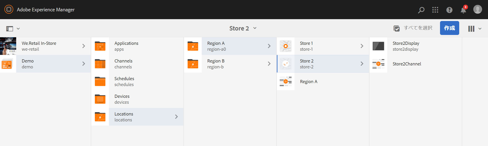

# 動的埋め込みシーケンスの使用 {#using-dynamic-embedded-sequence}

「動的埋め込みシーケンスの使用」では、以下のトピックについて説明します。

* **概要**
* **AEM Screens での動的埋め込みエクスペリエンスの使用**
* **結果の表示**
* **ユーザーの制限と ACL の変更**

## 概要 {#overview}

***動的埋め込みシーケンス*** は、親子階層に従う大きなプロジェクトの場合に作成されます。子は、チャネルフォルダーではなく、ロケーションフォルダー内で参照されます。 ユーザーは、***チャネルロール***&#x200B;別にチャネル内にシーケンスを埋め込むことができます。これにより、ユーザーは、メインチャネル内の埋め込みシーケンスを使用して、様々なオフィス向けにロケーション固有のプレースホルダーを定義できます。

ディスプレイにチャネルを割り当てる際に、ディスプレイのパスを指定するオプションがあります。 または、実際のチャネルに解決されるチャネルの役割をコンテキストで指定できます。

動的埋め込みシーケンスを使用するには、***チャネルロール***&#x200B;別にチャネルを割り当てます。チャネルロールはディスプレイのコンテキストを定義します。この役割は、様々なアクションをターゲットとし、その役割を果たす実際のチャネルとは独立しています。 ここでは、ロール別にチャネルを定義する使用例と、そのコンテンツをグローバルチャネルに適用する方法を説明します。ロールは、割り当て用の ID、またはディスプレイのコンテキストにおけるチャネルのエイリアスと考えることもできます。

### 動的埋め込みシーケンスを使用するメリット {#benefits-of-using-dynamic-embedded-sequences}

シーケンスチャネルをチャネルフォルダーではなく場所に配置すると、ローカルまたは地域の作成者が自身に関連するコンテンツを編集できるようになります。 また、階層の上位にあるチャネルの編集を制限することもできます。

の参照 *役割別チャネル*&#x200B;では、チャネルのローカルバージョンを作成できます。 これにより、場所固有のコンテンツが動的に解決されます。また、場所固有のチャネルのコンテンツを使用するグローバルチャネルを作成することもできます。

>[!NOTE]
>
>**埋め込みシーケンスと動的埋め込みシーケンスの比較**
>
>動的埋め込みシーケンスは埋め込みシーケンスに似ていますが、あるチャネルに対する変更や更新が他のチャネルに関連して反映される階層に従うことができます。 親子階層に従い、画像やビデオなどのアセットも含まれます。
>
>***動的埋め込みシーケンス***&#x200B;ではロケーション固有のコンテンツを表示できるのに対して、***埋め込みシーケンス***&#x200B;では、コンテンツの一般的なスライドショーのみ表示できます。また、動的埋め込みシーケンスを設定する際に、チャネルの役割と名前を使用してチャネルを設定します。 実践的に実装するには、以下の手順を参照します。
>
>埋め込みシーケンスの実装について詳しくは、AEM Screens ドキュメントの[埋め込みシーケンス](embedded-sequences.md)を参照してください。

以下の例では、次のキーワードに的を絞ったソリューションを示しています。

* グローバルシーケンス用の&#x200B;***メインシーケンスチャネル***
* ローカルにカスタマイズ可能なシーケンス部分ごとの&#x200B;***動的埋め込みシーケンス***&#x200B;コンポーネント
* ディスプレイの&#x200B;*ロール*&#x200B;が&#x200B;**動的な埋め込みシーケンスコンポーネント&#x200B;*のロール***と一致するそれぞれのロケーションにある&#x200B;***個々のシーケンスチャネル***。

>[!NOTE]
>
>チャネル割り当てについて詳しくは、 **[チャネル割り当て](channel-assignment.md)** AEM Screens ドキュメントのオーサリングの節の下にあります。

## 動的埋め込みシーケンスの使用 {#using-dynamic-embedded-sequence-2}

ここでは、AEM Screens チャネルでの動的埋め込みシーケンスの作成について説明します。

### 前提条件 {#prerequisites}

この機能の実装を開始する前に、次の前提条件を満たしていることを確認してください。

* AEM Screens プロジェクト（この例では **Demo**）を作成する
* を作成 **グローバル** の下のチャネル **チャネル** フォルダー。
* **Global** チャネルにコンテンツを追加する（*関連するアセットについては&#x200B;**resources.zip**を確認してください*）

次の画像は、 **デモ** を使用したプロジェクト **グローバル** 内のチャネル **チャネル** フォルダー。

### リソース {#resources}

次のリソース（画像）をダウンロードしてアセットに追加し、デモ用のチャネルコンテンツとして使用できます。

[ファイルを入手](assets/resources.zip)

>[!NOTE]
>
>プロジェクトの作成方法とシーケンスチャネルの作成方法について詳しくは、以下のリソースを参照してください。
>
>* **[プロジェクトの作成と管理](creating-a-screens-project.md)**
>* **[チャネルの管理](managing-channels.md)**
>

AEM Screens プロジェクトに動的埋め込みシーケンスを実装するには、主に次の 3 つのタスクが必要になります。

1. **チャネル、ロケーション、ディスプレイなどのプロジェクト分類のセットアップ**
1. **スケジュールの作成**
1. **各ディスプレイへのスケジュールの割り当て**

この機能を実装するには、以下の手順に従います。

>[!CAUTION]
>
>動的埋め込みシーケンスを実装する場合は、各ロケーションにチャネルを作成する際に、「**名前**」フィールドと「**タイトル**」フィールドに注意してください。命名規則に慎重に従ってください。

1. **2 つのロケーションフォルダーを作成します。**

   AEM Screens プロジェクトの「**ロケーション**」フォルダーに移動し、「**Region A**」と「**Region B**」という 2 つのロケーションフォルダーを作成します。

   >[!NOTE]
   >
   >ロケーションフォルダー「**Region A**」を作成する際は、「**タイトル**」を「**Region A**」と入力してください。「**名前**」フィールドは空のままにしておくことができます。その場合は、「**region-a**」という名前が自動的に選択されます。
   >
   >場所フォルダーの作成の場合も同様です **地域 B**&#x200B;を次に示します。

   

   >[!NOTE]
   >ロケーションの作成方法については、**[ロケーションの作成と管理](managing-locations.md)**&#x200B;を参照してください。

1. **各ロケーションフォルダーに 2 つのロケーションと 1 つのチャネルを作成します。**

   1. **Demo**／**Locations**／**Region A** に移動します。
   1. クリック **地域 A** をクリックして、 **+作成** アクションバーから。
   1. クリック **場所** を使用してウィザードから **タイトル** as **ストア 1**. 同様に、ウィザードから別の場所として、というタイトルを付けて作成します **ストア 2** （を使用） **タイトル** as **ストア 2**. 「**Store 1**」と「**Store 2**」の作成時には、「**名前**」フィールドを空のままにしておくことができます。
   1. 手順（b）を繰り返し、ここで **シーケンスチャネル** ウィザードから変更します。 を入力 **タイトル** as **地域 A** および **名前** as the **地域** このチャネル用。

   >[!CAUTION]
   >
   >チャネルを作成する際は、を確認してください **地域 A**&#x200B;を入力します **タイトル** as **地域 A** および **名前** as a **地域**.

   

   同様に、「**Region B**」で、「**Store 3**」および「**Store 4**」というタイトルの 2 つのロケーションを作成します。また、「**タイトル**」が「**Region B**」で「**名前**」が「**region**」の&#x200B;**シーケンスチャネル**&#x200B;も作成します。

   >[!CAUTION]
   >
   >**Region A** と **Region B** に作成したチャネルには、**region** という同じ名前を使用できることを確認してください。

   

1. **各ロケーションにディスプレイとチャネルを作成します。**

   1. **Demo**／**Locations**／**Region A**／**Store 1** に移動します。
   1. クリック **ストア 1** をクリックして、 **+作成** アクションバーから。
   1. クリック **表示** ウィザードからの作成 **`Store1Display`**.
   1. 手順（b）を繰り返し、今回は **シーケンスチャネル** ウィザードから変更します。 「**タイトル**」を「**`Store1Channel`**」と入力し、「**名前**」を「**store**」と入力します。

   >[!CAUTION]
   >
   >シーケンスチャネルを作成する際、チャネルの「**タイトル**」は要件に応じて設定できますが、「**名前**」はすべてのローカルチャネルで同じにする必要があります。
   >この例では、**地域 A** および&#x200B;**地域 B** 配下のチャネルは、**地域**&#x200B;として&#x200B;**名前**&#x200B;を共有し、**`Store 1`**、**`Store 2`**、**`Store 3`**、および **`Store 4`** 配下のチャネルは、**store** として&#x200B;**名前**&#x200B;を共有します。

   

   同様に、**`Store2Display`** というディスプレイと、**`Store2Channel`** というチャネル（名前は **store**）を **`Store `2** の下に作成します。

   >[!NOTE]
   >**store** として **`Store 1`** および **`Store 2`** で作成したチャネルには、必ず同じ名前を使用してください。

   

   上記の手順に従ってチャネルを作成し、**Region B** 配下の **`Store 3`** および **`Store 4`** で表示します。繰り返しになりますが、**`Store3Channel`** と&#x200B;**`Store4Channel`** を作成する際は、必ず **store** という共通の「**名前**」にしてください。

   次の画像は、**`Store 3`** のディスプレイとチャネルを示しています。

   

   次の画像は、**`Store 4`** のディスプレイとチャネルを示しています。

   

1. **チャネルのそれぞれのロケーションにコンテンツを追加します。**

   **Demo**／**Locations**／**Region A**／**Region A** に移動し、アクションバーの「**編集**」をクリックします。チャネルに追加するアセットをドラッグ＆ドロップします。

   >[!NOTE]
   >上記の&#x200B;***リソース***&#x200B;で言及した **resources.zip** ファイルを使用して、その中の画像をチャネルコンテンツのアセットとして使用できます。

   

   同様に、**Demo**／**Locations**／**Region B**／**Region B** に移動し、アクションバーの「**編集**」をクリックして、アセットをチャネルにドラッグ＆ドロップします（下図を参照）。

   

   前述の手順とリソースに従って、次のチャネルにコンテンツを追加できます。

   * **`Store1Channel`**
   * **`Store2Channel`**
   * **`Store3Channel`**
   * **`Store4Channel`**

1. **スケジュールを作成します。**

   に移動し、 **スケジュール** AEM Screens プロジェクトのフォルダー。 次に、アクションバーの「**作成**」をクリックします。

   次の画像は、 **AdSchedule** 作成場所 **デモ** プロジェクト。

   

1. **スケジュールにチャネルを割り当てます。**

   1. **Demo**／**Schedules**／**AdSchedule** に移動し、アクションバーの「**ダッシュボード**」をクリックします。
   1. クリック **+ チャネルを割り当て** から **割り当てられたチャネル** パネルを開く **チャネル割り当て** ダイアログが表示されます。
   1. クリック **参照チャネル** パス。
   1. 「」をクリックします **チャネルパス**&#x200B;と同様 **デモ** > ***チャネル*** > ***グローバル***.
   1. を入力 **チャネルロール**&#x200B;と同様 **GlobalAdSegment**.
   1. 「」をクリックします **サポートされるイベント**&#x200B;と同様 **初期読み込み**, **アイドル画面**、および **ユーザーインタラクション**.
   1. 「**保存**」をクリックします。

   **地域のチャネルをロール別に割り当てます。**

   1. **割り当てられたチャネル**&#x200B;パネルで「**+ チャネルを割り当て**」をクリックします。
   1. チャネルの割り当てダイアログボックスで、 **参照チャネル** 名前別。
   1. 「**チャネル名**」に「**region**」と入力します *。
   1. 「**チャネルロール**」に「**RegionAdSegment**」と入力します。
   1. 「**保存**」をクリックします。

   **ストアのチャネルをロール別に割り当てます。**

   1. **割り当てられたチャネル**&#x200B;パネルで「**+ チャネルを割り当て**」をクリックします。
   1. チャネルの割り当てダイアログボックスで、 **参照チャネル** 名前別。
   1. 「**チャネル名**」に「**store**」と入力します。
   1. 「**チャネルロール**」に「**StoreAdSegment**」と入力します。
   1. 「**保存**」をクリックします。

   次の図は、割り当てられたチャネルをパス別およびロール別に示しています。

   

1. **動的埋め込みシーケンスをグローバルチャネルに設定します。**

   に移動します。 **グローバル** 最初に作成したチャネル： **デモ** プロジェクト。

   アクションバーの「**編集**」をクリックします。

   

   エディターで、2 つの&#x200B;**動的埋め込みシーケンス**&#x200B;コンポーネントをチャネルエディターにドラッグ＆ドロップします。

   どちらか一方のコンポーネントのプロパティを開き、「**チャネル割り当ての役割**」に「**RegionAdSegment**」と入力します。

   同様に、他のコンポーネントをクリックし、プロパティを開いてを入力します **チャネル割り当ての役割** as **StoreAdSegment**.

   

1. **各ディスプレイへのスケジュールの割り当て**

   1. **Demo**／**Locations**／**Region A**／**Store 1**／**`Store1Display`** などと、各ディスプレイに移動します。
   1. アクションバーから「**ダッシュボード**」をクリックします。
   1. ダッシュボードで、**割り当てられたチャネルとスケジュール**&#x200B;パネルの「**...**」をクリックし、さらに「**+ スケジュールを割り当て**」をクリックします。
   1. スケジュールのパスをクリックします（ここでは、 **デモ** > **スケジュール** > **AdSchedule**）に設定します。
   1. 「**保存**」をクリックします。

## 結果の表示 {#viewing-the-results}

チャネルと表示の設定が完了したら、AEM Screens Player を起動してコンテンツを表示します。

>[!NOTE]
>
>AEM Screens Player について詳しくは、次のリソースを参照してください。
>
>* [AEM Screens Player のダウンロード](https://download.macromedia.com/screens/)
>* [AEM Screens Player での作業](working-with-screens-player.md)

以下の出力は、ディスプレイパスに応じて、AEM Screens Player のチャネルコンテンツを確認するものです。

**シナリオ 1**：

表示パスをに割り当てた場合 **デモ** > **場所** > **地域 A** > **ストア 1** > **`Store1Display`**&#x200B;では、次のコンテンツがAEM Screens Player に表示されます。

**シナリオ 1**：

表示パスをに割り当てた場合 **デモ** > **場所** > **地域 B** > **ストア 3** > **`Store3Display`**&#x200B;では、次のコンテンツがAEM Screens Player に表示されます。

## ユーザーの制限と ACL の変更 {#restricting-users-and-modifying-the-acls}

グローバル、地域またはローカルの作成者を作成して、階層の上位のチャネルの編集を制限しながら、それらに関連するコンテンツを編集できます。

ACL を編集して、場所に基づいてコンテンツに対するユーザーのアクセスを制限できます。

### 使用例 {#example-use-case}

次の例では、上記の Demo プロジェクトのユーザーを 3 人作成できます。

各グループに割り当てられる権限は、次のとおりです。

**グループ**：

* **Global-Author**：**Demo** プロジェクト内のすべてのロケーションとチャネルにアクセスでき、読み取り、書き込み、編集の権限をすべて持っているユーザーで構成されます。

* **Region-Author**：**Region A** と **Region B** に対する読み取り、書き込み、編集の権限を持つユーザーで構成されます。

* **Store-Author**：**Store 1**、**Store 2**、**Store 3**、**Store 4** のみに対する読み取り、書き込み、編集の権限を持つユーザーで構成されます。

#### ユーザーグループとユーザーの作成および ACL の設定の手順 {#steps-for-creating-user-groups-users-and-setting-up-acls}

>[!NOTE]
>
>各個人または各チームが独自のプロジェクトを扱えるように、ACL を使用してプロジェクトを区別する方法について詳しくは、**ACL の設定**&#x200B;を参照してください。

グループとユーザーを作成し、ACL を権限に応じて変更するには、以下の手順に従います。

1. **グループの作成**

   1. **Adobe Experience Manager** に移動します。
   1. **ツール**／**セキュリティ**／**グループ**&#x200B;をクリックします。
   1. 「**グループを作成**」をクリックし、「**ID**」に「**Global-Author**」と入力します。
   1. 「**保存して閉じる**」をクリックします。

   同様に、**Region-Author** や **Store-Author** など、他の 2 つのグループを作成します。

   

1. **ユーザーの作成とグループへのユーザーの追加**

   1. **Adobe Experience Manager** に移動します。
   1. **ツール**／**セキュリティ**／**ユーザー**&#x200B;をクリックします。
   1. 「**ユーザーを作成**」をクリックし、「**ID**」に「**Global-User**」と入力します。
   1. Enter **パスワード** そして、このユーザーのパスワードを確認します。
   1. 「」をクリックします **グループ** tab キーを押して、にグループ名を入力します。 **Click Group**&#x200B;例えば、 **Global-Author** 追加 **Global-User** その特定のグループに。
   1. 「**保存して閉じる**」をクリックします。

   同様に、次のような 2 人の他のユーザーを作成します **Region-User** および **Store-User**&#x200B;を作成して、に追加します **Region-Author** および **Store-Author** それぞれ。

   >[!NOTE]
   >グループにユーザーを追加してから、個々のユーザーグループに権限を割り当てることをお勧めします。

   

1. **寄稿者へのすべてのグループの追加**

   1. **Adobe Experience Manager** に移動します。
   1. **ツール**／**セキュリティ**／**グループ**&#x200B;をクリックします。
   1. クリック **投稿者** リストで、 **メンバー** タブ。
   1. 「」をクリックします **グループ** 例： **Global-Author**, **地域作成者** および **Store-Author** コントリビューターに対して
   1. 「**保存して閉じる**」をクリックします。

1. **各グループの権限へのアクセス**

   1. に移動します。 *ユーザー管理者* この UI を使用して、様々なグループの権限を変更できます。
   1. を検索 **Global-Author** をクリックし、 **権限** タブを付けます（下図を参照）。
   1. 同様に、**Region-Author** と **Store-Author** の権限にもアクセスできます。

   

1. **各グループの権限の変更**

   **Global-Author の場合：**

   1. 「**権限**」タブに移動します。
   1. ***/content/screens/demo*** に移動し、すべての権限を有効にします。
   1. ***/content/screens/demo/locations*** に移動し、すべての権限を有効にします。
   1. ***/content/screens/demo/locations/region-a*** に移動し、すべての権限を有効にします。同様に、**`region-b`** の権限を有効にします。

   手順について理解するためには、次の図を参照してください。
   

   以下は、 **Global-User** にアクセスできます **グローバルチャネル**. および両方へのアクセス **地域 A** および **地域 B** 4 つの店すべてで、すなわち **ストア 1**, **ストア 2**, **ストア 3**、および **ストア 4**.

   

   **Region-Author の場合：**

   1. 「**権限**」タブに移動します。
   1. ***/content/screens/demo*** に移動し、**読み取り**&#x200B;権限のみ有効にします。
   1. ***/content/screens/demo/locations*** に移動し、**読み取り**&#x200B;権限のみ有効にします。
   1. ***/content/screens/demo/channels*** に移動し、**Global** チャネルに対する権限を無効にします。
   1. ***/content/screens/demo/locations***/***region-a*** に移動し、すべての権限を有効にします。同様に、**`region-b`** の権限を有効にします。

   手順を理解するには、次の画像を参照してください。

   

   次に示すのは、地域ユーザーが両方にアクセスできることを示します **地域 A** および **地域 B**. そして、すべての 4 店舗、すなわちアクセス **ストア 1**, **ストア 2**, **ストア 3**、および **ストア 4**&#x200B;ただし、はにアクセスしません **グローバル** チャネル。

   

   **Store-Author の場合：**

   1. 「**権限**」タブに移動します。
   1. ***/content/screens/demo*** に移動し、**読み取り**&#x200B;権限のみ有効にします。
   1. ***/content/screens/demo/locations*** に移動し、**読み取り**&#x200B;権限のみ有効にします。
   1. ***/content/screens/demo/channels*** に移動し、**Global** チャネルに対する権限を無効にします。
   1. ***/content/screens/demo/locations/region-a*** に移動し、**読み取り**&#x200B;権限のみ有効にします。同様に、**`region-b`** の&#x200B;**読み取り**&#x200B;権限のみ有効にします。
   1. ***/content/screens/demo/locations***/***region-a /store-1*** に移動し、すべての権限を有効にします。同様に、**store-2、store-3**、**store-4** に対する権限を有効にします。

   手順を理解するには、次の画像を参照してください。

   

   以下は、 **Store-User** 次へのアクセスのみ可能： **ストア 1**, **ストア 2**, **ストア 3**、および **ストア 4**. ただし、にアクセスするための権限はありません **グローバル** または region （**地域 A** および **地域 B**）チャネルです。

   

>[!NOTE]
>
>権限の設定について詳しくは、[ACL の設定](setting-up-acls.md)を参照してください。
