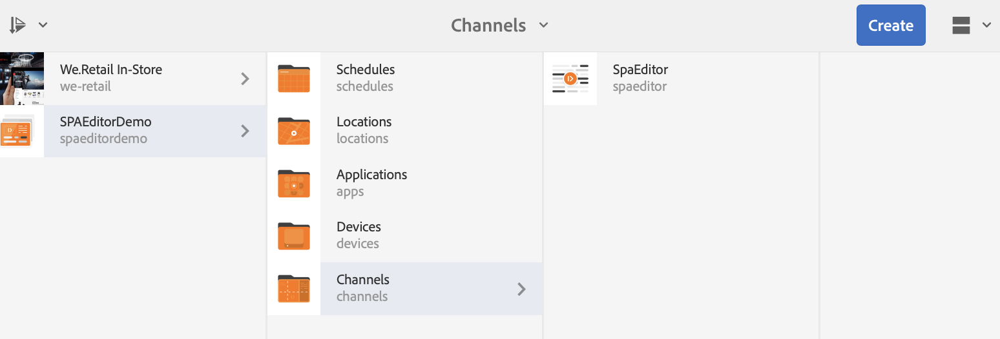
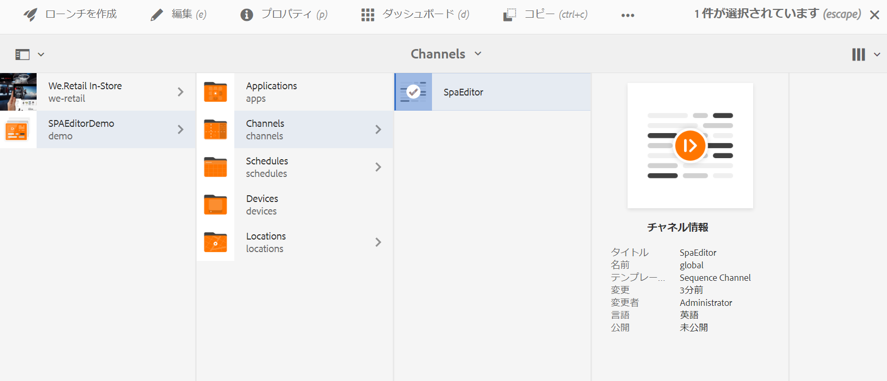
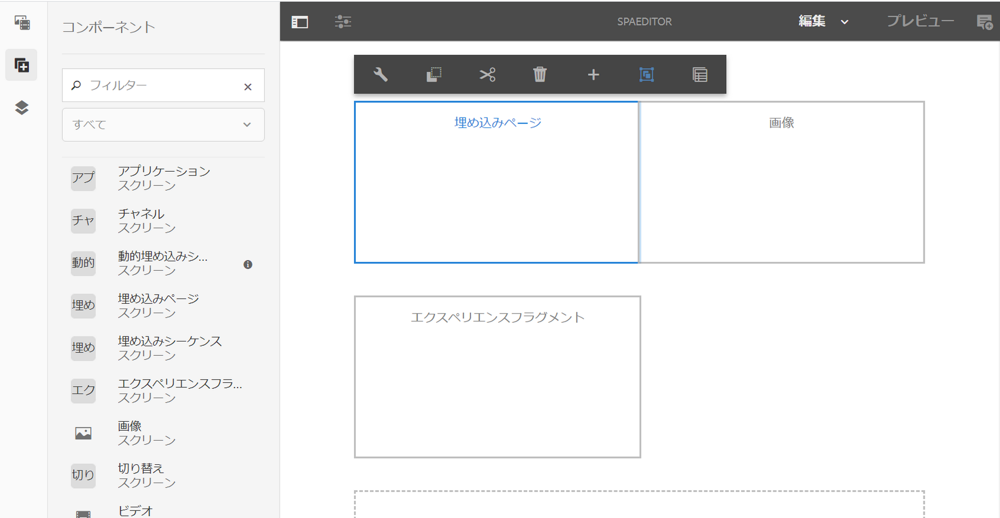

# AEM SPA Editor を使用した React アプリケーションの埋め込みと AEM Screens Analytics との統合 {#embedding-a-react-application-using-the-aem-spa-editor-and-integrating-with-aem-screens-analytics}

ここでは、AEM でビジネスプロフェッショナルが設定できる AEM SPA Editor を使用して React（または Angular）ベースのインタラクティブなシングルページアプリケーションを埋め込む方法について説明します。また、インタラクティブアプリケーションをオフライン Adobe Analytics と統合する方法についても説明します。

## AEM SPA Editor の使用 {#using-the-aem-spa-editor}

AEM SPA Editor を使用するには、以下の手順に従います。

1. AEM SPA Editor リポジトリ（[https://github.com/adobe/aem-spa-project-archetype](https://github.com/adobe/aem-spa-project-archetype)）のクローンを作成します。

   >[!NOTE]
   >
   >このアーキタイプでは、独自の SPA プロジェクトの出発点として、最小限の Adobe Experience Manager プロジェクトが作成されます。このアーキタイプの使用時に指定する必要があるプロパティを通じて、このプロジェクトのあらゆる部分に必要に応じて名前を付けることができます。

1. AEM SPA Editor アーキタイププロジェクトを作成するには、readme の説明に従ってください。

   ```
   mvn clean install archetype:update-local-catalog
   mvn archetype:crawl
   
   mvn archetype:generate \
   -DarchetypeCatalog=internal \
   -DarchetypeGroupId=com.adobe.cq.spa.archetypes \
   -DarchetypeArtifactId=aem-spa-project-archetype \
   -DarchetypeVersion=1.0.3-SNAPSHOT \
   ```

   >[!NOTE]
   >
   >ここでは、**GroupId** として ***com.adobe.aem.screens*** を、**ArtifactId** として ***My Sample SPA***（これがデフォルト）を使用します。必要に応じて独自に選択できます。

1. プロジェクトを作成したら、任意の IDE またはエディターを使用し、生成された Maven プロジェクトをインポートします。
1. ***mvn clean install -PautoInstallPackage*** コマンドを使用して、ローカルの AEM インスタンスにデプロイします。

### React アプリのコンテンツの編集 {#editing-content-in-the-react-app}

React アプリのコンテンツを編集するには、以下の手順に従います。

1. `https://localhost:4502/editor.html/content/mysamplespa/en/home.html` に移動します（ホスト名、ポート、プロジェクト名を実際のものに置き換えます）。
1. Hello world アプリケーションに表示されるテキストを編集できます。

### AEM Screens へのインタラクティブ React アプリの追加 {#adding-the-interactive-react-app-to-aem-screens}

AEM Screens にインタラクティブ React アプリを追加するには、以下の手順に従います。

1. 新しい AEM Screens プロジェクトを作成します。詳しくは、[プロジェクトの作成と管理](creating-a-screens-project.md)を参照してください。

   >[!NOTE]
   >
   >Screens プロジェクトの&#x200B;**チャネル**&#x200B;フォルダーにチャネルを作成する際に、**シーケンスチャネル**&#x200B;を作成します。
   >
   >
   >詳しくは、[チャネルの作成と管理](managing-channels.md)を参照してください。

   

1. シーケンスチャネルを編集し、埋め込みページコンポーネントをドラッグ＆ドロップします。

   詳しくは、[チャネルへのコンポーネントの追加](adding-components-to-a-channel.md)を参照してください。

   >[!NOTE]
   >
   >チャネルをディスプレイに割り当てる際には、必ずユーザーインタラクションイベントを追加してください。

1. アクションバーの「**編集**」をクリックして、シーケンスチャネルのプロパティを編集します。

   

1. **埋め込みページ**&#x200B;コンポーネントをドラッグ＆ドロップし、mysamplespa アプリケーションのホームページ（例：***/content/mysamplespa/en/home***）を選択します。

   

1. このプロジェクトに対してプレーヤーを登録すると、AEM Screens 上で動作するインタラクティブアプリケーションが表示されます。

   デバイスの登録について詳しくは、[デバイスの登録](device-registration.md)を参照してください。

## AEM Screens を使用した SPA とオフライン機能付き Adobe Analytics の統合 {#integrating-the-spa-with-adobe-analytics-with-offline-capability-through-aem-screens}

AEM Screens を通じて SPA をオフライン機能付きの Adobe Analytics と統合するには、以下の手順に従います。

1. AEM Screens で Adobe Analytics を設定します。

   AEM Screens と連携する Adobe Analytics でのシーケンス化の実行方法と、オフライン Adobe Analytics を使用したカスタムイベントの送信方法については、[AEM Screens と連携する Adobe Analytics の設定](configuring-adobe-analytics-aem-screens.md)を参照してください。

1. 任意の IDE またはエディターを使用して、React アプリ（特に、イベントの発行を開始するテキストコンポーネントなどのコンポーネント）を編集します。
1. コンポーネントに対してキャプチャするクリックイベントなどのイベントで、標準データモデルを使用して分析情報を追加します。

   詳しくは、[AEM Screens と連携する Adobe Analytics の設定](configuring-adobe-analytics-aem-screens.md)を参照してください。

1. AEM Screens Analytics API を呼び出して、イベントをオフラインで保存し Adobe Analytics にバースト送信します。

   例：

   ```
   handleClick() {
       if ((window.parent) && (window.parent.CQ) && (window.parent.CQ.screens) && (window.parent.CQ.screens.analytics))
       {
           var analyticsEvent = {};
           analyticsEvent['event.type'] = 'play'; // Type of event
    analyticsEvent['event.coll_dts'] = new Date().toISOString(); // Start of collecting the event
    analyticsEvent['event.dts_start'] = new Date().toISOString(); // Event start
    analyticsEvent['content.type'] = 'Washing machine'; // Mime Type or product category
    analyticsEvent['content.action'] = 'Path to the washing machine asset in AEM'; // Path in AEM to relevant asset
    analyticsEvent['trn.product'] = 'Washing machine Model number'; // Product being explored
    analyticsEvent['trn.amount'] = 1000; // Product pricing or other numeric value or weight
    analyticsEvent['event.dts_end'] = new Date().toISOString(); // Event end
    analyticsEvent['event.count'] = 100; // Numeric value that may count a number of clicks or keystrokes or wait time in seconds for example
    analyticsEvent['event.value'] = 'My favorite analytics event';
           analyticsEvent['trn.quantity'] = 10; // Quantity of product selection
    analyticsEvent['event.subtype'] = 'end'; // Event subtype if applicable
    window.parent.CQ.screens.analytics.sendTrackingEvent(analyticsEvent);
       }
   }
   ```

   >[!NOTE]
   >
   >プレーヤーのファームウェアによって、送信するカスタム分析データにプレーヤーとそのランタイム環境に関する詳細が自動的に追加されます。したがって、どうしても必要な場合を除き、OS やデバイスに関する低レベルの詳細情報を取得する必要はありません。ビジネス分析データに的を絞るだけでよいのです。

