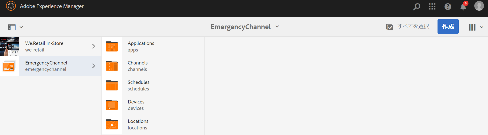
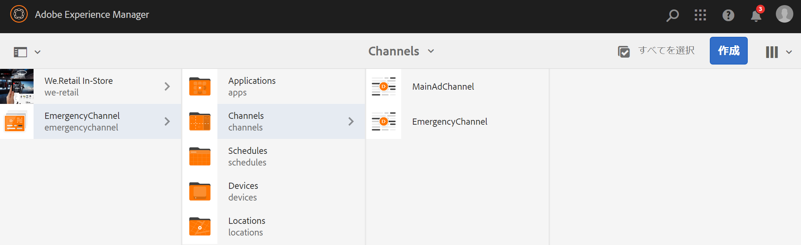
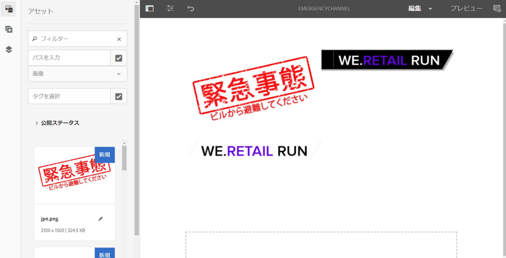
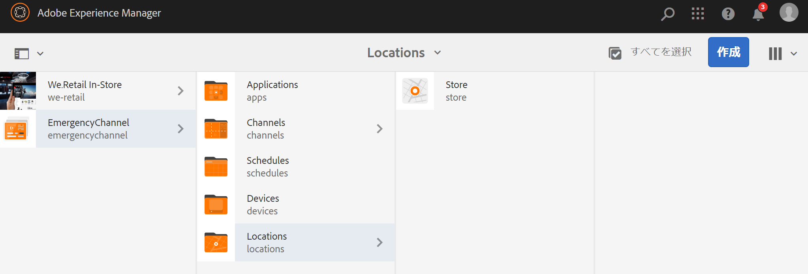
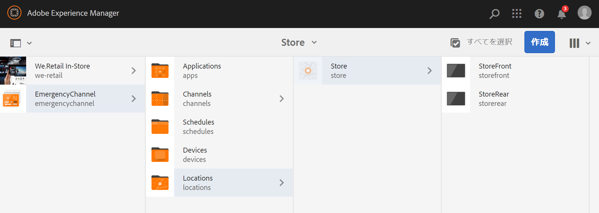
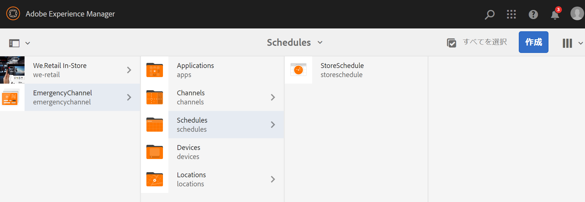
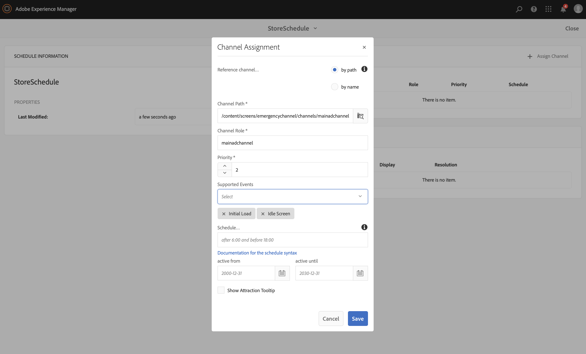
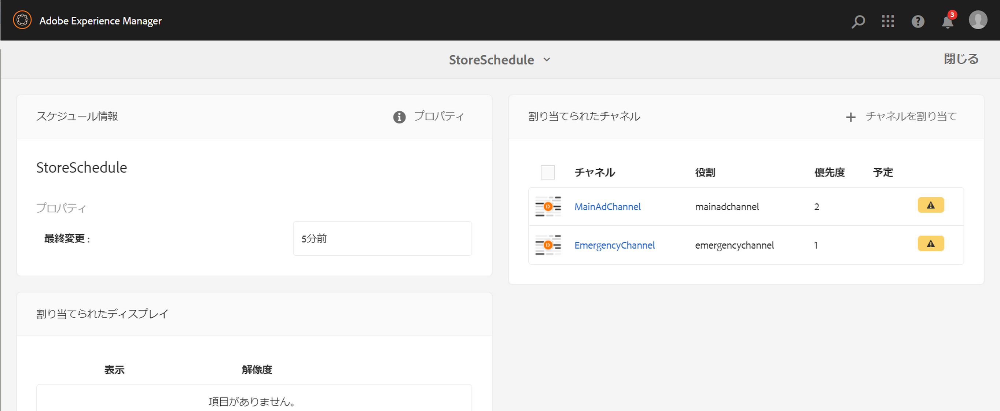
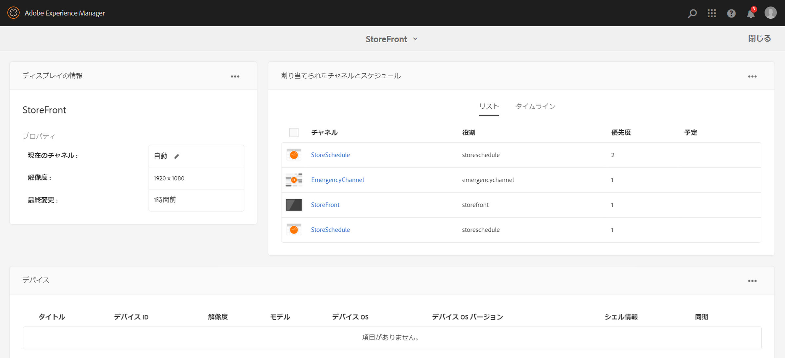
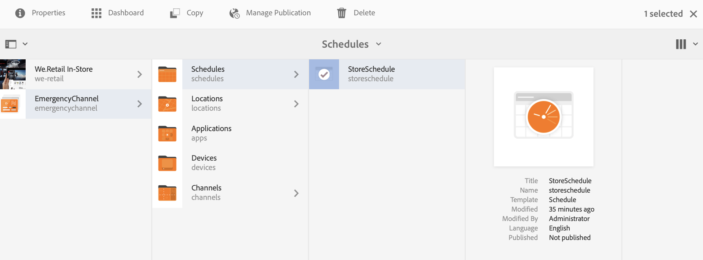

# 緊急チャネル {#emergency-channel}

## 使用例の説明 {#use-case-description}

ここでは、緊急チャネルの作成と管理に重点を置いた使用事例を説明します。この例では、事前条件が発生した場合に、コンテンツ作成者がシーケンスチャネルから切り替えることができます。

### 前提条件 {#preconditions}

この使用事例を開始する前に、以下の方法を理解しておく必要があります。

* **[チャネルの作成と管理](managing-channels.md)**
* **[場所の作成と管理](managing-locations.md)**
* **[スケジュールの作成と管理](managing-schedules.md)**
* **[デバイスの登録](device-registration.md)**

### 主役 {#primary-actors}

コンテンツ作成者

## 基本フロー：プロジェクトの設定 {#basic-flow-setting-up-the-project}

次の手順に従って、緊急チャネルを設定します。

1. 以下に示すように、EmergencyChannelという名前のAEM Screensプロ **ジェクトを作成し**&#x200B;ます。

   >[!NOTE]
   >
   >AEM Screensでのプロジェクトの作成と管理について詳しくは、「プロジェクトの作成」を参照してください。

   

1. **シーケンスチャネルの作成**

   1. チャネルフォ **ルダを選択し** 、「作成」をク **リックして** 、チャネルを作成するウィザードを開きます。

   1. ウィザード **で「Sequence Channel** 」を選択し、「MainAdChannel」という名前のチャネルを作 **成します**。
   

1. **シーケンスチャネルへのコンテンツの追加**

   1. チャネル(MainAdChannel ****)を選択します。
   1. アクションバーから「**編集**」をクリックして、エディターを開きます。少数のアセットをチャネルにドラッグ&amp;ドロップします。
   

1. **緊急チャネルの作成**

   1. Select the **Channels** folder.
   1. [作成]をク **リックし** 、ウィザードを開いてチャネルを作成します。
   1. ウィザード **で「Sequence Channel** 」を選択し、「 **EmergencyChannel」という名前のチャネルを作成します**。
   >[!NOTE]
   >
   >通常は、既存の実稼働プロジェクトに緊急チャネルが追加されます。

   

1. **緊急チャネルへのコンテンツの追加**

   1. チャネル(緊急チャネ&#x200B;**ル)を選択します**。
   1. アクションバーから「**編集**」をクリックして、エディターを開きます。緊急時に実行するアセットをチャネルにドラッグ&amp;ドロップします。
   

1. **場所の作成**

   1. 「ロケーション」( **Locations** )フォルダに移動します。
   1. アクシ **ョンバーで** 「Create」をクリックし、ウィザードから「 **Store** 」という場所を作成します。
   

1. **場所での表示の作成**

   目的の場所(**Store**)に移動し、アクションバー **で「作成** 」をクリックします。 ウィザードに従って、「 **StoreFront** 」と「 **StoreRear** 」の2つのディスプレイを **作成します**。

   

1. **スケジュールの作成**

   1. スケジュールフォルダ **ーに移動します** 。
   1. アクションバーから「**作成**」をクリックします。ウィザードに従って、StoreScheduleというタイトルのスケジュールを作 **成します**。
   

1. 両方の表示をスケジュールに割り当て、優先度を設定します

   1. スケジュール **(StoreSchedule)を選択し** 、アクションバ **ーの「ダッシュボード** 」をクリックします。

   1. [割り当て **済みチャネル]パネルで** [+チャネルの割り当て **** ]をクリックします。

   1. [チャネル割り **当て** ]ダイアログボックスで、次の操作を行います。

      1. MainAdChannelへのパスを選択し **ます**
      1. 優先度 **を** 2に設定
      1. Set the Supported Events as **Initial Load** and **Idle Screen**.
      1. Click **Save**
      同様に、同じ手順を繰り返してEmergencyChannelを割り当て、その **Priority** を設定する必要があり **ます**。
   >[!NOTE]
   >
   >優先度は、複数が作業基準に合致する場合に、割り当ての順序を決めるために使用します。最高値のあるものが低い値よりも常に優先されます。

   

1. [割り当て **済みチャネル]パネルで** [+チャネルの割り当て **** ]をクリックします。

1. [チャネル割り **当て** ]ダイアログボックスで、次の操作を行います。

   1. EmergencyChannelへのパスを選択し **ます**
   1. 優先度 **を** 1に設定

   1. サポートされるイベントを初期読み込み **、アイド**&#x200B;ル画面 **、ユーザ****ー操作として設定**

   1. Click **Save**
   

   割り当てられたチャネルはStoreScheduleダッシュボードから表 **示できます** 。

   

1. **各表示にスケジュールを割り当てる**

   1. 各画面( **EmergencyChannel** —&gt;場所 **—&gt;ストア** —&gt; **StoreFrontFront** な&#x200B;****&#x200B;ど)に移動します。

   1. Click **Dashboard** from the action to open the display dashboard.
   1. **クリ**&#x200B;ック…[割り当てら **れたチャネルとスケジュール** ]パネルで、[ **+スケジュールの割り当て]をクリックします**。

   1. スケジュールのパスを選択します(例： **EmergencyChannel** —&gt; **Schedules** —&gt;**StoreSchedule**)。

   1. 「**保存**」をクリックします。
   StoreScheduleダッシュボードから、表示に割り当てられたスケジュールを表 **示できます** 。
   

1. **デバイスの登録**

   デバイスの登録プロセスを完了し、登録が完了すると、AEM Screensプレーヤーに次の出力が表示されます。

   

## 緊急チャネルへの切り替え {#switching-to-emergency-channel}

緊急の場合は、次の手順を実行します。

1. EmergencyChannel **—&gt;** Schedules **—&gt;** StoreSchedule **に移動し、アクション・バー****** から「Dashboard」を選択します。

   

1. StoreScheduleダッシュボードから **EmergencyChannelを選択し、** 「割り当てを編 **集」をクリックします******。

   

1. Channel Assignment **Dialog** box **Save** Click **ClickDesignt ChannelのPriority Of** the EmergencyChannelを ******** 3に更新します。

   

1. チャネルの優先順位が更新されるとすぐに、すべてのAEM Screensプレーヤーは **** 、以下に示すようにEmergencyChannelコンテンツを表示します。

   

### 結論 {#conclusion}

EmergencyChannelは **** 、コンテンツ作成者が優先度の値を1にリセットするまで、引き続きコンテンツを表示します。

緊急事態が解決されたという指示をコンテンツ作成者が受け取ったら、通常の再生を再開する **MainAdChannel** の優先順位を更新する必要があります。
