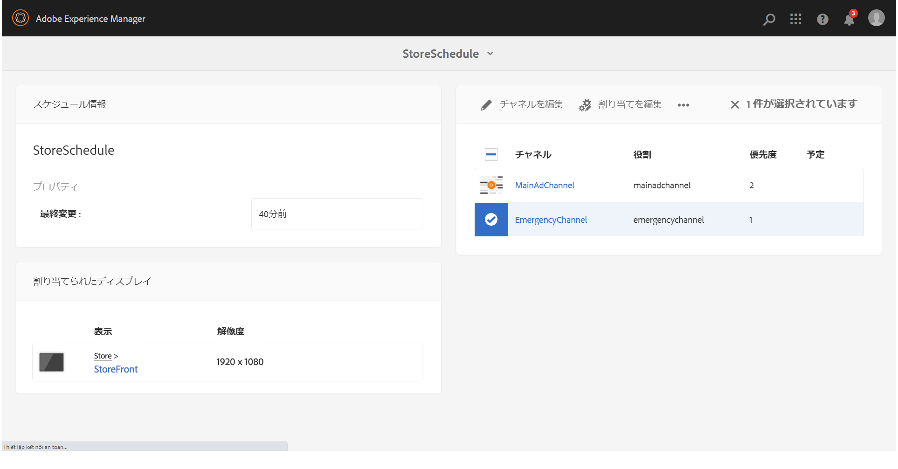

# 緊急チャネル {#emergency-channel}

## 使用例の説明 {#use-case-description}

ここでは、緊急チャネルの作成と管理に重点を置いた使用例について説明します。事前条件が存在する場合、コンテンツ作成者はシーケンスチャネルから緊急チャネルに切り替えることができます。

### 前提条件 {#preconditions}

この使用例を開始する前に、以下の方法を理解しておく必要があります。

* **[チャネルの作成と管理](managing-channels.md)**
* **[ロケーションの作成と管理](managing-locations.md)**
* **[スケジュールの作成と管理](managing-schedules.md)**
* **[デバイスの登録](device-registration.md)**

### 主要なアクター {#primary-actors}

コンテンツ作成者

## 基本フロー：プロジェクトのセットアップ {#basic-flow-setting-up-the-project}

緊急チャネルをセットアップするには、以下の手順に従います。

1. **EmergencyChannel** という名前の AEM Screens プロジェクトを作成します（下図を参照）。

   >[!NOTE]
   >AEM Screensでのプロジェクトの作成と管理については、プロジェクトの作成を参照してください。

   

1. **シーケンスチャネルを作成する**

   1. 「」を選択します **チャネル** フォルダーをクリックし、 **作成**.

   1. ウィザードで「**シーケンスチャネル**」を選択し、**MainAdChannel** というタイトルのチャネルを作成します。

   

1. **シーケンスチャネルにコンテンツを追加する**

   1. チャネル（**MainAdChannel**）を選択します。
   1. クリック **編集** アクションバーから。
   1. いくつかのアセットをチャネルにドラッグ&amp;ドロップします。

   

1. **緊急チャネルを作成する**

   1. **チャネル**&#x200B;フォルダーを選択します。
   1. 「**作成**」をクリックします。
   1. ウィザードで「**シーケンスチャネル**」を選択し、**EmergencyChannel** というタイトルのチャネルを作成します。

   >[!NOTE]
   >
   >通常、緊急チャネルは既存の実稼動プロジェクトに追加されます。

   

1. **緊急チャネルにコンテンツを追加する**

   1. チャネル（**Emergency Channel**）を選択します。
   1. クリック **編集** アクションバーから。
   1. 緊急時に実行するアセットをチャネルにドラッグ&amp;ドロップします。

   

1. **ロケーションの作成**

   1. **ロケーション**&#x200B;フォルダーに移動します。
   1. アクションバーの「**作成**」をクリックし、ウィザードから **Store** というタイトルのロケーションを作成します。

   

1. **ロケーションにディスプレイを作成する**

   ロケーション（**Store**）に移動し、アクションバーの「**作成**」をクリックします。ウィザードの後に、次の 2 つを作成します **ディスプレイ** タイトルは **StoreFront** および **StoreRear**.

   

1. **スケジュールの作成**

   1. **スケジュール**&#x200B;フォルダーに移動します。
   1. アクションバーの「**作成**」をクリックします。
   1. ウィザードの後、という名前のスケジュールを作成します。 **StoreSchedule**.

   

1. スケジュールに両方のディスプレイを割り当て優先度を設定する

   1. スケジュール（**StoreSchedule**）を選択し、アクションバーの「**ダッシュボード**」をクリックします。

   1. **割り当てられたチャネル**&#x200B;パネルで「**+ チャネルを割り当て**」をクリックします。

   1. **チャネル割り当て**&#x200B;ダイアログボックスで、次の操作をおこないます。

      1. **MainAdChannel** へのパスを選択します。
      1. 「**優先度**」を「2」に設定します。
      1. 「サポートされているイベント」として「**最初の読み込み**」および「**待機中画面**」を設定します。
      1. 「**保存**」をクリックします。

      同様に、同じ手順に従い、を割り当てます **Emergen シーチャネル** およびを設定 **優先度**.

   >[!NOTE]
   >
   >優先度は、複数の割り当てが再生条件に一致する場合に、割り当ての順序付けを行うために使用します。値が大きい方が小さい方より常に優先されます。

   

1. **割り当てられたチャネル**&#x200B;パネルで「**+ チャネルを割り当て**」をクリックします。

1. **チャネル割り当て**&#x200B;ダイアログボックスで、次の操作をおこないます。

   1. **EmergencyChannel** へのパスを選択します。
   1. 「**優先度**」を「1」に設定します。

   1. 「サポートされているイベント」として、「**最初の読み込み**」、「**待機中画面**」、「**ユーザーインタラクション**」を設定します。

   1. 「**保存**」をクリックします。

   

   割り当てられたチャネルを **StoreSchedule** のダッシュボードで確認できます。

   

1. **各ディスプレイへのスケジュールの割り当て**

   1. 次のような各表示に移動します **Emergen シーチャネル** > **場所** > **ストア** >**StoreFront**.

   1. クリック **Dashboard** アクションバーから。
   1. **割り当てられたチャネルとスケジュール**&#x200B;パネルで「**...**」をクリックし、さらに「**+ スケジュールを割り当て**」をクリックします。

   1. スケジュールのパスを選択します（ここでは、 **Emergen シーチャネル** > **スケジュール** >**StoreSchedule**）に設定します。

   1. 「**保存**」をクリックします。

   ディスプレイに割り当てられたスケジュールを **StoreSchedule** のダッシュボードで確認できます。
   

1. **デバイスの登録**

   デバイスの登録プロセスを完了します。 登録すると、AEM Screens Player で次の出力を確認できます。

   

## 緊急チャネルへの切り替え {#switching-to-emergency-channel}

緊急事態が発生した場合は、次の手順に従います。

1. に移動します。 **Emergen シーチャネル** > **スケジュール** > **StoreSchedule** を選択して、 **Dashboard** アクションバーから。

   

1. **StoreSchedule** のダッシュボードで **EmergencyChannel** を選択し、「**割り当てを編集**」をクリックします。

   

1. **チャネル割り当て**&#x200B;ダイアログボックスで、**EmergencyChannel** の「**優先度**」を「**3**」に更新し、「**保存**」をクリックします。

   

1. チャンネルの優先度が更新されると、すべてのAEM Screens Player で以下が表示されます。 **Emergen シーチャネル** コンテンツ。

   

### まとめ {#conclusion}

この **Emergen シーチャネル** コンテンツ作成者が優先度の値を 1 にリセットするまで、コンテンツの表示を続けます。

コンテンツ作成者は、緊急事態が解除されたという指示を受け取ったら、の優先度を更新する必要があります **MainAdChannel** これにより、通常の再生が再開されます。
