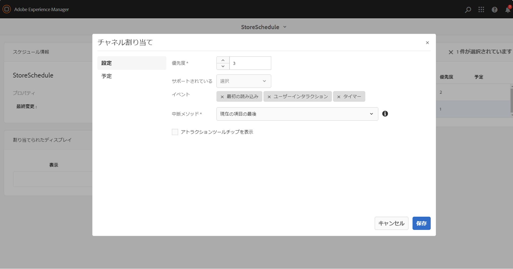

# 緊急チャネル {#emergency-channel}

## 使用例の説明 {#use-case-description}

ここでは、緊急チャネルの作成と管理に重点を置いた使用例について説明します。事前条件が成立した場合、コンテンツ作成者はシーケンスチャネルから緊急チャネルに切り替えることができます。

### 前提条件 {#preconditions}

この使用例を開始する前に、以下をおこなう方法を理解しておく必要があります。

* **[チャネルの作成と管理](managing-channels.md)**
* **[ロケーションの作成と管理](managing-locations.md)**
* **[スケジュールの作成と管理](managing-schedules.md)**
* **[デバイスの登録](device-registration.md)**

### 主要なアクター {#primary-actors}

コンテンツ作成者

## 基本フロー：プロジェクトのセットアップ {#basic-flow-setting-up-the-project}

緊急チャネルをセットアップするには、以下の手順に従います。

1. **EmergencyChannel** という名前の AEM Screens プロジェクトを作成します（下図を参照）。

   >[!NOTE]
   >AEM Screens でのプロジェクトの作成と管理について詳しくは、プロジェクトの作成と管理を参照してください。

   

1. **シーケンスチャネルを作成する**

   1. **チャネル**&#x200B;フォルダーを選択し、「**作成**」をクリックしてチャネル作成用ウィザードを開きます。

   1. ウィザードで「**シーケンスチャネル**」を選択し、**MainAdChannel** というタイトルのチャネルを作成します。

   

1. **シーケンスチャネルにコンテンツを追加する**

   1. チャネル（**MainAdChannel**）を選択します。
   1. アクションバーの「**編集**」をクリックして、エディターを開きます。アセットをいくつかチャネルにドラッグ＆ドロップします。

   

1. **緊急チャネルを作成する**

   1. **チャネル**&#x200B;フォルダーを選択します。
   1. 「**作成**」クリックして、チャネル作成用ウィザードを開きます。
   1. ウィザードで「**シーケンスチャネル**」を選択し、**EmergencyChannel** というタイトルのチャネルを作成します。

   >[!NOTE]
   >
   >通常、緊急チャネルは既存の実稼動プロジェクトに追加されます。

   

1. **緊急チャネルにコンテンツを追加する**

   1. チャネル（**EmergencyChannel**）を選択します。
   1. アクションバーの「**編集**」をクリックして、エディターを開きます。緊急時に実行するアセットをチャネルにドラッグ＆ドロップします。

   

1. **ロケーションの作成**

   1. **ロケーション**&#x200B;フォルダーに移動します。
   1. アクションバーの「**作成**」をクリックし、ウィザードから **Store** というタイトルのロケーションを作成します。

   

1. **ロケーションにディスプレイを作成する**

   ロケーション（**Store**）に移動し、アクションバーの「**作成**」をクリックします。ウィザードに従って、**StoreFront** および **StoreRear** というタイトルの 2 つの&#x200B;**ディスプレイ**&#x200B;を作成します。

   

1. **スケジュールの作成**

   1. **スケジュール**&#x200B;フォルダーに移動します。
   1. アクションバーの「**作成**」をクリックします。ウィザードに従って、**StoreSchedule** というタイトルのスケジュールを作成します。

   

1. スケジュールに両方のディスプレイを割り当て優先度を設定する

   1. スケジュール（**StoreSchedule**）を選択し、アクションバーの「**ダッシュボード**」をクリックします。

   1. **割り当てられたチャネル**&#x200B;パネルで「**+ チャネルを割り当て**」をクリックします。

   1. **チャネル割り当て**&#x200B;ダイアログボックスで、次の操作をおこないます。

      1. **MainAdChannel** へのパスを選択します。
      1. 「**優先度**」を「2」に設定します。
      1. 「サポートされているイベント」として「**最初の読み込み**」および「**待機中画面**」を設定します。
      1. 「**保存**」をクリックします。

      同様に、同じ手順を繰り返して **EmergencyChannel** を割り当て、その「**優先度**」を設定する必要があります。
   >[!NOTE]
   >
   >優先度は、複数の割り当てが再生条件に一致する場合に、割り当ての順序付けをおこなうために使用します。最高値のものが低い値よりも常に優先されます。

   

1. **割り当てられたチャネル**&#x200B;パネルで「**+ チャネルを割り当て**」をクリックします。

1. **チャネル割り当て**&#x200B;ダイアログボックスで、次の操作をおこないます。

   1. **EmergencyChannel** へのパスを選択します。
   1. 「**優先度**」を「1」に設定します。

   1. 「サポートされているイベント」として、「**最初の読み込み**」、「**待機中画面**」、「**ユーザーインタラクション**」を設定します。

   1. 「**保存**」をクリックします。

   

   割り当てられたチャネルを **StoreSchedule** のダッシュボードで確認できます。

   

1. **各ディスプレイへのスケジュールの割り当て**

   1. 各ディスプレイに移動します（**EmergencyChannel**／**Locations**／**Store**／**StoreFront** など）。

   1. アクションバーの「**ダッシュボード**」をクリックして、ディスプレイダッシュボードを開きます。
   1. **割り当てられたチャネルとスケジュール**&#x200B;パネルで「**...**」をクリックし、さらに「**+ スケジュールを割り当て**」をクリックします。

   1. スケジュールのパスを選択します（例：**EmergencyChannel**／**Schedules**／**StoreSchedule**）。

   1. 「**保存**」をクリックします。

   ディスプレイに割り当てられたスケジュールを **StoreSchedule** のダッシュボードで確認できます。
   

1. **デバイスの登録**

   デバイス登録プロセスを完了します。登録が完了すると、AEM Screens Player に次の出力が表示されます。

   

## 緊急チャネルへの切り替え {#switching-to-emergency-channel}

緊急の場合には、以下の手順を実行します。

1. **EmergencyChannel**／**Schedules**／**StoreSchedule** に移動し、アクションバーの「**ダッシュボード**」をクリックします。

   

1. **StoreSchedule** のダッシュボードで **EmergencyChannel** を選択し、「**割り当てを編集**」をクリックします。

   

1. **チャネル割り当て**&#x200B;ダイアログボックスで、**EmergencyChannel** の「**優先度**」を「**3**」に更新し、「**保存**」をクリックします。

   

1. チャネルの優先度が更新され次第、すべての AEM Screens Player に **EmergencyChannel** コンテンツが表示されます（下図を参照）。

   

### まとめ {#conclusion}

コンテンツ作成者が優先度の値を 1 にリセットするまで、**EmergencyChannel** には引き続きコンテンツが表示されます。

コンテンツ作成者は、緊急事態が解除されたという通知を受け取ったら、**MainAdChannel** の優先度を更新する必要があります。その結果、通常の再生が再開されます。
