# エクスペリエンスフラグメントの使用 {#using-experience-fragments}

ここでは、以下のトピックについて説明します。

* **概要**
* **AEM Screens でのエクスペリエンスフラグメントの使用**
* **マスターページからの変更の反映**

## 概要 {#overview}

***エクスペリエンスフラグメント***&#x200B;は、ページ内で参照できるコンテンツおよびレイアウトを含む 1 つ以上のコンポーネントのグループです。エクスペリエンスフラグメントには、段落システム内に含めることができる 1 つ以上のコンポーネントなど、任意のコンポーネントを含めることができます。完全なエクスペリエンスに参照され、3 番目のエンドポイントによって要求されます。

## AEM Screens でのエクスペリエンスフラグメントの使用 {#using-experience-fragments-in-aem-screens}

>[!NOTE]
>
>次の例では、**We.Retail** をデモプロジェクトとして使用し、**Sites** ページのエクスペリエンスフラグメントを AEM Screens プロジェクトに利用します。

例えば、以下のワークフローでは、Sites の We.Retail に含まれているエクスペリエンスフラグメントを使用する方法を示しています。Web ページを選択し、そのコンテンツを対象プロジェクトの AEM Screens チャネルで利用できます。

### 前提条件 {#pre-requisites}

**チャネルを使用したデモプロジェクトの作成**

***プロジェクトの作成***

1. Click **Create Screens Project** to create a new project.
1. タイトルに &quot;**DemoProject**&quot; と入力します。
1. 「**保存**」をクリックします。

**DemoProject** が AEM Screens に追加されます。

***チャネルの作成***

1. 作成した **DemoProject** プロジェクトに移動し、**チャネル**&#x200B;フォルダーを選択します。

1. Click **Create** from the action bar to open the wizard.
1. ウィザードで「**シーケンスチャネル**」テンプレートを選択し、「**次へ**」をクリックします。

1. 「**タイトル**」に「**TestChannel**」と入力し、「**作成**」をクリックします。

**TestChannel** が **DemoProject** に追加されます。\

### エクスペリエンスフラグメントの作成 {#creating-an-experience-fragment}

**DemoProject** の **TestChannel** に **We.Retail** のコンテンツを利用するには、以下の手順に従います。

1. **We.Retail の Sites ページへの移動**

   1. Navigate to Sites and select **We.Retail In-Store** -> **United States** ->**English** and select **Equipment** page to use this as an experience fragment for your Screens channel.

   1. アクションバーの「**編集**」をクリックして、Screens チャネルのエクスペリエンスフラグメントとして使用するページを開きます。

      

1. **コンテンツの再利用**

   1. チャネルに含めるフラグメントを選択します。
   1. 右側の最後のアイコンをクリックして、**エクスペリエンスフラグメントバリエーションに変換**&#x200B;ダイアログボックスを開きます。
   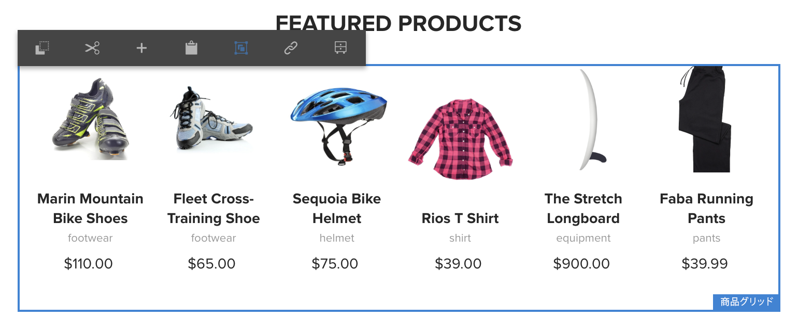

1. **エクスペリエンスフラグメントの作成**

   1. 「**アクション**」として「**新しいエクスペリエンスフラグメントを作成**」を選択します。

   1. 「**親パス**」を選択します。
   1. 「**テンプレート**」を選択します。Choose the **Experience Fragment - Screens Variation** template here.

   1. Enter the **Fragment Title** as **ScreensFragment**.

   1. チェックマークをオンにして、新しいエクスペリエンスフラグメントの作成を完了します。
   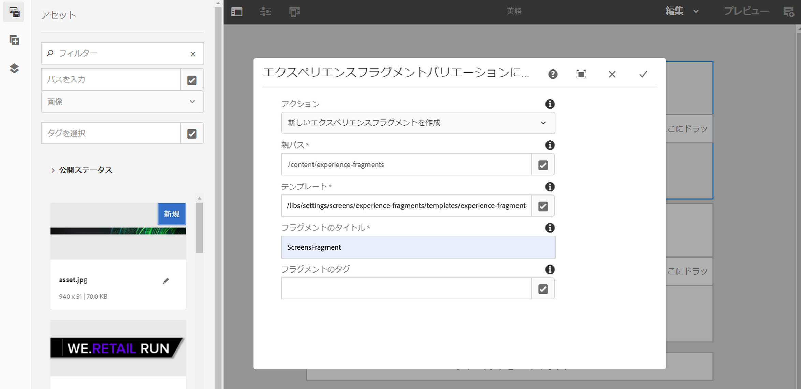

1. **エクスペリエンスフラグメントのライブコピーの作成**

   1. AEM ホームページに移動します。
   1. 「**エクスペリエンスフラグメント**」を選択し、「**ScreensFragment**」をハイライト表示して、「**バリエーションをライブコピーとして**」をクリックします（下図を参照）。
   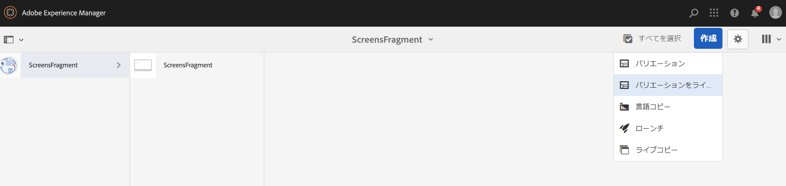

   c. Select the** ScreensFragment** from **Create Live Copy** wizard and click **Next**.

   d. 「**タイトル**」と「**名前**」に「**Screens**」と入力します。

   e. 「**作成**」をクリックして、ライブコピーを作成します。

   f. 「**完了**」をクリックして、**ScreensFragment** ページに戻ります。

   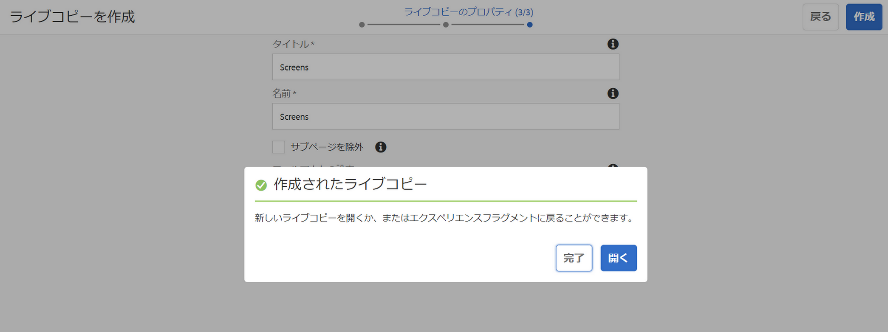

   >[!NOTE]
   >
   >Screens フラグメントを作成したら、フラグメントのプロパティを編集できます。フラグメントを選択し、アクションバーの「**プロパティ**」をクリックします。

   **Screens フラグメントのプロパティの編集**

   1. （前の手順で作成した）**ScreensFragment** に移動し、アクションバーの「**プロパティ**」をクリックします。

   1. 「**オフライン設定**」タブを選択します（下図を参照）。
   エクスペリエンスフラグメントに&#x200B;**クライアント側ライブラリ**（java および css）と&#x200B;**静的ファイル**&#x200B;を追加できます。

   次の例は、クライアント側ライブラリのほか、フォントを静的ファイルの一部としてエクスペリエンスフラグメントに追加する場合を示しています。

1. **Screens チャネルでのコンポーネントとしてのエクスペリエンスフラグメントの使用**

   1. **Screens** フラグメントを使用する Screens チャネルに移動します。
   1. 「**TestChannel**」を選択し、アクションバーの「**編集**」をクリックします。

   1. サイドタブのコンポーネントアイコンをクリックします。
   1. チャネルに「**エクスペリエンスフラグメント**」をドラッグ＆ドロップします。
   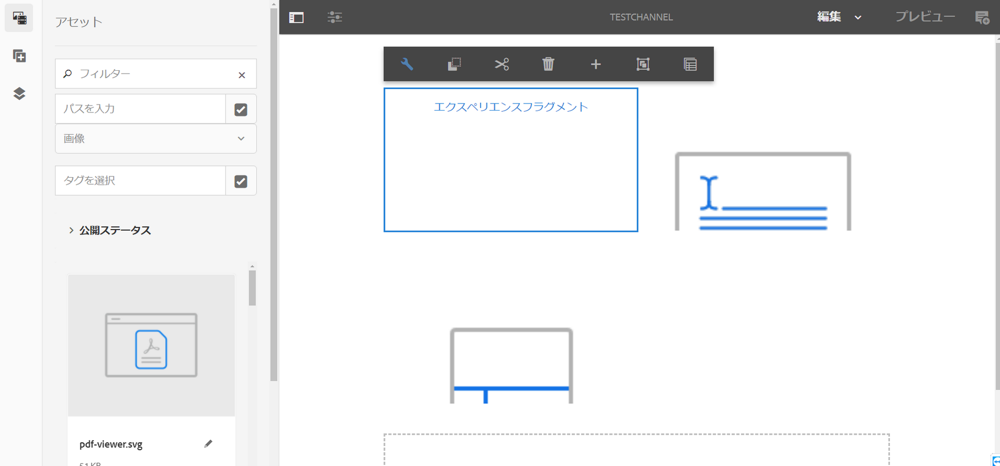

   e. **エクスペリエンスフラグメント**&#x200B;コンポーネントを選択し、左上の（レンチ）アイコンをクリックして、**エクスペリエンスフラグメント**&#x200B;ダイアログボックスを開きます。

   f. Select the **Screens** live copy of the fragment you created in *Step 3* in **Path**.

   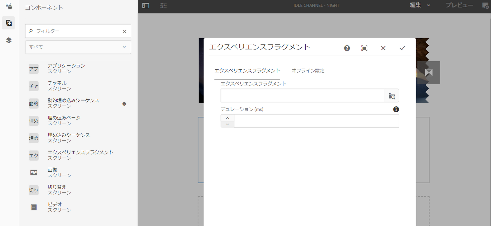

   f. Select the **Screens** live copy of the fragment you created in *Step 3* in the **Experience Fragment**.

   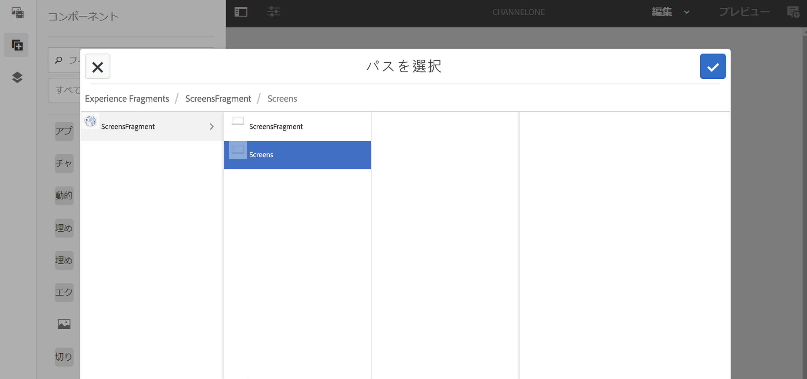

   h. ミリ秒を「 **期間**」で入力します。

   i. **エクスペリエンスフラグメント**&#x200B;ダイアログボックスで「**オフライン設定**」を選択し、クライアント側ライブラリと静的ファイルを定義します。

   >[!NOTE]
   >
   >前述の手順 4 で設定した内容に加えて、クライアント側ライブラリや静的ファイルを追加する場合は、**エクスペリエンスフラグメント**&#x200B;ダイアログボックスの「**オフライン設定**」タブで追加できます。

   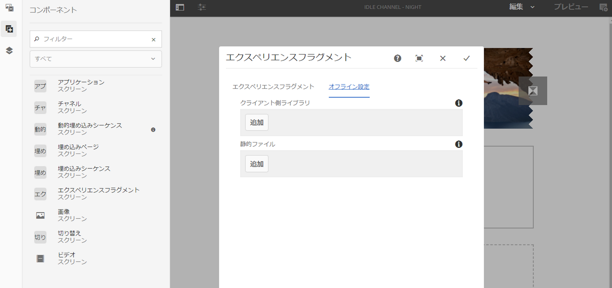

   j. チェックマークをオンにして、手順を完了します。

### 結果の検証 {#validating-the-result}

前述の手順が完了したら、次の手順で **ChannelOne** 内のエクスペリエンスフラグメントを検証できます。

1. **TestChannel** に移動します。
1. アクションバーの「**プレビュー**」をクリックします。

チャネル内の **Sites** ページ（エクスペリエンスフラグメントのライブコピー）のコンテンツが表示されます（下図を参照）。\
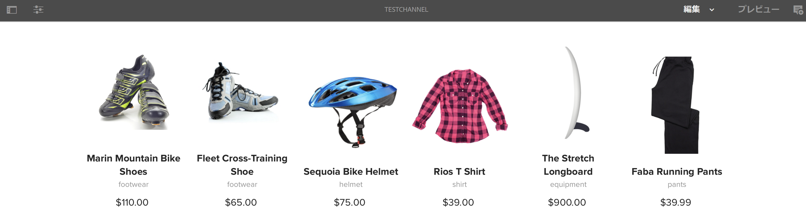

## マスターページからの変更の反映 {#propagating-changes-from-the-master-page}

***ライブコピー***&#x200B;とは、ロールアウト設定で定義された同期アクションによって維持管理される（ソースの）コピーのことです。

Since the Experience Fragment, we created is a live copy from the **Sites** pages, so if you make changes to that particular fragment from the master page, you will view the changes in your channel or the destination where you have used the Experience Fragment.

>[!NOTE]
>
>ライブコピーについて詳しくは、「コンテンツの再利用：マルチサイトマネージャーとライブコピー」を参照してください。

マスターチャネルから目的のチャネルに変更を反映するには、以下の手順に従います。

1. **Sites**（マスター）ページで「エクスペリエンスフラグメント」を選択し、鉛筆アイコンをクリックして、エクスペリエンスフラグメント内の項目を編集します。

   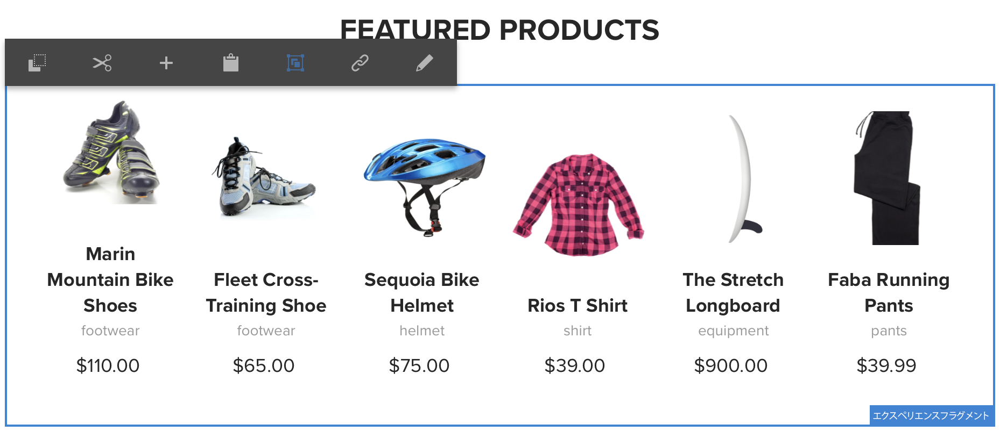

1. エクスペリエンスフラグメントを選択し、レンチアイコンをクリックして、画像編集用のダイアログボックスを開きます。

   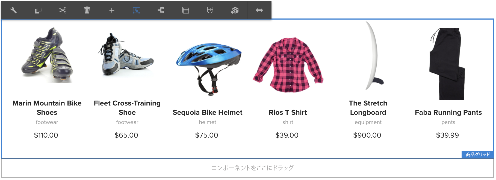

1. **商品グリッド**&#x200B;ダイアログボックスが開きます。

   

1. 任意の画像を編集できます。例えば、ここでは、このフラグメントの最初の画像が置き換えられます。

   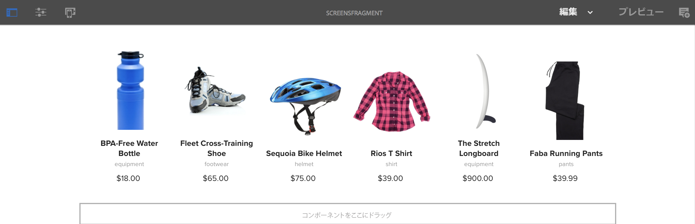

1. エクスペリエンスフラグメントを選択し、ロールアウトアイコンをクリックして、チャネルで使用されているフラグメントに変更を反映します。

   

1. 「ロールアウト」をクリックして、変更内容を確認します。

   変更がロールアウトされたことがわかります。

   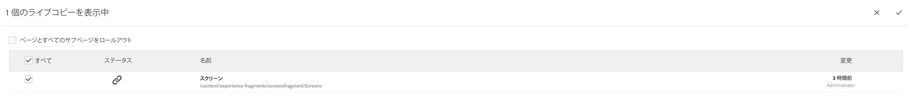

### 変更の検証 {#validating-the-changes}

チャネルでの変更内容を確認するには、以下の手順に従います。

1. **Screens**／**Channels**／**TestChannel** に移動します。

1. アクションバーの「**プレビュー**」をクリックして、変更内容を確認ます。

次の画像は、**TestChannel** に反映された変更を示しています。\

