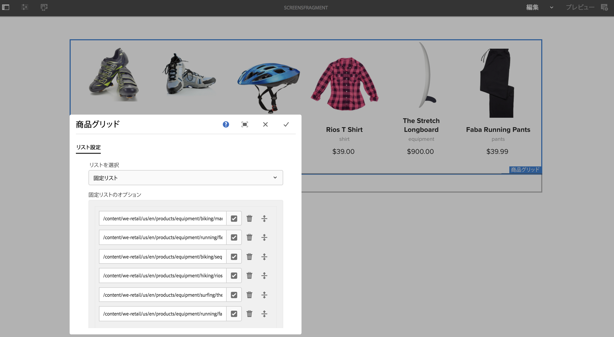

# エクスペリエンスフラグメントの使用 {#using-experience-fragments}

ここでは、以下のトピックについて説明します。

* **概要**
* **AEM Screens でのエクスペリエンスフラグメントの使用**
* **ページへの変更の反映**

## 概要 {#overview}

***エクスペリエンスフラグメント***&#x200B;は、ページ内で参照できるコンテンツおよびレイアウトを含む 1 つ以上のコンポーネントのグループです。エクスペリエンスフラグメントには、任意のコンポーネントを含めることができます。例えば、1 つまたは複数のコンポーネントを含め、そのコンポートに完全なエクスペリエンスで参照される、または 3 番目のエンドポイントによって要求される段落システム内のあらゆるものを含めることができます。

## AEM Screens でのエクスペリエンスフラグメントの使用 {#using-experience-fragments-in-aem-screens}

>[!NOTE]
>次の例では、**`We.Retail`** をデモプロジェクトとして使用し、**Sites** ページのエクスペリエンスフラグメントを AEM Screens プロジェクトに利用します。

例えば、以下のワークフローは、`We.Retail` のエクスペリエンスフラグメントを Sites で使用する方法を示しています。Web ページを選択し、そのコンテンツをプロジェクトの 1 つの AEM Screens チャネルで使用できます。

### 前提条件 {#pre-requisites}

**チャネルを含んだデモプロジェクトの作成**

***プロジェクトの作成***

1. プロジェクトを作成するには、「**Screens プロジェクトの作成**」をクリックします。
1. タイトルに「**DemoProject**」と入力します。
1. 「**保存**」をクリックします。

**DemoProject** が AEM Screens に追加されます。

***チャネルの作成***

1. 作成した **DemoProject** プロジェクトに移動し、**チャネル**&#x200B;フォルダーをクリックします。

1. アクションバーの「**作成**」をクリックして、ウィザードを開きます。
1. ウィザードで「**シーケンスチャネル**」テンプレートを選択し、「**次へ**」をクリックします。

1. 「**タイトル**」に「**TestChannel**」と入力し、「**作成**」をクリックします。

**TestChannel** が **DemoProject** に追加されます。\

### エクスペリエンスフラグメントの作成 {#creating-an-experience-fragment}

**DemoProject** の **TestChannel** に **`We.Retail`** のコンテンツを適用するには、以下の手順に従います。

1. **We.Retail の Sites ページへの移動**

   1. Sites に移動し、**`We.Retail`**／**United States**／**English**／**Equipment** をクリックし、このページをクリックすると、Screens チャネルのエクスペリエンスフラグメントとして使用できます。

   1. アクションバーの「**編集**」をクリックして、Screens チャネルのエクスペリエンスフラグメントとして使用するページを開きます。

1. **コンテンツの再利用**

   1. チャネルに含めるフラグメントをクリックします。
   1. 右側の最後のアイコンをクリックして、**エクスペリエンスフラグメントに変換**&#x200B;ダイアログボックスを開きます。

   

1. **エクスペリエンスフラグメントの作成**

   1. 「**アクション**」として「**新しいエクスペリエンスフラグメントを作成**」を選択します。

   1. 「**親パス**」をクリックします。
   1. 「**テンプレート**」をクリックします。ここでは、「**エクスペリエンスフラグメント - 画面のバリエーション**」テンプレート（このフィールドの `/libs/settings/screens/experience-fragments/templates/experience-fragment-template-screens` 値）を選択します。

   1. 「**フラグメントのタイトル**」に「**ScreensFragment**」と入力します。

   1. 新しいエクスペリエンスフラグメントの作成を完了するには、チェックマークをクリックします。

   

   より簡単なオプションを選択するには、フィールドの右側のチェックマークをクリックして、選択ダイアログボックスを開きます。

1. **エクスペリエンスフラグメントのライブコピーの作成**

   1. AEM ホームページに移動します。
   1. 「**エクスペリエンスフラグメント**」をクリックし、「**ScreensFragment**」をハイライト表示して、「**バリエーションをライブコピーとして**」をクリックします（下図を参照）。

   

   c. **ライブコピーを作成**&#x200B;ウィザードで「**ScreensFragment**」、「**次へ**」の順にクリックします。

   d. 「**タイトル**」と「**名前**」に「**Screens**」と入力します。

   e. 「**作成**」をクリックすると、ライブコピーを作成できます。

   f. 「**完了**」をクリックすると、**ScreensFragment** ページに戻ることができます。

   

   >[!NOTE]
   >
   >Screens フラグメントを作成したら、フラグメントのプロパティを編集できます。フラグメントをクリックし、アクションバーの「**プロパティ**」をクリックします。

   **Screens フラグメントのプロパティの編集**

   1. （前の手順で作成した）**ScreensFragment** に移動し、アクションバーの「**プロパティ**」をクリックします。

   1. 「**オフライン設定**」タブをクリックします（下図を参照）。

   エクスペリエンスフラグメントに&#x200B;**クライアント側ライブラリ**（Java™ および CSS）と&#x200B;**静的ファイル**&#x200B;を追加できます。

   次の例は、クライアント側ライブラリのほか、フォントを静的ファイルの一部としてエクスペリエンスフラグメントに追加する場合を示しています。

1. **Screens チャネルでのコンポーネントとしてのエクスペリエンスフラグメントの使用**

   1. **Screens** フラグメントを使用する Screens チャネルに移動します。
   1. 「**TestChannel**」をクリックし、アクションバーの「**編集**」を選択します。

   1. サイドタブのコンポーネントアイコンをクリックします。
   1. チャネルに「**エクスペリエンスフラグメント**」をドラッグ＆ドロップします。

   

   e. **エクスペリエンスフラグメント**&#x200B;コンポーネントを選択し、左上の（レンチ）アイコンをクリックすると、**エクスペリエンスフラグメント**&#x200B;ダイアログボックスを開くことができます。

   f. *手順 3* で作成したフラグメントの **Screens** ライブコピーを&#x200B;**パス**&#x200B;でクリックします。

   

   f. *手順 3* で作成したフラグメントの **Screens** ライブコピーを&#x200B;**エクスペリエンスフラグメント**&#x200B;でクリックします。

   

   h. ミリ秒を「**期間**」に入力します。

   i. **エクスペリエンスフラグメント**&#x200B;ダイアログボックスで「**オフライン設定**」をクリックすると、クライアント側ライブラリと静的ファイルを定義できます。

   >[!NOTE]
   >
   >前述の手順 4 で設定した内容に加えて、クライアント側ライブラリや静的ファイルを追加するには、**エクスペリエンスフラグメント**&#x200B;ダイアログボックスの「**オフライン設定**」タブで追加できます。

   

   j. チェックマークをクリックすると、プロセスを完了できます。

### 結果の検証 {#validating-the-result}

前述の手順が完了したら、次の手順で **ChannelOne** 内のエクスペリエンスフラグメントを検証できます。

1. **TestChannel** に移動します。
1. アクションバーの「**プレビュー**」をクリックします。

チャネル内の **Sites** ページ（エクスペリエンスフラグメントのライブコピー）のコンテンツが表示されます（下図を参照）。\

## ページへの変更の反映 {#propagating-changes-from-the-master-page}

***ライブコピー***&#x200B;とは、ロールアウト設定で定義された同期アクションによって維持管理される（ソースの）コピーのことです。

作成したエクスペリエンスフラグメントは **Sites** ページのライブコピーであり、その特定のフラグメントはプライマリページから変更するため、変更内容がチャネルに表示されます。または、エクスペリエンスフラグメントの使用先が表示されます。

>[!NOTE]
>
>ライブコピーについて詳しくは、「コンテンツの再利用：マルチサイトマネージャーとライブコピー」を参照してください。

プライマリチャネルから目的のチャネルに変更を反映するには、以下の手順に従います。

1. **Sites**（プライマリ）ページでエクスペリエンスフラグメント、鉛筆アイコンの順にクリックすると、エクスペリエンスフラグメント内の項目を編集できます。

   

1. エクスペリエンスフラグメントを選択し、レンチアイコンをクリックすると、画像編集用のダイアログボックスを開くことができます。

   

1. **商品グリッド**&#x200B;ダイアログボックスが開きます。

   

1. 任意の画像を編集できます。例えば、ここでは、このフラグメントの最初の画像が置き換えられます。

   

1. エクスペリエンスフラグメントをクリックし、ロールアウトアイコンをクリックすると、チャネルで使用されているフラグメントに変更を反映できます。

   

1. 「ロールアウト」をクリックします。

   変更がロールアウトされます。

   

### 変更の検証 {#validating-the-changes}

チャネルでの変更内容を確認するには、以下の手順に従います。

1. **Screens**／**Channels**／**TestChannel** に移動します。

1. アクションバーの「**プレビュー**」をクリックします。

次の画像は、**TestChannel** に反映された変更を示しています。\

