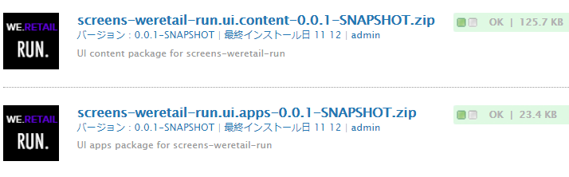
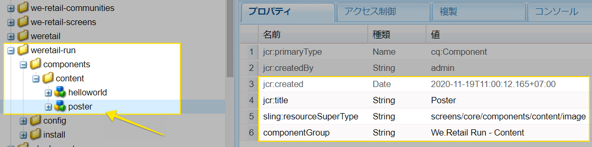
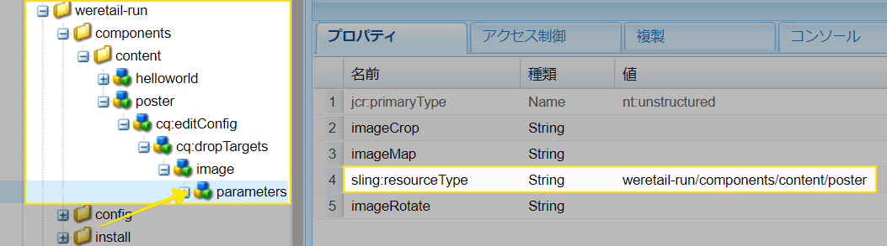
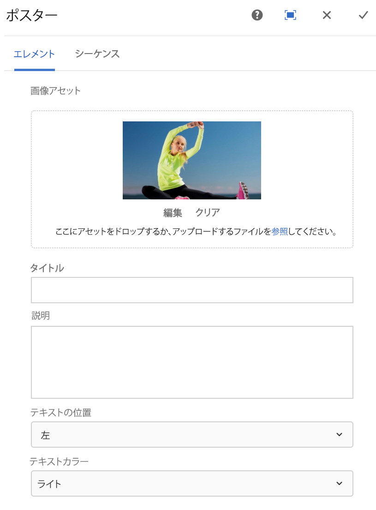
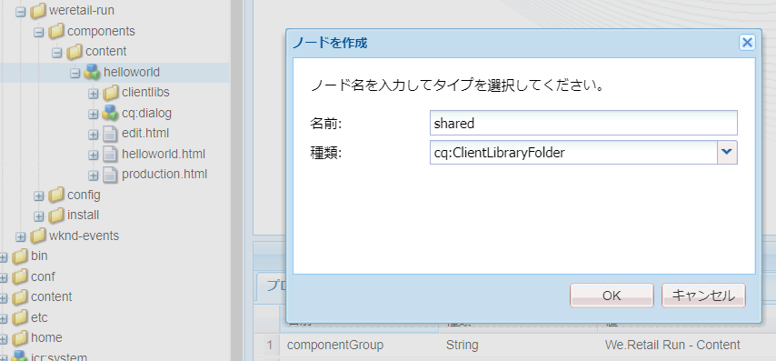
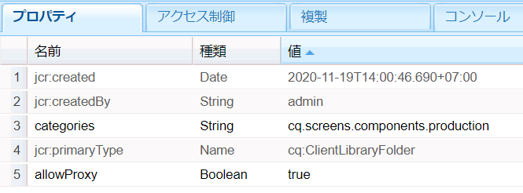
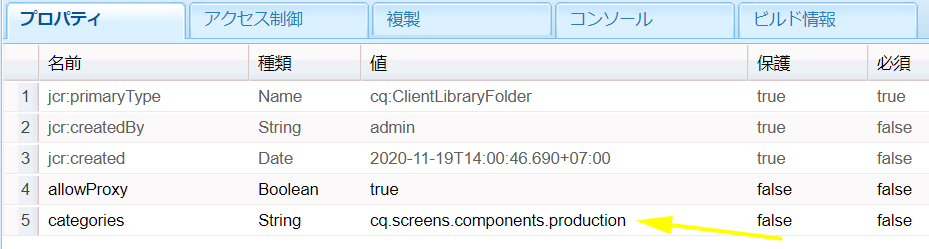
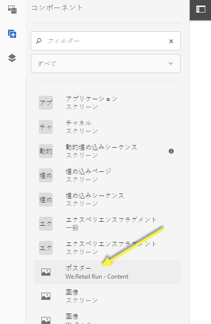
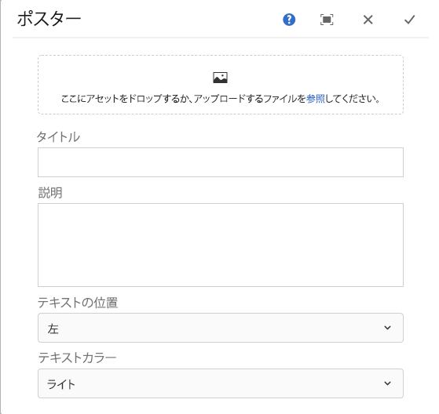

# AEM Screens コンポーネントの拡張 {#extending-an-aem-screens-component}

以下のチュートリアルでは、標準搭載の AEM Screens コンポーネントを拡張する際の手順とベストプラクティスについて説明します。画像コンポーネントが拡張されて、オーサリング可能なテキストオーバーレイが追加されます。

## 概要 {#overview}

このチュートリアルは、AEM Screens を初めて使用する開発者を対象としています。このチュートリアルでは、Screens 画像コンポーネントを拡張して、ポスターコンポーネントを作成します。タイトル、説明、ロゴを画像の上にオーバーレイして、シーケンスチャネル内に魅力的なエクスペリエンスを作成します。

>[!NOTE]
>
>このチュートリアルを開始する前に、[AEM Screens 用カスタムコンポーネントの開発](developing-custom-component-tutorial-develop.md)のチュートリアルを完了しておくことをお勧めします。


カスタムポスターコンポーネントは、画像コンポーネントを拡張して作成します。

## 前提条件 {#prerequisites}

このチュートリアルを完了するには、以下が必要です。

1. [AEM 6.4](https://docs.adobe.com/content/help/en/experience-manager-64/release-notes/release-notes.html) または [AEM 6.3](https://helpx.adobe.com/experience-manager/6-3/release-notes.html) + 最新の Screens 機能パック
1. [AEM Screens Player](/help/user-guide/aem-screens-introduction.md)
1. ローカル開発環境

チュートリアルの手順とスクリーンショットは、CRXDE-Lite を使用して実行します。[このチュートリ](https://docs.adobe.com/content/help/en/experience-manager-64/developing/devtools/aem-eclipse.html) アルを完了するには、EclipseまたはIntelliJ [](https://docs.adobe.com/content/help/en/experience-manager-64/developing/devtools/ht-intellij.html) IDEも使用できます。 More information on using an IDE to [develop with AEM can be found here](https://docs.adobe.com/content/help/en/experience-manager-learn/getting-started-wknd-tutorial-develop/project-setup.html#eclipse-ide).

## プロジェクトのセットアップ {#project-setup}

Screens プロジェクトのソースコードは、通常、マルチモジュールの Maven プロジェクトとして管理されます。このチュートリアルを効率よく進めるために、[AEM プロジェクトアーキタイプ 13](https://github.com/adobe/aem-project-archetype) を使用してプロジェクトを事前に生成してあります。Maven AEM プロジェクトアーキタイプを使用したプロジェクトの作成について詳しくは、[こちら](https://docs.adobe.com/content/help/en/experience-manager-learn/getting-started-wknd-tutorial-develop/project-setup.html#maven-multimodule)を参照してください。

1. **CRX パッケージマネージャー**（`http://localhost:4502/crx/packmgr/index.jsp)r:`）を使用して、次のパッケージをダウンロードしてインストールします。

   [ファイルを入手](assets/start-poster-screens-weretail-runuiapps-001-snapshot.zip)

   [ファイルを入手](assets/start-poster-screens-weretail-runuicontent-001-snapshot.zip)
   **（オプション）** Eclipse などの IDE を使用して作業する場合は、以下のソースパッケージをダウンロードします。次の Maven コマンドを使用して、プロジェクトをローカルの AEM インスタンスにデプロイします。

   **`mvn -PautoInstallPackage clean install`**

   SRC Start Screens We.Retail Run Project

   [ファイルを入手](assets/start-poster-screens-weretail-run.zip)

1. **CRX パッケージマネージャー**（`http://localhost:4502/crx/packmgr/index.jsp`）で、次の 2 つのパッケージがインストールされていることを確認します。

   1. **screens-weretail-run.ui.content-0.0.1-SNAPSHOT.zip**
   1. **screens-weretail-run.ui.apps-0.0.1-SNAPSHOT.zip**
   

   CRX パッケージマネージャーを使用してインストールされた Screens We.Retail Run Ui.Content および Ui.Apps パッケージ

## ポスターコンポーネントの作成 {#poster-cmp}

ポスターコンポーネントは、Screens に標準搭載の画像コンポーネントを拡張したものです。Sling の `sling:resourceSuperType` メカニズムを使用すると、画像コンポーネントのコア機能をコピーして貼り付けなくても継承できるようになります。Sling のリクエスト処理の基本について詳しくは、[こちら](https://helpx.adobe.com/experience-manager/6-5/sites/developing/using/the-basics.html#SlingRequestProcessing)を参照してください。

ポスターコンポーネントは、プレビュー／実稼働モードではフルスクリーンでレンダリングされます。編集モードでは、シーケンスチャネルのオーサリングを容易におこなえるように、コンポーネントをフルスクリーン以外でレンダリングすることが重要です。

1. **CRXDE Lite**（`http://localhost:4502/crx/de/index.jsp`）または任意の IDE で、`/apps/weretail-run/components/content` の下に `poster` という名前の新しい `cq:Component` を作成します。

   `poster` コンポーネントに次のプロパティを追加します。

   ```xml
   <?xml version="1.0" encoding="UTF-8"?>
   <jcr:root xmlns:sling="https://sling.apache.org/jcr/sling/1.0" xmlns:cq="https://www.day.com/jcr/cq/1.0" xmlns:jcr="https://www.jcp.org/jcr/1.0"
       jcr:primaryType="cq:Component"
       jcr:title="Poster"
       sling:resourceSuperType="screens/core/components/content/image"
       componentGroup="We.Retail Run - Content"/>
   ```

   

   /apps/weretail-run/components/content/poster のプロパティ

   `sling:resourceSuperType` プロパティを `screens/core/components/content/image` に設定すると、ポスターコンポーネントは画像コンポーネントのすべての機能を事実上継承します。機能を上書きおよび拡張するために、`screens/core/components/content/image` の下にある同等のノードおよびファイルを `poster` コンポーネントの下に追加することができます。

1. `/libs/screens/core/components/content/image.` の下の `cq:editConfig` ノードをコピーし、`/apps/weretail-run/components/content/poster` コンポーネントの下に `cq:editConfig` を貼り付けます。

   `cq:editConfig/cq:dropTargets/image/parameters` ノードで、`sling:resourceType` プロパティを `weretail-run/components/content/poster` に更新します。

   

   cq:editConfig の XML 表現は次のようになります。

   ```xml
   <?xml version="1.0" encoding="UTF-8"?>
   <jcr:root xmlns:sling="https://sling.apache.org/jcr/sling/1.0" xmlns:cq="https://www.day.com/jcr/cq/1.0" xmlns:jcr="https://www.jcp.org/jcr/1.0" xmlns:nt="https://www.jcp.org/jcr/nt/1.0"
       jcr:primaryType="cq:EditConfig">
       <cq:dropTargets jcr:primaryType="nt:unstructured">
           <image
               jcr:primaryType="cq:DropTargetConfig"
               accept="[image/.*]"
               groups="[media]"
               propertyName="./fileReference">
               <parameters
                   jcr:primaryType="nt:unstructured"
                   sling:resourceType="weretail-run/components/content/poster"
                   imageCrop=""
                   imageMap=""
                   imageRotate=""/>
           </image>
       </cq:dropTargets>
   </jcr:root>
   ```

1. WCM 基盤コンポーネントの `image` ダイアログをコピーして、`poster` コンポーネントに使用します。

   既存のダイアログを出発点にして、それに変更を加えるのが最も簡単です。

   1. ダイアログのコピー元：`/libs/wcm/foundation/components/image/cq:dialog`
   1. ダイアログの貼り付け先のパス：`/apps/weretail-run/components/content/poster`
   

   /libs/wcm/foundation/components/image/cq:dialog を /apps/weretail-run/components/content/poster にコピーした後

   WCM の `image` 基盤コンポーネントは、Screens `image` コンポーネントのスーパータイプになります。したがって、`poster` コンポーネントは両者から機能を継承します。ポスターコンポーネントのダイアログは、Screens ダイアログと基盤ダイアログの組み合わせで構成されます。**Sling Resource Merger** の機能を使用して、スーパータイプコンポーネントから継承した無関係なダイアログフィールドやタブを非表示にします。

1. `/apps/weretail-run/components/content/poster` の下の cq:dialog を更新して、XML で表現された以下の変更を反映します。

   ```xml
   <?xml version="1.0" encoding="UTF-8"?>
   <jcr:root xmlns:sling="https://sling.apache.org/jcr/sling/1.0" xmlns:cq="https://www.day.com/jcr/cq/1.0" xmlns:jcr="https://www.jcp.org/jcr/1.0" xmlns:nt="https://www.jcp.org/jcr/nt/1.0"
       jcr:primaryType="nt:unstructured"
       jcr:title="Poster"
       sling:resourceType="cq/gui/components/authoring/dialog">
       <content
           jcr:primaryType="nt:unstructured"
           sling:resourceType="granite/ui/components/foundation/container">
           <layout
               jcr:primaryType="nt:unstructured"
               sling:resourceType="granite/ui/components/foundation/layouts/tabs"
               type="nav"/>
           <items jcr:primaryType="nt:unstructured">
               <image
                   jcr:primaryType="nt:unstructured"
                   jcr:title="Elements"
                   sling:resourceType="granite/ui/components/foundation/section">
                   <layout
                       jcr:primaryType="nt:unstructured"
                       sling:resourceType="granite/ui/components/foundation/layouts/fixedcolumns"
                       margin="{Boolean}false"/>
                   <items jcr:primaryType="nt:unstructured">
                       <column
                           jcr:primaryType="nt:unstructured"
                           sling:resourceType="granite/ui/components/foundation/container">
                           <items
                               jcr:primaryType="nt:unstructured"
                               sling:hideChildren="[linkURL,size]">
                               <file
                                   jcr:primaryType="nt:unstructured"
                                   sling:resourceType="cq/gui/components/authoring/dialog/fileupload"
                                   autoStart="{Boolean}false"
                                   class="cq-droptarget"
                                   fieldLabel="Image asset"
                                   fileNameParameter="./fileName"
                                   fileReferenceParameter="./fileReference"
                                   mimeTypes="[image]"
                                   multiple="{Boolean}false"
                                   name="./file"
                                   title="Upload Image Asset"
                                   uploadUrl="${suffix.path}"
                                   useHTML5="{Boolean}true"/>
                               <title
                                   jcr:primaryType="nt:unstructured"
                                   sling:resourceType="granite/ui/components/foundation/form/textfield"
                                   fieldLabel="Title"
                                   name="./jcr:title"/>
                               <description
                                   jcr:primaryType="nt:unstructured"
                                   sling:resourceType="granite/ui/components/foundation/form/textarea"
                                   fieldLabel="Description"
                                   name="./jcr:description"/>
                               <position
                                   jcr:primaryType="nt:unstructured"
                                   sling:resourceType="granite/ui/components/coral/foundation/form/select"
                                   fieldLabel="Text Position"
                                   name="./textPosition">
                                   <items jcr:primaryType="nt:unstructured">
                                       <left
                                           jcr:primaryType="nt:unstructured"
                                           text="Left"
                                           value="left"/>
                                       <center
                                           jcr:primaryType="nt:unstructured"
                                           text="Center"
                                           value="center"/>
                                       <right
                                           jcr:primaryType="nt:unstructured"
                                           text="Right"
                                           value="right"/>
                                   </items>
                               </position>
                               <color
                                   jcr:primaryType="nt:unstructured"
                                   sling:resourceType="granite/ui/components/coral/foundation/form/select"
                                   fieldLabel="Text Color"
                                   name="./textColor">
                                   <items jcr:primaryType="nt:unstructured">
                                       <light
                                           jcr:primaryType="nt:unstructured"
                                           text="Light"
                                           value="light"/>
                                       <dark
                                           jcr:primaryType="nt:unstructured"
                                           text="Dark"
                                           value="dark"/>
                                   </items>
                               </color>
                           </items>
                       </column>
                   </items>
               </image>
               <accessibility
                   jcr:primaryType="nt:unstructured"
                   sling:hideResource="{Boolean}true"/>
           </items>
       </content>
   </jcr:root>
   ```

   `items` ノードでプロパティ `sling:hideChildren`= `"[linkURL,size]`&quot; を使用して、**linkURL** フィールドと **size** フィールドがダイアログで非表示になるようにします。これらのノードをポスターダイアログから削除するだけでは不十分です。「アクセシビリティ」タブのプロパティ `sling:hideResource="{Boolean}true"` は、タブ全体を非表示にするために使用されます。

   2 つの選択フィールドをダイアログに追加すると、「タイトル」と「説明」のテキスト位置や色を作成者が制御できるようになります。

   

   ポスター - 最終的なダイアログ構造

   この段階で、`poster` コンポーネントのインスタンスを We.Retail Run プロジェクトの **Idle Channel** ページ（`http://localhost:4502/editor.html/content/screens/we-retail-run/channels/idle-channel.edit.html`）に追加できます。

   

   ポスターダイアログのフィールド

1. `/apps/weretail-run/components/content/poster` の下に `production.html.` という名前のファイルを作成します。

   ファイルに以下のように入力します。

   ```xml
   <!--/*
   
       /apps/weretail-run/components/content/poster/production.html
   
   */-->
   <div data-sly-use.image="image.js"
        data-duration="${properties.duration}"
        class="cmp-poster"
        style="background-image: url(${request.contextPath @ context='uri'}${image.src @ context='uri'});">
       <div class="cmp-poster__text
                   cmp-poster__text--${properties.textPosition @ context='attribute'}
                   cmp-poster__text--${properties.textColor @ context='attribute'}">
           <h1 class="cmp-poster__title">${properties.jcr:title}</h1>
            <h2 class="cmp-poster__description">${properties.jcr:description}</h2>
       </div>
    
   </div>
   ```

   上記は、ポスターコンポーネントの実稼働用マークアップです。HTL スクリプトで `screens/core/components/content/image/production.html` が上書きされます。`image.js` は、POJO に似た画像オブジェクトを作成するサーバー側スクリプトです。この画像オブジェクトを呼び出して、`src` をインラインスタイルの背景画像としてレンダリングできます。

   `The h1` タグと h2 タグを追加して、コンポーネントプロパティ `${properties.jcr:title}` および `${properties.jcr:description}` に基づいて「タイトル」と「説明」を表示します。

   「`cmp-poster__text`」のバリエーションを使用する 3 つの CSS クラスを含んだ div ラッパーで、`h1` タグと `h2` タグを囲みます。`textPosition` プロパティと `textColor` プロパティの値を使用し、作成者によるダイアログ選択に基づいてレンダリングされる CSS クラスを変更します。次の節では、クライアントライブラリの CSS を記述して、これらの変更をディスプレイに反映します。

   コンポーネントには、ロゴもオーバーレイとして含まれます。この例では、We.Retail ロゴのパスが DAM にハードコードされています。使用例によっては、ロゴのパスを動的に設定できるような新しいダイアログフィールドを作成する方が合理的な場合があります。

   また、コンポーネントでは BEM（ブロック要素修飾子）表記が使用されることにも注意してください。BEM は、再利用可能なコンポーネントを容易に作成できる CSS コーディング規則です。BEM は、[AEM のコアコンポーネント](https://github.com/Adobe-Marketing-Cloud/aem-core-wcm-components/wiki/CSS-coding-conventions)で使用される表記です。詳しくは、[https://getbem.com/](https://getbem.com/) を参照してください。

1. `/apps/weretail-run/components/content/poster` の下に `edit.html.` という名前のファイルを作成します。

   ファイルに以下のように入力します。

   ```xml
   <!--/*
   
       /apps/weretail-run/components/content/poster/edit.html
   
   */-->
   
   <div class="aem-Screens-editWrapper ${image.cssClass} cmp-poster" data-sly-use.image="image.js" data-emptytext="${'Poster' @ i18n, locale=request.locale}">
       
       <div class="cmp-poster__text
              cmp-poster__text--${properties.textPosition @ context='attribute'}
          cmp-poster__text--${properties.textColor @ context='attribute'}">
         <p class="cmp-poster__title">${properties.jcr:title}</p>
         <p class="cmp-poster__description">${properties.jcr:description}</p>
       </div>
   </div>
   ```

   上記は、ポスターコンポーネントの&#x200B;**編集用**&#x200B;マークアップです。HTL スクリプトで `/libs/screens/core/components/content/image/edit.html` が上書きされます。このマークアップは `production.html` のマークアップと似ており、画像の上にタイトルと説明が表示されます。

   コンポーネントがエディターでフルスクリーンでレンダリングされないように、`aem-Screens-editWrapper` を追加します。`data-emptytext` 属性を指定すると、画像やコンテンツが入力されていない場合に、必ずプレースホルダーが表示されるようになります。

## クライアント側ライブラリの作成 {#clientlibs}

クライアント側ライブラリは、AEM の実装で必要な CSS および JavaScript ファイルの編成および管理のための仕組みを提供します。クライアント側ライブラリの使用の詳細については、[こちら](https://helpx.adobe.com/experience-manager/6-5/sites/developing/using/clientlibs.html)を参照してください。

AEM Screens コンポーネントは、編集モードとプレビュー／実稼働モードではレンダリングが異なります。2 組のクライアントライブラリが作成されます。1 つは編集モード用、もう1つはプレビュー／実稼働用です。

1. ポスターコンポーネントのクライアント側ライブラリ用のフォルダーを作成します。

   `/apps/weretail-run/components/content/poster,` の下に、`clientlibs` という名前の新しいフォルダーを作成します。

   

1. `clientlibs` フォルダーの下に、名前が `shared` で `cq:ClientLibraryFolder.` 型の新しいノードを作成します。

   

1. 共有クライアントライブラリに次のプロパティを追加します。

   * `allowProxy` | Boolean | `true`
   * `categories` | String[] | `cq.screens.components`
   

   /apps/weretail-run/components/content/poster/clientlibs/shared のプロパティ

   `categories` プロパティは、クライアントライブラリを識別する文字列です。`cq.screens.components` カテゴリは、編集モードとプレビュー／実稼働モードの両方で使用されます。したがって、`shared` クライアントライブラリに定義された CSS／JS は、すべてのモードに読み込まれます。

   実稼働環境では、直接 /apps にパスを公開しないことをお勧めします。`allowProxy` プロパティにより、クライアントライブラリの CSS と JS が `/etc.clientlibs` というプレフィックスを付けて参照されるようになります。allowProxy について詳しくは、[こちら](https://helpx.adobe.com/experience-manager/6-5/sites/developing/using/clientlibs.html#main-pars_title_8ced)を参照してください。

1. 共有フォルダーの下に `css.txt` という名前のファイルを作成します。

   ファイルに以下のように入力します。

   ```
   #base=css
   
   styles.less
   ```

1. `shared` フォルダーの下に `css` という名前のフォルダーを作成します。`css` フォルダーの下に、`style.less` という名前のファイルを追加します。クライアントライブラリの構造は次のようになります。

   

   このチュートリアルでは、CSS を直接記述するのではなく、LESS を使用します。[LESS](https://lesscss.org/) は、CSS 変数、ミックスイン、関数をサポートしている一般的な CSS プリコンパイラーです。AEM のクライアントライブラリは、LESS によるコンパイルをネイティブにサポートしています。Sass などのプリコンパイラーも使用できますが、その場合は、AEM の外部でコンパイルする必要があります。

1. `/apps/weretail-run/components/content/poster/clientlibs/shared/css/styles.less` に以下を入力します。

   ```css
   /*
    /apps/weretail-run/components/content/poster/clientlibs/shared/css/styles.less
    Poster Component - Shared Style
   */
   
   @import url('https://fonts.googleapis.com/css?family=Fjalla+One|Open+Sans:400i');
   
   @text-light-color: #fff;
   @text-dark-color: #000;
   @title-font-family: 'Fjalla One', sans-serif;
   @description-font-family: 'Open Sans', sans-serif;
   
   .cmp-poster {
   
         &__text {
         position: absolute;
         color: @text-light-color;
         top: 0;
         text-align:center;
         width: 100%;
   
         &--left {
          text-align: left;
                margin-left: 1em;
         }
   
         &--right {
          text-align: right;
                margin-right: 1em;
         }
   
         &--dark {
          color: @text-dark-color;
         }
       }
   
       &__title {
         font-weight: bold;
            font-family: @title-font-family;
            font-size: 1.2em;
       }
   
       &__description {
     font-style: italic;
           font-family: @description-font-family;
    }
   
   }
   ```

   >[!NOTE]
   >
   >Google Web フォントは、フォントファミリーに使用します。Web フォントを使用するにはインターネット接続が必要ですが、すべての Screens 実装に信頼性の高い接続があるとは限りません。オフラインモードへの対応を計画することは、Screens デプロイメントの重要な考慮事項です。

1. クライアントライブラリフォルダー `shared` をコピーします。兄弟として貼り付け、名前を `production` に変更します。

   

1. 実稼働用クライアントライブラリの `categories` プロパティを `cq.screens.components.production.` に更新します。

   `cq.screens.components.production` カテゴリにより、プレビュー／実稼働モードの場合のみ、スタイルが読み込まれるようになります。

   

   /apps/weretail-run/components/content/poster/clientlibs/production のプロパティ

1. `/apps/weretail-run/components/content/poster/clientlibs/production/css/styles.less` に以下を入力します。

   ```css
   /*
    /apps/weretail-run/components/content/poster/clientlibs/production/css/styles.less
    Poster Component - Production Style
   */
   
   .cmp-poster {
   
       background-size: cover;
    height: 100%;
    width: 100%;
    position:absolute;
   
        &__text {
   
           top: 2em;
   
           &--left {
               width: 40%;
               top: 5em;
           }
   
           &--right {
               width: 40%;
               right: 1em;
           }
       }
   
       &__title {
     font-size: 5rem;
     font-weight: 900;
     margin: 0.1rem;
    }
   
    &__description {
     font-size: 2rem;
     margin: 0.1rem;
     font-weight: 400;
   
    }
   
       &__logo {
     position: absolute;
     max-width: 200px;
     top: 1em;
     left: 0;
    }
   
   }
   ```

   上記のスタイルでは、「タイトル」と「説明」がスクリーン上の絶対位置に表示されます。タイトルは説明よりもかなり大きく表示されます。コンポーネントの BEM 表記により、cmp-poster クラス内のスタイルを注意深くスコープ設定するのが非常に容易になります。

3 番目のクライアントライブラリカテゴリ `cq.screens.components.edit` は、コンポーネントに編集専用のスタイルを追加する場合に使用できます。

| クライアントライブラリカテゴリ | 使用方法 |
|---|---|
| `cq.screens.components` | スタイルとスクリプトが編集モードと実稼働モードの両方で共有される |
| `cq.screens.components.edit` | スタイルとスクリプトが編集モードでのみ使用される |
| `cq.screens.components.production` | スタイルとスクリプトが実稼働モードでのみ使用される |

## シーケンスチャネルへのポスターコンポーネントの追加 {#add-sequence-channel}

ポスターコンポーネントは、シーケンスチャネルで使用するためのものです。このチュートリアルのスターターパッケージには、Idle Channel が含まれています。Idle Channel は、**We.Retail Run - Content** グループのコンポーネントを許可するように事前設定されています。ポスターコンポーネントのグループは `We.Retail Run - Content` に設定されており、チャネルに追加できるようになっています。

1. We.Retail Run プロジェクトの Idle Channel（**`http://localhost:4502/editor.html/content/screens/we-retail-run/channels/idle-channel.edit.html`**）を開きます。
1. **ポスター**&#x200B;コンポーネントの新しいインスタンスをサイドバーからページにドラッグ＆ドロップします。

   

1. ポスターコンポーネントのダイアログを編集して、「画像」、「タイトル」、「説明」を追加します。「テキストの位置」と「テキストの色」の選択フィールドを使用して、「タイトル」や「説明」が画像上で読みやすくなるようにします。

   

1. 上記の手順を繰り返して、ポスターコンポーネントをいくつか追加します。コンポーネント間にトランジション（トランジション）を追加します。

   

## まとめ {#putting-it-all-together}

以下のビデオでは、完成したコンポーネントと、それをシーケンスチャンネルに追加する方法を示しています。この後、チャネルはロケーションのディスプレイに追加され、最終的に Screens プレイヤーに割り当てられます。

>[!VIDEO](https://video.tv.adobe.com/v/22414?quaity=9)

## 完成したコード {#finished-code}

チュートリアルで完成したコードは以下のとおりです。**screens-weretail-run.ui.apps-0.0.1-SNAPSHOT.zip** と **screens-weretail-run.ui.content-0.0.1-SNAPSHOT.zip** は、コンパイル済みの AEM パッケージです。SRC-screens-wertail-run-0.0.1.zip は、Maven を使用してデプロイできる未コンパイルのソースコードです。

[ファイルを入手](assets/final-poster-screens-weretail-runuiapps-001-snapshot.zip)

[ファイルを入手](assets/final-poster-screens-weretail-runuicontent-001-snapshot.zip)

SRC Final Screens We.Retail Run Project

[ファイルを入手](assets/src-screens-weretail-run-001.zip)
