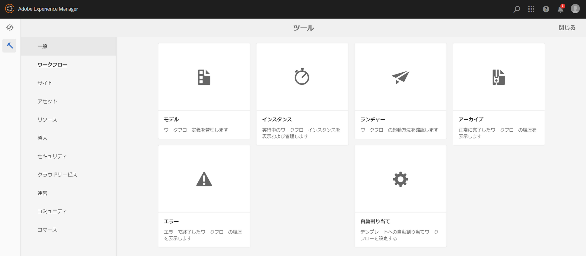
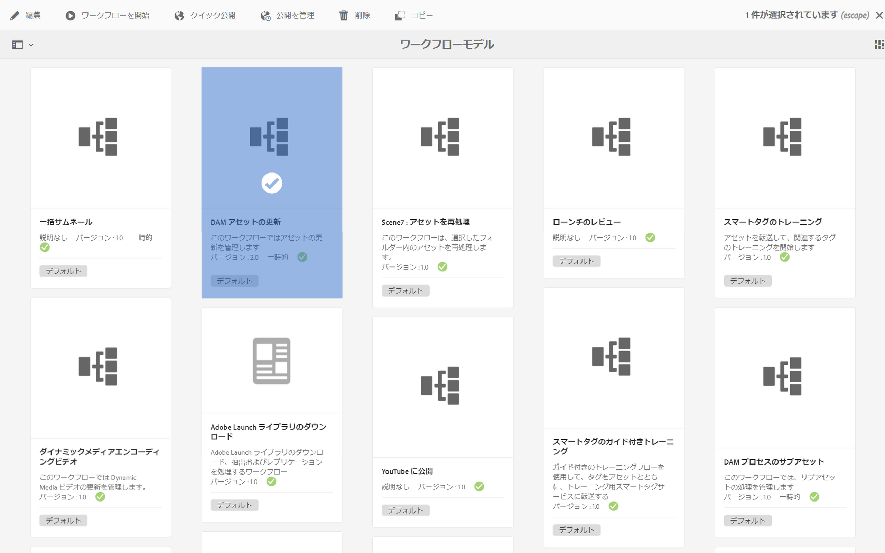
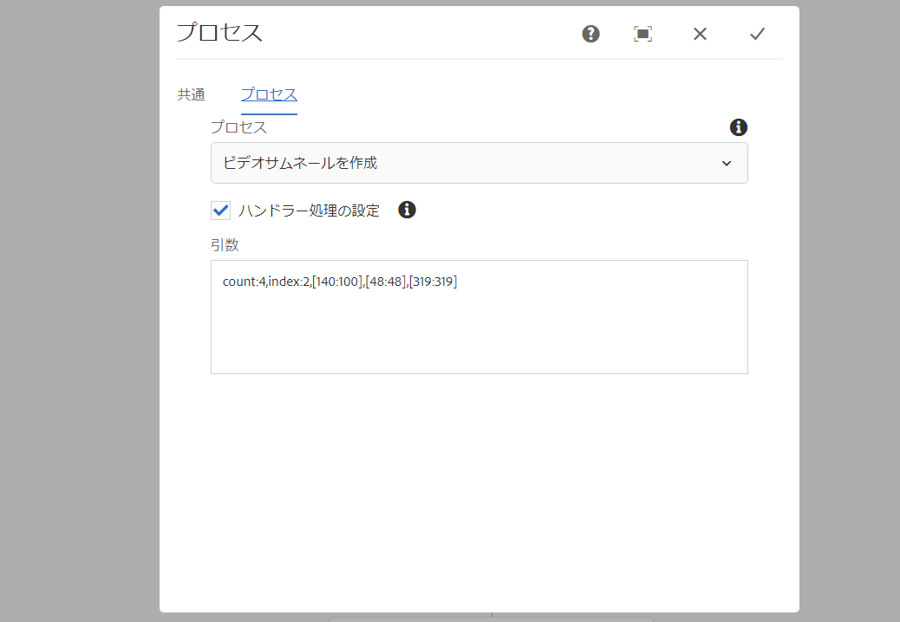
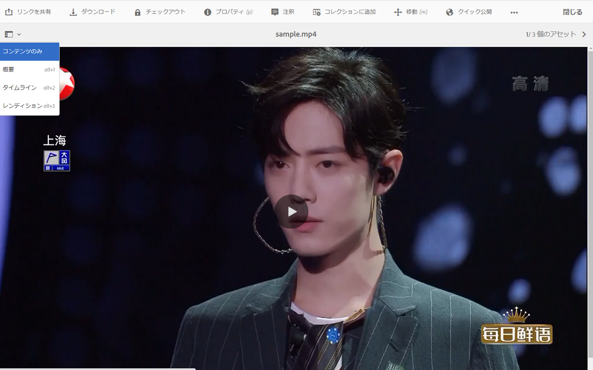
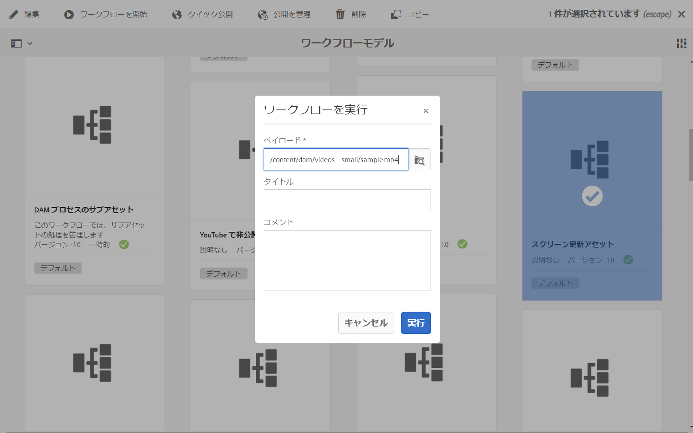
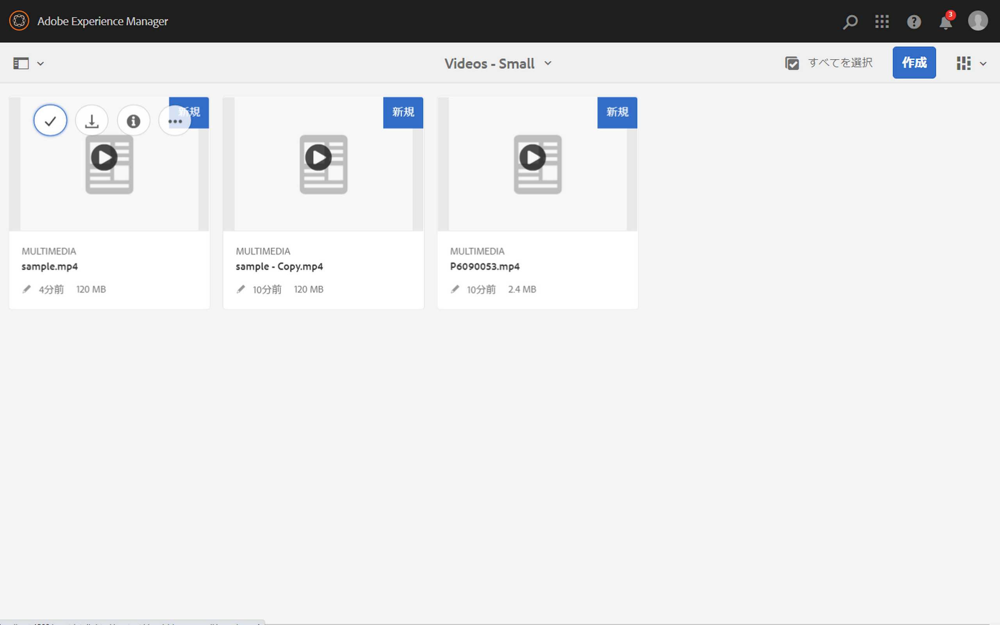

# ビデオレンディション {#video-renditions}

手動および自動でフル HD レンディションを生成できます。ここでは、アセットにレンディションを追加するワークフローを説明します。

## フル HD レンディションの自動生成  {#automatically-generating-full-hd-renditions}

>[!NOTE]
>
>デバイスで AEM Screens ビデオレンディションが自動的に再生されない場合は、ビデオの仕様についてハードウェアベンダーにお問い合わせください。これは、デバイスで最高のパフォーマンスを得るのに役立ち、これにより、FFMPEG でレンディションを生成するための適切なパラメーターを提供する独自のカスタムビデオプロファイルを作成できます。続いて、次の手順でプロファイルのリストにカスタムビデオプロファイルを追加します。
>
>また、チャネルで再生されているビデオをデバッグおよびトラブルシューティングする方法については、[ビデオのトラブルシューティング](troubleshoot-videos.md)を参照してください。

フル HD レンディションを自動的に生成するには、次の手順に従います。

1. Adobe Experience Manager リンク（左上）を選択し、ツールを選択するためのハンマーアイコンをクリックして、「**ワークフロー**」を選択します。

   「**モデル**」をクリックして、ワークフローモデル管理に進みます。

   

1. 「**DAM アセットの更新**」モデルを選択し、アクションバーの「編集」をクリックして、**DAM アセットの更新**&#x200B;ウィンドウを開きます。

   

1. **FFmpeg トランスコーディング**&#x200B;の手順をダブルクリックします。

   

1. 「**プロセス**」タブを選択し、プロセスの引数を編集します。「**引数**」のリストにフル HD プロファイルとして「***,profile:fullhd-bp,profile:fullhd-hp***」を入力し、「**OK**」をクリックします。

   

1. **DAM アセットの更新**&#x200B;画面の左上にある「**保存**」をクリックします。

   

1. **Assets** に移動し、新しいビデオをアップロードします。ビデオをクリックしてレンディションサイドレールを開くと、2 つのフル HD ビデオが表示されます。

   

1. サイドレールから「**レンディション**」を開きます。

   

1. 2 つの新しいフル HD レンディションが表示されます。

   

## フル HD レンディションの手動生成 {#manually-generating-full-hd-renditions}

フル HD レンディションを手動で生成するには、次の手順に従います。

1. Adobe Experience Manager リンク（左上）を選択し、ツールを選択するためのハンマーアイコンをクリックして、「**ワークフロー**」を選択します。

   「**モデル**」をクリックして、ワークフローモデル管理に進みます。

   

1. 「**スクリーン更新アセット**」モデルを選択し、「**ワークフローを開始**」をクリックして&#x200B;**ワークフローを実行**&#x200B;ダイアログボックスを開きます。

   

1. 「**ペイロード**」で目的のビデオを選択し、「**実行**」をクリックします。

   

1. **Assets** に移動し、アセットまでドリルダウンしてクリックします。

   

1. **レンディション**&#x200B;サイドレールを開くと、新しいフル HD レンディションが表示されます。

   
