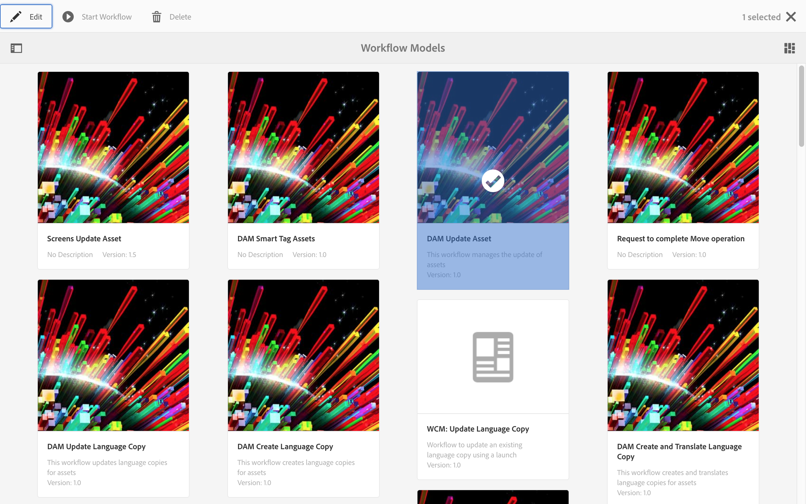
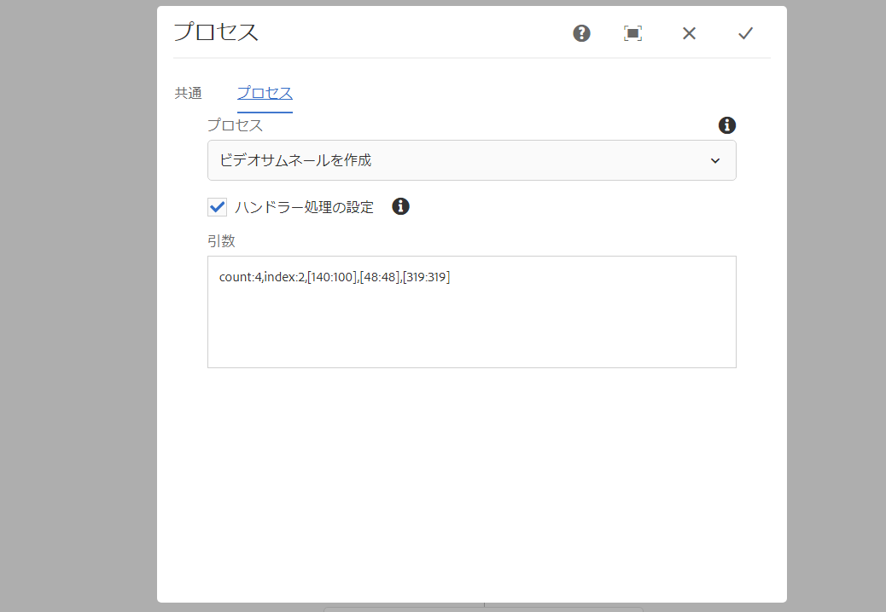
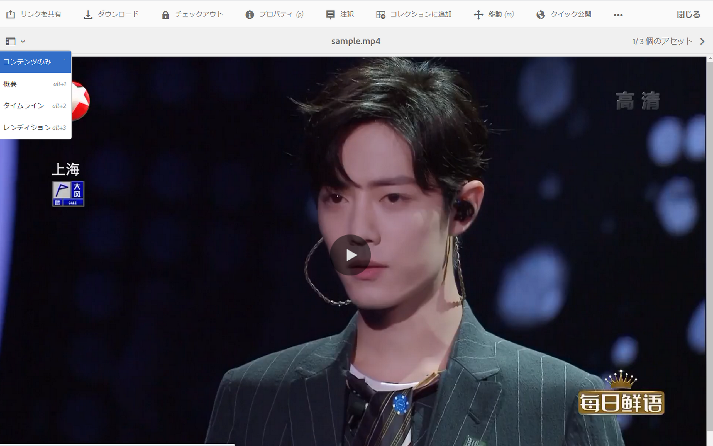
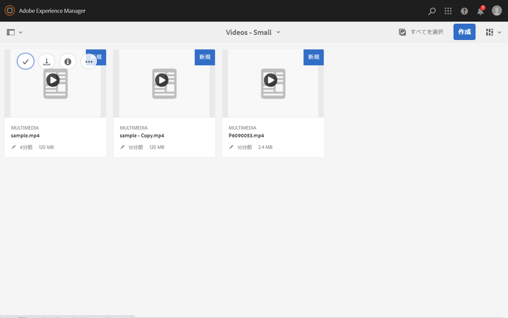

# ビデオレンディション {#video-renditions}

>[!IMPORTANT]
>このコンテンツは、AEM オンプレミス/AMS （AEM 6.5LTSおよびAEM 6.5）に対して有効です。 AEM as a Cloud Service Screensの内容については、[AEM as a Cloud Service ガイド &#x200B;](https://experienceleague.adobe.com/en/docs/experience-manager-cloud-service/content/screens-as-cloud-service/overview/introduction)を参照してください。

手動および自動のフル HD レンディションを生成できます。 次の節では、アセットにレンディションを追加するワークフローについて説明します。

## フル HD レンディションの自動生成 {#automatically-generating-full-hd-renditions}

>[!NOTE]
>
>AEM Screens のビデオレンディションがデバイスで最適に再生されない場合は、ハードウェアのベンダーにビデオの仕様を問い合わせてください。 これにより、デバイスで最高のパフォーマンスを得ることができます。 これは、レンディションを生成するための FFMPEG に適したパラメーターを提供する、独自のカスタムビデオプロファイルを作成する場合に役立ちます。 次に、次の手順を使用して、カスタムビデオプロファイルをプロファイルのリストに追加します。
>
>また、チャネルで再生されるビデオをデバッグおよびトラブルシューティングするには、[ビデオのトラブルシューティング](troubleshoot-videos.md)を参照してください。

フル HD レンディションを自動で生成するには、次の手順に従います。

1. Adobe Experience Manager リンク（左上）をクリックし、ハンマーアイコンをクリックすると、**ワークフロー**&#x200B;がクリックできます。

   **モデル**&#x200B;をクリックします。

   

1. ワークフローモデル管理で、**DAM Update Asset** モデルをクリックし、アクションバーから「**編集**」をクリックします。

   

1. **DAM Update Asset** ウィンドウで、**FFmpeg でのトランスコード**&#x200B;ステップをダブルクリックします。

   

1. 「**プロセス**」タブをクリックします。
1. **引数**&#x200B;のリストへ、フル HD プロファイルを次のように入力します。
   ***`,profile:fullhd-bp,profile:fullhd-hp`***
1. 「**OK**」をクリックします。

   

1. **DAM Update Asset**&#x200B;画面の左上にある「**保存**」をクリックします。

   

1. **Assets** に移動し、新しいビデオをアップロードします。 ビデオをクリックして、レンディションサイドパネルを開きます。 2 つのフル HD ビデオに注目します。

   

1. サイドレールから「**レンディション**」を開きます。

   

1. 2 つの新しいフル HD レンディションが表示されます。

   

## フル HD レンディションの手動生成 {#manually-generating-full-hd-renditions}

フル HD レンディションを手動で生成するには、次の手順に従います。

1. Adobe Experience Manager リンク（左上）をクリックし、ハンマーアイコンをクリックするとツールをクリックできるようになるので、次に「**ワークフロー**」をクリックします。

   **モデル**&#x200B;をクリックします。

   

1. ワークフローモデル管理で、**スクリーン更新アセット**&#x200B;モデルをクリックし、**ワークフローを開始**&#x200B;をクリックして&#x200B;**ワークフローを実行**&#x200B;ダイアログボックスを開きます。

   

1. 「**ペイロード**」で目的のビデオをクリックし、「**実行**」をクリックします。

   

1. **Assets** に移動し、アセットまでドリルダウンしてクリックします。

   

1. **レンディション**&#x200B;サイドパネルを開きます。 新しいフル HD レンディションに注目してください。

   

