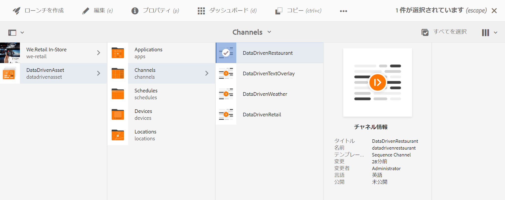
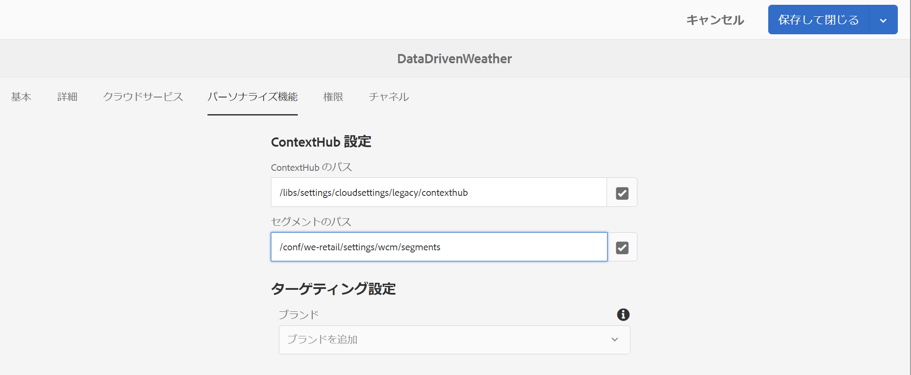
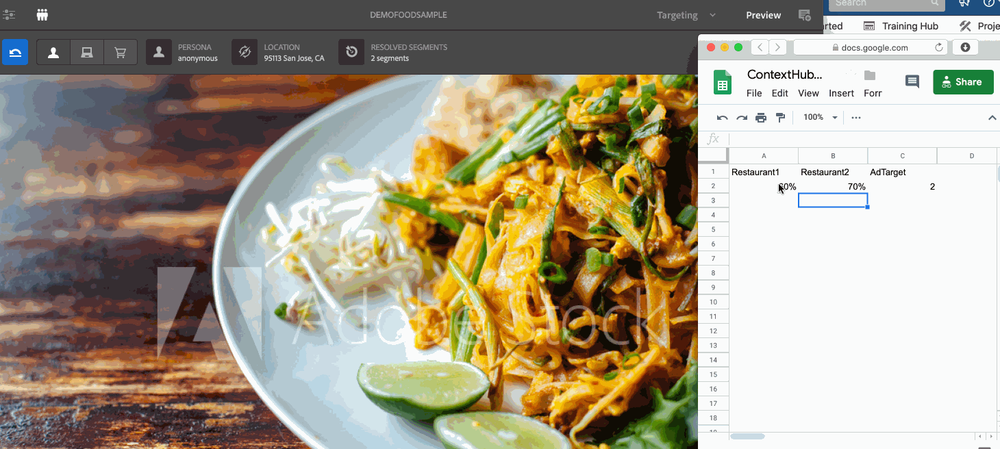

# 接客業向けの予約状況に応じたアクティベーション {#hospitality-reservation-activation}

以下の使用例では、Google シートに入力された値に基づく、接客業向けの予約状況に応じたアクティベーションを示しています。

## 説明 {#description}

この使用例では、**Restarant1** および **Restarant2** という 2 つのレストランの予約率が Google シートに入力されています。Restarant1 と Restarant2 の値に基づいて数式が適用され、その数式に基づいて、値 1 または値 2 が **AdTarget** 列に割り当てられます。

**Restaurant1** の値が **Restaurant2** の値より大きい場合は、**AdTaget** に値 **1** が割り当てられ、それ以外の場合は、**AdTarget** に値 **2** が割り当てられます。値 1 の場合はディスプレイの画面に&#x200B;*ステーキ料理*&#x200B;のオプションが表示され、値 2 の場合は&#x200B;*タイ料理*&#x200B;のオプションが表示されます。

## 前提条件 {#preconditions}

予約状況に応じたアクティベーションの実装を開始する前に、AEM Screens プロジェクトで&#x200B;***データストア***、***オーディエンスのセグメント化***、***チャネルのターゲティングの有効化***&#x200B;をセットアップする方法を理解しておく必要があります。

詳しくは、[AEM Screens プロジェクトでの ContextHub の設定](configuring-context-hub.md)を参照してください。

## 基本フロー {#basic-flow}

AEM Screens プロジェクトに「接客業向けの予約状況に応じたアクティベーション」の使用例を実装するには、以下の手順に従います。

1. **Google シートにデータを入力し数式を追加する**

   例えば、3 列目の **AdTarget** に数式を適用します（下図を参照）。

   

1. **要件に従ってオーディエンスのセグメントを設定する**

   1. オーディエンスのセグメントに移動します（詳しくは、***AEM Screens プロジェクトでの ContextHub の設定***&#x200B;の&#x200B;**[手順 2：オーディエンスのセグメント化のセットアップ](configuring-context-hub.md)**&#x200B;を参照してください）。

   1. 「**Sheets A1 1**」を選択し、「**編集**」をクリックします。

   1. 比較プロパティを選択し、設定アイコンをクリックしてプロパティを編集します。
   1. 「**プロパティ名**」のドロップダウンから「**googlesheets/value/1/2**」を選択します。

   1. 「**演算子**」のドロップダウンメニューから「**次と等しい**」を選択します。

   1. 「**値**」に「**1**」を入力します。

   1. 同様に、「**Sheets A1 2**」を選択し、「**編集**」をクリックします。

   1. 比較プロパティを選択し、設定アイコンをクリックしてプロパティを編集します。
   1. 「**プロパティ名**」のドロップダウンから「**googlesheets/value/1/2**」を選択します。

   1. 「**演算子**」として「**2**」を選択します。

1. チャネルに移動して選択し、アクションバーの「**編集**」をクリックします。次の例では、**DataDrivenRestarant** というシーケンスチャネルを使用して機能を紹介しています。

   >[!NOTE]
   >
   >チャネルには既にデフォルトの画像が存在し、[AEM Screens プロジェクトでの ContextHub の設定](configuring-context-hub.md)で説明しているとおりにオーディエンスが事前設定されています。

   

   >[!CAUTION]
   >
   >チャネルの&#x200B;**プロパティ**&#x200B;を開き、「**パーソナライズ機能**」タブを使用して「**ContextHub** **設定**」をセットアップしておいてください。

   

1. エディターから「**ターゲット設定**」を選択し、「**ブランド**」を選択してドロップダウンメニューから「**アクティビティ**」を選択します。次に、「**ターゲット設定を開始**」をクリックします。
1. **プレビューを確認する**

   1. 「**プレビュー**」をクリックします。また、Google シートを開き、値を更新します。
   1. **Restaurant1** 列と **Restaurant2** 列の値を更新します。**Restaurant1** の値が **Restaurant2** の値より大きい場合は、スクリーンに&#x200B;*ステーキ料理*&#x200B;の画像が表示され、それ以外の場合は、*タイ料理*&#x200B;の画像が表示されます。

   

